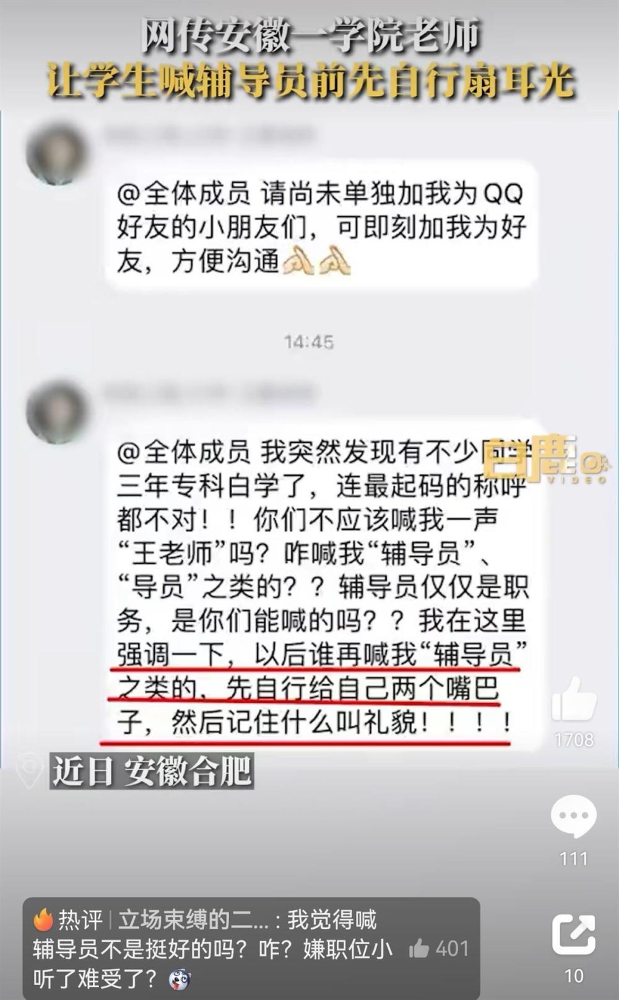

# 高校老师班群喊话“谁再叫我辅导员自扇两嘴巴”，校方：已约谈当事人

据陕西网白鹿视频9月8日报道：近日，安徽合肥，网传安徽某学院的任课教师在班级群聊中发消息跟学生说“以后谁再喊我辅导员，先自行给自己两个嘴巴子，记住什么叫礼貌!”

_报道截图（来源：白鹿视频）_

另据齐鲁晚报报道，涉事的是安徽交通职业技术学院的任课老师，不是班里的辅导员，领导已经在跟他约谈了，这些言论只是他的个人行为，不代表系里其他老师。

 _报道截图（来源：齐鲁晚报）_

极目新闻综合白鹿视频、齐鲁晚报

（来源：极目新闻）

