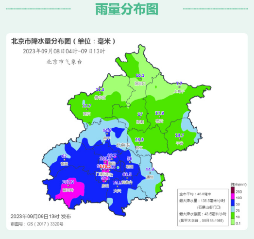
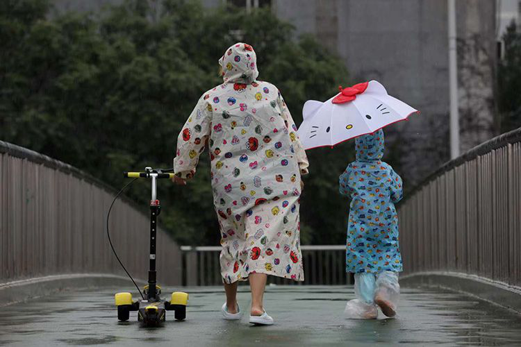
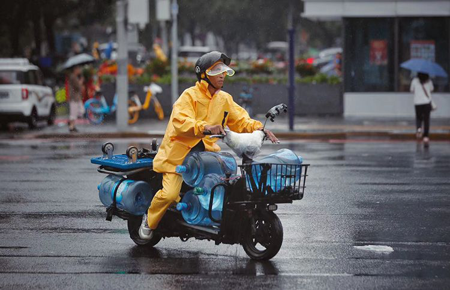
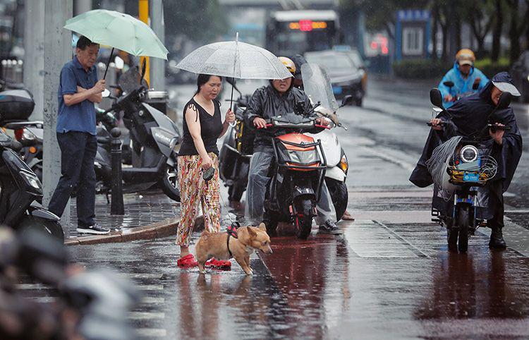

# 北京这场雨还要下多久？为何今年9月雨水多？一文读懂

9月8日我国迎来了白露节气。白露是秋季的第三个节气，北方此时开启秋高气爽的舒适时节，南方暑热犹存，“秋老虎”偶尔出没。北京在8日迎来新一轮降雨。目前北京市暴雨、山洪、地质灾害三预警持续生效。这场雨还要下多久？北京采取了哪些应对措施？为何感觉今年9月雨水多？一文读懂。

**这场雨还要下多久?**

北京的雨下了一夜，还将持续一个白天。据北京市气象台介绍，这场雨的主要降雨时段在8日夜间到9日中午， **今夜降水趋于结束。**

截至今天8时，北京降雨呈现南多北少的分布。城区和南部普降大雨到暴雨，局地出现大暴雨。南郊观象台，海淀，石景山，丰台，门头沟，房山，大兴均超50毫米，为暴雨。据气象专家分析，目前雨带移动缓慢，雨势平缓，从逐6小时预报看，降雨会淅淅沥沥下到夜间。

据气象北京数据统计，9月8日4时至9月9日13时北京地区全市平均降水46.8毫米，城区平均73.2毫米；最大降水出现在石景山衙门口138.5毫米，最大降水强度出现在昌平大辛峰8日18-19时43.5毫米/小时。

_图片来源：气象北京_

9月9日12时至13时，最大降水量为朝阳奥林匹克公园、密云新城子为7.2毫米。目前本市降雨平缓，预计未来2小时全市降雨分布较均匀，平均降雨量2-5毫米，个别点8-10毫米。

_图片来源：气象北京_

_9月9日，朝阳路，一位妈妈和孩子在雨中漫步。图片来源：新京报_

_9月9日，朝阳路，一位送货小哥在雨中送水。图片来源：新京报_

 _9月9日，朝阳路，一位女士牵着小狗在路口等红绿灯。图片来源：新京报_

**有何应对措施?**

**暴雨、山洪、地质灾害三预警持续生效**

9月8日北京出现了中到大雨，房山、门头沟、丰台、石景山以及海淀和昌平的局部地区出现暴雨。目前北京市仍处于防汛蓝色预警响应中，石景山、房山两区已升级发布暴雨黄色预警信号。据气象部门预测，9日降雨继续，白天有中雨，局地大雨，地质灾害风险大。再次提醒市民合理安排周末出行，避让积水路段，避免到山区、河边游玩，远离山洪、地质灾害隐患等危险地带，确保安全。

北京市规划自然资源委联合市气象局升级发布地质灾害气象风险黄色预警：9月9日12时至9月11日12时，北京市房山、门头沟大部，海淀、石景山、丰台西部发生崩塌、滑坡等地质灾害的风险较高;昌平西部和北部，延庆大部，怀柔中部和南部，密云大部，平谷北部有发生崩塌、滑坡等地质灾害的风险，请注意防范。

目前，北京暴雨、山洪、地质灾害三预警同时生效中， **北京降雨可能会对今天晚高峰出行有不利影响，道路湿滑、能见度降低，公众雨天出行请注意交通安全。**
另外，建议大家周末尽量避免前往山区、河道等地质灾害隐患区域活动。

按照北京市相关部门要求，9月9日，房山区除首创奥特莱斯休闲驿站外，其他旅游景区暂时关闭，所有涉山涉水乡村旅游民宿暂停营业。开园时间请及时关注各景区微信公众号。

视频来源：我们视频

**北京暴雨致86条公交线路受影响 市郊3条铁路线有列车临时停运**

9月9日，北京公交发布公告，截至10时共有86条公交线路受降雨天气影响。其中，采取停驶措施64条，采取区间措施17条，绕行甩站措施5条。8日，地铁丰台站出口，工作人员免费给因大雨滞留乘客发雨衣。8日，北京市郊铁路发布运营调整公告，因降雨预警，9日起，怀柔至密云线、通密线、S2线所有列车临时停运。

**应对新一轮降雨，北京排水集团启动防汛二级响应**

北京迎来新一轮降雨，北京排水集团即时启动防汛二级响应，共计出动大中小防汛单元193组、防汛人员1816人。

北京排水集团17座再生水厂站于9月7日19时开始加大水量抽升处理，雨前为管网腾容9万立方米。9月8日10时至9月9日7时，北京排水集团各水厂总计处理水量为218万立方米，集团共57座雨水泵站开启运行，累计抽升雨水12.9万立方米。

**为何今年9月雨水多？**

国家气候中心副主任贾小龙介绍，2023年夏季，我国气候总体雨少温高。全国平均降水量320.2毫米，较常年同期偏少3.5%，主要多雨区在我国东北和华北地区，中东部降水总体呈“北多南少”分布。

贾小龙表示，今年夏季，我国北方总体降水比较多。华北，特别是北京，降水降偏多还是比较明显的。多雨期是在今年7月，这是东亚夏季风环流系统和台风共同作用的结果。今年7月东亚夏季风偏强，西太平洋副高偏强偏北，华北东部处于副高西北边缘，对流不稳定能量充足。7月台风“烟花”在我国陆上滞留时间较长、影响范围广，加强了来自西北太平洋的水汽输送，给华北地区提供了非常充沛的水汽来源，导致了降水明显偏多。

预计9月份华北地区的降水还是较常年同期偏多，华北北部偏多1-2成，华北、北京多雨态势可能会持续一段时间。

贾小龙提醒，
**根据9月份气候趋势预测，首先是防范强降水、强对流及次生灾害。东北地区北部、华南地区东部、华东地区东南部、西南地区西部、新疆大部等地降水较常年同期偏多。**
“9月仍是暴雨和雷暴、大风等强对流天气多发月份，强降水可能引发的城市内涝、强对流天气灾害风险较高，建议有关部门密切关注天气变化。”

资料来源：气象北京、中国气象局、新京报

编辑 常江

校对 刘军

