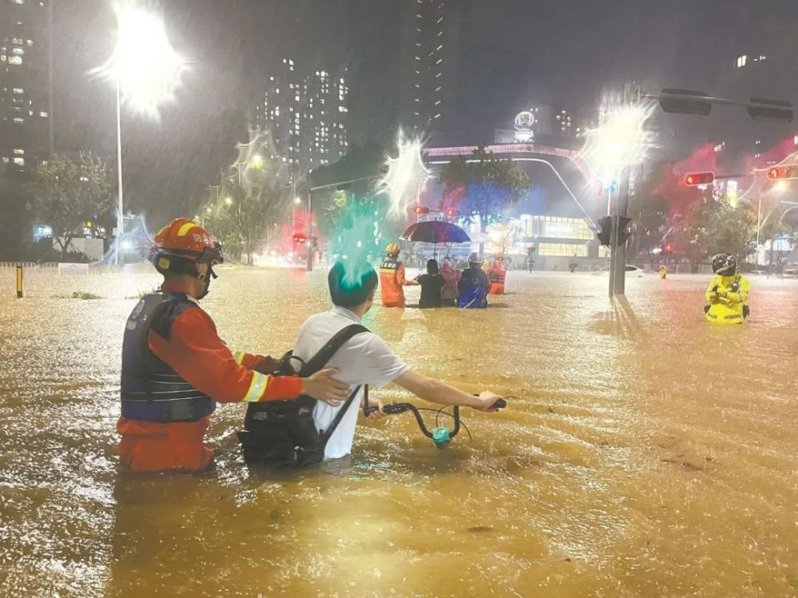
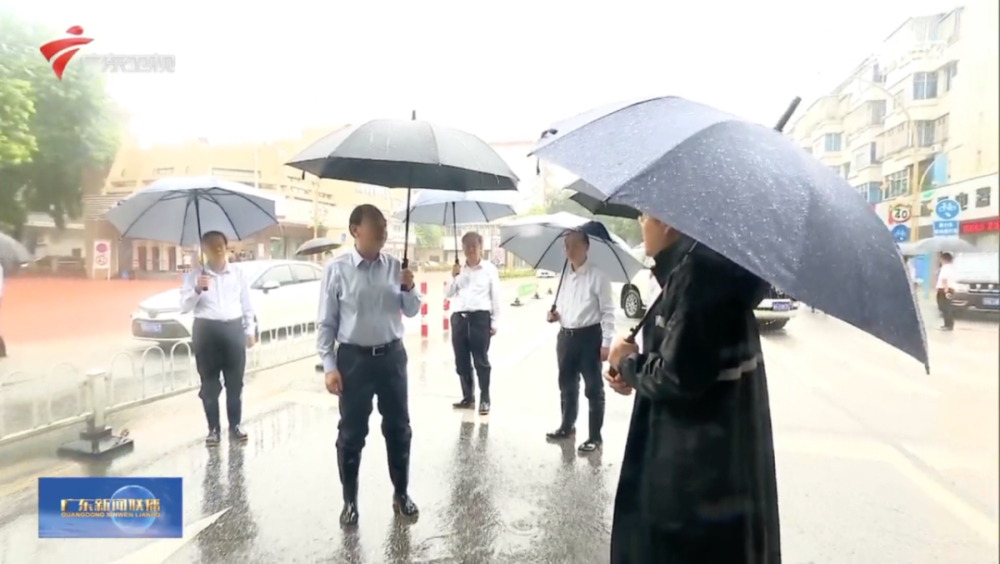
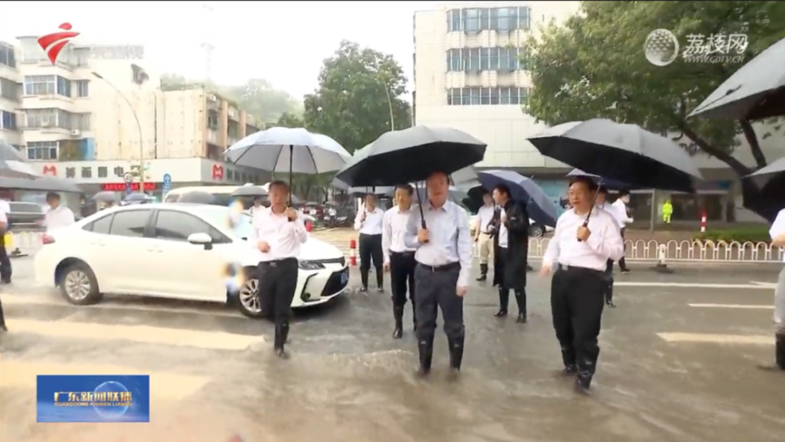

# 广东省委书记一天奔赴两个城市，部署“当前头等大事”

**撰文 | 董鑫**

连日来，广东粤西沿海及珠三角西部出现持续强降雨过程，强降雨来势凶猛、持续时间长、致灾风险高。

据《南方日报》报道，为部署防御强降雨工作，9月8日，广东省委书记黄坤明相继去往位于珠三角西部的中山市和佛山市。

在中山市，黄坤明主持召开全省强降雨防御工作会议；在佛山市，他看望慰问奋战在防汛一线的工作人员，实地检查指导防汛排涝、抢险救援等强降雨应对处置工作。

雨情：强降雨过程仍将持续

继台风“苏拉”于9月2日在珠海市南部沿海登陆后，台风“海葵”于9月5日在粤闽交界附近沿海登陆。

9月7日至8日，受“海葵”外围云系和季风影响，广东多地出现超历史纪录强降雨，其中广州、深圳、珠海、东莞、肇庆、佛山等市发生内涝、滑坡、道路中断等险情。

根据广东省气象部门观测统计，9月7日8时至8日8时，广东全省平均雨量68.6毫米。

有105个镇街录得超过250毫米的特大暴雨，313个镇街录得100毫米-250毫米的大暴雨，242个镇街录得50毫米-100毫米的暴雨。

9月7日8时至8日12时，广东省累计有24条河流28个水文站超警戒。

_受强降雨影响，深圳多地出现内涝，图为救援人员在龙岗区救援_

截至9月8日20时，广东共有13个地市启动防汛应急响应，全省共提前转移114568人。

9月9日，中央气象台发布预测，“海葵”残余环流将继续缓慢西行。

广东应急管理微信公众号9日中午发布消息，当前，随着“海葵”残余环流继续向西移动，广东整体雨势逐渐减小，江河水情趋于平稳。9月9日至10日，粤西沿海及珠三角西部仍将出现持续强降雨过程。

根据《广东省防汛防旱防风防冻应急预案》和省防总有关规定，广东省防汛防旱防风总指挥部决定于9月9日12时将防汛II级应急响应调整为防汛III级应急响应。

省委书记在积水路段实地检查

9月7日以来，佛山全市普降大雨，一些地区降雨量录得当地历史极值，导致城市部分路段出现水浸内涝现象。

9月8日，黄坤明前往佛山市，看望慰问奋战在防汛一线的工作人员，实地检查指导防汛排涝、抢险救援等强降雨应对处置工作。

在高明区沧江路某积水路段，黄坤明察看道路积水、车辆人员通行管控等情况以及抽排水工作进展。

在西江大堤高明段，黄坤明沿河堤察看干流水位及除险加固措施。

黄坤明指出，要迅速开展抽排水工作，及时疏通排涝管网，加快排空道路积水，最大限度减少对群众生产生活影响。

还要细致做好巡堤查险，密切监测水位变化，及时清除行洪障碍，在重要堤段、险工险段预置抢险力量物料，一旦发现隐患及时排查处置到位，确保度汛安全、江河安澜。

“当前头等大事”

广东是全国台风登陆最多的省份，往年6-9月登陆广东的台风个数为3.2个。

今年6-9月（截至9月8日），已有3个台风登陆广东，分别是“泰利”“苏拉”“海葵”。

8月30日至9月1日，在台风“苏拉”逼近广东之时，黄坤明相继主持召开了三场防台风有关会议。他当时在会上表示，台风防御的大仗、硬仗已经打响，要全面进入台风防御“战时”状态。

9月5日，“海葵”登陆广东潮州。由于引导气流弱，台风移动速度缓慢，给广东造成长时间风雨影响，且累计雨量大。

9月8日上午，黄坤明在中山主持召开全省强降雨防御工作视频会议，分析研判强降雨发展趋势及灾情影响，现场指挥调度有关地市做好应对处置工作，就全省防御工作进行部署落实。

**“将强降雨防御工作作为当前头等大事来抓。”黄坤明指出，要努力把损失降到最低，切实守护好人民群众生命财产安全。**

他要求，加密监测预警频次，重点关注局地短时强降雨，滚动发布短临预报、洪水和地质灾害风险预警，及时采取防范应对措施。坚决果断转移避险，重点关注施工人员和外来旅游人员，确保做到应转尽转，不漏一户一人。还要严格执行领导带班和24小时专人值班制度，确保调度及时、指令畅通、落实到位。

黄坤明指出，要及时抢修抢通因灾阻断的水、电、路、网等生命线，妥善做好受灾群众安置和基本生活保障。加强各类物资供应，尽快恢复生产生活秩序，确保城市正常运转。

**资料｜南方日报、金羊网等**

**【版权声明】本文著作权归政知新媒体独家所有，未经授权，不得转载。**

