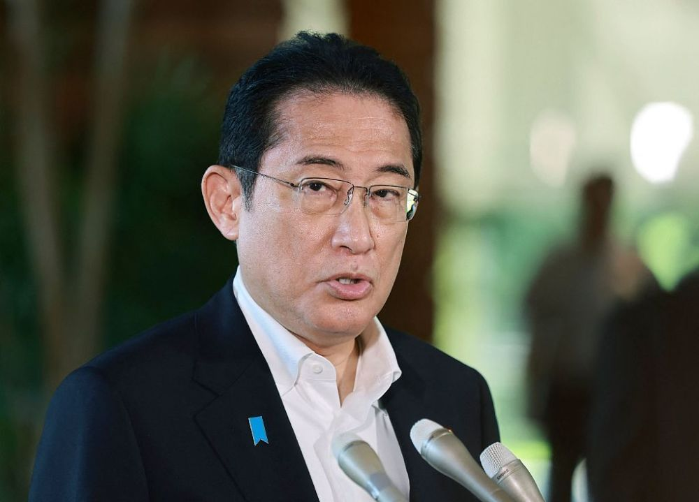

# 支持率低迷，岸田被迫改组内阁，日媒：只改内阁显然救不了他

【环球时报驻日本特派记者 岳林炜 环球时报特约记者
李海】据日本广播协会（NHK）网站8日报道，日本首相岸田文雄已确定将于13日进行内阁改组，并向多名执政党干部传达了这一意向。日本公明党领导人山口那津8日对记者透露，他接到了岸田的电话，称准备在下周三进行内阁和自民党领导层改组。自2021年10月上台以来，从“统一教”问题、安倍晋三国葬、物价上涨到数字身份证改革，岸田内阁频频遭受批评，面临执政危机。今年8月底的日本民调显示，岸田内阁民意支持率已经跌至26%，落入30%以下的“危险水域”。其强行推动的核污染水排海更是引发邻国强烈抨击。

_岸田文雄 资料图 图源：视觉中国_

**党内掣肘**

据日本多家媒体报道，参加完在印度举行的二十国集团（G20）领导人第十八次峰会后，岸田文雄将于11日返回日本，并计划于13日上午进行自民党高层人事调整，当天下午进行内阁改组。
岸田文雄7日在印尼就人事变动问题接受采访时称，“正如我之前所说，让合适的人在合适的地方发挥才干。基于这一想法，我希望在考虑日程安排的同时，考虑人事的具体变动”。

日本《读卖新闻》8日称，现任自民党干事长茂木敏充希望继续担任干事长，而自民党副总裁麻生太郎也曾向岸田建议让茂木留任。在自民党内，岸田率领的岸田派是党内第四大派系，而为了维护政权稳定，岸田与党内第二大派系麻生派、第三大派系茂木派的合作不可或缺，这似乎影响了岸田的决断。

另据日本《每日新闻》8日报道，关于内阁官房长官松野博一、自民党政调会长萩生田光一，他们两人可能被继续留任原职，也可能被任命为重要阁僚或党内要职。岸田重视政权基础的稳定，所以可能不会调整担任内阁和党内重要职务的人士。

**有人成烫手山芋**

除了一些要员留任，一些职务则成为争议焦点。据日本媒体报道，自2012年12月以来，作为联合执政党的公明党就一直掌控内阁国土交通大臣职位，先后共有4名公明党籍国会议员担任自民党内阁中的国土交通大臣。

由于过去一段时期内，自民党与公明党之间曾就选举合作问题出现矛盾，自民党内有声音要求将“国土交通大臣岗位夺回来”，但据《读卖新闻》8日披露，岸田计划继续由公明党籍国会议员担任国土交通大臣，现任齐藤铁夫留任可能性很大。

日本舆论也十分关注内阁和自民党高层人事以外的变动，其中就包括现内阁官房副长官木原诚二。《朝日新闻》6日披露称，岸田计划让其亲信、内阁官房副长官木原诚二留任。木原诚二隶属岸田派，是岸田最信任的人之一，并在日本央行（即日本银行）总裁人选、岸田闪电访问乌克兰等内政外交重要事务上扮演特殊角色。但今年以来，日本八卦周刊接连披露木原坐拥“一妻一妾”等丑闻，所以岸田也有可能在首相官邸内给木原安排其他职务。对于岸田而言，木原的安排成了烫手山芋。

**改组侧重“稳定运营”**

《日本经济新闻》8日分析称，岸田作为自民党总裁的任期将于2024年秋季结束，而现在的人事调整则是为了布局明年的自民党总裁选举。在没有找到能较好提升内阁支持率方法的情况下，岸田将重点放在了维持政权稳定与政策连贯性上，以此来寻求积累执政成果。

日本NHK电视台网站8日也分析认为，茂木敏充和麻生太郎是自岸田内阁成立以来，就一直以中枢力量的身份支持岸田，所以岸田希望让两人继续留任，进而支持自身政权今后的稳定运营。NHK8日报道称，岸田文雄改组内阁和调整自民党高层人事的目的之一是改善国民认知，提振内阁支持率。但只改内阁显然救不了岸田文雄。日本共同社8日报道称，福岛县、宫城县等地民众约150人当天向福岛地方法院起诉日本政府和东京电力公司，要求叫停8月启动的福岛第一核电站核污染水排放入海作业。原告方律师团对媒体表示，这是日本首起有关叫停核污染水排海的诉讼。

