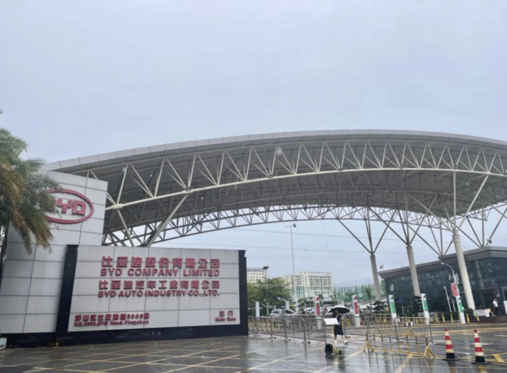
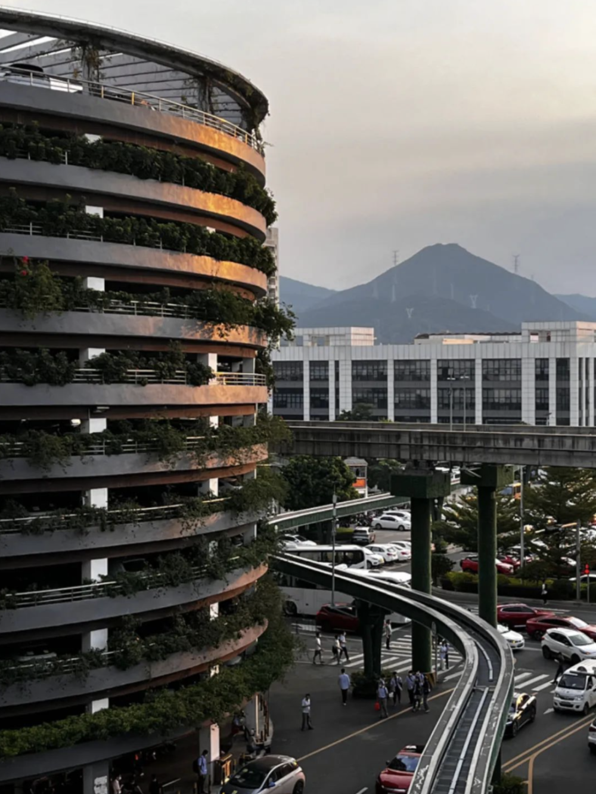
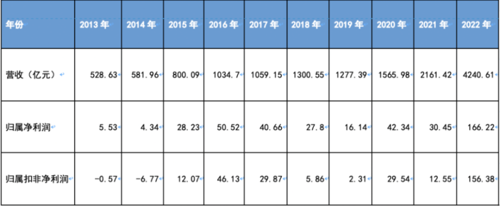

# 本科应届毕业生，月薪五千，我在比亚迪当螺丝钉

文｜郭宇 陈亮 翟芳雪 邓雨洁

比亚迪正在成为真正的大厂。

敞开门，你看到的是有关它的光环。全球卖出最多新能源车的车企；世界500强；正在实现从几万元到上百万元的汽车产品覆盖；深圳街头的出租车就是它最好的招牌；不仅造车，还造电池、搞汽车芯片，多领域跨界。

关上门，你看不到的是有关它的日常。它是全球员工数量最多的车企之一，2023年一季度已达66万人，足够“大”；一天三次打卡，午休只有一小时，宿舍还是上下铺，紧张和秩序的管理方式也足够“厂”。

2023年的夏天，有3.18万应届毕业生入职了比亚迪，比去年的人数翻了一番，是历年最多。他们来自50个不同类别的专业，有六成是硕博学历，有八成人员将投入到研发工作。

学历至关重要。以本科应届生为例，毕业于双非院校底薪为5500元，211院校6000元，985院校底薪7000元，C9院校底薪7500元。硕士底薪比本科高1500元到5500元不等。

他们加入的是有“民企里的国企”之称的比亚迪——财报显示，截至2022年底，比亚迪共有12位高管，7位在2000年之前就入职，最晚加入的也在2005年。其中，有四位高管均是一毕业就入职了比亚迪，花费了二十年左右时间，从当年的应届生做到了如今的位置。

企业文化与制度，筛选人，也被筛选。不是所有校招生都认同比亚迪所说的竞争文化，和它所体现的“民企里的国企”的企业气质。

我们找到了5位加入比亚迪的校招生，想知道在这些年轻大学生眼中，真实的比亚迪是什么样的，又该如何看待它。

**简单、快速、“秋招之光”**

今年6月刚毕业的佳琪，如今已经入职比亚迪一个多月。回顾当时的投递经历，源自一个意外——她在另一场公司面试上，听到面试官提到比亚迪的名字，没想到比亚迪后来成了她的“救命稻草”。

佳琪本科专业是新闻学，原本打算进入媒体行业，但一份份简历石沉大海。一再受挫之后，她才发现了比亚迪这家跟原专业完全不对口的企业。“比亚迪实实在在研发产品，干的是实事。”佳琪琢磨了很久，得出这个结论。

向比亚迪投简历更多出于“碰运气”的心态，但佳琪没想到，大名鼎鼎的比亚迪并不难进——简历通关之后，甚至没有笔试环节，面试也只有三轮，问题也都相对简单。第三轮面试之后两天，佳琪就拿到了offer。相比之下，绝大多数互联网企业都会有笔试和几轮高难度面试。

同样感叹比亚迪校招简单的还有周涵。周涵毕业于南方某985高校的土木工程系，春招期间，她通过脉脉、小红书等社交媒体得知，车企大厂比亚迪offer“点击就送”。于是她顺手就投了一份简历。

不久，比亚迪汽车工程院一名部门主管联系了周涵，开始了三轮较为简单的面试。一面是部门主管，只让她作了基本的自我介绍；二面是人事，也只是询问她意向地点和意向岗位；三面又回到部门主管，主要谈薪资。

“一开始我对比亚迪没兴趣，觉得它只是一家工厂。”这是今年刚刚入职比亚迪的小乐最初的心声。比亚迪的校园宣传并没有吸引在东部省会念书的小乐，总部来的人力专员介绍笼统、开出的薪资不高，让小乐兴味索然。

_比亚迪总部 郭宇/摄_

但遍地可见的比亚迪出租车、深圳亲友对比亚迪的一致好评，让小乐愿意去了解这家企业。转折发生在面试时，事业部HR的专业态度一下子吸引了小乐，对方从企业发展到平台能力，从事业部规划到个人发展，从职级体系到薪资福利，都详尽地介绍。

而且事业部HR和部门领导的态度都让小乐觉得被尊重，不像其他大厂领导一样不苟言笑。她认为在比亚迪工作有一定前景，最终选择了比亚迪。

多名受访者都向财经汽车坦言，比亚迪并非他们的首选。只是由于面试简单，比亚迪成了毕业生考研失败、大厂碰壁之后的避风港，被称为“秋招之光”。

“如果有更好的offer，我也不会来比亚迪了。”佳琪说。她本科就读于双非院校，按照比亚迪的薪资标准，只能拿到最低档的5500元，未来的涨薪空间也不明朗。

佳琪还从社交媒体了解到，比亚迪住宿条件差、食堂难吃，还没有加班费。但她实在没有更好的选择，就抱着“来大厂学本领”的心态，进入比亚迪深圳总部。

小七本来计划读研，2022年2月考研失败后不得不加入春招大军，她才匆忙投了比亚迪。虽然她轻松拿到了比亚迪的offer，但由于岗位与兴趣不符，再考虑到薪资和离家距离问题，她觉得过不了多久自己就会“跑路”。

就这样，比亚迪在高速扩张的过程中招进大量应届生。光是2023年，就有3.18万名应届生进入比亚迪。2021至2022年，比亚迪在职员工数量从28.8万人增长到惊人的57万人，增长率达到97.92%。

**双非底薪5500，985值7000**

校招生激增背后，是比亚迪爆发式增长的用人需求。

2020年至今，比亚迪在国内已经过规划了10余座新工厂，对应新增产能超400万辆；海外的建厂和开店计划也在同步进行。这势必需要渠道管理、工程建设、技术研发等无数岗位。迅速拿到offer的佳琪对此深有体会，“这届人特别多，感觉HR都顾不过来，流程飞快”。

急速扩张的用人需求，让比亚迪难以“精挑细选”，HR和业务部门领导都很难审视每一个应聘者。而以学历定起薪的“出身论”是最简单粗暴的方式，也是比亚迪给这些毕业生上的社会第一课。

不同学历背景的毕业生入职后将获得不同职级，职级则对应薪资待遇和职场起点。国内大学中，“C9联盟”属于第一档，“985”次之，“211”再次之。国外大学则按QS排名分级。

以本科应届生为例，毕业于双非院校底薪为5500元，211院校6000元，985院校底薪7000元，C9院校底薪7500元。硕士底薪比本科高1500元到5500元不等。如果专业为计算机类、机械化、控制类等技术类专业，底薪会相应增加。

这样的光景，也曾出现在数年前的房地产行业。2019年以前，房企高速扩张，每年以高薪吸纳大量应届生。单是在2017校园招聘中，碧桂园“超级碧业生”就能给到应届生24万的年薪，引来许多羡慕。

然而，众所周知，近几年房市增速放缓，以“高周转”闻名的房企相继暴雷，除了缩招应届生，已经入职的也在经历被裁员的命运。

智联研究院统计数据显示，2022年三季度，房地产/建筑/建材/工程行业的招聘，平均薪酬为9978元，同比下跌2.3%，较2022年同期的第16位下降了8个名次。猎聘大数据显示，细分行业分布TOP20中，房地产开发/建筑/建材/工程行业的新发应届生职位，占比下降最多。从2021三季度的10.93%下滑到2022三季度的5.10%

风水轮流转，房市触底之际，新能源车市场崛起，产生大量人才需求。作为行业领军企业，比亚迪吸纳了大量应届生。但谁也无从判断，假以时日新能源车市增速放缓，这些应届生命运会如何。

高速背后的无序已经逐渐在比亚迪内部出现。

一方面是薪资和职级的倒挂。学历决定薪资起点，帮助比亚迪吸引了大量高精尖人才，但这把双刃剑也砍向了员工士气。不少老员工由于早年学历不够光鲜，在职级上还不如新员工。这也就意味着，老员工花5-6年去翻越的职级高山，被一些学历背景好的新人轻松越过。

另一方面是个人职业发展的迷茫。南方某985高校地质专业2022届毕业生花泽进入比亚迪的第一年，就已经换了两个岗位。

最开始，他被安排到开发中心。“虽然顶着开发中心的名号，但其实就是后勤。”花泽自嘲道。他到比亚迪的第一个任务，是给厂房设计管道。厂房建设一结束，他就被调到了别的部门，理由是原部门组织架构调整。花泽说，对于自己这样游离在汽车核心技术部门外的员工来说，生存环境是很狭窄的。

又由于本科专业与岗位需求并不匹配，花泽的工作有时会出现纰漏，这时他总能感觉到老员工隐隐的排斥，他也因此感到羞愧，以至于对上班产生强烈的抗拒心理。

如今，花泽只想跨专业考研，逃离比亚迪。他认为比亚迪本身很不错，技术强、声望高、前景好。只是他在岗位发挥不了自己的价值，冷漠的同事关系也让他感到孤独。“我们只是不合适。”花泽这样定义自己和比亚迪的关系。

**真正的大厂**

互联网行业从业者经常半抱怨、半骄傲地将所在公司戏称为“大厂”，以此调侃互联网公司工作强度高、压榨员工，有如制造业工厂。但他们中的大多数，也许并未亲身体验过真正的制造业“大厂”。

_比亚迪深圳总部 受访者提供_

小七在比亚迪体验过。手机闹钟响起，关掉闹钟，打开手机上名为“打卡”的APP，人脸拍照+实时定位打卡。这样的打卡流程，小七一天要重复三次，分别在早上上班、中午吃饭和午休期间、下午下班。她说，一天打卡三次，中午休息一小时，自己仿佛进了“民企里的国企”。

在比亚迪上班，员工都需要每天完成早中晚三次打卡，漏掉一次就会扣发当月绩效。在互联网企业、外企实习过的应届生，往往需要一个月时间才能适应这样的制度。

如今，小七入职一年了，她“感觉自己像个螺丝钉，没有作为一个人的感受”。一句“如此生活三十年”，已经到了嘴边。如果说打卡制度是工厂管理的虚拟化缩影，让小乐坚信比亚迪是一家工厂的，是环境。

2007年建成的六角大楼，成了比亚迪深圳总部的代表建筑。这座大楼承载着这家公司最引以为傲的技术，接待用的礼宾楼有着漂亮的玻璃外立面、高科技的展示橱窗和贴满专利的高墙。然而穿过现代化的礼宾楼，六角大楼的其他部分都显得老旧，除了颗粒感十足的水泥路，连灯光都泛着昏暗的白色。让小乐“一步穿越回十几年前”。

饮食和居住环境也没小乐预想中的好，小乐踏入公司宿舍的第一天，就连夜找中介搬了出来。公司宿舍名曰公寓，免费提供给应届生，供大家过渡用，但看着上下铺设计、没有网络和洗衣机的宿舍，小乐感慨连大学宿舍都不如。

小七也体验过同样的住宿环境，后来她和同宿舍的人一起在公司外租了房子。目前公司会给应届生每月1000元的住房补贴。

六角大楼的食堂很便宜，一顿工作餐只需要6.5元，但如同不见荤腥的“斋饭”，是吃饱而不是“吃好”，而且人山人海。想吃好点有许多选择，诸如肯德基等餐饮店已经入住园区，但考虑到路程和排队情况，会挤占本就不富裕的1小时午休+吃饭时间，以至于不少员工选择自带午饭。

小乐印象最深刻的，是“入厂第一课”上公司发的入职礼包，里面有保温杯、笔、伞和卡套，这让在外企实习过的小乐有些失望，虽然实用，但缺少新意。

_2022届校招生入职礼包 受访者提供_

之前，在同学间口耳相传的“入职礼包”，可能是阿里的智能音箱；字节的T恤和帆布包，腾讯的企鹅公仔。

这些互联网企业在发展初期代表着年轻化、进取、活力，因此往往受到应届生青睐。互联网文化逐渐进入制造业，跨界而来的“造车新势力”就带着互联网行业的烙印。比如蔚来的校招入职礼包有盲盒、徽章和贴纸等等；小鹏有香氛、小音箱等等。

与造车新势力相比，比亚迪这种传统大厂也许更老气横秋、按部就班。但也更体系化。一名入职造车新势力一年多的应届生就感慨，在比亚迪，至少做事情可以有迹可循，但在新势力更多靠自己摸索。

“在造车新势力，很多事情连前辈都没干过，更别说形成方法论。说得好听是可以自由探索，说得难听叫盲人过河。”这位应届生说。她觉得，这在职业起步期并不是一个很好的选择，如今她更向往不那么光鲜亮丽的“大厂”了。

**比学赶帮超，筛选人，也被筛选**

比亚迪崇尚竞争文化，“比学赶帮超”是校招生入职时的必修课之一，此外还要学习基本的岗位知识。

这样的竞争文化让比亚迪在短时间内成为新能源汽车霸主，一批又一批勤劳的比亚迪人在付出。例如比亚迪会表彰每月加班最多的那批员工，通过类似放榜的方式，刺激着所有部门所有人。花泽觉得，比亚迪的竞争文化区别于内卷，每月的绩效考核也比较公平。

竞争文化已经刻在王传福骨子里。王传福1966年出生于安徽农村，按照这一代企业家的话来说，年少时大家都是放牛娃，要想出人头地就得去读书考试，这背后都是一次次、一场场、一个个血淋淋的竞争。

2018年前后，王传福将竞争文化提到了企业文化的高度。“我们把企业文化从平等、务实、激情、创新，调整为竞争、务实、激情、创新，就是要高度重视竞争。”王传福认为，竞争虽然带来了短期的压力，但也同时带来了长期的繁荣、活力和生命力。

这也是企业内外压力所致。2017年至2019年，比亚迪陷入困境，三年增收不增利。连王传福都说，2019年他唯一的想法就是活下去。当时，新能源汽车补贴退坡，造成比亚迪汽车业务盈利下滑，其动力电池业务也受到宁德时代的挑战。

于是，比亚迪提出了竞争文化和市场化，让旗下几个零部件业务部门参与市场竞争，寻找公司外的客户，与竞争对手直接PK。

 _比亚迪近10年营收数据 数据来源：比亚迪财报_

竞争文化无疑加速了比亚迪集团几个子公司的发展，比亚迪电子、弗迪电池都在外部竞争中自我变革，如今成为了各自领域的佼佼者。但数年过去，新入职的应届生还吃这一套吗？

“入职一年多，我在最近才感受到卷的倾向。绩效考核变了，会加一些东西想让你竞争一下。”小七说，由于自己不是争第一的性格，所以竞争文化在她这里更像是一个口号。

刚入职的佳琪也感触不深，她所在的部门都是年轻人，和入职前她以为比亚迪是一个“压榨员工的血汗工厂”的印象完全相反，她感觉部门氛围还是十分融洽的。

但小七也强调，由于比亚迪“家大业大”，不同部门的工作强度不同，所以对竞争的感受也不同。她的一位同事日常工作是剪辑和文案，经常在工作日加班，没有加班费，但她所在的岗位一年到头也加不了几次班。

企业文化与制度，筛选人，也被筛选。不是所有校招生都认同比亚迪所说的竞争文化，和它所体现的“民企里的国企”的企业气质。

_比亚迪专利墙 郭宇/摄_

从OKR的提出，到ESG，再到欧洲实行四天工作制度，世界管理的主流似乎都向着人性化发展，强调关爱、员工福利、可持续化管理。狼性的竞争文化，和看起来不够洋气的企业气质，越来越被年轻人所唾弃，用小乐的话来说：“这个行为很掉价。”

如果说竞争文化成就了比亚迪的新能源与制造帝国，那么比亚迪的成就又给这些校招生们带来了什么时代红利？或许，拥有这份工作本身就是时代红利。

时代红利能停留多久，是企业和员工的双向选择。接受了这份工作，但又受不了这些价值观与制度的年轻人开始向外走——比亚迪是他们的来路，却不是归处。

财报显示，截至2022年底，包括王传福在内，比亚迪共有12位高管，其中有7位在2000年之前就入职了比亚迪，最晚入职的也在2005年。另外，何志奇（1998年入职）、何龙（1999年入职）、周亚琳（1999年入职）和杨冬生（2005年入职）四位高管均是一毕业就入职了比亚迪，花费二十年左右的时间，从当年的应届生做到了如今的高管。

收入低、晋升慢，让比亚迪的年轻人开始畅想下一个理想国。有着当代电动汽车先驱、外企标签的特斯拉，成为了这些想要离开比亚迪的年轻人口中的理想国。虽然理想国就像围城，围城内外，总有人想离开，有人想进入。

其实，比亚迪的地位已经提升了不少。三年前的夏天，财经汽车和汽车专业毕业生聊起求职经历，详见：《夹缝中的汽车专业：学生面试一家凉一家，老师“转行”去搞新东西》当时他们选择主机厂的“鄙视链”是外资、合资、国企，最后才是自主品牌。甚至，都不会单独提起“比亚迪”这三个字。

如今，自主品牌崛起的呼声愈高，其中的比亚迪也连续两年进入世界500强，成为全球卖出最多新能源车的车企。在2023年校招普遍缩招的情况下，比亚迪还提供了三万多个校招岗位。

但改变鄙视链并非一朝一夕，如何把招进来的年轻人留住，为这个庞大的组织注入新能量，是比亚迪需要思考的问题。

（应受访者要求，佳琪、周涵、小乐、小七、花泽为化名）

编辑｜王静仪

责编｜赵成

本文转载自财经汽车（ID：caijingqiche）

