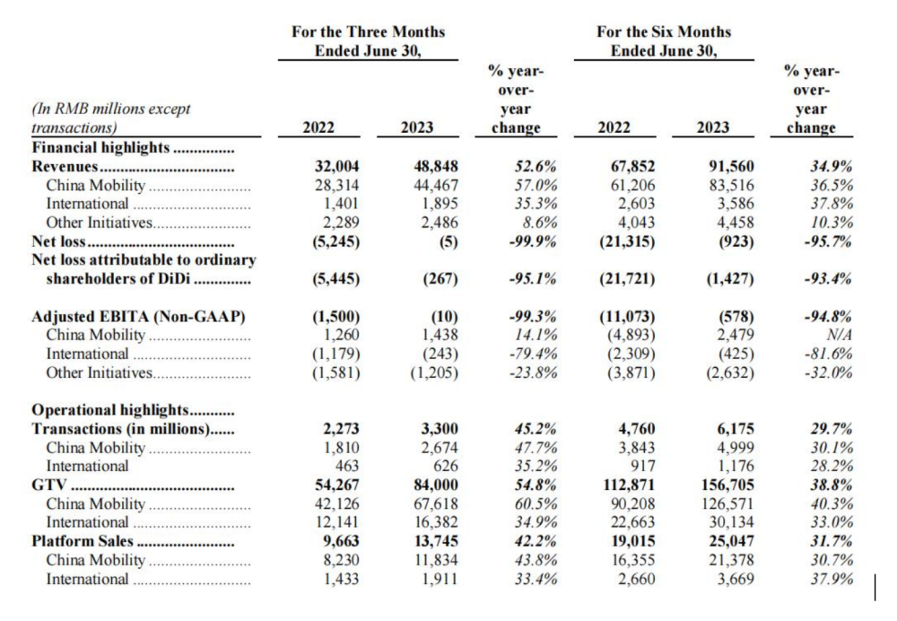

# 滴滴第二季度营收488亿元 净亏损2.67亿元大幅收窄

**划重点**

  * _1_ 滴滴第二季度总收入达488亿元，同比增长52.6%。归属于普通股股东的净亏损为2.67亿元，同比大幅收窄。
  * _2_ 滴滴中国出行业务第二季度收入为445亿元，同比增长57%。国际业务总收入为19亿元，同比增长35.3%。
  * _3_ 滴滴核心平台交易在第二季度达到33亿单，同比增长45.2%。GTV达到840亿元，同比增长54.8%。
  * _4_ 截至6月30日，滴滴现金及现金等价物、限制性现金及国债投资总额为538亿元，而截至2022年12月31日为488亿元。

腾讯科技讯 9月9日消息，滴滴于周六公布了截至6月30日的2023年第二季度未经审计财报。

财报显示，滴滴第二季度总营收为488亿元，同比增长52.6%；归属于普通股股东的净亏损为2.67亿元，经调整EBITA（息税前利润）亏损1000万元，而去年同期亏损达54亿元；其中，滴滴第二季度中国出行实现收入445亿元，同比增长57%，6月日均单量3040万单。

以下为滴滴第二季度财报要点

——滴滴2023年第二季度总收入为488亿元，同比增长52.6%。其中，中国出行业务总收入为445亿元，比2022年第二季度增长57.0%；国际业务总收入为19亿元，较2022年第二季度增长35.3%；

——滴滴2023年第二季度净亏损500万元，远低于去年同期的52亿元。归属于滴滴普通股股东的净亏损为2.67亿元，而去年同期归属于滴滴普通股股东的净亏损达54亿元；

——滴滴2023年第二季度调整后EBITA（息税前利润）亏损为1000万元。其中，中国出行业务调整后EBITA为14亿元；国际业务调整后EBITA亏损为2亿元；其他业务部门调整后EBITA亏损为12亿元；

——截至6月30日，滴滴现金及现金等价物、限制性现金及国债投资总额为538亿元，而截至2022年12月31日为488亿元；

——滴滴核心平台交易在2023年第二季度达到33亿单，比去年第二季度增长45.2%。其中，中国出行业务在2023年第二季度的交易量达到26.74亿单，比2022年第二季度增长47.7%；国际业务在2023年第二季度的交易量达到6.26亿单，比2022年第二季度增长35.2%；

——滴滴核心平台2023年第二季度总交易额（GTV）达到840亿元，同比增长54.8%。其中，中国出行GTV为676亿元，同比增长60.5%；国际业务GTV为164亿元，同比增长34.9%；

——滴滴2023年第二季度中国出行和国际业务的平台销售额达到1370亿元，较2022年第二季度增长42.2%。其中，中国出行的平台销售额达到118亿元，同比增长43.8%；国际业务的平台销售额达到19亿元，同比增长33.4%；

**一、按业务划分**

1\. 中国出行

在2023年第二季度，中国出行业务延续了自第一季度以来的复苏，平均每天完成3040万单交易。其中，

——GTV为676亿元，同比增长60.5%，主要得益于中国出行交易数量增长；

——平台销售额为118亿元，同比增长43.8%，这一增长主要是由中国出行的GTV增长所推动，部分被中国提供公共交通服务收入的临时增值税免税政策到期所抵消。该政策于2022年12月到期；

——中国出行业务收入达445亿元，同比增长57.0%，主要受GTV增长所推动；

——调整后EBITA收益14亿元，同比增长14.1%。这一增长的主要原因是来自中国出行业务GTV增加，但部分被上述增值税减免政策的到期以及广告和促销费用的增加所抵消。

2.国际业务

滴滴继续关注拉丁美洲的巴西和墨西哥等关键市场。在2023年第二季度和上半年，滴滴经历了营销费用的暂时减少和增长计划投资减少的激励。在2023年下半年，该公司计划加大对消费者激励和营销费用的投资，以继续推动国际业务的增长。

——GTV为164亿元，同比增长34.9%，这主要归因于国际业务的交易数量增加；

——平台销售额为19亿元，同比增长33.4%，主要受国际业务GTV增长所推动；

——国际业务收入为19亿元，同比增长35.3%，主要受国际业务增长所推动，包括国际网约车业务和其他业务；

——调整后EBITA亏损为2亿元，同比减少0.9亿元，这主要是由于营销支出的减少以及运营效率的提高所推动。

3.其他业务

——其他业务收入为25亿元，同比增长8.6%，主要受能源服务和金融服务收入增长所推动；

——调整后EBITA亏损为12亿元，同比减少4亿元，主要是由于运营效率提高所推动。

**二、营收与运营成本**

1.营收成本

滴滴2023年第二季度营收成本为414亿元，占总收入的84.8%，而2022年第二季度为260亿元，占总收入的81.2%。营收成本占收入百分比的增加主要是由于与中国网约车业务相关的成本增加所致。

2.运营和支持费用

滴滴2023年第二季度运营和支持费用为17亿元，占总收入的3.5%，而2022年第二季度为16亿元，占总收入的4.9%。运营和支持费用占收入百分比的下降主要是由于对费用进行了有效的成本控制。

3.销售和营销费用

滴滴2023年第二季度销售和营销费用为26亿元，占总收入的5.3%，而2022年第二季度为24亿元，占总收入的7.6%。销售和营销费用占收入的百分比减少主要是由于对营销费用投资的有效成本控制和消费者激励措施所驱动。

4.研发费用

滴滴2023年第二季度研发费用为22亿元，占总收入的4.4%，而2022年第二季度为23亿元，占总收入的7.3%。研发费用占收入百分比的下降主要是由于经营杠杆的改善所推动。

5.总务及行政费用

滴滴第二季度总务及行政费用为20亿元，占总收入的4%，而2022年第二季度为23亿元，占总收入的7.1%。总务和行政费用占收入的百分比减少，主要是由于经营杠杆的改善所推动。

6.投资净收益（亏损）

净额由2022年第二季度的亏损12亿元变为2023年第二季度的盈利4亿元。2022年第二季度的投资损失主要与公司投资Grab的公允价值损失有关，2023年第二季度的投资收益主要与公司投资Grab的公允价值增长有关。

7.净亏损

滴滴2023年第二季度净亏损为500万元，而去年第二季度净亏损达52亿元。归属于滴滴普通股股东的净亏损为2.67亿元，而2022年第二季度归属于滴滴普通股股东的净亏损为54亿元。调整后EBITA，2023年第二季度为亏损1000万元

，而2022年第二季度为亏损15亿元。

**三、现金流**

截至2023年6月30日，滴滴持有的现金及现金等价物、限制性现金和国债投资为538亿元，而截至2022年12月31日为488亿元。

滴滴2023年第二季度经营活动提供的现金净额为27亿元，用于投资活动的现金净额为51亿元，融资活动提供的净现金为14亿元。（文/金鹿）

