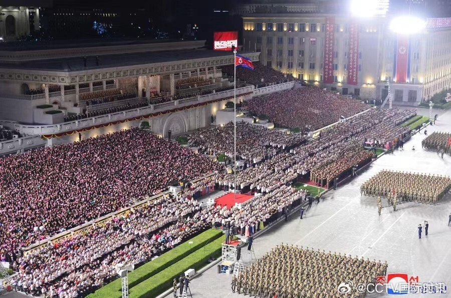
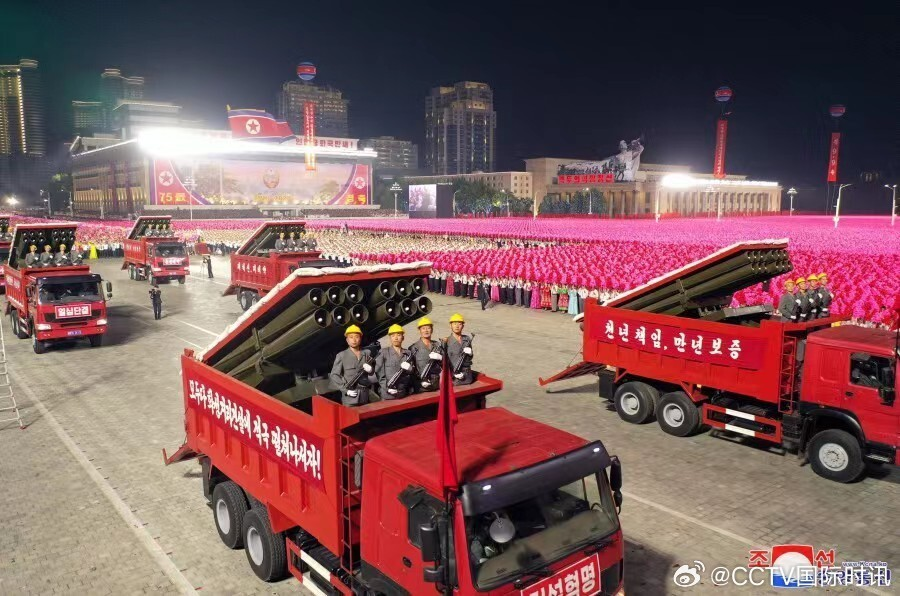
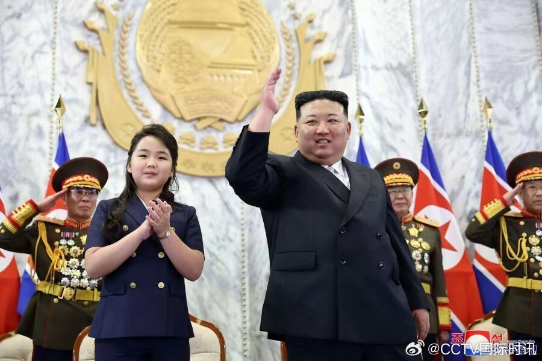
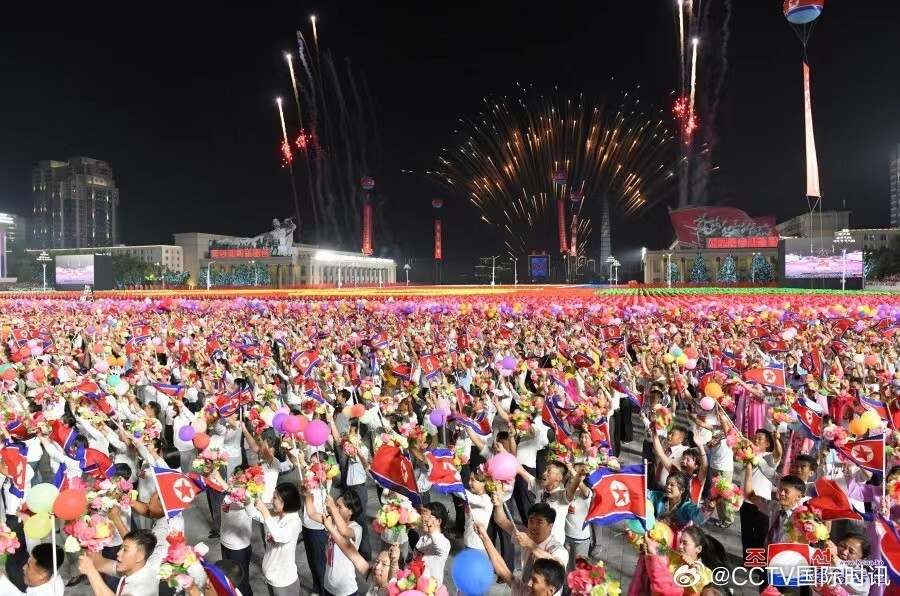

# 现场画面曝光：朝鲜举行国庆75周年阅兵式 金正恩出席

据朝中社今天（9日）报道，朝鲜民主主义人民共和国成立75周年民间防卫武装力量阅兵式8日在平壤的金日成广场隆重举行。朝鲜劳动党总书记、国务委员长金正恩出席。中华人民共和国党政代表团、俄罗斯武装力量亚历山德罗夫红旗歌舞团成员、中国和俄罗斯驻朝外交代表也应邀出席。

8日当天，平壤还举行了庆祝朝鲜民主主义人民共和国成立75周年中央报告大会。（总台记者 董海涛）

