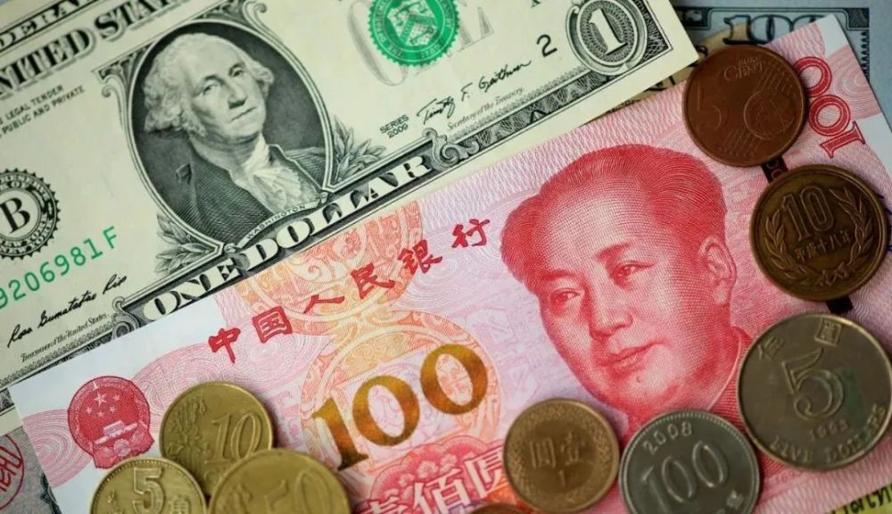

# 短短数日贬值近1000基点、创2007年以来最低值，人民币还能涨回来吗

**文/邱牧子**

进入9月份，人民币对美元汇率走势又起波澜。

以在岸人民币为例，相比于8月31日的收盘价7.2595，截至9月9日凌晨3时，最低值已触及7.3510，不仅短短数日贬值近1000个基点，更创下2007年以来在岸人民币对美元汇率的最低值。

人民币汇率究竟怎么了？还能涨回来吗？

多因素造成阶段性承压

与在岸人民币走势基本同步的离岸人民币也刷新了年内最低值，同样在9日凌晨触及7.3679的新低点，人民币对美元汇率中间价也跌破了7.2关口，最近一个交易日报7.2150。美元指数则延续着自7月中旬以来跌破100后的反弹态势，近期已有涨回105上方的表现。

**仲量联行大中华区首席经济学家兼研究部总监庞溟**
对中新社国是直通车表示，近期人民币对美元汇率的阶段性承压，主要是在美元指数走强、中美利差预期扩大等背景下的被动贬值。

具体来看，由于美国通胀问题仍较顽固，美联储有可能在未来一段时间内继续将利率维持在限制性水平，且近期若干美国经济领先指标较为积极，显示美国经济更有可能以软着陆方式实现增速放缓；与此同时，欧元区PMI数据和主要经济体领先指标均较为低迷，避险情绪在衰退担忧下再次抬头。

“ **这些因素让美元指数在近期上行，相应地给人民币对美元汇率带来短期的、阶段性的、波动式的压力**
。如果观察追踪人民币对一篮子货币汇率变动的中国外汇交易中心人民币汇率指数，可以发现在近一个月内有比较明显的企稳回升态势。”庞溟说。

**中国银行研究院高级研究员王有鑫**
则提到，沙特宣布将延长石油减产至年底，叠加北半球取暖季临近，使得市场对能源短缺担忧升温，原油价格快速走高，既加大了经济下行压力，也使得市场担忧欧美通胀问题变得更加顽固，欧美央行可能进一步延长紧缩货币周期，这对美元和美债收益率形成提振，对人民币在内的非美货币汇率走势则形成抑制。

也有专家认为，短期看，主要是市场对经济复苏可能还存在一定疑虑，比如近几个月服务业PMI指数持续降温，国内利率下行，近期美元利率强劲反弹，以及股市波动，均对短期外汇市场构成扰动。

人民币还能涨回来吗？

王有鑫预计，短期随着能源价格的走高，美国核心通胀回落速度可能继续放缓，美联储在11月前仍将反复炒作加息话题。加之全球经济和欧元区经济仍然面临下行风险，美元指数可能继续维持相对强势。

但从长期来看，美国经济下行和经济指标回落会使美联储考虑结束加息周期，而中国稳经济政策的红利将在四季度逐渐释放，
**此消彼长之下，人民币汇率有望在年底实现小幅回升** 。

必须看到，外汇市场受预期影响本身较大，但预期随时又是会发生变化。

有观点认为， **短期波动不改年内人民币汇率反弹走势**
。主要是国内消费、外贸等最困难时期可能已经过去，经济复苏动能有望逐步改善，宏观风险趋势收敛等，人民币有坚实的基本面支撑，且中国央行稳汇率的工具较多。

尽管近期人民币跟随宏观经济短期波动，但从内外环境趋势看，继续看多人民币汇率走势， **下半年人民币汇率有望继续在合理均衡水平附近双向波动。**

庞溟提到， **近期有关部门已经采取了引入逆周期因子、上调跨境融资宏观审慎调节参数、发行离岸央票及国债、下调外汇存款准备金率等政策措施**
，加强对市场预期的有效管理和合理引导，未来政策工具箱里留存的工具选项依然较为充足，可以说，中国有基础、有实力、有信心、有能力、有办法保持人民币汇率基本稳定。

他说，从更长的时间维度来看，伴随着各项宏观政策适度刺激、合理宽松、及时补强、逆周期调控的空间进一步释放，近期各项增量政策的稳信心、稳增长、扩内需效果不断显现，预计市场对汇率的决定性作用将得到坚持，人民币汇率的弹性将得以增强，人民币汇率纠偏的力量和机制将得到健全，人民币汇率将继续在合理均衡水平上保持基本稳定。

来源：国是直通车

编辑：秦晶

责编：魏晞

