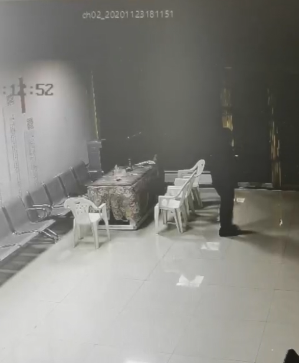
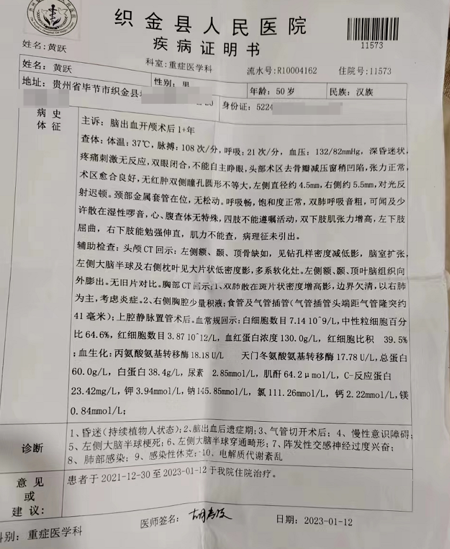
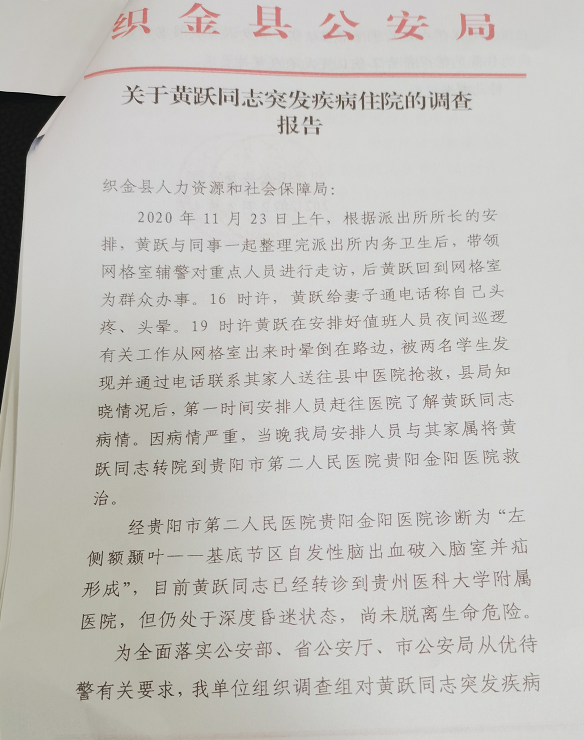

# 立过三等功的前缉毒警察 倒在因公牺牲认定条件之外

2023年9月8日，民警黄跃在派出所网格室外300米处倒下后的第1019天，遗孀林敏终于决定火化黄跃的遗体并进行安葬。而在过去的近8个月时间里，她一直都不能理解，为什么自己的丈夫黄跃不能被认定为因公牺牲。

林敏向红星新闻记者提供的一段监控视频显示，2020年11月23日18时14分，在贵州省毕节市织金县公安局文腾派出所金西网格室，民警黄跃安排好了夜间巡逻工作，在室内监控视频中留下了生前最后一句话“8点钟集合”后走出网格室，关上了门。

_▲黄跃安排好工作后准备离开，成为他生前最后的画面_

当晚不久后，两名中学生发现黄跃在距网格室约300米处昏迷倒地。织金县公安局向织金县人社局发出的《关于黄跃同志突发疾病住院的调查报告》显示，黄跃经贵阳市第二人民医院贵阳金阳医院诊断为“左侧额颞叶——基底节区自发性脑出血破入脑室并脑疝形成”。

林敏告诉红星新闻记者，在长达2年的昏迷时间中，黄跃完全没有清醒过，其在监控中留下的那句“8点钟集合”就是黄跃留在人世间最后的声音。2023年1月12日，黄跃突发高热，经抢救无效不幸离世。

“黄跃同志从发病到离世总共历时了2年1个月20天。依据《人民警察抚恤优待办法》相关规定，经过研究，我们单位认为黄跃同志的死亡性质不符合《办法》中人民警察因公牺牲认定的条件，所以我们把这一复核结果通过函的形式回复了县公安局。”织金县退役军人事务局退役军人服务中心主任王庆林是进行黄跃同志死亡性质认定工作的成员之一，他这样告诉红星新闻记者。

除了不符合因公牺牲认定条件，黄跃的工伤认定也没能通过。

织金县委政法委办公室主任焦雷告诉红星新闻记者，黄跃去世后，织金县公安局收集相关材料申请工伤认定，但是织金县人社局认为并不符合工伤认定的有关规定。

“我们也很能理解家属的心情，人都不在了，我们也都希望往（因公牺牲）这方面认定，但是我们作为认定的部门，执行国家的政策，我们肯定只能依法依规。”退役军人服务中心主任王庆林告诉红星新闻记者。

黄跃为何不符合因公牺牲认定条件，而“因公（工）负伤、致残、死亡”的认定也没能通过？

**倒在派出所网格室外300米处**

**也倒在了认定因公牺牲情形之外**

遗孀林敏提供给红星新闻记者的证件、奖章等材料显示，黄跃在网格室工作前，曾在禁毒大队做毒品办案侦查中队中队长，2014年在禁毒大队工作期间，黄跃因工作成绩突出，荣立个人三等功一次。

_▲黄跃的三等功奖章_

林敏向红星新闻记者介绍，黄跃从业29年。2011年10月至2014年7月，在禁毒大队，黄跃共参与破获毒品案件99起，特大案件7起，重大案件1起，一般案件17起，零包案件74起，缴获毒品4.39公斤，查获吸毒人员134人。而在刑侦大队重案中队工作期间，黄跃参与破获雷某故意杀人案、民警任某佩戴枪支被盗案等。

一段监控视频显示，2020年11月23日18时14分，黄跃安排好了夜间巡逻工作，在室内监控视频中留下了一句“8点钟集合”，而后走出网格室，关上了门。

据多名知情人士介绍，当晚不久后，织金县第五中学的2名初三学生发现黄跃在距网格室约300米处昏迷倒地。

织金县公安局向织金县人力资源和社会保障局发出的《关于黄跃同志突发疾病住院的调查报告》显示，黄跃被送往县中医院抢救，因病情严重，当晚织金县公安局安排人员与其家属将黄跃同志转院到贵阳市第二人民医院贵阳金阳医院救治。经该院诊断为“左侧额颞叶——基底节区自发性脑出血破入脑室并脑疝形成”后，黄跃同志转诊到贵州医科大学附属医院，但仍处于深度昏迷状态，未脱离生命危险。

林敏告诉红星新闻记者，在长达2年的昏迷时间中，黄跃完全没有清醒过，其在监控中留下的那句“8点钟集合”就是黄跃留在人世间最后的声音。

2023年1月12日，一份织金县人民医院出具的疾病证明书显示，患者黄跃诊断结果为：1、昏迷（持续植物人状态）；2、脑出血后遗症期；3、气管切开术后；4、慢性意识障碍；5、左侧大脑半球梗死；6、左侧大脑半球穿通畸形；7、阵发性交感神经过度兴奋；8、肺部感染；9、感染性休克；10、电解质代谢紊乱。

 _▲织金县人民医院疾病证明书_

2023年1月12日，黄跃突发高热，经抢救无效不幸离世。“从发病到离世总共历时了2年1个月20天。”织金县退役军人事务局退役军人服务中心主任王庆林向红星新闻记者介绍情况时说道。

织金县委政法委办公室主任焦雷是黄跃死亡性质认定工作调查组的成员之一，焦雷告诉红星新闻记者，今年1月、4月，织金县公安局两次发函到退役军人事务局，申请认定黄跃为因公牺牲，但是退役军人事务局对其死亡的性质进行复核，最后认定不符合因公牺牲的法定情形。

织金县人社局工作人员罗洪也对红星新闻记者表示，根据《贵州省人事局关于国家机关、事业单位工作人员因公（工）负伤、致残、死亡待遇的处理意见》（黔人福〔1989〕3号），黄跃同志的死亡并不属于其中的几种情形。

**公安局两度申请均未通过**

**达不到“因公牺牲”认定条件**

2014年，民政部、最高法院、最高检察院、公安部、国家安全部、司法部等九部委联合颁布《人民警察抚恤优待办法》，该《办法》成为现行警察抚恤管理的重要依据。

根据《办法》第4条，各级人民政府民政部门要充分发挥政府职能部门的作用，认真履行职责，严格执行现行优抚法规、政策，根据人民警察的工作性质，准确、及时办理人民警察的伤亡抚恤事宜。

在实践上，自2018年退役军人事务部挂牌成立后，退役军人事务部门已成为我国伤残抚恤管理的行政主管部门。

据织金县委政法委办公室主任焦雷介绍，尽管织金县公安局做了许多努力，但是公安局两度向退役军人事务局提出的因公牺牲认定都没有通过。

织金县退役军人事务局退役军人服务中心主任王庆林对红星新闻记者逐条梳理了因公牺牲的5种情形，其中第1、4、5项和黄跃的死亡情形有一定相关度，但均不符合。

在《人民警察抚恤优待办法》第10条显示，人民警察死亡，符合下列情形之一的，确认为因公牺牲：

（一）在执行任务或者在上下班途中，由于意外事件死亡的；

（二）被认定为因战、因公致残后因旧伤复发死亡的；

（三）因患职业病死亡的；

（四）在执行任务中或者在工作岗位上因病猝然死亡，或者因医疗事故死亡的；

（五）其他因公死亡的。

人民警察在处置突发事件、执行边海防执勤或者执行抢险救灾以外的其他任务中失踪，经法定程序宣告死亡的，按照因公牺牲对待。

王庆林介绍，对照第1项，黄跃同志属于突发疾病，并非意外事件。第4项是在执行任务或者在工作岗位上因病猝然死亡，或者因医疗事故死亡的情形。

_▲《人民警察抚恤优待办法》第10条_

“这里有一个关键点就是猝然死亡，依据民政部优抚安置局、国务院法制办公室政法劳动社会保障法制司共同编著的《军人抚恤优待条例释义》共同对猝然死亡作出的司法解释，猝然死亡也叫猝死或急死，是平时健康或者虽患某种疾病但病情处于稳定状态的患者，然后突然发病导致了意外迅速死亡。迅速即是指心脏突然停止跳动导致大脑缺氧，随即呼吸功能消失，猝死的临场表现为突然昏迷、意识不清、脉搏消失……在工作时间或者在工作岗位上，有以上临床表现当场死亡或者48小时以内经抢救无效死亡的均可认定猝然死亡。”王庆林解释道。

王庆林说：“黄跃同志的情况历时2年1个月20天，也没有医疗事故，是正常抢救，因此不符合第4项。第5项其他因公死亡，是必须与前4项在性质上具有相当性的。”

据介绍，所谓“相当性”，“是发生这种情况的时候，它有个同类的解释，就是说第5项发生的情况和前面4项在同一个基准线上，这才叫其他。”

“不适用这5种情况，肯定就不能认定为因公牺牲。”王庆林说道。

与之类似，织金县人社局工作人员罗洪也为红星记者逐条对应了黄跃死亡情况与《贵州省人事局关于国家机关、事业单位工作人员因公（工）负伤、致残、死亡待遇的处理意见》（黔人福〔1989〕3号）中的7种情形。

罗洪告诉红星新闻记者，在该《处理意见》的因公（工）负伤、致残、死亡确定的范围中，黄跃既不符合“工作人员在保护国家利益、集体利益、以及他人的合法利益时，见义勇为导致伤残和死亡的”“工作人员在创造发明、技术革新工作中造成死亡事故”等7种情形，也不属于“工作人员在执行任务中突然发病而死亡”这种情况，因为黄跃是在昏迷2年多之后死亡，不满足“突然发病而死亡”条件。

_▲织金县公安局向县人社局提交的报告_

罗洪介绍，2017年，贵州省人社厅曾对毕节市人社局复函，解释“关于工作人员在执行任务中突然发病而死亡”的规定，指出这一规定强调的是工作人员在执行任务中突然发病而当场死亡，没有抢救时限。

**公安局为死亡民警争取救助金与补助**

**家属表示已接受现实**

在很长一段时间里，遗孀林敏都不能接受或者说理解这个结果。在她看来，此前也有类似情况的民警认定了因公牺牲。例如，据公开资料，2021年，织金县公安局某同志与病魔抗争近一月后，救治无效因公牺牲。

调查组多名知情人士向红星新闻记者表示，公安局、调查组都曾多次慰问黄跃家属，并告知黄跃不符合因公牺牲认定条件的原因，但9月8日之前，林敏始终对红星新闻记者表示不愿将黄跃遗体火化并安葬，要等一个“结果”。

“我们也很能理解家属的心情，人都不在了，我们也希望（认定因公牺牲），但是我们作为认定的部门，执行国家的政策，我们肯定只能依法依规。”退役军人服务中心主任王庆林告诉红星新闻记者。

在黄跃昏迷的日子里，织金县公安局协调有关部门为其开通绿色通道以便就医，公安局警员自发组织到血液中心献血，为黄跃用血提供方便，与此同时，公安局也为黄跃申请特殊的救助金，如职工医疗保险、职工医疗救助金等，截至9月5日前累计有26万元左右。

根据贵州省人社厅对毕节市人社局复函，工作人员伤残、死亡是否属于因公（工）性质，是由本人所在单位提出意见，按程序申报认定，而不是本人向认定机关申报，因此，属认定机关对申报单位作出的行政行为，认定机关没有向本人告知的义务。

尽管如此，王庆林等多名知情人士告诉记者，对黄跃死亡性质进行认定的调查组还是多次向林敏说明情况，解释原因。

9月8日，林敏对红星新闻记者表示，她已接受现实，准备尽快将丈夫安葬。

红星新闻记者 王辰元

编辑 张寻 责编 邓旆光

