# 美股收盘：苹果大跌暂歇，纳指标普反弹，科技股重创一周股债双杀

因iPhone在华销售担忧而两日大跌的苹果暂时止住跌势，本周跌跌不休的两大股指标普和纳指终于反弹，但未能逆转全周下跌势头。

本周原油走高加剧通胀压力，ISM服务业指数意外强劲、失业人数超预期下降又体现美国经济稳健，强化市场对美联储的紧缩预期，加之iPhone相关报道冲击苹果及高通等苹果供应商的业绩前景，上周支持美股走高的一大动力科技股成为大盘的一大拖累，主要美股指9月首周开局不佳。

美股止跌的同时，一再走强的美元盘中回落，暂别连日上涨所创的将近半年来高位，美股午盘抹平跌幅。得益于美国经济数据向好、欧元区等地本周公布的PMI等数据又疲软，美元指数连续八周累涨，创九年来最长连涨纪录，彭博美元现货指数甚至创2005年问世以来最长连涨周。

尽管美元回落，部分非美货币仍盘中下跌。在岸人民币兑美元盘中曾跌破7.35，两日刷新2007年末以来低位，离岸人民币十个月来首次盘中失守7.36。日元未能保住反弹势头。日本财务大臣铃木俊一称，不排除对过度的汇率波动采取任何行动，日元兑美元短线跳涨、刷新日高，后迅速失守147并转跌，一度回落到周四所创的十个月低位，巴克莱预计，促使日本政府真正行动的门槛可能在150左右。

相比周四公布申请失业救济人数超预期下降后短线转升、又在美联储官员讲话后刷新日低，美国国债周五的收益率波动较小，美股盘中转升，但并未逼近周四失业数据公布后所创的高位。不过，美债收益率全周累计攀升，价格回落，对利率敏感的两年期美债收益率升约10个基点，体现经济数据促使投资者加大押注美联储会将高利率保持更久、预计今年内仍可能进一步加息，同时本周二共计360多亿美元的企业海量发债也影响了债市。

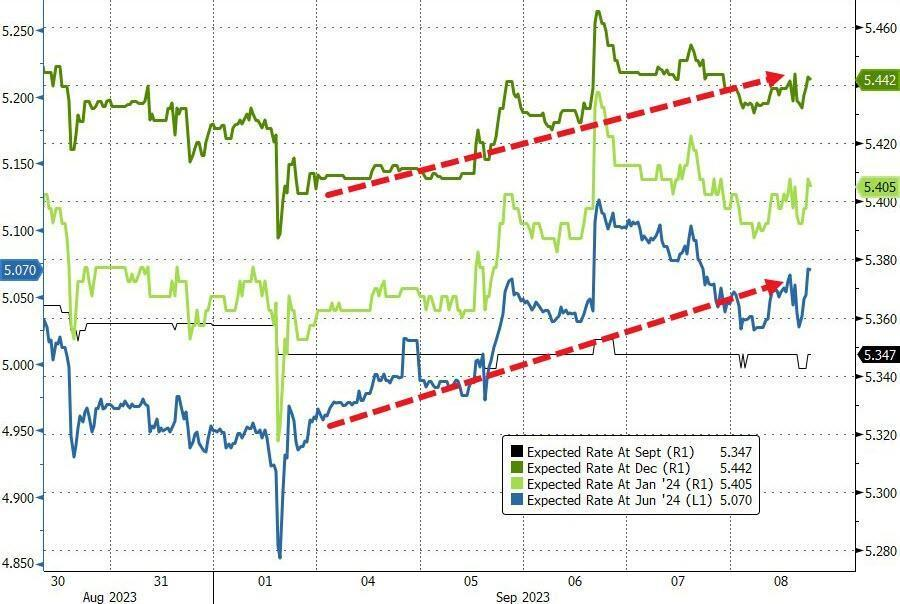

 _本周市场对年内美联储进一步加息的预期有所升温，总体体现呈偏鹰预期_

美元本周走强给全体大宗商品施加下行压力，黄金虽然周五止住跌势，仍最近三周首度累跌；欧洲等地的经济数据逊色，对经济前景的担忧打击下，经济风向标“铜博士”等工业金属全线累跌；原油得到沙特和俄罗斯延长自愿减少供应至年底的支持，全周继续累涨，但经济前景的阴霾遏制了涨势，本周涨幅远不及上周；欧洲天然气继续因学佛龙液化天然气（LNG）工厂的罢工消息震动，学佛龙在澳大利亚的LNG工厂同工会谈判破裂，工人周五罢工，周四强劲反弹的欧洲气价进一步走高，盘中一度涨超10%，后回吐多数涨幅，全周仍累跌。

纳指止住四连跌 和标普仍结束两周连涨 苹果本周跌近6% 芯片股和中概连日跑输大盘

三大美国股指开盘表现不一，但早盘齐涨。纳斯达克综合指数和标普500指数早盘保持涨势，纳指曾涨近0.7%，标普曾涨0.5%，后逐步涨幅，纳指午盘曾转跌。微幅低开的道琼斯工业平均指数盘初几度转涨，开盘约半小时后保住涨势，早盘曾涨近130点、涨近0.4%，午盘转跌时曾几乎回吐所有涨幅。

最终，三大指数本周首度集体收涨。道指收涨75.86点，涨幅0.22%，报34576.59点，连涨两日，继续脱离周二和周三刷新的8月25日以来低位。连跌三日的标普收涨0.14%，报4457.49点，连跌四日的纳指收涨0.09%，报13761.52点，和标普均暂别周三和周四刷新的8月28日上周一以来低位。

科技股为重的纳斯达克100指数收涨0.14%，跑赢大盘，脱离连跌两日刷新8月28日上周一以来低位。价值股为主的小盘股指罗素2000收跌0.23%，连续两日跑输大盘，连跌四日至8月24日以来低位。

在周一休市、只有四个交易日的本周，主要美股指势全线累计下跌，在上周大涨后回落。上周涨近3.3%的纳指累跌1.93%，上周涨近3.7%的纳斯达克100累跌1.36%，上周涨2.5%的标普累跌1.29%，结束两周连涨，上周分别反弹逾1.4%和3.6%的道指和罗素2000分别累跌0.75%和3.61%，分别录得最近四周内第三周和最近六周内第五周累跌。

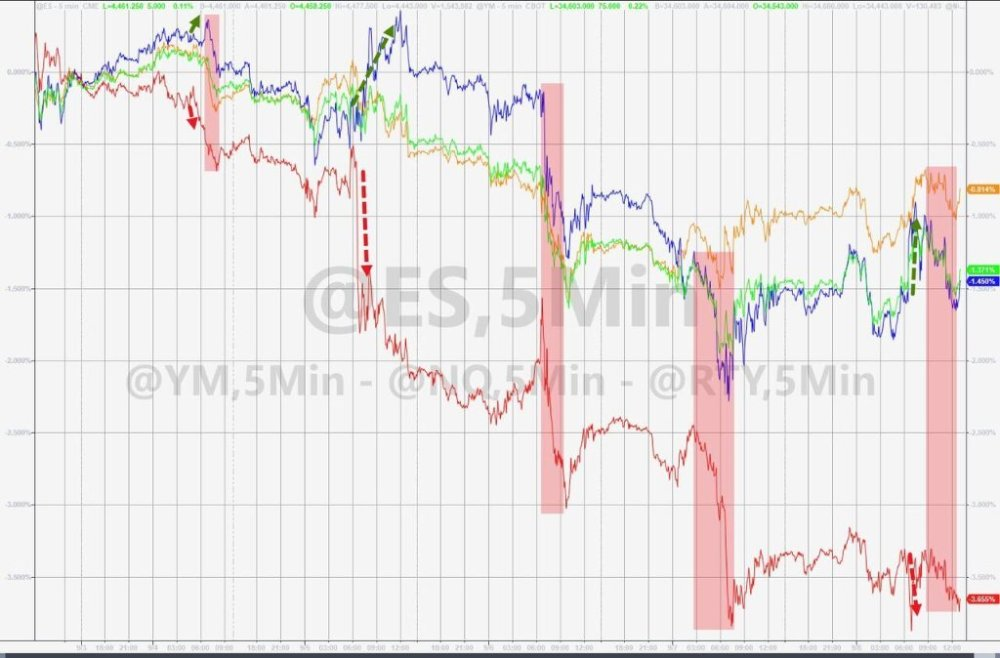

 _主要美股指本周走势_

标普500各大板块中，周五只有跌超0.6%的房产、跌近0.5%的工业和微跌的医疗三个未收涨，涨近1%的能源和公用事业领涨，其他板块涨不足0.4%，特斯拉所在的非必需消费品微涨。本周只有涨约1.4%的能源和涨近0.9%的公用事业两个板块累涨，工业跌近3%，矿业股所在的材料、苹果和芯片股所在的IT都跌超2%，医疗、房产、金融跌超1%。

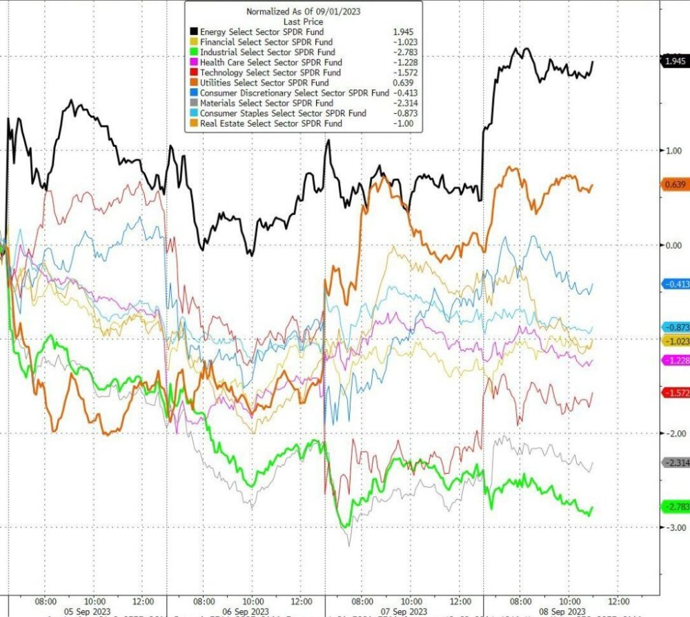

_美股各板块ETF本周走势_

龙头科技股早盘曾齐涨，盘中部分转跌，特斯拉盘初曾涨2%，午盘转跌，收跌1.2%，连跌三日，因周二逆市大涨约4.7%，本周还累涨1.42%，涨幅不及上周的2.7%，远不及上上周近11%的涨幅。

FAANMG六大科技股中，苹果早盘涨超1%，午盘回吐多数涨幅，收涨近0.4%，暂别连跌两日刷新的8月24日以来收盘低位；连跌两日的微软收涨1.3%，刷新周二所创的8月1日以来高位；谷歌母公司Alphabet收涨0.8%，连涨两日至去年4月以来高位；亚马逊收涨近0.3%，连涨两日至8月14日以来高位；而Facebook母公司Meta和奈飞盘中转跌，分别收跌近0.3%和不足0.1%，连跌三日，继续跌离各自周二刷新的8月15日以来和7月19日以来高位。

本周这些科技股大多累涨，仅周三和周四两日跌超6%的苹果累跌，全周跌近6%；微软涨1.7%，奈飞涨近0.7%，Alphabet和Meta涨约0.5%，亚马逊涨不足0.1%。

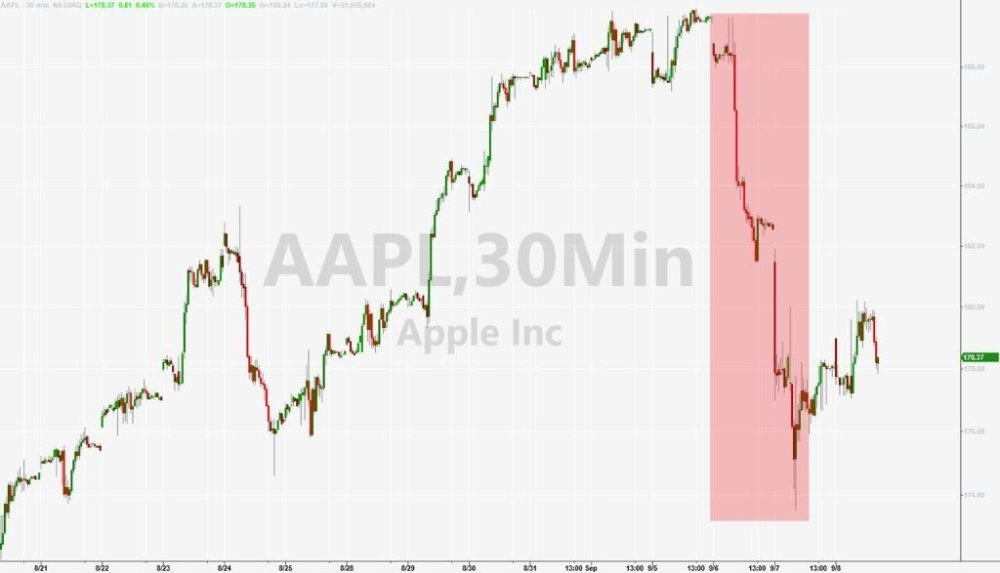

_苹果较7月末的盘中高位回落约10%_

芯片股总体继续下跌，势将连续两日跑输大盘。费城半导体指数和半导体行业ETF
SOXX早盘转跌，收跌约0.5%，本周分别累跌约3.2%和3.5%。AI芯片巨头英伟达收跌近1.5%，连跌三日至8月18日以来低位，回吐发布季报前以来的所有涨幅，在连涨三周、且每周至少涨超5%后本周累跌近6.1%；周四重挫逾7%的高通收跌逾0.2%，本周跌约8%；连涨九日的英特尔收跌近0.5%，跌落去年7月以来高位，AMD和应用材料也跌近0.5%，而美光科技涨0.4%。

AI概念股未能集体追随大盘反弹。到收盘时，BigBear.ai（BBAI）涨6.6%，C3.ai（AI）涨近1.6%，
而SoundHound.ai（SOUN）跌1.7%，Palantir（PLTR）跌近0.5%，Adobe（ADBE）微跌。

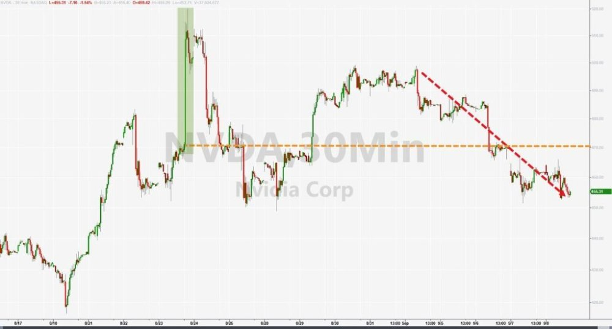

 _英伟达回到上月下旬发布季报前水平_

热门中概股总体连跌四日，继续跑输大盘。纳斯达克金龙中国指数（HXC）早盘曾跌超1%，收跌0.5%，本周累跌7%。个股中，收盘时B站跌超5%，拼多多跌超1%，在上周财报公布周大涨逾29%后，本周累跌约7.7%，百度收跌1%，小鹏汽车跌近0.5%，蔚来汽车和理想汽车跌约0.4%，腾讯粉单跌0.2%，而阿里巴巴涨不足0.1%，京东涨近0.2%，网易涨近0.5%；瑞幸咖啡收跌超6%，但因前三日每日至少涨超4%，在和茅台联名咖啡酱香拿铁开卖的本周，瑞幸累涨约7.4%。

连续两日跑输大盘的银行股指数反弹，本周仍累跌，回吐上周涨幅。周四连跌三日至8月22日以来低位的整体银行业指标KBW银行指数（BKX）收涨1.1%，本周跌约2.4%；周四连跌三日至7月11日以来低位的地区银行指数KBW
Nasdaq Regional Banking Index（KRX）和地区银行股ETF
SPDR标普地区银行ETF（KRE）分别收涨0.8%和0.9%，本周分别跌约5.2%和近5%。

大银行多数上涨，到收盘高盛、摩根士丹利、富国银行涨超1%，美国银行涨近0.8%，摩根大通涨不足0.1%，而花旗跌0.3%
。地区银行中，Keycorp（KEY）和Zions
Bancorporation（ZION）收涨超3%，西太平洋合众银行（PACW）和阿莱恩斯西部银行（WAL）涨超2%。

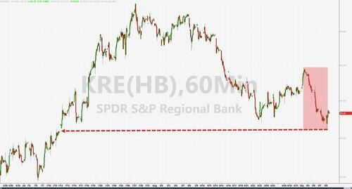

_地区银行股ETF最近六周内第五周累跌_

公布财报的个股中，三季度营收和营业利润率指引均低于预期、预计宏观经济逆风将持续今年全年的奢侈家具品牌RH（RH）收跌15.6%；二季度亏损高于预期、营收低于预期的遥感卫星数据公司Planet
Labs（PL）收跌11%；季度营收略高于预期、亏损符合预期的生物医药公司Avid
Bioservices（CDMO）收跌6.8%；而二季度收入和盈利均高于预期的电子签名公司DocuSign（DOCU）收涨；二季度营收低于预期但盈利高于预期的零售巨头Kroger（KR）收涨3.1%，同时，为争取监管方批准246亿美元并购Albertsons，Kroger和Albertsons决定，将413家门店作价19亿美元出售给C&S
Wholesale Grocers。

波动较大的个股中，周二跌超11%、周四跌近27%的“越南特斯拉”VinFast（VFS）收跌约4.7%，连跌八个交易日，在上周累跌57%后本周累跌41.9%，自8月15日合并SPAC上市以来，虽然8月累涨逾232%，但8月末到9月持续大跌。

欧股方面，连跌七日的泛欧股指反弹，终结了2018年2月以来最长连跌日，但未能扭转全周跌势，体现了央行紧缩环境下市场更担心经济前景。欧洲斯托克600指数告别周四刷新的8月25日以来收盘低位。主要欧洲国家股指齐涨，英股和法股连涨两日，分别连跌七日和六日和两日的西股、德股和意股反弹。

各板块中，因奢侈品巨头LVMH涨2.2%，终结七日连跌，带动所在板块个人与家庭用品涨超1%，旅游板块也反弹1%以上，周四逆市收涨的传媒也涨超1%。而周四跌超2%领跌的矿业股所在板块基础资源继续下挫，跌约0.3%，周四跌幅仅次于基础资源的科技微跌不足0.1%，受累于部分芯片股继续下行，荷兰ASML跌超1%，德国英飞凌跌0.6%，而周四跌超4%的苹果供应商、法国上市的意法半导体（STMicroelectronics
NV）收涨0.7%。

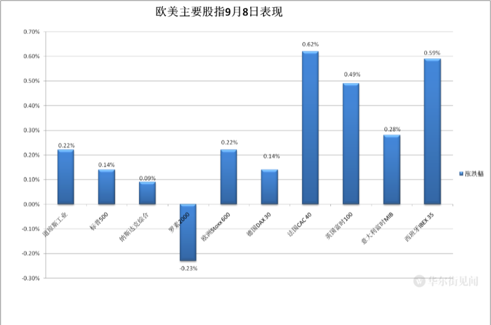

本周斯托克600指数累跌不足1%，表现远不及涨近1.5%创1月14日以来最大周涨幅的上周，和多数欧洲国家股指均在连涨两周后回落。而英股累涨，连涨三周。各板块中，上周涨超4%领涨的基础资源跌近3%领跌，体现经济数据逊色对矿业股需求前景的打击。银行和个人与消费品都跌超2%，上周涨近3%的科技跌超1%，而传媒涨超2%，上周涨超3%的油气涨超1%，继续受益于原油上涨。

本周两年期英债收益率降11个基点 同期美债收益率升11个基点

欧洲国债价格表现不一，欧元区国债波动较小，英债价格继续回升，收益率连日回落。到债市尾盘，英国10年期基准国债收益率收报4.42%，日内降3个基点；2年期英债收益率收报5.04%，降7个基点；基准10年期德国国债收益率收报2.61%，2年期德债收益率收报3.06%，均持平周四同时段水平。

全周欧债表现各异。收益率连降两周的10年期英债收益率大致平盘，周五持平上周五水平，而2年期英债收益率累计下降约11个基点，体现交易者继续降低对英国央行加息前景的预期；10年期德债收益率升约7个基点，在连降两周后反弹，和2年期德债收益升约8个基点，抹平上周降幅，体现本周多名欧洲央行官员鹰派表态的影响。

目前交易员预计，欧洲央行下周加息25个基点的概率约为40%，是一周前的两倍。

周五美国国债收益率波动相对较小，在周一休市的全周总体保持升势，主要源于周二油价上涨加剧通胀担忧且企业海量发债，美债收益率持续上行，周三公布的ISM服务业数据推高美联储加息预期，美债收益率盘中转升。

美国10年期基准国债收益率在欧股盘前曾下破4.21%刷新日低，日内降约4个基点，欧股盘中抹平降幅转升，美股盘前又转降，美股盘初下破4.22%，早盘转升，午盘曾升至4.26%，还未逼近周四升破4.30刷新的8月23日以来高位，到债市尾盘时约为4.26%，日内升约2个基点，本周累计升约个基点，结束两周连降，最近七周内第五周攀升。

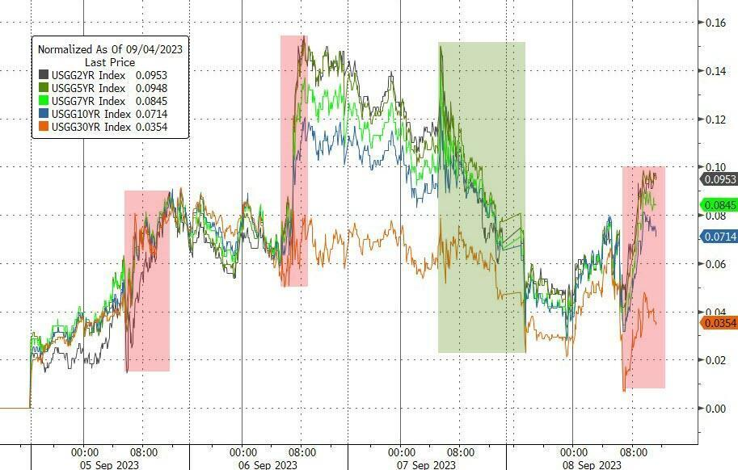

_各期限美债收益率本周齐升，短债收益率领衔攀升_

对利率前景更敏感的2年期美债收益率在欧股盘前曾下破4.92%刷新日低，美股早盘持续回升，抹平降幅，午盘持续回升，但未能重上5.0%、逼近周三升破5.03%刷新的8月29日以来高位，到债市尾盘时约为4.99%，日内升约3个基点，在上周大幅回落20个基点后本周累计升约11个基点，最近五周内第四周攀升。

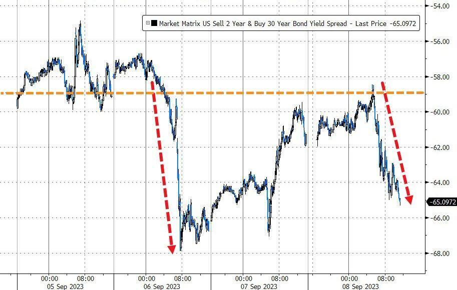

_两年期美债收益率周二和周三处于5.0%上方，周四回落后周五未能重回上方_

美元指数跌落近半年高位，仍连涨八周，在岸人民币连创逾十五年新低 离岸人民币失守7.36

追踪美元兑欧元等六种主要货币一篮子汇价的ICE美元指数（DXY）结束连续三日创至少3月中以来新高的势头，在周五亚市早盘迅速转跌后基本保持跌势，仅在欧股盘中曾短线转涨，美股开盘后跌幅持续扩大，美股早盘曾跌破104.70刷新日低至104.663，日内跌近0.4%，跌落周四涨破105.10至105.157刷新的3月10日涨至105.352以来盘中高位，午盘逐步抹平跌幅，一度转涨。

到周五美股收盘时，美元指数略高于105.00，日内微涨、几乎持平周四水平，在连涨三日后涨势暂歇，本周涨逾0.8%；追踪美元兑其他十种货币汇率的彭博美元现货指数涨不足0.1%，连涨四日，本周累涨约1%，和美元指数均连续第八周累涨。

彭博美元现货指数创有纪录以来最长连涨周，美元指数创2014年以来九年最长连涨周。

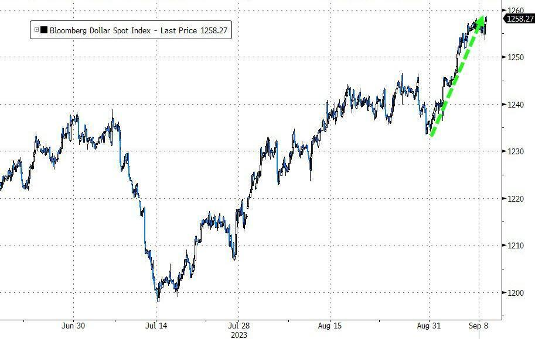

 _彭博美元现货指数创2月以来最佳周表现_

在岸人民币（CNY）兑美元周五保持下行，欧股早盘曾跌破7.35至7.3503，连续两日创2007年12月以来盘中新低，后很快收复7.35。北京时间16点30分，在岸人民币官方收报7.3415，创2007年12月以来收盘新低，较周四官方收盘价跌136点。日间收盘后，在岸人民币在欧股盘中曾收复7.34、并刷新日高至7.3345，美股盘前又失守7.34。北京时间9月9日3点整，在岸人民币收报7.3450，较周四夜盘收盘跌153点。

离岸人民币（CNH）兑美元在亚市早盘曾刷新日高至7.3346，早盘转跌后持续下行，在欧股盘前，自去年10月25日以来首次盘中失守7.36，后曾收复7.35，美股盘前跌幅再度扩大，美股盘中曾跌至7.3682，再度刷新去年10月25日以来盘中低位，日内跌260点，连续三日盘中跌超200点，北京时间9月9日4点59分，离岸人民币兑美元报7.3647元，较周四纽约尾盘跌225点，连跌五日，在连涨两周后本周累跌944点。

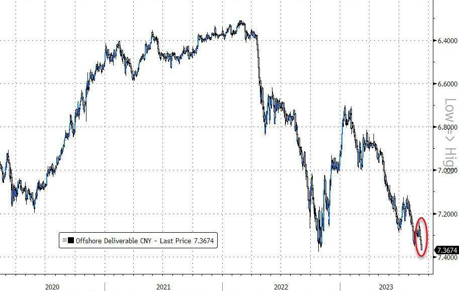

_在岸人民币连跌五日，创2月以来最差周表现_

其他非美货币中，继日本财务省副大臣后，日本财务大臣也发表口头干预言论，警告可能打击过度汇率波动，日元盘中曾刷新日高，后转跌，美元兑日元在亚市早盘曾跌破146.60刷新日低，日内跌近0.5%，后很快重上147.00，欧股盘前转涨，美股午盘涨至147.87，持平周四连续第三日刷新的去年11月初以来高位；欧元兑美元和英镑兑美元在美股盘前拉升，美股早盘曾分别涨破1.0740和1.2510刷新日高，日内涨逾0.4%和0.3%，脱离周四各自跌破1.0690和和1.2450所创的6月7日和6月8日以来低位，后持续回落，美股收盘时欧元几乎回吐所有涨幅，英镑微跌。

比特币（BTC）在美股早盘涨破2.64万美元刷新日高，欧股盘中加速回落，跌穿2.6万美元后一度跌至2.57万美元下方，较日高跌近800美元、跌近3%，美股收盘时处于2.59万美元下方，和上周五跌破2.54万美元刷新的8月17日以来低位仍有距离，最近24小时跌不到1%，最近七日涨0.6%左右。

原油反弹 布油六日内五度创近十个月新高 欧洲天然气盘中涨超10%

国际原油期货周五反弹，美股午盘刷新日高时，美国WTI原油逼近88美元，布伦特原油略超过91美元，日内均涨超1.2%。

最终，截至周三连续三日创去年11月以来新高的WTI
10月原油期货收涨0.73%，报87.51美元/桶，逼近周三报87.54美元刷新的去年11月11日以来收盘高位。布伦特11月原油期货收涨0.81%，报90.65美元/桶，最近四日内第三日收盘站上90美元关口，刷新周三所创的去年11月16日以来收盘高位，最近六个交易日内第五日收创去年11月以来新高。

本周美油累计上涨2.29%，布油累涨2.37%
，均在连跌两周后连涨两周，但涨幅均不及上周。上周美油累涨7.16%，布油累涨5.48%，分别创3月31日和4月6日以来最大周涨幅。

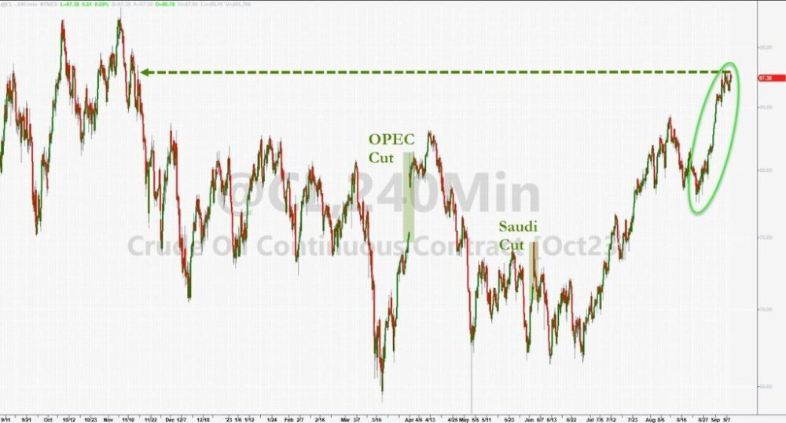

_美国WTI原油最近11周内第九周累涨，向90美元关口挺进_

欧洲天然气连续两日反弹，但部分源于周三大幅回落近10%，全周仍累跌。英国天然气期货收涨6.77%，报84.68便士/千卡，周五刷新日高时盘中涨约14.5%，本周累跌2.4%，连跌三周；欧洲大陆TTF基准荷兰天然气期货收涨5.35%，连续两日涨超5%，报34.508/兆瓦时，和英国天然气均刷新一周来来收盘高位，周五刷新日高时盘中涨12.6%，本周累跌3.1%，抹平上周反弹的涨幅。

美国汽油和天然气期货继续齐涨。NYMEX
10月汽油期货收涨1.17%，报2.6537美元/加仑，连涨三日，刷新8月23日以来高位，本周累涨2.4%，抹平上周回落的跌幅；NYMEX
10月天然气期货收涨1.01%，报2.6050美元/百万英热单位，连涨两日，继续脱离周三连跌四日刷新的8月23日以来低位，在上周止住两周连跌后本周累跌约2.60%。

黄金徘徊近两周低位 三周内首度周跌 伦镍五连阴 一周跌近5%

纽约黄金期货周五险些反弹失利，周五美股早盘刷新日高至1954美元，日内涨约0.6%，后持续回落，午盘曾转跌。

最终，COMEX
12月黄金期货收涨0.01%，报1942.70美元/盎司，虽然勉强止住三日连跌，但还接近周四刷新的8月25日以来收盘低位。本周期金累跌1.24%，最近三周首度累跌，此前两周每周涨超1%。

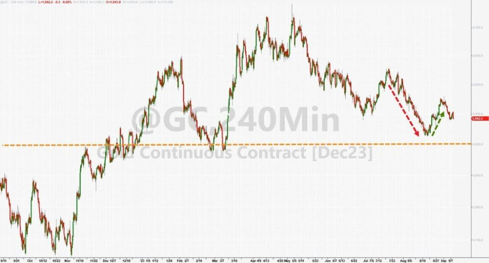

_纽约黄金期货连涨两周后回落_

纽约期银连跌五日，COMEX 12月白银期货收跌0.28%，报23.174美元/盎司，连续两日刷新8月18日以来低位，在连涨两周后本周累跌5.65%。

伦敦基本金属期货周五全线下跌。领跌的伦镍跌超2%，连跌五日，两周多来首次收盘逼近2万美元关口。伦锡跌近2%，三个月来首次收盘跌破2.56万美元，和伦铜都连跌三日，伦铜跌穿8300美元创三周新低。伦锌回吐周四止住三连跌的涨幅，回落到一周低位，周四反弹的伦铅和周四小幅收涨的伦铝也回落，伦铅未能继续靠近上周五所创的和七个多月来高位，伦铝创一周多来新低。

本周基本金属集体累跌，领跌的伦镍4.9%，伦铜跌约3%，伦铝跌超2%，伦锌跌超1%，伦锡跌0.9%，均结束两周连涨，连涨三周的伦铅跌0.9%。

纽约期铜连跌四日，COMEX 12月期铜收跌1.2%，报3.7165美元/磅，刷新8月18日以来低位，在连涨两周后本周累跌3.5%。

从累计涨跌，金银铜油和美国天然气四种商品之中，原油一枝独秀，其他商品都累计下跌。

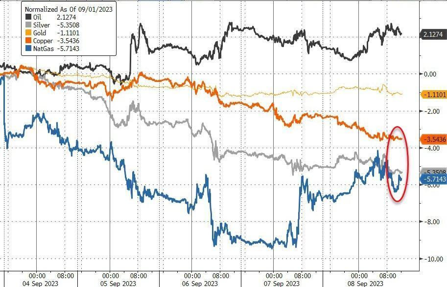

_金银铜油和美国天然气本周走势_

