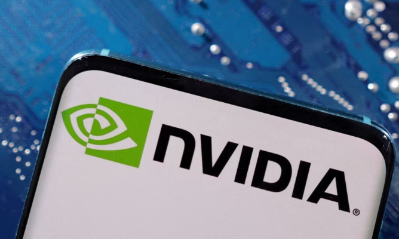
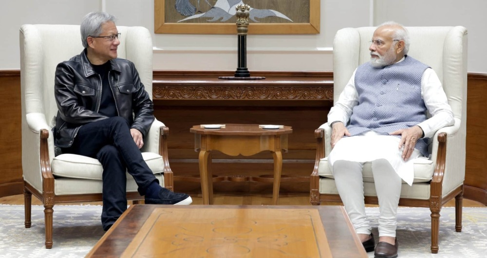

# 英伟达与印度开展AI合作：搭建AI基础设施，开发大语言模型

【文/观察者网
刘程辉】据路透社9月8日报道，美国芯片制造商英伟达当天宣布与印度信实工业和塔塔集团建立人工智能（AI）合作伙伴关系，共同建设云基础设施，开发大型语言模型以及生成式应用程序。

报道称，在美国政府对中国等国限制芯片出口之际，与印度两家最大商业公司的交易有助于英伟达深化对印度新兴人工智能生态系统的渗透。美国媒体认为，英伟达五分之一收入与中国有关，拜登政府对华芯片限制破坏了公司业务，可能是英伟达进军印度的动因之一。

_3月6日，一部显示有英伟达徽标的智能手机被放置在计算机主板上/路透社_

在与信实工业的合作中，英伟达将提供构建云人工智能基础设施平台所需的计算能力，而信实工业子公司Jio将管理和维护基础设施，并对用户行为进行监管。

英伟达表示，双方将合作开发以印度自己为基础的大型语言模型，让人工智能更好地为印度服务。双方将设立“比当前印度最快超算还要强大一个数量级”的人工智能基础设施。信实将为Jio的4.5亿（电信）客户创建人工智能应用程序和服务，并为印度各地的科学家、开发商和初创公司提供低能耗的人工智能基础设施。

两家公司在一份声明中表示，印度第一大软件服务出口商塔塔咨询服务公司将利用与英伟达的合作，构建和运行生成式人工智能应用程序和超级计算机。塔塔还将借助此次合作提升其60万名员工的技能。

声明补充道，合作还将推动塔塔集团旗下从制造业到消费业的各个公司向以人工智能为主导的转型。

报道提到，英伟达在全球范围内几乎垄断了用于为ChatGPT等服务提供支持的计算系统。为此类应用程序提供支持的人工智能被称为大型语言模型，因为它接收文本提示并从中编写出与人类似的回答。

此次合作将使信实能够使用最新版本的英伟达Grace
Hopper超级芯片，该芯片经过优化，可以执行人工智能推理功能，从而有效地为ChatGPT等应用程序提供支持。

信实工业方面表示，新的人工智能基础设施将加快印度的一系列关键人工智能项目，包括聊天机器人、药物发现和气候研究。

_9月4日，英伟达CEO黄仁勋与印度总理莫迪举行会谈/英伟达网站_

知名市场调研机构Counterpoint Research的合伙人尼尔·沙阿（Neil
Shah）表示，人工智能的加持对于Jio公司“理解”数百万用户的数据至关重要，并促使Jio成为一家能够提供电信以外服务的科技公司。

沙阿说：“人工智能基础设施将使其能够在零售、电信和金融领域的庞大客户网络中提供准确的建议，并交叉销售产品和服务。”

英伟达于2004年开始在印度开展业务，目前在四个工程开发中心拥3800名员工。

9月4日，印度总理莫迪与英伟达创始人兼首席执行官黄仁勋举行会谈，讨论了印度在人工智能领域的巨大潜力。英伟达方面称，这是莫迪和黄仁勋的第二次会面，表明英伟达在印度快速发展的科技产业中的作用。

对于英伟达与印度的合作，路透社称，在美国政府限制企业向中国等国出口芯片之际，这将帮助英伟达加深对印度这个新兴人工智能生态系统市场的渗透。

美国投资领域网站“Investopedia”9月8日给出了相似的观点，认为英伟达进一步进军印度正值地缘政治紧张局势加剧，拜登政府的芯片出口限制可能对英伟达的业务造成破坏。

就在8月31日，路透社称，美国政府将英伟达、AMD将美芯片制造商的先进人工智能芯片的出口限制，从中国扩大到中东地区。英伟达方面已证实此事，目前尚不清楚美国政府用意何为，也不清楚具体哪些中东国家将受影响。

“Investopedia”表示，虽然对中东出口的限制对英伟达收入的影响可以忽略不计，但英伟达五分之一的收入与中国有关。

此外，印度企业也开始瞄准芯片制造领域。路透社在8日的另一篇报道中称，根据两位知情人士的说法，印度信实工业已开始探索进军半导体制造领域，此举不仅满足了其自身的供应链需要，还能满足印度不断增长的芯片需求。

一位直接了解这些计划的知情人士称，在印度政府的鼓励下，信实已与有潜力成为技术合作伙伴的外国芯片制造商进行了早期谈判。不过目前还无法立即得知外国芯片制造商的名字。

“有这方面的意图，但没有具体时间表。”知情人士补充道，信实公司“尚未决定是否要最终投资”。

**本文系观察者网独家稿件，未经授权，不得转载。**

