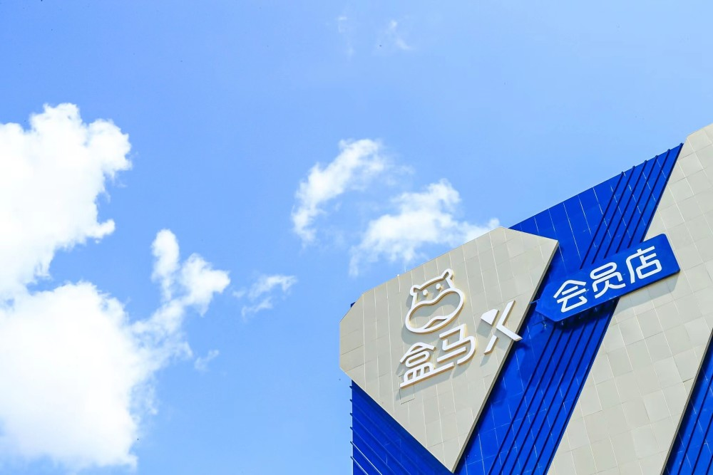
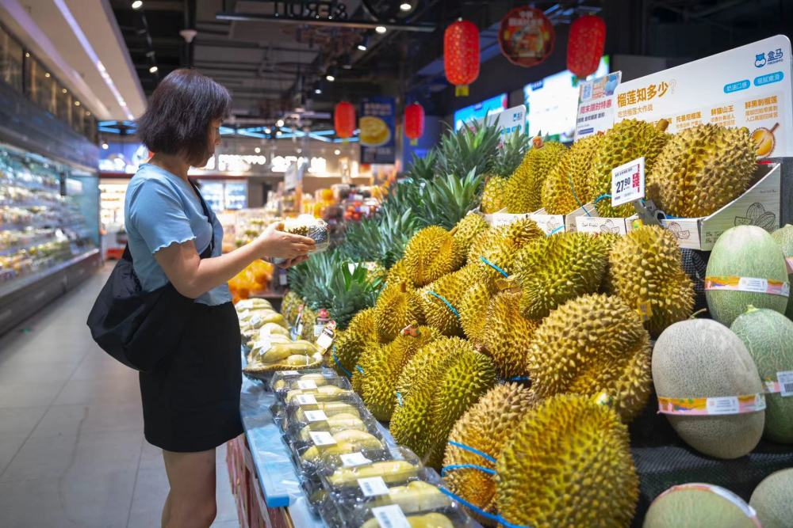

# 被传IPO搁置？盒马仍在狂奔：平均每天开家新店、死磕山姆

本文来源：时代财经 作者：张雪梅 黎倩

_图片来源：图虫创意_

“好久没有开战了，打一仗练练兵，很重要。”移山价上线后，盒马CEO侯毅在朋友圈转发一篇文章时这样写道。

7月31日，盒马“移山价”在北京、上海上线，一个八寸大、售价99元的榴莲千层蛋糕将一场暗流涌动的零售战争，直接摆上了台面，也将盒马和会员店巨头山姆捆绑。一个多月过去，这场突如其来的价格战覆盖的产品、地区不断扩大，似乎并无停下来的意思。

“高端的商战，往往采用最朴素的方式。”商品价格下降，消费者乐享其成，但对侯毅和盒马来说，这是一场久违的硬仗。背着上市任务的他们，心情或许没有话语中那么轻松。

今年3月，阿里巴巴宣布“1+6+N”改革，云智能集团将从阿里完全分拆独立走向上市，菜鸟、盒马启动上市计划，5月发布的2023财年报里，阿里透露董事会已经批准盒马启动上市流程，预计于未来6-12个月内完成。

上市前夜，死磕山姆的盒马急于向市场证明自己在零售市场的地位和能力，但资本市场是否买单犹未可知。

9月8日，有消息称，阿里正在搁置旗下盒马鲜生连锁店可能在香港进行的首次公开募股。阿里认为，盒马鲜生估值可能在40亿美元，低于其2022年考虑筹集私募融资时设定的60亿美元至100亿美元目标。对于IPO搁置事宜，盒马方面对媒体回应称“不予置评”。

**盒马狂奔，平均每天开家店**

上市提上日程表，留给侯毅和盒马的时间并不多。

2023年，盒马喊出了更高的GMV目标——1000亿元。据晚点LatePost报道，这一数字在2022年约为450亿元，2021年约为340亿元。而侯毅在年初更透露过，盒马的愿景是十年时间服务10亿消费者、全国10000亿元的销售、建立1000个盒马村。在更高的经营目标和上市重压下，盒马一改2019年以来收缩门店、降本增效的姿态，在2023年招兵买马、多业务急速扩张。今年1月，盒马CEO侯毅同样在内部信中强调，2023年还要“继续狠一点、继续苦一点”。

3月30日，盒马正式宣布上线“1小时达”服务，打破3公里边界，为3-5公里区域提供最快1小时送达服务；4月，盒马云超服务实现全国覆盖。

扩大配送范围不仅对盒马的运力提出了更高的要求，也让配送的人力成本相应上升。一般而言，盒马单店配送员在40-60名，多则上百名。而盒马扩大配送范围后，不少城市也开始加大配送员招聘。据南方都市报报道，3月底宣布扩大配送范围后，盒马在广州就开启新一轮骑手招募，预计带来约500个就业岗位。薪资方面，某招聘网站显示的北京盒马鲜生配送员的薪资范围在9000元-14000元。即便如此，一旦门店出现爆单，也会出现配送超时的情况。在社交媒体上，也有消费者表达对盒马配送服务的不满。

扩大配送范围的同时，盒马还在疯狂开店。挑起价格战前的一个月，盒马在北上广深等8座城市同时开出12家门店，8月又在上海、杭州、重庆等地开出7家门店。另据盒马最新消息，9月预计会开出16家盒马鲜生门店、3家盒马mini门店、9家盒马奥莱门店，1家盒马黑标店Premier,
1家杭州亚运会媒体中心体验店，合计30家门店，平均每天1家新店，开店速度重回巅峰。

但开店也意味着持续的投入，此前盒马已经连亏7年，直到2022年盒马鲜生这一主力业态才实现全面盈利。过去用亏损换取市场和规模，在上市面前未必合适。

资深零售专家王国平对时代财经分析：“盒马今年看重营收增长，新店开业能够实现营收快速增长，向外界证明其模式成立以及进入加速状态，以便获取资本市场认可。”

与此同时，盒马全新业态的“黑标店”也将落户上海龙之梦城市生活中心，并于国庆前后开业。

脱胎于互联网大厂，盒马的出现自带新零售基因，而从线上回归线下零售，折腾了7年的盒马也开始向山姆等零售巨头取经，并挖来了在商超领域经验丰富的高管。

今年4月，永辉超市原CEO李国加入盒马，担任CEO助理一职，参与盒马奥莱等业务。入职盒马前，李国在永辉超市工作超过20年，从门店员工一路做到永辉CEO。侯毅亦表示，李国过去20多年的零售从业经验，对盒马来说是一笔非常宝贵的财富。时代财经向盒马方面了解李国目前的具体工作，但对方表示暂不对外回应。而据红星新闻报道，李国已上任盒马NB事业部的新负责人。

**摸着石头过河，8年“折腾”不止**

对于盒马而言，IPO之仗已筹备数年。

2015年，刚刚接任阿里巴巴CEO的张勇和从京东出走、回到老家上海的侯毅一拍即合，年底，盒马正式成立，并于次年开出盒马鲜生第一家店。既是线下超市，又能在APP下单，门店3公里范围内30分钟送货上门，“超市+餐饮+APP电商+物流”的模式在当时吸引了不少消费者。

2016年的云栖大会上，马云首次提出新零售概念，背后正是出于对盒马的信心。马云站台，阿里砸钱，盒马这一新物种吸引了大批流量，其用了3年时间在全国布局超200家门店，成为网红级产品。无论外界、阿里，还是侯毅，都对盒马寄予过很高的期望，有传言称，“盒马很长一段时间是阿里CEO张勇的一号工程。”

然而，入局者不断出现，随着永辉、京东、苏宁相继试水线下生鲜超市，叮咚买菜、美团买菜等线上平台来势汹汹，模式没跑通，客群不稳定，长期未盈利的盒马顶不住经营压力，在2019年出现了一小波关店潮。

这一年，侯毅发现数字化、大数据也好，线上销售、电子支付和30分钟达也罢，仅仅是一个工具和服务方式，解决不了零售的本质问题。于是，他开始回归商业的本质——赚钱，将盒马“由舍命狂奔改为保命狂奔”，盈利成为盒马的第一要务。在阿里内部，他的汇报对象也由张勇转为集团B2B事业群总裁戴珊。

放慢开店速度的盒马，并未停止“折腾”。在2019年-2021年的新零售模型打磨期，盒马尝试过盒马F2、盒马里、盒小马、盒马小站等多种新业态，但大多以失败告终。

也是在这个阶段，阿里开始将盒马推向独立。2021年6月，阿里宣布组织升级，全面推行经营责任制，盒马则升级为独立事业群，开始自负盈亏。同年年底，阿里又升级“多元化治理”体系，宣布成立4个业务板块，分别由4个大总裁代表集团分管，盒马、飞猪、饿了么等业务分别成为独立的环路公司，有自己单独的薪酬、福利、预算和员工期权激励机制，盒马员工也从“阿里编”转变为“盒马编”。

这一年，盒马作为独立公司开始探索新的业务模式，在盒马鲜生和盒马X会员店的基础上，其新孵化了社区电商业态盒马邻里与折扣店盒马奥莱业态。不过，盒马邻里也遭遇发展瓶颈，其计划结合加盟模式迅速在全国一、二线城市完成扩张，曾经3个月开出400家店，却在2022年一退再退，至10月覆盖范围仅余上海一城。盒马奥莱的折扣店模式则初步跑通，迅速在上海规模化复制。

在2022年11月举行的供应商大会上，盒马CMO（首席商品官）赵家钰表示，盒马鲜生销售额当年同比增长达到了25%，盒马X会员店增长超247%；奥莱和邻里渠道的增长高达555%。盒马也基本形成盒马鲜生店、X会员店、奥莱店“三架马车”齐头并进的模式。

截至2023年6月，盒马于全国开设超过300家盒马鲜生门店，68家盒马奥莱店，及9家盒马X会员店。

_图源：盒马_

距离马云喊出新零售口号已经七年，互联网大厂们在亏钱中铩羽而归，却始终没有人能看清它到底是什么模样。而从线上线下都想要到侧重线下，摸着石头过河的盒马还在继续探索。

**估值缩水4成？盒马“对标”沃尔玛**

前期烧钱不断，分拆独立、自负盈亏，盒马的上市融资成为圈定的生存路线。

早在去年年初，就有盒马寻求以约100亿美元估值融资的消息传出；而到了去年7月，据路透社援引三位知情人士消息称，盒马正在寻求以约60亿美元的估值融资，半年时间估值缩水了4成。

“资本市场对盒马的估值取决于对标参照物或者盒马能给资本描绘一个怎样的前景，其估值从100亿美元降至60亿美元，是因为盒马更多是在永辉超市市值的对标范畴。想要获得更高的资本溢价，对标脱离永辉超市有其必要性。”王国平指出。这也或许可以解释此轮价格战中，盒马为何一直在“捆绑”山姆。

王国平也认为，盒马更偏向于将沃尔玛作为自己的对标参照物，“盒马鲜生对标沃尔玛，盒马X会员店对标山姆。”而盒马7月底推出的“移山价”，一方面是尝试跑通折扣路线，增强供应链的竞争力，另一方面或许也有让外界将盒马与山姆对标的意思。

在近日的采访中，侯毅也谈及零售行业折扣化是赢得竞争的方法，“折扣化是差异化商品竞争、垂直供应链、极致的营运成本。一定要有让消费者印象深刻的爆款产品，而不仅仅是便宜的价格。”而这背后依靠的是强大的供应链建设，和自有品牌的打造。

以自有品牌为例，据晚点LatePost报道，山姆旗下自有品牌Member'sMark，目前占山姆全部商品的25%-30%，在2022年为山姆中国贡献约40%的营业额。而据盒马CMO赵家钰透露，在盒马平台，囊括了生鲜、标品、3R（即烹、即食、即热）等自有品牌的销售占比现已达到35%。数据显示，截至2022年10月底，盒马自有品牌商品类目1200多种。

不过，与山姆覆盖全球的供应链相比，年轻的盒马在供应链深度上还远远不够。一直以来，盒马也在持续优化门店商品。盒马西安的一家供应商——陕西秦之杰商贸有限责任公司相关负责人对时代财经表示，2018年盒马刚进驻西安市，公司在当地盒马鲜生门店上架100多个sku，至2022年5月其退出盒马系统时，仅剩下10多个sku，“盒马采购系统分为产地直采和全国统采，我们很多商品让位给了全国供应商。另外，当初合作时盒马选品可能比较仓促，所以后续有些商品被淘汰掉了。”

上述供应商还透露，2018年公司与盒马达成合作时，对方收取9个点的费率，即供货100万元，给供应商实际结款91万。2019年时费率涨到11个点，2020年则上涨至13个点（传统卖场整体后台费用占比约为15个点）。

与此同时，盒马也在打造全球供应链。今年9月，其与多家海外水果企业达成合作，盒马水果采销总监陈杨辉对时代财经透露，盒马在合作过程中，会根据消费者需求倒推，将需求传递给海外水果商，使其生产出符合中国市场标准的产品。

 _图源：盒马_

不过，目前盒马的模式还没有完全跑通。“折扣逻辑、自有品牌是盒马在向供应链深水区进行改革，考验的是供应链管理能力和极致的运营能力。‘移山价’仍在打个别单品，如果能够实现全品低成本运作，才算真正实现跑通。”王国平指出。

对于资本市场而言，能否盈利是仍是考量上市公司的重要指标。有资本市场人士对时代财经直言，“市场怎么看待盒马主要还是看它的财务表现，尤其是其亏损情况，另外它过去和现在的业务变化很大，尤其是疫情之后。”

年初的内部信中，侯毅透露，2022年实现了主力业态盒马鲜生的盈利。但与整体盈利尚有距离，阿里2023财年年报（2022年4月1日-2023年3月31日）透露，2023财年，盒马通过增强其销售能力并提高运营效率，致使其亏损同比大幅收窄。

抛开与山姆的价格战，站在上市门口的盒马，仍面临不小的挑战。

