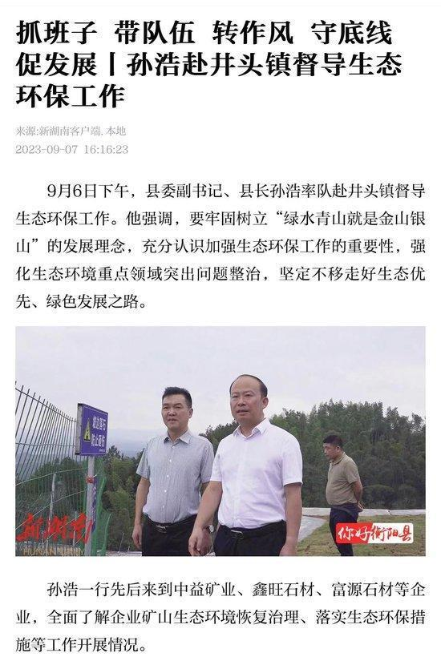

# 一县长视察路上无视村民拦路“告状”？县长本人：不完全是真实情况

9月9日晚上，一段视频在社交媒体广泛传播，视频中显示：一个约有4辆车的车队经过一条公路时，其中一辆标有“环境监察”字样，一名女子拦住开路警车，大声诉求着什么。

该视频文字说明：9月6日下午4点，湖南省衡阳县领导带着车队下乡检查工作，期间遇民妇跪地喊冤，车队方面当即令人将其控制，随即扬长而去。

据了解，视频里说的衡阳县领导是县长孙浩。查阅当地新闻报道“9月6日下午，县委副书记、县长孙浩率队赴井头镇督导生态环保工作。他强调，要牢固树立“绿水青山就是金山银山”的发展理念，充分认识加强生态环保工作的重要性，强化生态环境重点领域突出问题整治，坚定不移走好生态优先、绿色发展之路。”

9日晚7时许，指尖客户端联系上了孙浩，孙浩表示：“视频里展现的不是那么回事，当天我的车已经过去了，并没有看到拦路的，后来同志们说有群众拦车反映情况，我才知道，但我已经安排人去了解了，当事人反映的是企业股东之间的矛盾。”

稍有不同的是，拦路的戴女士告诉指尖客户端：“我看到有车开道，就拦下了第一辆车，没看到有过去的车，我知道他那天有视察，那条路是他必经的道路，拦车是为了反映企业股东之间的问题，拦车后没有政府人员找过我。”戴女士表示，拍摄视频的是其司机。

此前的采访中，孙浩县长曾表示，会安排县里宣传部门与记者立刻对接，但截止截稿前并无人对接，而且当地相关部门负责人也未对指尖客户端的采访予以正面回应。

指尖客户端将继续关注此事进展。

指尖客户端记者 刘强

