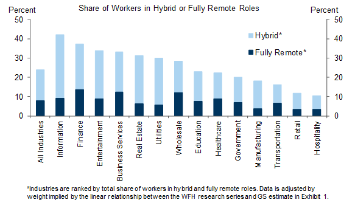
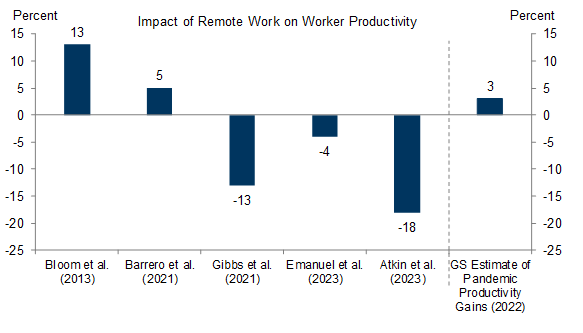

# 不愿放弃居家工作自由？一周三天回公司，成硅谷和华尔街员工新方式

腾讯新闻《潜望》作者 纪振宇 发自硅谷

好不容易适应了居家工作的自由和舒适，在硅谷工作的Jonathan又要重新面临通勤上班的考验。

在席卷全球的新冠疫情爆发三年后，从硅谷的科技公司到华尔街上的金融企业，开始纷纷对员工喊话：“速速返回办公室！”

“很多人会选择周中去办公室，避开周一的上班高峰，还有周五留给自己一天，基本上相当于给自己多放半天假。”
Jonathan的公司虽然要求逐步恢复常态化办公，但目前离疫情前每天到岗的状态还有差距。

伴随着疫情一起流行起来的“远程办公”概念，现在正在成为公司和员工之间争执不下的焦点，甚至有态度强硬的公司直接放话：不想回来上班，就考虑去别的公司找工作吧。

从公司的角度而言，业绩和效率永远是首要考量的因素，这大概也是公司如此急促地在新冠疫情消退之后，让员工立即回来上班的主要原因：“远程工作”对于某些行业、某些公司来说，不仅没有带来生产力和效率的提升，反而带来了拖累。

但“远程办公”的概念，或许就像新冠病毒永远无法消失一样，将成为现代工作生活形式的一种新常态。即便是科技行业中态度最强硬的亚马逊，也只是要求员工至少一周要到岗三天，并没有强制一周五天的到岗率，这也是在目前的“拉锯”下，不得不做出的无奈妥协。

高盛近日的一份报告指出，远程办公持续进行下去既有结构上的原因，也有周期性因素。从结构上来看，与疫情相关的初期的居家隔离措施，催生了技术创新，使远程工作变得可行和便捷；从周期上来看，过去两年紧张的劳动力市场，使公司更愿意做出妥协，允许员工远程工作。

**终于开始享受居家工作了，公司叫上班了**

作为硅谷某科技大厂的一名员工，Jonathan在过去三年中经历了工作上的起伏变化，一切都围绕着那一场突如其来的新冠疫情开始。

“2020年初，组里开始完全远程办公，就我们的工作性质来说，问题也不大。” 负责某款产品前端的Jonathan对腾讯新闻《潜望》说。

但时间一长，问题开始慢慢出现。

“整天在家，感觉工作时间并没有变少，甚至还增加了。”Jonathan说，“该干的活一样要及时干完。”

尤其是在产品新版本发布上线赶进度时，基本上需要全部的投入。他表示，居家工作对他来说最大的一个挑战是，原先工作和生活的区分界限变得模糊，虽然人在家中，却无时无刻都觉得自己无法脱离开工作，而家中的事也同样牵扯着自己的时间精力。

三年前，Jonathan的孩子还没到上学的年纪，由于害怕疫情，也不敢将孩子送去托儿所（Daycare)，只能在家里照看。同在硅谷某科技公司工作的妻子和他两人除了日常工作以外，还要照看孩子。

“原先觉得在家里时间比较自由，无论如何两个人总能安排得开。”Jonathan说，“但实际发现实施起来并不容易。”

最后导致的情况是，Jonathan和妻子身在家中，却无时无刻不被工作和照顾小孩两件事情同时牵扯，疲于奔命。

“有些时候眼睛一直盯着电脑屏幕，大脑却一片空白，”Jonathan说，“有时甚至想放下这一切，但清醒过来又发现，什么都改变不了，只能再熬一熬。”

支持Jonathan和妻子继续“熬一熬”的很大动力，来自于对新冠疫情缓解的期待。

事情确实在朝着好的方向发展，学校逐步开放，尽管还是有一些担心，
Jonathan和妻子也决定和其他家长一样，将孩子送到托儿所，这样整个白天的时间，他们可以不用在照顾孩子方面花任何的时间精力。

“终于感觉有了自己的一点生活空间，”Jonathan说，“我们开始真正享受到居家工作的好处。”的确，不用在上下班高峰时间通勤，节省下很多时间，又能充分享受在家工作的自由。

但今年开始，Jonathan所在的公司，开始逐步恢复常态化，要求员工回到办公场所。根据具体工作内容性质不同，一些组最开始要求一周至少要到办公室两三次。

和同事一样， Jonathan目前也是选择周中去公司，周一周五在家，这样既能避开上班高峰，又有多一点属于自己的时间。

Jonathan觉得这样的“混合”式的工作安排是他可以接受的最舒适的一种工作状态。目前公司的政策依然相对宽松，并没有强制要求每个工作日都要到岗。具体到组里的安排，也是在公司大的政策的基础上，仍有一些灵活度，部分住的较远的员工，依然可以选择继续居家办公。

**对回办公室，高盛、摩根大通和亚马逊为何如此强硬？**

但即便是在许多公司纷纷要求员工回到办公室的情况下，远程工作在很大程度上可能会成为一个新的常态。

根据高盛最近的一份调查报告显示，美国公司员工平均在一周内至少会居家工作一天的比例，目前稳定在20%-25%左右的水平，尽管远低于疫情期间高达47%的比例，但仍然远高于疫情之前仅仅2.6%的水平。换句话说，由于席卷全球的新冠疫情的影响，很多事情已经不可能再回到疫情之前。

分行业来看，信息技术和金融依然是目前远程工作和混合工作形式最多的行业。从公司角度而言，无论员工的工作形式如何变化，最重要的决策考量因素是不影响生产力，但远程工作对生产力究竟如何影响，目前主流的研究并没有形成统一的有足够置信度的观点。

高盛的报告引用的部分研究结果表明，部分研究认为远程工作能够对员工的生产力带来很大提升，但也有研究认为会造成生产力的大幅下降。高盛自己在2022年的研究则认为在疫情期间，远程工作对生产力带来了3%的提升。

高盛表示，造成结论不一致的原因主要在于可能是由于不同研究对生产力的测量方法以及研究的任务类型和行业的差异所导致的。

高盛指出，早期的研究使用自我评估生产力的调查数据，或在涉及任务的行业(例如呼叫中心)的实验证据的研究，倾向于发现远程工作的积极影响。

但最近的研究使用了更为复杂的绩效指标，并从涉及高认知任务的行业(例如IT服务)收集证据，揭示了更多远程工作的负面影响。

高盛认为，学术研究的一个局限性在于，它们大多集中在远程工作如何通过改变员工的表现来影响生产力。但是远程工作还可以通过其他渠道影响整个经济的生产力，例如帮助企业减少办公费用和促进技术创新。

“在我们以前的研究中，我们估计远程工作和其他疫情变化使私营部门的生产力提高了大约3%，尽管我们继续看到这些估计存在相当大的不确定性。” 高盛在报告中指出。

这也在一定程度上解释了为何不同公司目前对于远程工作的态度如此不一致。最具代表性的华尔街投行例如高盛、摩根大通等，态度十分坚决强硬，要求部分岗位的员工必须要出现在办公室；同样科技行业的电商巨头亚马逊首席执行官Andy
Jassy也直截了当地表示，亚马逊员工必须一周到岗至少三天，如果不同意，就去别的公司找工作吧。

在部分行业和公司的强硬态度下，全美回到办公室办公的员工比例正在缓慢上升。根据安保提供商Kastle
Systems的最新数据显示，在8月17日至8月23日的一周，全美人口最多的前十大城市中，办公楼的使用率达到47.2%，已经显著高于一年前同期的43%的水平。

近期最具标志性意义的事件是远程会议应用Zoom也号召员工回到办公室上班，这家业绩受益于疫情的公司，股价随着新冠疫情的发展经历了大起大落。

**一周三天，公司和员工正达成默契**

尽管对于许多人来说，重新回到办公室，意味着过去两年逐渐形成习惯的工作和生活节奏需要重新调整，甚至需要从别的城市搬到离办公室更近的地点，但在雇主更强势的态度下，绝大部分人还是遵从了公司政策规定。

“没有必要跟公司政策硬碰硬。”在某硅谷科技公司大厂供职已经5年的Shaun对腾讯新闻《潜望》表示，“如果觉得自己的能力还不够，那就先老实待着吧，一些生活上的不方便也并不是不能克服。”

Shaun的态度或许代表了大多数在硅谷科技行业或华尔街金融行业工作的职场人的心态，尤其是在过去两年曾经光鲜的行业经历了大规模裁员的背景下，对于普通“打工人”来说，能保住一份收入相对稳定的工作，在某种程度上已经算是幸运。

“想要绝对的时间和空间上的自由，可以去创业，没人拦着你，”Shaun说，“但是只要在公司打工一天，那就按公司规定办吧。”

要求员工一周回到办公室3天目前已经成为硅谷科技公司主流的约定俗成的方案，如果不属于协议上规定的“远程工作员工”，基本上所有人都要遵从这一规定。对于大多数人来说，这一规定并非难以接受，公司方面实际上也做出了一定程度的妥协。

对于去年刚毕业加入到某硅谷大厂的Max来说，他甚至很期待看到办公室熙熙攘攘热闹的场景。因为疫情期间还在读书，他从来没有经历过疫情之前公司的工作状态。

“对我来说，一周三天去办公室的时间甚至有些少，”Max说，“我做的是我很感兴趣的工作，现在租的公寓也离办公室挺近，没觉得去上班有什么不方便。”

就腾讯新闻《潜望》所了解到的情况而言，虽然之前在硅谷科技公司中间流传出的要强制执行一周三天回办公室工作，将出勤与绩效挂钩的说法，但实际上真正纳入到规章制度的极少，公司本身也不愿意额外在原有的绩效体系中，再新增一些更复杂的考核变量。

“如果组里所有的人，都按照规定一周三天，你不可能还自己一个人在家吧，除非特殊情况。”Shaun说，“这是公司和员工之间达成的某种默契。”

公司和员工之间对于远程工作的态度，正在达成某种意义上的微妙平衡。在纽约某大型资管机构工作的Dan对腾讯新闻《潜望》表示，自己对于回到办公室工作并不抵触，他依然很享受和同事在一起协作的时光。

“即便是在一起喝个咖啡、吃个午饭，闲聊一下也能增进一下团队的气氛，”Dan说，“这个是无数次Zoom会议都替代不了的。”

Dan表示，由于他工作性质的因素需要频繁见客户，回办公室上班客观上会给他更好的工作状态。“从办公室出发去见客户和从家里出发，精神状态也会很不一样。”Dan说。

