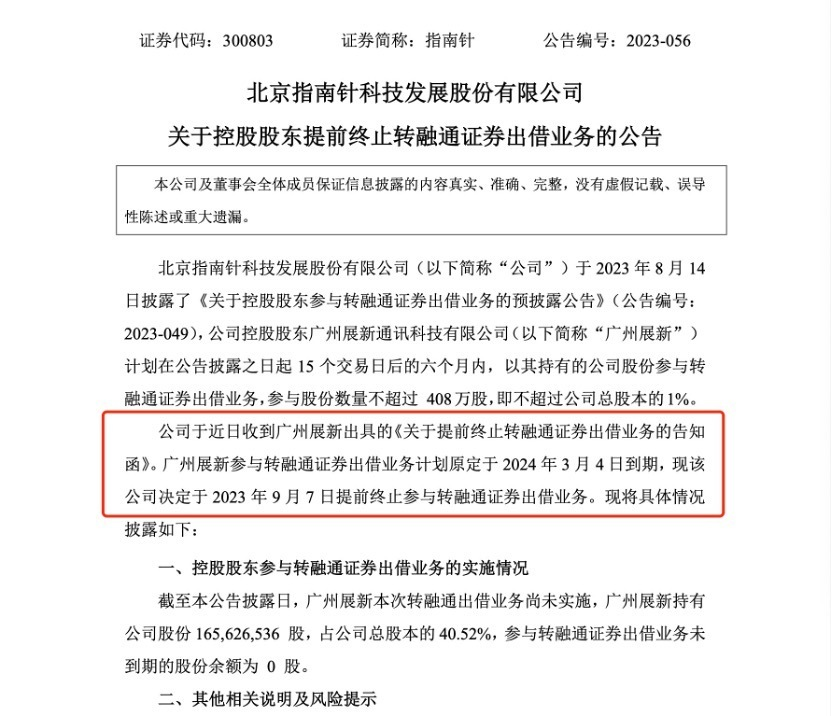

# 关起“做空力量”？上市公司股东罕见提前终止融券出借

**财联社9月10日讯（记者 闫军）** 一则上市公司控股股东提前终止转融通证券出借业务的消息在周末迅速发酵。

9月7日下午，指南针公告称，近日收到公司控股股东广州展新出具的《关于提前终止转融通证券出借业务的告知函》。广州展新参与转融通证券出借业务计划原定于2024年3月4日到期，现该公司决定于2023年9月7日提前终止参与转融通证券出借业务。

融券作为A股可“做空”的力量，终止融券出借，杂糅在当前市场震荡磨底、高频量化被质疑的情绪中，挑动了市场的敏感神经。立马传出小作文称已有通知“所有融券渠道告知客户截止10月1日前必须还券”，在社交平台被迅速讨论。

上市公司提前终止融券出借的确罕见，背后的真相如何？观点有多方面，有观点认为或对高频量化交易有影响，也有业内人士认为，当前控股股东提前终止融券借出，更大的可能在于限制控股股东的变相减持。

**罕见控股股东提前终止融券出借**

根据指南针公告显示，近日收到公司控股股东广州展新出具的《关于提前终止转融通证券出借业务的告知函》。广州展新参与转融通证券出借业务计划原定于2024年3月4日到期，现该公司决定于2023年9月7日提前终止参与转融通证券出借业务。

据悉，广州展新持有指南针40.52%的股份，为公司控股股东。当前参与转融通证券出借业务未到期的股份余额为0股，也就是说广州展新本次转融通出借业务尚未实施。

根据此前公告显示，公司于今年8月14日披露了《关于控股股东参与转融通证券出借业务的预披露公告》，广州展新计划在公告披露之日起15个交易日后的六个月内，以其持有的公司股份参与转融通证券出借业务，参与股份数量不超过408万股，即不超过公司总股本的1%。

有投顾人士认为，提前终止融券出借，相当于少了这部分的做空力量，对股价是有正面刺激的。这一点也是得到不少投资者的认同，不少股民留言称，没有做空力量，并直指高频量化的“收割”。

控股股东提前终止融券出借的情形并不多见，财联社记者不完全统计显示，上一次还要追溯到2022年9月16日，光环新网公告称，公司收到控股股东百汇达出具的《关于提前终止参与转融通证券出借业务的告知函》。百汇达参与转融通证券出借业务计划原定于2022年12月14日到期，截至2022年9月15日上述计划时间已过半，百汇达拟于2022年9月16日提前终止参与转融通证券出借业务。

**业内人士称“堵上变相减持漏洞”**

罕见的控股股东提前终止融券业务出借，引起市场的众多猜测。财联社记者从多位业内分析人士处获悉，这一举措带来最直接的影响，或是“堵上变相减持的漏洞”。

众所周知，8月27日证监会公布减持新规，要求上市公司存在破发、破净情形，或者最近三年未进行现金分红、累计现金分红金额低于最近三年年均净利润30%的，控股股东、实际控制人不得通过二级市场减持本公司股份。控股股东、实际控制人的一致行动人比照上述要求执行；上市公司披露为无控股股东、实际控制人的，第一大股东及其实际控制人比照上述要求执行。

同时，从严控制其他上市公司股东减持总量，引导其根据市场形势合理安排减持节奏；鼓励控股股东、实际控制人及其他股东承诺不减持股份或者延长股份锁定期。

据悉，证监会正在抓紧修改《上市公司股东、董监高减持股份的若干规定》，提升规则效力层级，细化相关责任条款，加大对违规减持行为的打击力度。

上述业内人士指出，目前来看， **并无迹象表明监管限制上市公司控股股东融券出借行为，但是从这一事件影响来看，或将堵上上市公司变相减持的漏洞。**

有业内人士指出，在市场上通过融券来实现变相减持是较为容易操作的举措。“在操作上，上市公司把券借给资管计划，然后做空自己股票，再自己再买了这个资管计划，相当于锁定了价格，未来如果股票下跌，虽然自己持有的股票亏钱，但因为买了资管计划，而资管计划是做空自己股票。所以最后的结果可以实现不赚不亏。”该人士指出，这样做就可以绕过监管实现减持。

该人士进一步解释，通过融券变相减持严格意义上并不违反减持新规，但是属于“灰色地带”，的确可以通过一些举措进行规范。

在减持新规发布后，上市公司重新评估减持行为，截至目前，A股已有近百家公司股东终止减持计划，终止减持股票市值合计逾170亿元，还有逾70家公司股东承诺不减持。

但是在这其中，也有上市公司“顶风作案”，公然违规减持，甚至被出示监管函。比如，就在监管新规发出的第二天，股价处于破发的东方时尚的控股股东东方时尚投资在已明确知晓相关要求的情况下，踩线通过大宗交易减持公司股份340万股，占公司总股本比例0.47%。

监管的处罚同样火速下达，9月6日，北京证监局决定对东方时尚投资采取责令改正的监管措施，上交所对东方时尚控股股东东方时尚投资予以监管警示。

东方时尚发布公告称，东方时尚投资将通过自筹资金于9月15日前购回此部分减持股份，如此部分股份购回涉及收益所得将全部归上市公司所有。

与此同时，8连板我乐家居股东惊现5%以上股东“清仓式”减持并反向交易被处罚，公告显示，我乐家居股东于范易及其一致行动人刘福娟、烟台埃维管业有限公司、西藏埃维创业投资有限公司、烟台埃维商贸有限公司为合计持股比例达到5%以上的股东，于2023年6月30日至2023年9月6日收盘期间通过集中竞价方式“清仓”式减持所持公司股份，并买入4200股。

我乐家居9月7日午间公告，公司获悉股东于范易及其一致行动人刘福娟于当日收到证监会下发的立案告知书，因涉嫌超比例减持，根据相关法律法规，证监会决定对公司前述股东立案。

上述人士指出，在过去资本市场强调“重融资”理念下，上市公司控股股东约束较少，获得更大利益。当前减持新规的初衷在于，避免因大股东在市场低迷的环境下大量抛售股份而对市场造成冲击，同时引导大股东优先考虑做大做强企业，强化长期投资理念。但是依然有些上市公司顶风作案，明知监管要求之下刻意“踩红线”，体现了一定程度的短视。

**又伴随小作文借题发挥**

指南针提前终止融券出借后，市场立刻传出无出处小作文，有消息称，“通知要求：所有融券渠道告知客户截止10月1日前必须还券，”并进一步解读称“彻底扭转空头趋势”。

对于要所有渠道还券的真实性，多位公募人士向财联社记者表示，从逻辑上可以推断为假消息。融券具备相对灵活，提供多种交易策略，通过杠杆放大投资收益，也能扩大投资范围等优势，“一刀切”停止融券可能性不大。

配合上述小作文，还有投资者引申为，指南针这一提前终止融券出借动作，让高频量化无法做空，为重大利好。

不过这一说法并未得到专业人士的认可，仅以指南针单个事件来看，广州展新本次转融通出借业务尚未实施，也就意味着此前并没有做空力量加入。此外，从全市场来看，高频量化中通过融券交易占比并不高，或为20%，高频量化主要盈利途径还是在短期持票、高频交易博弈中获利。

（财联社记者 闫军）

