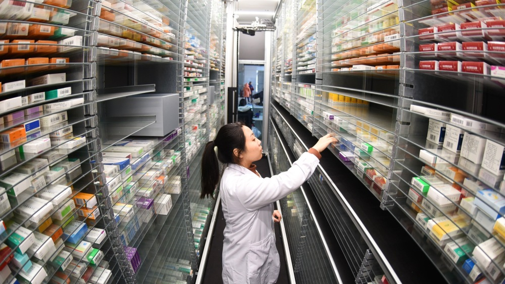
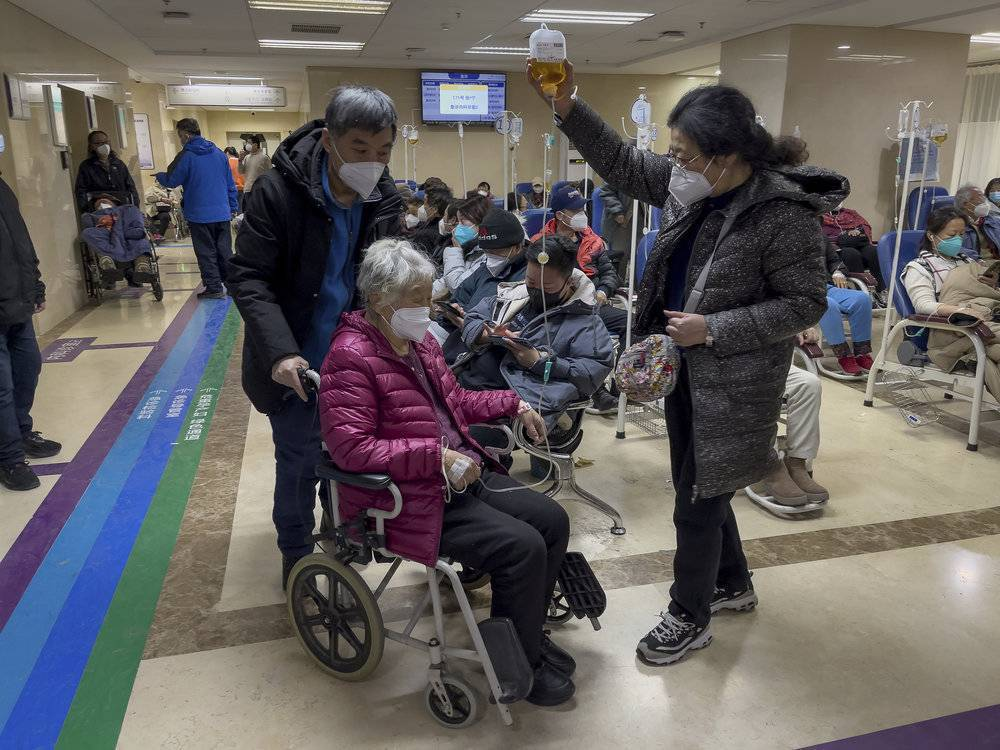
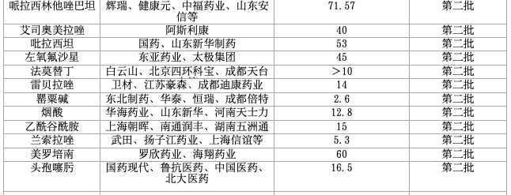
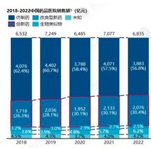
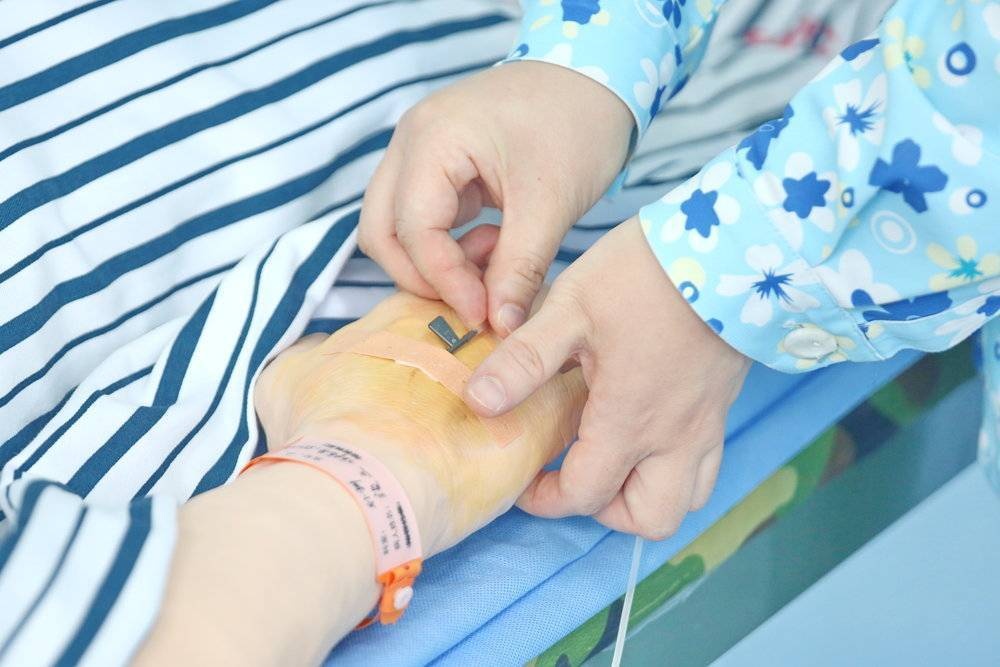

# 在医院为什么买不到以前的常用药了？因重点监控制度让部分神药消失了

出品｜虎嗅医疗组

作者｜陈广晶

编辑｜廖影

头图｜视觉中国

医疗反腐压力持续升级，一项威力更大的新政也开始发力。

就在9月2日，上海市闵行区纪委监委官网透露，上海医药集团下属子公司的4名原高管接受纪律审查和监察调查。

这四个人分别是：9月1日刚宣布辞职的上海医药集团原副总裁、上海上柯医药原董事长潘德青；上海上柯医药总经理李平；上海上药第一生化药业原总经理陈彬华；上海上药第一生化药业公司原副总经理黄臻辉。

此前中药龙头企业片仔癀，也有4名原高管落马。

一个是全国排名前三的大型医药集团，一个是有“药茅”之称的中药大白马企业，均集中有原高管落马。

**反腐压力之下，另一个更有威力的新政——药品重点监控制度，面对新的形势，在执行层面进入了一个升级的关键阶段。**

纵观全局，中国的医疗问题中，看病难和看病贵，是两个核心问题。

近年来改革的重点转向了解决看病贵问题，且越来越聚焦于解决其中的药价高、滥用药问题。集采和医保谈判似乎已经找到了降价的“法门”；医疗反腐却很难根治“大处方”问题——也就是超过正常范围开具处方的行为。

“大处方”问题中，最难缠的又要属行业人士常说的“神药”——原来是指又贵又没有效果的辅助用药，现在也在扩大到有治疗效果却容易超出规范、滥用的药品。它们几乎“包治百病”，广泛用在各个科室，有动辄数十亿元的销售额，撑起多家A股上市公司的业绩增长。

人民群众不得不面对的现实是，尽管大处方、滥用药的驱动力量中，有利益输送、医疗腐败，但是同时也有临床用药水平不够、患者不良用药习惯等问题。

但医疗反腐也只能解决一部分的问题，重点监控制度更具有釜底抽薪的意义。

从历史结果上看，重点监控的效果也确实比单纯反腐更加显著——已倒逼多款年销10亿元以上的“神药”成功退市。而如今，这项政策在执行层面上，也面临来自患者不理解、医院专业力量不足等带来的种种挑战。

就在前不久，多份由知名医学院校、三甲医院、学协会的临床专家、学者撰写的专家共识指南、使用规范等在医疗行业内引发关注。

“药物重点监控是一个非常复杂的政策，又没法一对一指导医院。这种情况下，医院如果也精力不够，相关专业人员配备不到位，就容易产生简单化、粗暴化的处理方式。为了既把政策落实好、把相关产品尽可能合理管控起来，又能依据医学规律更好地服务病人。所以专家们才自发地联合起来提出了共识。”北京大学医药管理国际研究中心主任史录文告诉虎嗅。

**这也给“神药”的前途蒙上了更重的阴影。接下来，重点监控政策消灭“神药”进程有何变化？专家共识指南，将如何影响医院用药和医药市场？**

医院为什么没有这些“常用药”了？

重点监控制度，早就让部分“神药”消失了。

半年前，李大娘像往常一样，在换季的时候到医院住院两周，通过输液来“疏通血管”。但是这一次她非常不满意。“应该给4种药，这次只给用2种。”这让李大娘很气愤，更气人的是其中每次都会用到的“血塞通”，这次医生说什么也不给她用了。

尽管钱也少花了一半，但李大娘却并不买账。医生温和而坚定的减药行为，让她感到药量不够、效果大不如前。这让出钱出力忙活了半个月的子女深感无奈，也让医生们承受了很大的压力。

**实际上，在李大娘不满意的背后，是一场由药物重点监控、合理用药等新政倒逼的、中国临床用药领域的急剧变革。**

_每年冬春、秋冬换季，涌入医院输液，除了治疗感冒、肺炎，也不乏“预防性”输液者。 来自：视觉中国_

**药物重点监控制度，简单来说，就是对容易过度使用的药品进行重点监控。**

2019年以来，国家卫健委会同国家中医药局已经组织下发了两份目录（虎嗅注：第一批目录有20个药品，第二批在第一批基础上减少了13个，增加了23个，形成了总30个药品的目录），共涉及43款常用药。

这些药品的采购金额在医院同期总采购金额中的占比、住院患者的使用率等数据，都会影响医院的考核成绩，进而影响评级、评优。

**因此，临床在使用这类药品时已经非常谨慎了。这导致药物重点监控制度执行不到4年的时间里，包括血塞通注射剂在内的多款销售额畸高的药品急速淡出临床。**

以李大娘念念不忘的“血塞通”为例。作为治疗中风、冠心病、心绞痛等疾病的药物，含有三七、人参等成分，1986年由昆药集团率先推出，到现在已经有93个批文，除了昆药，黑龙江珍宝岛等多家A股上市公司都有相关产品。剂型从注射剂、冻干粉针剂到咀嚼片、软胶囊，应有尽有。

注射剂曾经是血塞通药品中的霸主，市场份额曾经达到42%，整个市场规模超过80亿元。在其发展过程中，也遇到过“限输令”、中药注射剂在基层使用受限等种种政策阻碍，到2019年时，也仍然有65亿元到66亿元的销售规模，简直就是“财富神话”。

但是，重点监控改变了这一切。作为广受诟病的中药注射剂的一员，虽然该药不在国家版重点监控目录上，但是在多地的地方版重点监控目录上，临床使用受到致命影响。

Wind和华金证券研究所数据显示，昆药集团的收入结构中，注射剂型的占比已经从2018年的27%降到了2022年的12%。从该公司年报看，2019年全年卖出了8186万支血塞通注射剂，到2021年已经锐减到了3115.12万支。尽管2022年又有所恢复，但也很难回到巅峰时期了。

**与之类似的，康恩贝的丹参川芎嗪注射液，步长制药的谷红注射液，舒泰神、丽珠制药的鼠神经生长因子、先声药业的依达拉奉等，昔日推动药企上市的“神药”，也都面临退市，甚至已经退市了。**

甘肃一家三甲医院的统计显示，2018年到2020年，这家医院的重点监控药品品种已经由23种降到了16种，减少了30%以上；用量由42.16万支降为19.78万支，减少了53.08%。

在湖北十堰市某医院，部分神经系统辅助用药，已经彻底停用了，包括：单唾液四己糖神经节苷脂钠、脑苷肌肽、曲克芦丁脑蛋白水解物、依达拉奉、小牛血清去蛋白。

**堪称是对辅助用药的致命一击。如今这一消灭“神药”的行动要有变化了吗？**

_数据来自：企业公开信息、医药魔方、中康资讯、米内网、药融云等/虎嗅制图_

**新政要转向了吗？**

8月以来，四川省医学科学院、电子科技大学医学院，联合中华医学会临床药学分会、中国药学会药物流行病学专委会、四川省药学会药物流行病学专委会等部门的药学专家连续发布了4份关于重点监控药品（主要是第二批目录药品）的指南共识。

主要包括：《国家重点监控药品超说明书临床合理应用专家共识》《第二批国家重点监控药品合理使用规范》《国家重点监控药品合理用药管理规范》《国家重点监控药品（第二批）处方（医嘱）审核点评规则》。

在这些共识中，药学专家们不仅对每一种重点监控药品的用法用量等作出详细建议，还从合理用药评价制度、处方（医嘱）点评制度建立，以及如何通过制度督促医生、科室整改等方面提出建议。

在理念上，他们也一致认为：对于重点监控的药品，不该用的不去用；该用的还是要用，而且量要用足。

**这一看似给“神药”松绑的专家共识，其实是在促进药品使用回归合理。**

史录文告诉虎嗅：“更多治疗性的药品、集采药品等进入了重点监控目录，那就要求医院结合自身流行病特点，更好地去遴选药品，思考如何将政策落实到位。”

第一批国家重点监控目录公布以后，因为没有具体实施的方案，主要靠各个医院、医生根据当地的疾病谱来具体执行。因为本来就存在的用药水平的差异，以及各地对政策的理解不同，最后的执行结果也有很多参差，不合理用药的问题转向了另一个极端。

在《中国现代药物应用》杂志今年5月份刊登的一篇文章中，作者就对其所在医院使用第一批国家重点监控目录药品情况做了一番调查，结果发现
**：“因超量使用重点监控药品会被医院严肃处理，因此很少见超量使用情况，临床药师在点评医嘱时发现最多问题的是依达拉奉注射液和奥拉西坦用量不足的现象。”**

剖析原因时，作者指出，医师认为此类药品只起辅助作用对疾病治疗没有决定性意义，而且这类药品价格又贵，为了控制住院费用和科室用药比，就减少了用量。随着重点监控制度实施，药师地位提高，才在点评中指出问题，告诫医师，
**如果这些药不用足量，达不到治疗效果，也是对医药资源的浪费。**

如前所述，很多重点监控药品，则直接就被医院停用了。

一个值得关注的现象是，如果在治疗性药物中，还是这样操作，对治疗恐怕会有直接影响。

**“药物应该回归它原本的证据支撑体系里。”史录文告诉虎嗅，这也是重点监控的目的所在。合理用药就是要恰到好处地使用药品。“在准确的人身上，在准确的时间内，准确地使用准确剂量的药品”。**

结合DRG、DIP等政策落地，随着临床医生、药师越来越了解药品、合理用药水平逐渐提高，安全无用药品加速消亡是必然的趋势。另有行业人士向虎嗅分析称，
**重点监控先控制住“神药”的使用，将更多空间留给临床急需的创新药，也是必然趋势。** 这也再次印证了“神药”的命运。

_创新药在临床使用占比逐年提高。 来自：医药魔方（注：根据百张床位以上医院药物销售情况统计，未包括中药产品）_

中国的用药格局中创新药所占比例一直很低，2017年以前，甚至曾低至9%左右。到2022年，这个比例已经有所提高，但是仍然只有30%左右。据医药行业第三方咨询机构“医药魔方”数据为30.4%。但是，这相比发达国家创新药费用占比达到68%的水平，仍然有较大差距。

这说明临床仍有创新价值不高、安全、无用、因过度使用还有较大风险的“神药”，压缩此类药物“水分”，可以给创新药使用腾挪更多空间。

可以看到，在这些专家们提出的共识指南中，还有关于“建立超长预警管理制度”的建议，其中提到要定期对相关药品做点评和趋势监测，发现问题及时采取暂停采购等措施。“临床使用不合理问题较多、使用金额异常偏高、对用药合理性影响较大”的药物，要预警、干预。

“比如一家综合医院，都没有肿瘤科，肿瘤用药费用却很高。这就是异常的情况。”史录文向虎嗅解释说，具体会结合当地流行病的特点等因素来确定。

**这也意味着，任何使用不尽合理的药物，即便没有纳入国家或地方的重点监控目录，也随时有可能会被架到“重点监控”的火上烤。**

应不应该消灭“神药”？

“神药”已经变成了困在笼子里的猛兽，药学专家们希望可以拴上绳子管好它们；而执行层面，往往是“一刀切”，直接让这个猛兽在笼子里自生自灭。对于患者来说，享受惯了猛兽带来的“好处”，如今直接戒断，还一时接受不了。

一个要认清的事实是，强调合理使用、不再“一刀切”，不等于“神药”不应该消失。

尽管李大娘等一批患者，为用不上常用药感到苦恼，但是客观来说，重点监控制度从设计上是对患者有益的。

过去滥用药、用药不合理的问题，既浪费了医保基金，增加了患者负担，也危害患者健康。医学界智库曾有统计数据，认为安全无用的“神药”每年浪费9600亿元；另有早年研究数据显示，全球约30%的患者死亡与药物不良反应有关。

**在李大娘的案例中，医院到底应不应该给她用血塞通，还需要结合实际情况由专业人士判断的，但是无论如何，风险是客观存在的。**

过去相当长时间里，中国人的用药习惯都没有科学依据，比如李大娘每年冬春、秋冬季节例行的“疏通血管”（虎嗅注：部分老年人认为血管壁上会像水管一样挂上垃圾，也就是血脂斑块，如果不定期输液“清理”会堵塞血管，导致血栓等问题）在全国各地都有很多拥趸，但是近年来这个项目已经被医学界摒弃了。

郑州市第二人民医院官方微信公众号就曾发表科普文章表示， **血管不像水管，垃圾不会附着在血管壁上，也不能通过输液“冲”走。**

根据这篇文章， **人体血管内如果有斑块，就会长在血管壁里面**
。一旦血管壁破裂，斑块像火山岩浆一样喷出、堵塞血管，就会诱发血栓、心肌梗死、中风等疾病。也就是说，如果血管里真的有斑块，可以用大输液来冲，那已经是发病的阶段了。

这种“预防性”输液不但没用，还有风险。临床用药素有“能口服不肌注，能肌注不输液”之说。长期、频繁越过层层屏障，直接将药物注射到静脉血管里，很容易增加静脉炎发生几率，还可能导致出现过敏反应、肝损伤、肺水肿等问题，而且所谓的“活血”药物，还会增加出血风险。

濮阳市中医医院中药房的刁莎、许石钟曾经对某医院使用的4种注射液不良反应特点进行分析，其中就有血塞通注射剂，在147例不良反应事件中有27.21%与之有关，排在第二位。

在江苏省南京市的一家医院，2002年到2017年间有19例重症药疹不良反应由血塞通注射剂使用有关。作为经验总结，报告这些病例的作者指出，要避免不合理使用这一药品，以减少不良反应发生。

**可以说，在不合理使用情况频繁出现的情况下，很多此类药物热卖、一个接一个封神的背后，患者、医院、医生，都承担了很大的安全风险，确实应该限制其滥用。**

_来自：视觉中国_

而之所以会形成这一局面的，跟此前医院医生不了解药品、用药水平不高也有关系。

根据国家卫健委发布的卫生健康事业发展统计公报，到2019年，中国每千人拥有的医生数量只有2.77人；部分发达国家已超过4人。专业药师数量则更少，只有48.3万人，还不到医生总数的1/8。

从人才结构上看，中国卫生技术人员中，只有39.2%是本科及以上学历，仍然有60%以上为大专、中专，甚至高中学历。在部分发达国家要当医生至少要博士学历，要当护士也要本科以上。

**此次药学专家们联名发布的专家共识，也正是引导性的，建议同行们参照执行。**
真正要用好“神药”这个猛兽，还是要依靠药学专业人士，在体系中，充分发挥好“监督者”的作用才行。

此前，中国的医疗体系中，“重医轻药”的问题一直存在，医院药师一度被认为就是负有采购药品、在药房发药等简单的职能。
**“目前最大的问题是药学专业队伍建设还比较缓慢。”史录文向虎嗅指出，这也需要现有教育体系、奖励机制等方面，都要随之做出变动。**

“药师作为一个职业，也是高素质的、高知识、高能力密集的行业。需要有能够体现自我认同感和自我价值的激励机制。”

这也许还需要一个相当漫长的过程。

