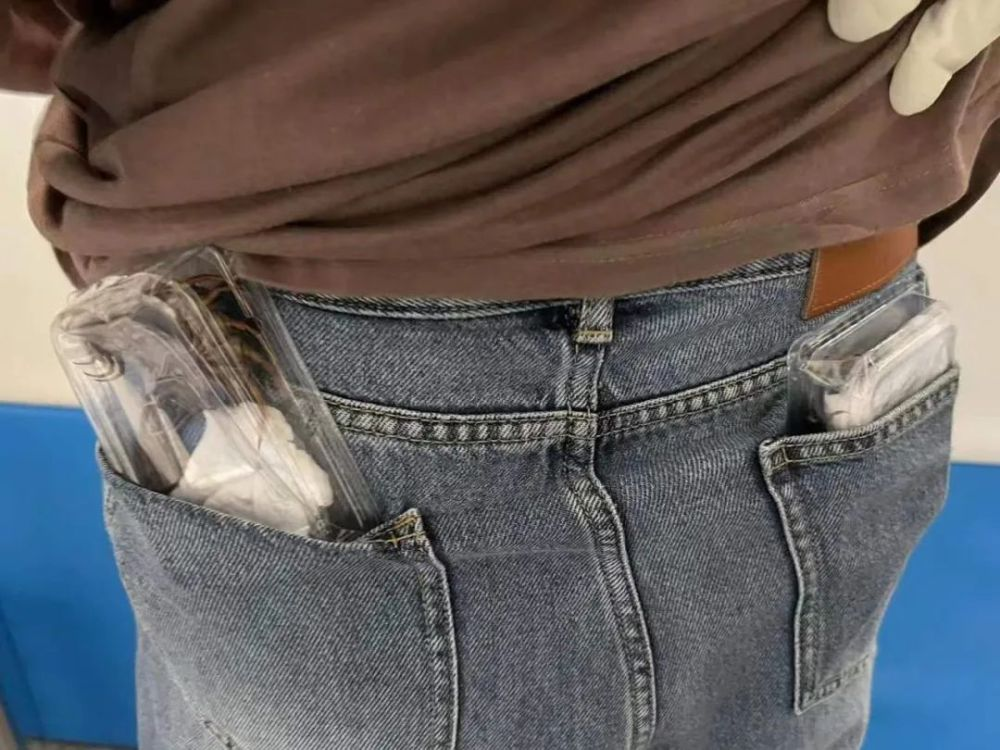
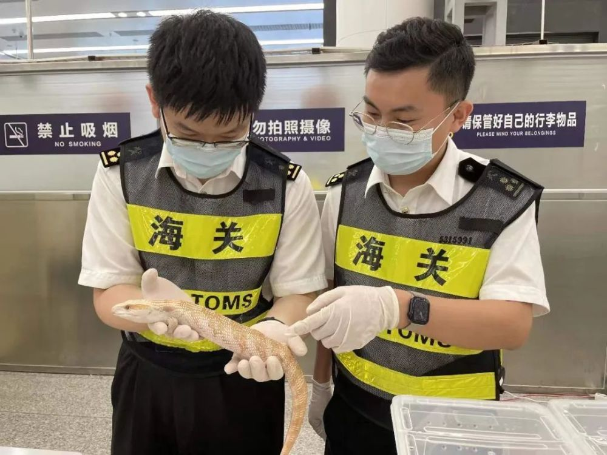
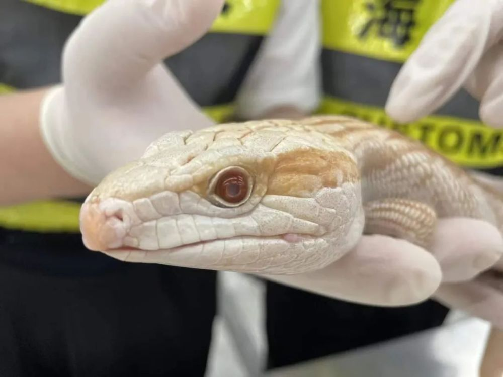
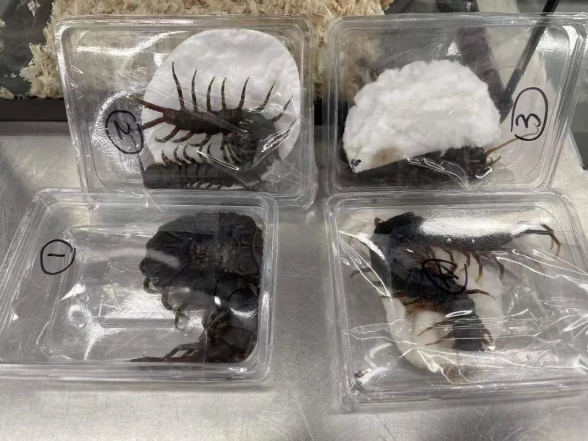
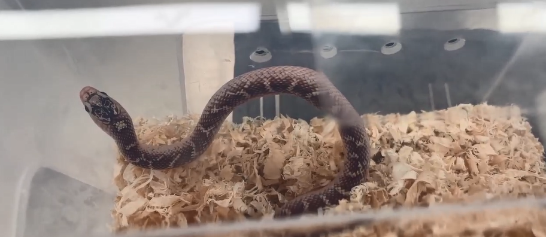
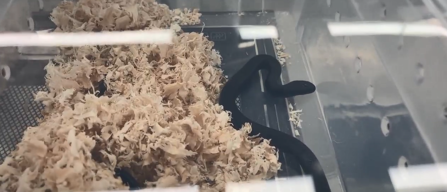

# 女子胸前腰部绑藏15条活体蛇入境，因行走姿势怪异被发现

近日，经鉴定，深圳海关所属皇岗海关此前在福田口岸旅检进境渠道查获1名旅客人身绑藏的9条活体蛇为王蛇、6条活体蛇为猪鼻蛇、4条活体蜈蚣为秘鲁巨人蜈蚣、1条活体蜥蜴为柔蜥属蜥蜴，均为外来物种。

皇岗海关关员在福田口岸旅检进境渠道发现，一名女性旅客衣物紧绷、行走姿势较为怪异，随即引导其至查验台进一步查验。经检查，在其裤兜、腰部、胸前查获绑藏的活体动物一批。目前，该批活体动物已移交相关部门处理。

来源：海关发布

