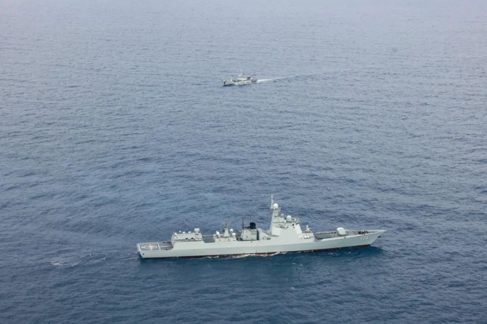
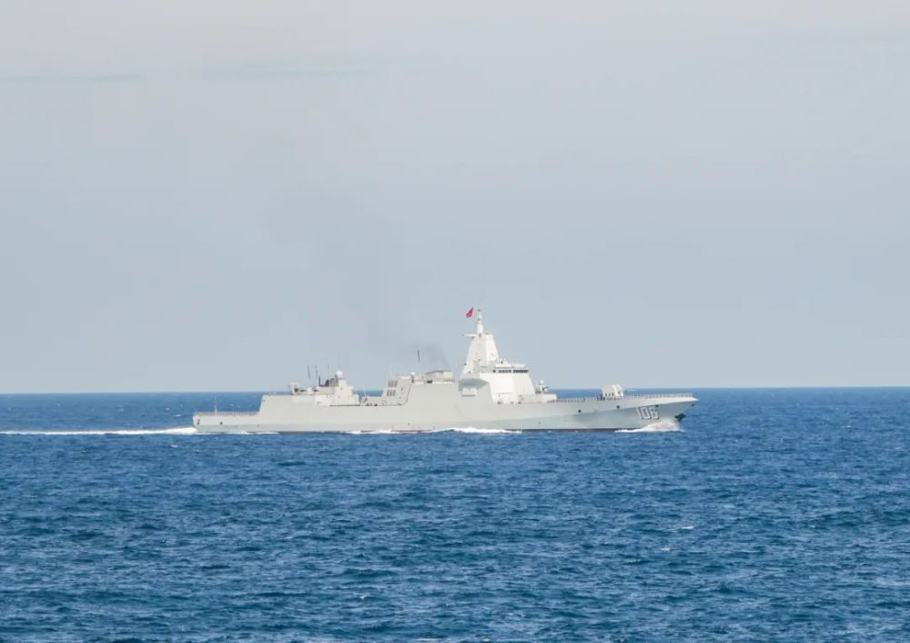
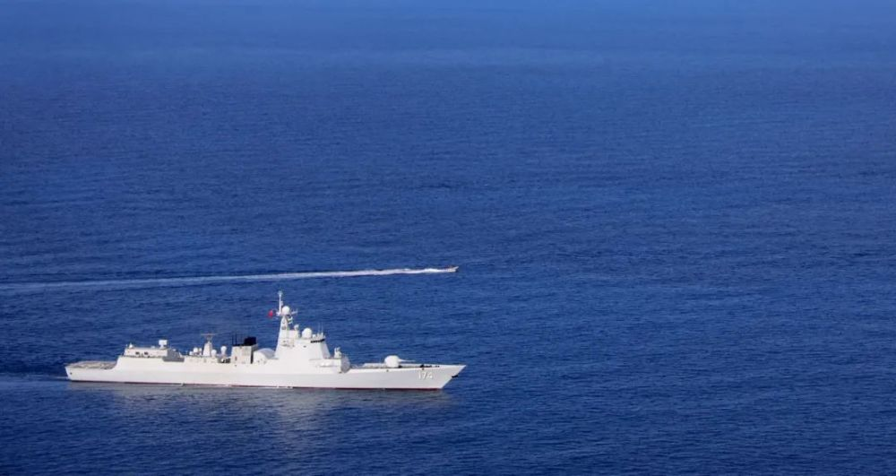
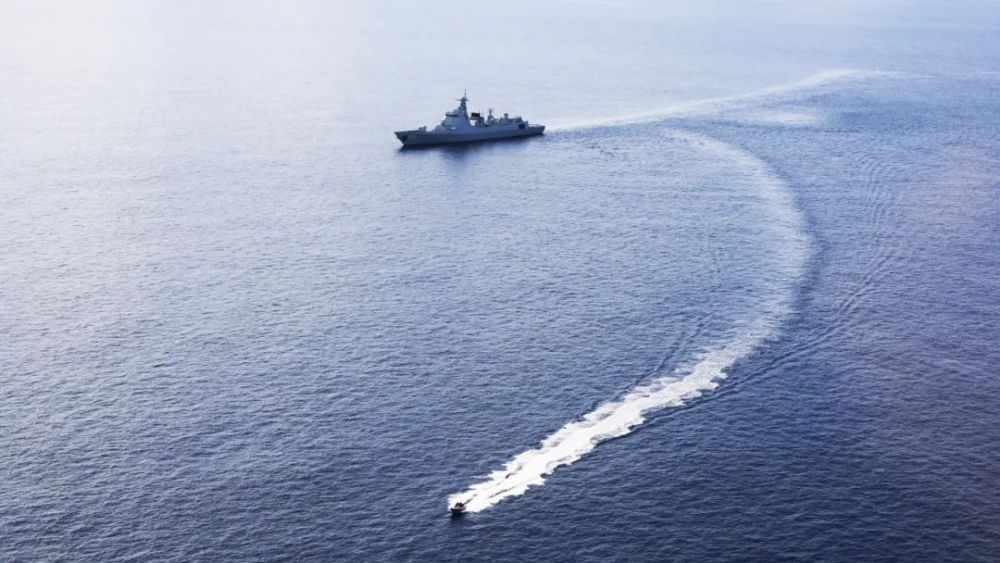
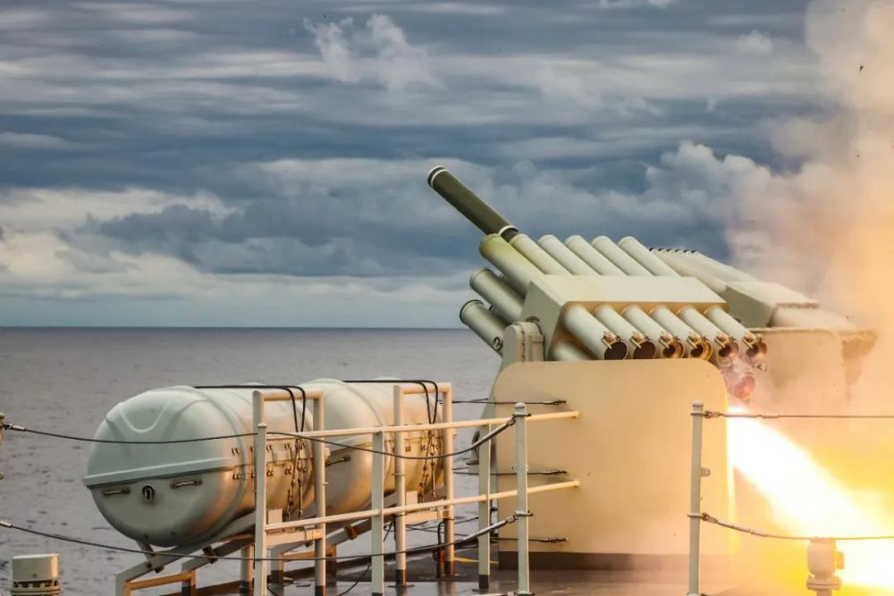
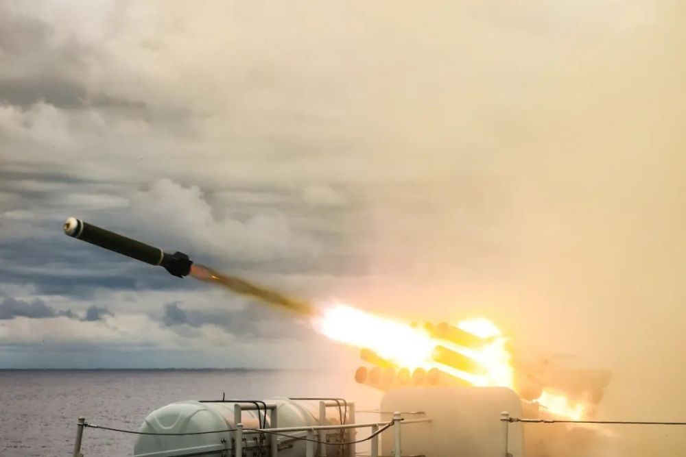
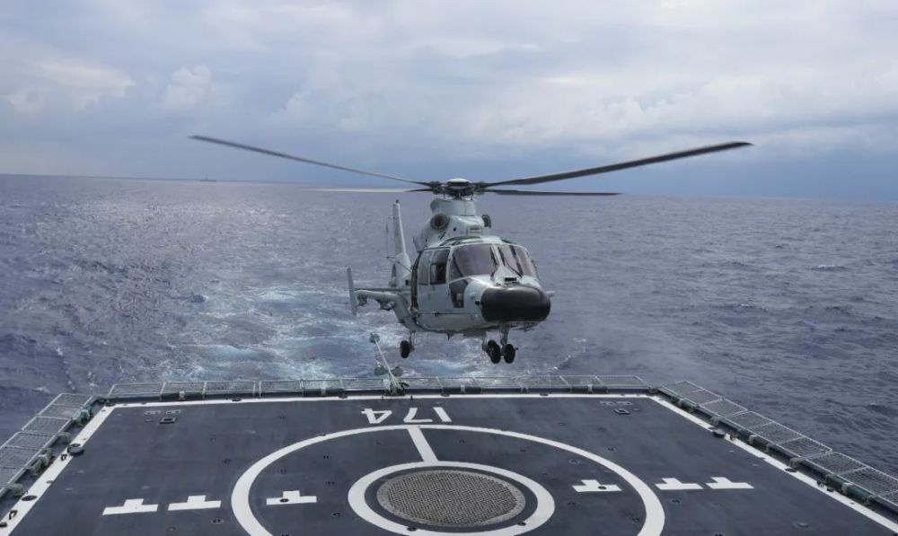
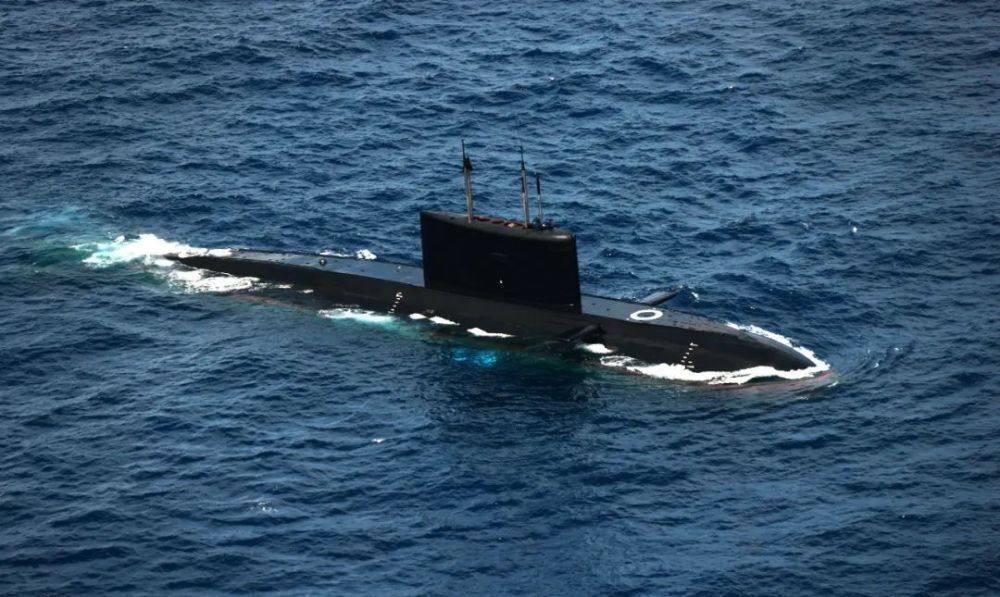
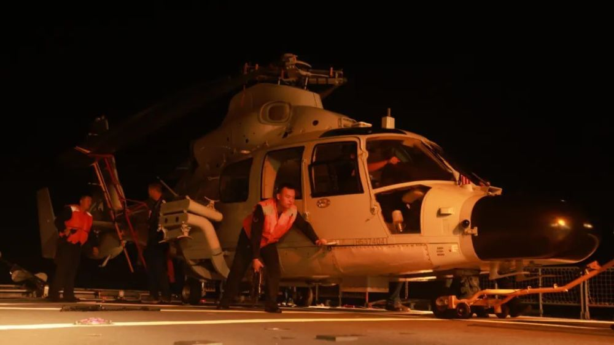

# 对接实战，解放军在南海多个海区开展协同攻防演练

日前，南部战区海军某驱逐舰支队多艘战舰组成训练编队，赴南海多个海区，开展实战背景下的协同攻防演练。

各舰预警探测系统在不同方向发现多批次低慢空中小目标，编队指挥员下令各舰提升战斗等级部署，舰艇在烟幕掩护下快速规避机动。

作战室内，“敌情”态势实时更新，一道道指令快速下达至战位。

各舰迅速转编队战术突击队形，对“敌”目标进行空中防御打击。

雷达捕捉到水面可疑信号，判明目标属性后下发各舰，占领有利射击阵位。

“预备，放！”收到指令，编队各系统密切配合，对目标实施火力打击。

声声巨响中，一枚枚炮弹呼啸出膛，直扑“敌”目标。

编队舰艇辗转多个海区，择机围绕对潜作战、轻武器射击。

舰载直升机起降等课目展开专攻精练，加速新型舰艇融入编队联合作战体系，有效提升编队遂行多样化军事任务。

