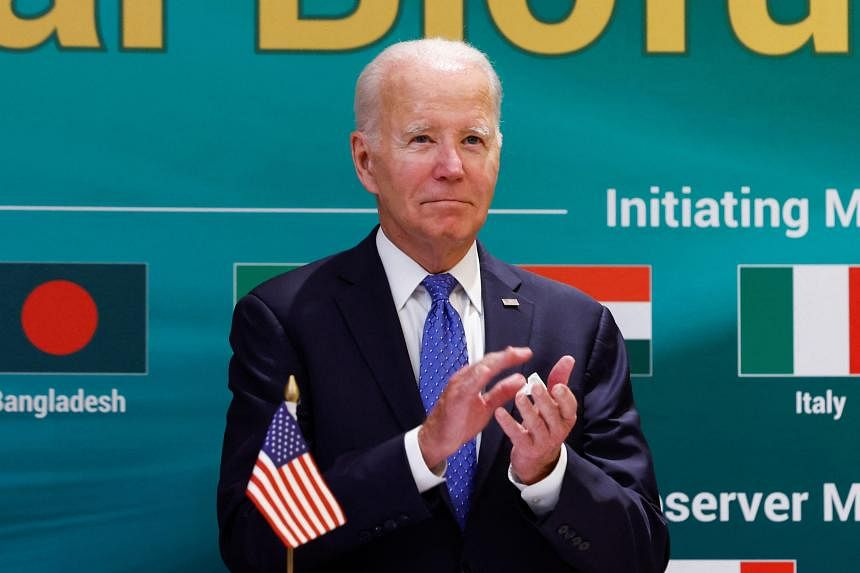
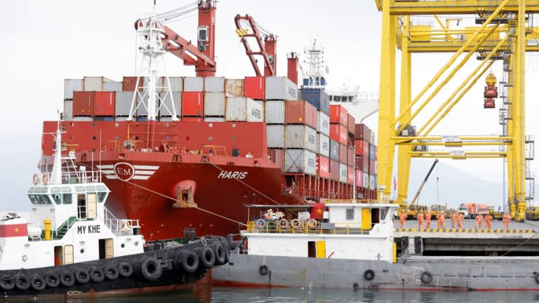

# 拜登马不停蹄访越南，外媒：美政府希望提升双边关系至战略伙伴关系

在参加二十国集团（G20）新德里峰会后，美国总统拜登今日（9月10日）访问越南，外界预计美越两国将提升双边关系至战略伙伴关系。

_拜登（资料图） 图源：《海峡时报》_

路透社报道，拜登将于今日下午在河内会见越共中央总书记阮富仲，两人之后将发表共同讲话。白宫此前公布的新闻声明称，在拜登访问越南期间，两国将强调“促进该地区和平、繁荣与稳定”的承诺。

拜登此次访问的背景是美越两国贸易和投资关系不断发展，同时也是美越建立全面合作伙伴关系10周年。拜登政府希望提升美越双边关系至战略伙伴关系，甚至扩大为全面战略伙伴关系。

美国国家安全顾问沙利文近日曾表示，这代表着“加强我们外交关系的重要一步”，并反映了越南将在美国“印太”伙伴关系中发挥的“主导作用”。沙利文说：“几十年来，美国和越南一直在努力克服越南战争的痛苦共同遗产，携手促进和解，我们的现役军人和退伍军人指明了道路。”

越通社9日报道，美国前国防部长哈格尔说，拜登此次访越对巩固和加强两国双边关系具有重要意义，表明美当局希望与越南建立更紧密、更牢固的关系。

越南驻美大使阮国勇则表示，自1995年美越关系正常化以来，历任美国总统都曾访问越南，拜登延续了这一良好的“传统”。

《日经亚洲》指出，目前美越双边关系为“全面伙伴关系”，比越南与中国和俄罗斯的“全面战略伙伴关系”要低了两个级别。

目前，越南已与四个国家建立全面战略伙伴关系，即中国、俄罗斯、印度和韩国，这是越南外交关系中的最高层级。美国一直在推动美越关系升级，但为了避免地区局势紧张，越南一直保持审慎应对。

一名越南官员对《日经亚洲》表示：“越南希望升级，但我们需要看看中国的反应。”他补充说，这一升级可能有助于这个东南亚国家赢得美国的让步，例如削减关税和承认市场经济地位，并附带贸易优惠。

 _越南岘港市仙沙港 图源：《日经亚洲》_

《日经亚洲》援引专家分析指，与美国的双边关系升级可能有助于越南“成为地区经济强国、新的半导体中心和美国供应链中的关键制造节点”，例如在芯片行业，胡志明市拥有英特尔全球最大的测试和组装基地，而三星和美国软件制造商新思科技去年也在越南扩张业务。

_胡志明市 图源：《纽约时报》_

此外，路透社称，谷歌、英特尔和波音公司等龙头企业高管，预计将于星期一（11日）在河内会见越南科技企业高管和美国国务卿布林肯。这也凸显了越南作为美国科技公司“友好外包”目的地的重要性日益增强。

不过，也有学者指出，虽然大幅提升美越双边关系的风险很高，但越南领导人认为现在是这么做的最佳时机，因为他们判断中美关系“未来可能更糟”。

俄罗斯《消息报》8月初发表的一篇报道称，越南不会为了加强与美国的关系而选择与中国和俄罗斯断绝关系，并强调河内寻求在与大国关系中实现平衡，以保护其利益。

《纽约时报》对此分析称，越南“擅长在世界强国之间跳舞”。“我觉得在某些方面，美国对越南抱有不切实际的期望，”新加坡尤索夫伊萨东南亚研究所高级研究员伊恩·斯托里说，“我不确定他们是否完全了解越南与中国的关系有多敏感以及他们与俄罗斯的关系有多深厚，而误解这些事情可能会让美国陷入困境。”

来源丨综合自路透社、《纽约时报》等

