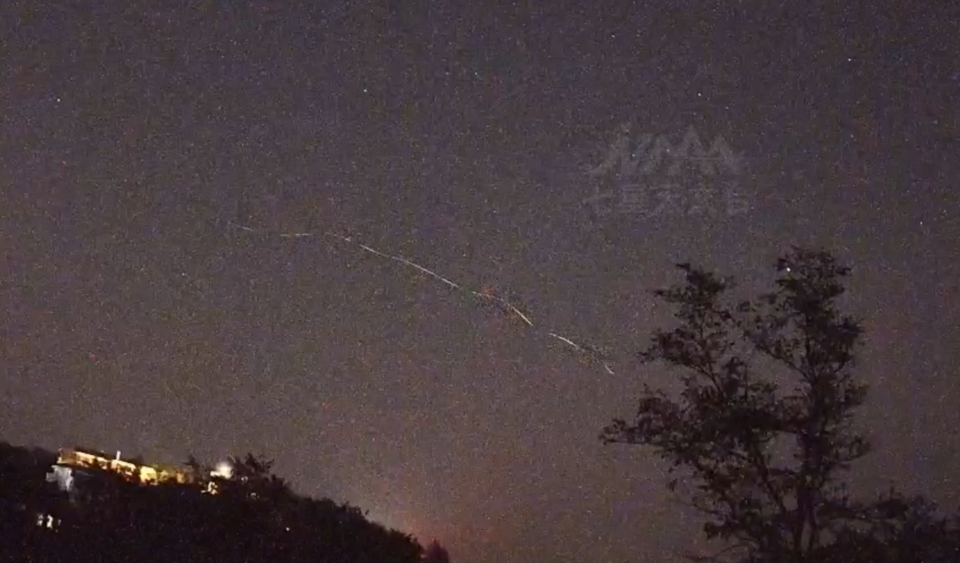

# 济南6天拍到3次不明飞行物，专家：在明确物体前，三次均可认定为UFO

近日，昆明、上海、济南、武汉等多地出现不明飞行物，引发网友持续热议。

**济南6天拍到3次不明飞行物**

据齐鲁晚报消息，近日，济南七星天文台发布的一则视频显示，9月6日的监测画面中，出现“发光下坠”的不明飞行物。9月1日和5日，七星天文台也两次拍下了不明飞行物的痕迹。

**专家：将开展模拟实验论证**

对此，山东天文学会副理事长、济南天文学会秘书长牛桂华表示，没有直接证据表明三次不明飞行物存在关联。他认为，由于有疑似动力的存在，目前只能得知不明飞行物并非流星之类的坠落物，但无法明确正体是什么。

七星天文台常务副台长卢寅兴在接受采访时表示，短期内出现多次不明飞行物的情况非常罕见，目前已经邀请专家进行研讨，下一步将开展模拟实验论证。

_9月1日 七星天文台监控画面_

_9月5日 七星天文台监控画面_

_9月6日 七星天文台监控画面_

9月7日晚，济南七星天文台发布的一则视频显示，9月6日20点02分，天空中出现不明飞行物，该“闪光”飞行物从高处坠落。牛桂华认为，因有疑似动力的存在，此发光体可以排除是流星的可能。他告诉记者，目前也可以排除是虫子一类的东西，常见可以发光的虫类便是萤火虫，由于萤火虫的亮光无法持续，且从画面来看，该发光体远离树木且飞行速度快，因此可以排除不明飞行物是常见的虫类。

9月1日凌晨约2时左右以及9月5日凌晨约5时左右，七星天文台同样拍到了不明飞行物的痕迹。牛桂华指出，三次不明飞行物存在较大差异。第一次是黑色且下降速度快的物体，第二次是两个黑色环状物体，第三次则是发光体。在明确物体的正体之前，这三次不明飞行物均可认定为UFO（Unidentified
Flying Object）。

_昆明有人拍到闪着红绿光的不明飞行物_

据春城晚报消息，近日，昆明市民夏先生在夜晚的天空中看到了一个像红绿灯光闪烁的飞行物，这个东西在空中停留了近一个小时。

夏先生介绍，当时这个不明飞行物在天上像红绿灯，一排有3个灯，一会儿红一会儿绿，突然之间以很快的速度飞走，悬停一下又回来。“一下就惊呆我了，在我的认知里面，所有的航空器在那么高的高空，不可能有那么快的速度。我怀疑是天外来物。”

一名无人机业内人士看了视频后表示：视频中的飞行器与一般无人机在晚上飞行时闪烁频率或颜色一致。“所以第一视觉来看，我觉得像无人机可能性很大，像他说的一个小时的话，有可能是经过改装的特殊机型。”

**上海现不明飞行物**

**如火球般高速坠落**

近日，上海市天空出现一个不明飞行物，如火球般高速坠落。

拍摄者李先生称，它呈下落状态，不像是飞机，颜色明显很亮很红，有点像孙悟空的筋斗云。‍

**专家推测：是飞机的尾迹云**

对此，中国气象局公共气象服务中心在官方微博发文，认为像是“飞机的尾迹云”；上海市气象局也推测，可能是尾迹云扩散后形成的。

上海市气象局专家邬锐表示，根据目前网友提供照片，尾迹云的可能性较大。不过，严谨的天文判断要更多证据，比如需要航空等相关部门确认当时经过宝山的航线。

_网友拍摄到的画面_

据了解，尾迹云俗称“飞机拉烟”。人们常常在晴朗的天空中看到喷气式飞机在高空飞行时，机身后边会出现一条或数条长长的“云带”。其实，这不是喷气式飞机喷出来的烟，而是飞机排出来的废气与周围环境空气混合后，水汽凝结而成的特殊云系，航空飞行界和航空气象学上称之为飞机尾迹。

**武汉夜空出现不明飞行物**

**发出神秘绿光**

9月2日凌晨，武汉天空出现一个不明飞行物，该物体悬浮空中数小时，还发出绿色光芒。

目击者称，该物体既不运动，也不闪烁，同时也没有光束，只是两个悬浮着的点。

近期“不明飞行物”为何这么多？

牛桂华表示，天文台的监测设备，每天都能拍到火流星的视频，网上报道出来的不明飞行物，只是小小部分，不足为奇，根本不用去担心地球所谓的“天外危机”。

来源：安徽商报、春城晚报、极目新闻、武汉发布、中国新闻网

