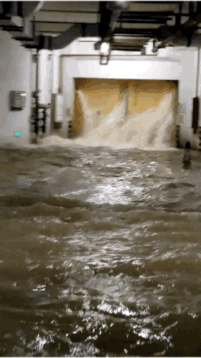

# 福州一小区200多辆车被淹：业主称突降暴雨时要求挪车被物业拒绝

**N海都全媒体记者 刘锦涵**

近日，福州仓山滨海橙里小区业主向智慧海都平台报料称，5日晚暴雨突降，小区地下车库积水，有业主要下楼挪车，但物业楼管却以“地下车库刚刚放置防洪板，车出不去”为由，拒绝业主挪车。

对此，物业相关工作人员对记者表示，由于当晚小区外围雨水倒灌，进入地库挪车存在危险。

**业主：楼管称防洪板没指示不能撤**

7日上午，海都记者来到了福州仓山滨海橙里小区，在小区地下车库出口处，记者看到，车库积水，约有3米深，只有几辆停在斜坡上的小车露出了部分车身。小区所在的盛景社区的黄书记称，
**超过200辆汽车泡在地下车库的积水中。**

_大量积水涌入地下车库_

 _楼梯旁的积水_

为何暴雨来临时，小区的业主们未将车辆移出地下车库呢？

业主刘女士说，当晚9时左右，就有不少人在业主群里说要下楼挪车，但物业楼管以“地下车库刚刚放置防洪板，车出不去，防洪板没有领导指示不能撤”为由，拒绝业主下楼挪车。

_工人在设置防洪板_

刘女士说，21点多的时候楼管还称车库只是部分被淹，情况可控，23点时才通知水倒灌，车来不及挪了。

_业主与物业的聊天记录_

还有业主告诉记者，当晚发现车库“守不住”时，小区居民还是有机会将车辆挪出地下车库的。但现场无人指挥，不少车辆停在车库通道的斜坡上，以致车库内的车辆全被“堵住”。

_车库已被积水完全灌满_

**物业：当时外围道路被淹 车辆难开出**

据了解，为该小区提供物业服务的是福州滨海物业管理有限公司。

对于此事，物业公司相关负责人答复称，当晚由于小区外围雨水倒灌，进入地库挪车存在危险，且外围道路已被淹没，车辆难以开出。

 _福州滨海物业管理有限公司_

物业公司相关负责人称，为应对当天晚上的极端天气，服务中心按照应急预案，启用地库防护挡板和防水沙袋，积水后物业服务中心已协调资源，抽调大型抽水设备，已排出大部分积水。服务中心将持续跟进后续事宜，保障业主权益。

_排水车在现场排水_

小区居民否定了物业的说法，居民章女士说：“从河南来支援的排水车是社区协调后前来帮忙的。另一辆排水车是小区居民自己联系的。”

 _车辆泡在水中_

记者了解到，此前由于地下车库积水，小区从5日晚至8日晚一直处于停水、停电的状态。截至昨日下午5时，小区已恢复供电。

编辑：白白、大陈

