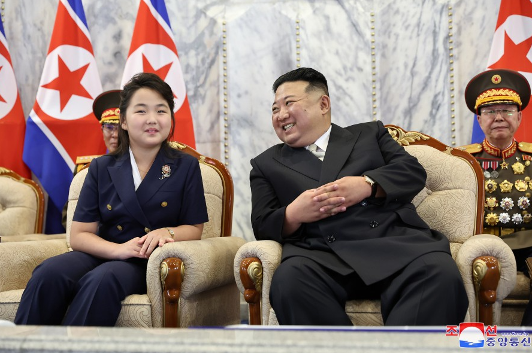

# 金正恩女儿最新公开露面，韩国统一部这么分析

据韩联社报道，韩国统一部10日表示，朝鲜8日晚在平壤举行的国庆75周年纪念阅兵仪式上，朝鲜国防委员会委员长金正恩和女儿金主爱（音）并排坐在主席团特别专座的正中央。韩联社援引韩国统一部的分析认为，朝鲜对金主爱的礼宾规格较7个月前的阅兵式更为提升。

 _9月8日，朝鲜国庆75周年纪念阅兵式 图源：朝中社_

而金主爱在2月的建军节阅兵式上与母亲李雪主等坐在主席团嘉宾席，位置与金正恩的座位有一定距离。

 _2月8日，朝鲜建军75周年阅兵式 图源：朝中社_

韩国统一部就此表示，与2月的阅兵式相比，9月8日金主爱的位子更靠近金正恩，可见其所受到的礼宾待遇提升，朝鲜如此安排有何意图尚难以预断，但韩方密切关注朝鲜动向。

金主爱继上月陪同金正恩参加海军节日程后，时隔12天再次公开露面。当时韩国统一部谨慎评价称，朝鲜对金主爱的礼宾规范正在形成。

 _8月27日，金正恩携女访问朝鲜人民军海军司令部祝贺海军节 图源：朝中社_

金主爱去年11月18日随金正恩观摩“火星-17”型洲际弹道导弹（ICBM）试射，首次在朝鲜官媒露面。韩联社报道称，截至8日的阅兵式，以朝鲜劳动党机关报《劳动新闻》为准，朝鲜16次报道金主爱的公开活动，其中13次涉及军事活动。

来源：韩联社

