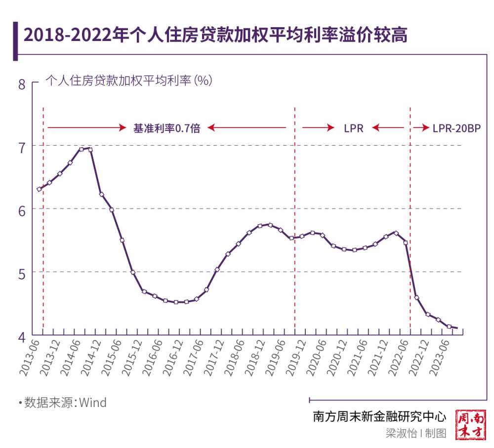
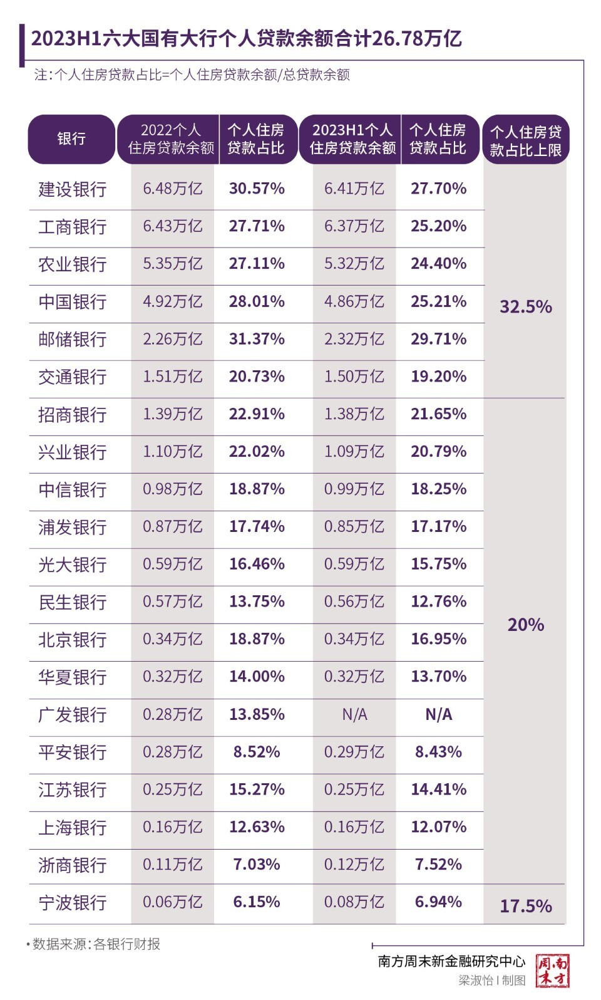
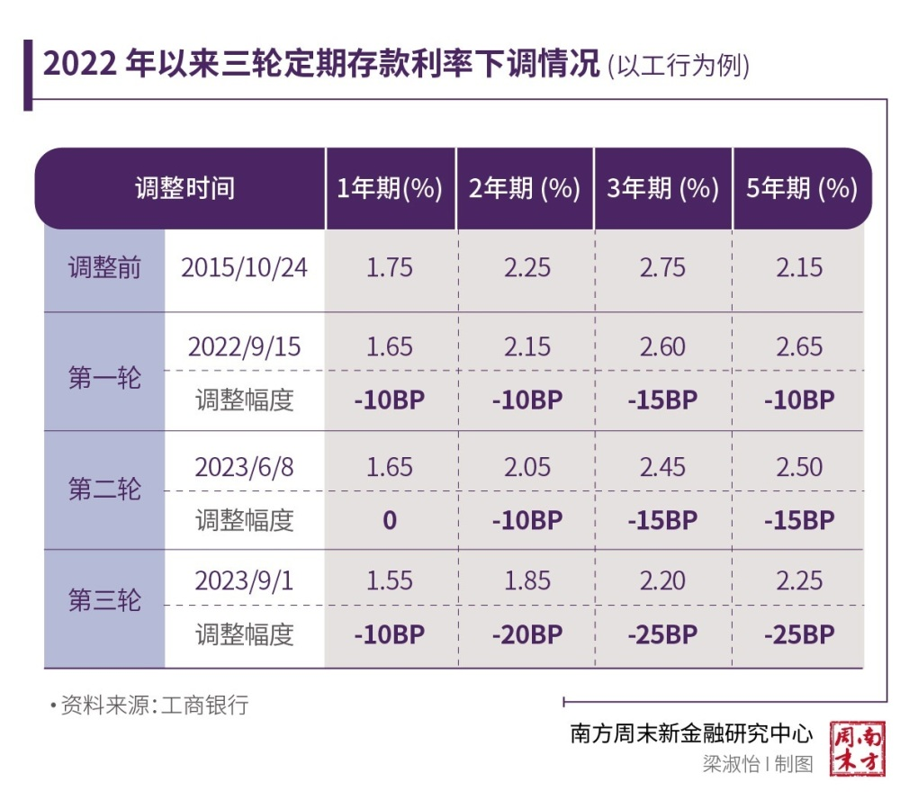

# 25万亿存量房贷降息倒计时，超4000万借款人谁最受益？

在民间呼吁半年多之后，中国人民银行终于在2023年8月31日定音存量房贷降息一事：9月25日起，商业银行可依法有序调整存量首套个人商业性住房贷款利率（文中简称“存量房贷利率”）。

仅一周时间，9月7日，工商银行、建设银行、农业银行和中国银行等主要银行“不约而同”发布了“存量房贷利率”调整和操作细节。这意味着备受关注的存量房贷新政实施进入倒计时。

南方周末新金融研究中心对此次存量房贷利率调整细则发布进行了全程跟踪调研。对比四大行及其它中小银行的存量房贷降息细则，哪些要点值得存量房贷措款人重点关注？4000万存量借款人，哪些人获益最大？与2008年存量房贷利率降息政策相比，此次调整有何不同？银行如何应对这次冲击？

南方周末新金融研究中心调研发现，各银行实施细则大同小异，其中有关首套房认定、优惠利率下限和个人信用如何挂钩等基本一致。同时，各银行实施细则首度确认采取统一批量调整的方式执行新政。

南方周末新金融研究中心研究员对比研究还发现，此次存量房贷新政吸取了过往的经验教训，政策发力更精准。在降低存量房贷借款人利息负担的同时，有效封堵了其它不符合条件的存量房贷借款人进行变相政策套利的各种漏洞，避免了因政策套利而出现的各种乱象，有效保障了市场公平秩序。

延续“因城施策”思路，降息与信用挂钩

各商业银行将自9月25日实施的“存量房贷利率”新政凸显了哪些重点信息？

基于存量房贷降息新政及实施细则，南方周末新金融中心研究员统计分析人民银行各分行发布的31个省（市、区）的存量房贷降息明细利率发现，存量房贷利率新政仍然强调“因城施策”。在此基础上，均以当地首套住房贷款利率政策下限为调整下限。再具体到按揭人个体而言，则会出现不同时间段存量房贷利率调整幅度不一的情况。

注重“因城施策”政策连贯性是此次存量房贷利率调整的基本原则。以北京为例，2019年10月8日至2023年8月31日，“存量房贷利率”下限为LPR+55BP，此次调整后利率下限仍为LPR+55BP。当前5年期LPR为4.2%，即下限为4.75%。再比如武汉，在2022年9月30日至2023年8月31日期间曾阶段性取消首套房贷款利率下限，显然该时间段贷款已享受利率优惠。因此，此时间段的“存量房贷利率”无需调整。

 _（梁淑怡/图）_

统一批量调整是“存量房贷利率”调整的另一个核心信息。南方周末新金融研究中心研究员对比所有商业银行的公告发现，9月25日起，各商业银行将与存量个人住房贷款客户就贷款执行利率进行协商调整，存量首套住房贷款客户无需申请，银行将统一批量调整。

但原来选择固定利率或基准利率定价贷款的存量房贷借款人，也可以申请享受此次新政。如，建设银行规定借款人可申请将固定利率贷款或基准利率定价贷款转换为采用LPR定价的浮动利率贷款。9月25日起，建行提供线上转换申请服务，可一键完成转换申请。

所有存量房贷借款人都可以享受此次新政？这一点被否认。政策优惠与个人信用挂钩是各家商业银行一致强调的内容之一。南方周末新金融研究中心研究员发现，商业银行首次将存量房贷利率优惠政策与贷款人的个人征信情况挂钩，即商业银行要求客户在申请调整存量房贷利率时，不能存在不良贷款或逾期情况。

另外，对于符合政策的“二套转首套”的存量房贷，或存在不良贷款归还积欠本息的存量房贷，商业银行要求客户向承办行主动申请利率调整，经银行审核符合条件后按上述调整规则调整贷款利率。

存量借款人受益几何？

据接近监管的有关人士说法，据估算，本次调整涉及的客户可能超过4000万，涉及调整的贷款规模可能达25万亿元。

**存量房贷借款人受益有多大？**

此次存量房贷利率新政明确，申请调整存量首套房贷利率的，不能低于当年当地的首套房贷利率政策下限。因此，理论上而言，在首套房贷利率超出政策下限时期发放的房贷，调整空间较大。但2022年下半年以来发放的存量按揭贷款，利率调整空间不大。

 _（梁淑怡/图）_

南方周末新金融研究中心研究员对比研究发现，对于2022年10月之后发放的首套房贷，全国平均房贷利率与相应时期的政策下限之间差值已接近；而自2019年10月至2022年6月，全国首套房平均房贷利率与相应时期的政策下限平均差距为71bp。

新政涉及最早的存量房贷发生于2019年10月之前发放，则按当时规定的首套房房贷利率下限为基准利率的0.7倍。其中，2019年10月前发放的房贷利率，绝大部分已按人民银行2019年第30号公告要求，在2020年底前转换为贷款市场报价利率（LPR）定价的存量首套个人住房贷款。

南方周末新金融研究中心研究员对全国70个城市2019年10月LPR定价改革以来的首套房利率政策进一步研究发现，除一线城市及部分强二线城市外，大多数城市的首套房贷利率基本与全国首套房贷利率下限保持一致，部分三线城市甚至阶段性取消了房贷利率下限。

南方周末新金融研究中心研究员认为，考虑到各地在全国政策下限的基础上有因城施策的自由度，假设各地实际利率下限较政策利率下限抵补后，从全国个人住房贷款加权平均利率看，理论上2022年6月以前发放的存量首套按揭贷款，其平均房贷利率在此次新政落地后有70bp左右的下降空间。

_（梁淑怡/图）_

“二套转首套”借款人或受益最大

“认房不认贷”政策将惠及的存量房贷借款人或是最大受益者。

2023年8月，住建部、中国人民银行和国家金融监督管理总局联合印发通知，推动落实购买首套房贷款“认房不认贷”政策措施。截至目前，北上广深等城市已执行购买首套房贷款“认房不认贷”政策。尽管商业银行“认房不认贷”实施细则尚需时日，但将有部分符合条件“二套转首套”借款人可以享受存量房贷利率优惠政策。

_（梁淑怡/图）_

南方周末新金融研究中心研究员对比发现，近年来，二套房贷款平均利率与同期首套房贷利率下限存在显著利差空间。自2019年7月至今平均差距接近1个百分点（100bp）。如前述可能性实现，则这部分存量按揭人或为本轮房贷新政最受益群体。

比2008年政策更精准

存量房贷利率调整曾有先例。2008年10月，中国人民银行发布《关于扩大商业性个人住房贷款利率下浮幅度等有关问题的通知》，首次将商业性个人住房贷款利率下限降为贷款基准利率的0.7倍，最低首付款比例调整为20%，同时适用于存量和新增房贷。

南方周末新金融研究中心研究员对比发现，两次房贷调整的最大不同之处，2008年的房贷新政直接刺激了房价大幅上涨和提前还贷需求的井喷，而提前还贷潮则是本年度房贷新政推出的重要内因，稳定房价也成为房贷新政的目标之一。

2008年房贷优惠政策推出后，由于存量房贷利率下调会直接压缩银行利润，大行执行相对犹豫，而中小银行则抓住契机抢夺房贷客户，率先推出利率7折优惠，并推出跨行“转按揭”业务来抢夺存量用户，迅速做大房贷业务规模。与此同时，由于当时各地住房信息系统尚未实现全国联网，一些不符合优惠政策的贷款人通过钻各种漏洞，也实现了套利。

政策利好叠加投机盛行，2008年下半年至2009年，个人住房按揭市场出现了井喷现象，个人自住、投资、投机需求大增，推动房价不断升高。一年半时间，全国住房平均价格上升了50%以上，豪宅价格上升了70%，个别地区房价甚至翻了一倍。与此同时，为享受新政优惠，提前还贷成为众多贷款人的选择，国内主要城市存量房贷早偿率一度高达26.27%。

鉴于房贷新政执行中出现的问题，2009年后，决策层一系列政策“补丁”陆续出台，严禁提供个人住房贷款“转按揭”“加按揭”服务，银行也未再提供过“转按揭”业务。但市场上各种钻政策空子的招数屡禁不绝，例如通过个人信用贷款降低贷款首付比例，甚至“首付”现象仍然存在。

直到“房住不炒”政策提出，相关配套制度不断完善强化下，房地产市场经历深刻调整，居民对房地产的预期也发生重大变化。特别是“三条红线”等政策发布后，房地产各种乱象得到遏制，但由于利率4%以上的个人房贷利率与最低利率已突破3%的个人信用贷、经营贷利率之间利差依然较大，通过其它低利率贷款进入房贷业务的情况仍然存在。

2022年起，提前还贷现象卷土重来，并延续至今。2023年第一季度、第二季度个人住房贷款的早偿率（年化）分别升至15.2%、13.1%，均远高于2022年末的8.9%。

提振消费、复苏经济成为新的核心命题背景下，此次出台的房贷新政成为稳定房地产市场信心的又一重要举措，并进而有利于平抑大规模提前还贷对银行体系和国民经济带来的冲击。

与2008年房贷政策相比，本次房贷新政设计上也更加精准有效。

一方面，新政打开政策预期上限，明确监管政策态度，有助于扭转“三条红线”以来不断强化的市场预期，对新发放的首套及二套房首付比例下限均创下2008年以来最低水平。

另一方面，为避免无序竞争，本次未放开跨行“转按揭”，由原机构采取两种方式自行下调，并对申请时间明确规定。此举有效抑制银行间通过“转按揭”等业务抢夺存量客户的可能，配合2018年已全国联网的不动产登记信息管理基础平台，基本封堵了不符合政策优惠条件的贷款人进行制度套利的漏洞。但经营贷利率仍低于房贷利率，借款人违规的空间依然存在。

银行降存款利率应对冲击

在超4000万存量房贷按揭人受益的同时，商业银行面临利息损失。25万亿存量按揭批量降息对商业银行影响多大？整体利差已降至历史低点的商业银行如何应对？

南方周末新金融研究中心研究员认为，存量房贷利率下调对商业银行的影响主要取决于存量按揭调整的比例及定价下调的幅度。从银行存量住房贷款余额看，国有大行规模较大，但由于不同地区不同银行实际执行利率较为复杂，且不同银行对按揭贷款业务依赖程度不同，因此受影响程度无法一概而论。

 _（梁淑怡/图）_

南方周末新金融研究中心研究员调研包括多家银行在内的研究机构测算结果发现，从银行角度看，存量按揭贷款利率下调，预计将为按揭人节省1000亿-2000亿元利息支出，对净息差影响约在3-8个基点之间。相对而言，商业银行的利息将因此减少至少1000亿元。

商业银行已提前采取对冲举措。商业银行主动下调存款挂牌利率以降低负债成本。9月1日，多家全国性银行宣布下调存款挂牌利率。其中，一年期下调10BP，2年期下调20BP，3年期和5年期均下调25BP。此次存款利率调降幅度普遍更大，且主要针对定期存款和大额存单。预计此举将进一步降低银行负债成本，稀释存量贷款调降带来的息差压力。

这是商业银行2022年以来第三轮主动调整人民币存款挂牌利率。

_（梁淑怡/图）_

与此同时，进入9月，新增按揭房贷尤其是首套房将迎来更低的首付比例和利率优惠，贷款增量有望提升。这可能在一定程度上对冲存量按揭利率下调的负面影响。

央行和商业银行寄望通过调降存量房贷利率减缓提前还贷现象，它可能实现吗？中国房贷市场近5年来有何引发深思的新现象？美国房贷余额为何经历周期仍保持平稳？相关研究报告即将发布。

南方周末新金融研究中心研究员 李鹤鸣 张文景 助理研究员 刘伟钊 张琪 彭君婷

责编 谢艳霞

