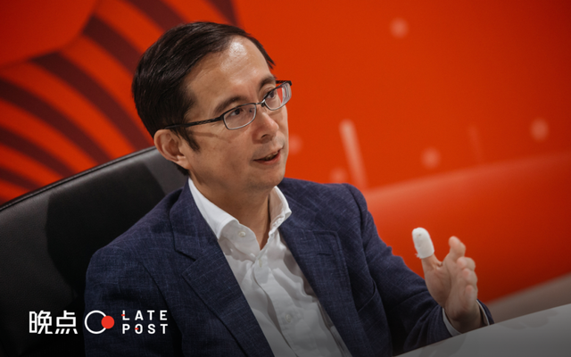

# 8个月和8年，张勇和阿里的两次告别

**文 | 管艺雯 陈晶**

**编辑丨管艺雯 黄俊杰**

9 月 10 日，张勇和蔡崇信按计划完成了阿里巴巴集团的权力交接。阿里员工随即收到了新任阿里董事会主席蔡崇信的全员信。

一位阿里云智能员工刚开始以为邮件里的字打错了，反复确认后才意识到张勇不仅卸任了阿里集团董事会主席和 CEO 职位，还卸任了仅担任 8
个月的阿里云智能集团的董事长和 CEO。

一些员工正期待张勇能够借助自己在集团的影响力，为阿里云智能争取到更好的价格 —— 近期阿里云智能正在和淘天、菜鸟等业务集团重新洽谈云资源的采购价。

上任后的每个月，张勇都会和阿里云创始人、阿里集团技术委员会主席王坚开会讨论；两个多月前，在一场 “院士面对面”
的员工活动上，张勇还和王坚一起讨论了云智能未来的发展方向，回答了员工提问；近期多个政企合作项目中，张勇都作为云业务代表接见了客户。

6 月 20 日，张勇在全员信中宣布将于 9 月 10 日卸任阿里集团管理职位，专心全职做好阿里云智能集团董事长兼 CEO
的工作。他在信中说，考虑到公司规范化治理的要求，他 “不宜再同时担任两家集团的董事长和首席执行官的职责。”

按照当时宣布的计划，阿里云智能集团将完全从阿里集团拆分，双方将不再有股权关联。张勇将以阿里云董事长和 CEO 的身份带领一家完全独立的公司。

这次调整后，张勇彻底离开了阿里集团和相关业务的管理层。他保留的唯一阿里身份是阿里巴巴合伙人，并获得第一个 “功勋阿里人”
的荣誉称号。蔡崇信在全员信中称阿里将投资 10 亿美元，支持张勇设立与掌管一个面向未来的科技基金。一位阿里员工称，“10
亿美元代表了阿里对张勇多年工作的一种尊重。”

《晚点 LatePost》了解到，阿里集团的管理层调整仍未停止。

8 个月的阿里云 CEO：砍项目、追求标准化

张勇在 2022 年的倒数第二个工作日正式接手阿里云智能业务。

当时几乎是阿里云智能最糟糕的时刻 —— 刚经历了一场被认为是 “阿里云史上最严重事故” 的服务器宕机事件；收入增速从四年前的 90%
下滑到只有个位数，到了今年一季度，阿里云甚至出现了创立 14 年以来的首次营收下滑（扣除阿里集团部分的收入）。

上一任云智能事业群总裁张建锋上任时，曾提出 3 年营收超 1000 亿元的目标。一位阿里云管理人士透露，张建锋除了要为规模负责，还需要完成张勇提出的
“高质量发展” 的目标：一是公有云收入占比要提升，更多销售云服务器（ECS）等基础的存储、计算产品；二是要有利润。

这意味着阿里云需要卖出更多标准化的产品——将阿里云数据中心的存储、计算服务卖给客户。为了适应环境，中国的主要云计算厂商多做项目
“包工头”，帮政企客户定制一整套服务，连电脑、桌椅板凳、办公用的手机都打包销售。营收看着不少，实际上利润微薄。

张勇接手阿里云之后，在内部开始更彻底地贯彻 “高质量发展”。今年 5
月的高管会议上，他梳理了阿里云接下来最重要的三大目标，按照优先级排列分别是：规模、营收、利润。

规模指的是数据中心的
CPU（中央处理器）核数规模，对应存储、计算等基础云资源，未来阿里云要售卖更多消耗基础云资源的标准产品，例如云服务器（ECS），而不再仅仅为了提升营收额去做规模效应差的定制开发。

为了明确资源调配的优先级，张勇将产品划分为四个等级 ——
云计算的操作系统是一线产品；通义大模型、基础运维、开发工具等则是二线产品；由生态伙伴定制开发，阿里云被集成的产品则被划归三、四线。项目也被划成了三类 ——
需要使用阿里云计算资源的项目属于一环项目，只使用阿里云应用的是二环项目，剩余的则是三环项目。

营收上，张勇将今年阿里云的营收目标定为 1100 亿元（不包括阿里集团部分收入），相较于去年张建锋提出的 900 亿元目标，提升了 22%。

多位阿里云员工对今年完成此营收目标并不乐观。近期阿里云正在和阿里集团下多家子公司重新谈云资源采购价格，此前阿里云向外部客户提供的云服务器（ECS）年续费价格为官网价格的
4 折，而给阿里部分子集团提供的折扣能达到 2
折。重新谈价后可能会拉升阿里云的营收，但长期来看，阿里子集团已经有了自由选择云服务提供商的权利，阿里云的议价空间受到挑战。

对于增量空间巨大的政企市场，阿里云可能会引入合作伙伴来共同拓展。9 月初据媒体报道，阿里云可能通过引入国企，来获得 100 亿 - 200 亿元的融资。

阿里云未来的想象空间在大模型上。今年 4 月，阿里云发布了类 GPT 大模型 “通义千问”，随后张勇还宣布阿里云的核心产品价格全线下调 15% 至
50%，他向分析师们解释，这样做是为了让更多中小企业、开发商者使用云计算。在行业人士看来，还是为了用低价撬动更大的市场。

为降低成本，张勇上任后砍掉了几十款产品，并裁撤了 15% 左右的产研人员。他在内部算了一笔账，90% 的营收实际上由 10%
的产品贡献，于是不赚钱的、消耗云计算资源较少的产品被大量取消。一位阿里云人士称，张勇来之前，内部就在反复提及关停内部排名靠后的产品，但最后往往只是停了产品，运营产品的人却被保留了下来。

张勇在任期间，钉钉、达摩院被剥离出阿里云智能集团，回到阿里集团成为 “N” 公司。这会让阿里云每年节省几十亿元，业务也会更聚焦。

一位阿里云员工评价，在梳理清楚战略优先级之外，张勇给阿里云带来的最大改变，还是让阿里云团队从追求营收目标回归到提升产品、技术本身，将云构建成可靠的基础设施。

此前，阿里云的产品、研发人员需要背营收指标，并配合前线销售做各个行业的解决方案，今年产研人员不再需要直接为营收目标负责，专注做好产研。

今年初阿里云的一场会议上，张勇批评了此前
“运动式的管理”：去年阿里云曾发起一轮降低客户问题咨询量的考核，每个业务线定期比较谁的客户问题咨询量减少得多，这种做法本意是为了提升用户体验，但最后员工为了满足考核，让客户在钉钉工作群内提出咨询问题，而不再通过后台提交问题，以减少咨询量。

张勇上任后，每个月都会与王坚开会，商定重大业务方向，两人在阿里云未来发展方向的看法一致：阿里云应该成为水、电、煤一样的基础设施，让更多的商业公司在这个基础设施上生长出来，因此应该卖更多标准的公有云产品，少做人效低的定制化开发。

在短暂的 8 个月阿里云 CEO 任职中，张勇明确了规模、营收优先，要求团队从销售回归到产品和技术，但他来不及做更多具体的调整了。

8 年 CEO：坚定投入消费升级，组织从集中到分散

张勇 2007 年加入阿里，任职至今 16 年。

以担任 CEO 为分界，前 8 年，张勇成立天猫、创立双十一购物节，让品牌愿意在阿里卖货投广告；成为 CEO 之后的 8 年，张勇进一步选择押注消费升级
—— 接入优衣库、欧莱雅等国际品牌；收购银泰、大润发，孵化盒马，在 “新零售” 上大力投入；收购饿了么，直接和美团竞争，满足新中产对即时配送到家的消费需求。

消费升级在很长一段时间里的确是中国社会发展的大趋势，在张勇的带领下，阿里集团年销售额突破万亿美元，一度成为中国市值最高的公司，带给股东巨大回报。

过去 3
年多，消费环境开始变化。当消费者偏向便宜的替代品，当商家库存积压、寻找清货渠道，拼多多一贯追求的极致低价就显得更具吸引力。品牌都不希望清仓打折的过季商品影响自己的新品销售，在电商平台，它们将更多清货商品放在拼多多销售，不希望便宜商品影响天猫旗舰店的销售。

阿里的消费升级有多成功，它要转身抓住低价市场就有多艰难。一方面，阿里自身忽视了消费形势的转变，过去的成功让它反应变慢；另一方面，它的挑战者们却在快速成长，形成迫近的威胁。

2019 年，拼多多 GMV 刚过 1 万亿元人民币，只有阿里的 1/7；当时抖音还没有自建电商，是阿里的销售渠道。三年后，拼多多 GMV 超过 3
万亿元、抖音电商 GMV 超过 1.6 万亿元。两家公司的 GMV 已经相当于半个多阿里。

张勇在 14 年前创立了双十一购物节，京东前 CEO 徐雷在 9 年前创立了 “618” 购物节。创造双十一和创造 618 的人都在今年告别了自己的公司。

业务战略上，张勇对消费升级的坚定投入，为阿里集团积累了千亿美元现金，也限制了这家公司在电商上的可能性。

而在大公司治理上，作为 CEO 的张勇的很多探索都是在摸着石头过河，这些探索是否成功很难轻易评判。

张勇很多年都是中国互联网最繁忙的 CEO，很长时间内，一度有 30
多人向他直接汇报，他本人是决策的集合点，总是亲力亲为，同时照管着线上零售、线下商超、线上批发、物流、云计算等商业模式和团队基因完全不同的生意。

“像阿里这种又大、竞争对手林立、创始人又不在一线的公司，确实面临着一个非常大的治理难题。” 一位阿里管理层称。

2015 年张勇接任 CEO 时，阿里的业务越来越多，为减少业务的重复建设和浪费，张勇主导推行了 “大中台，小前台”
的组织战略，让各业务共享数据和技术，试图让阿里集团合力对敌，这家公司走向了 “一个阿里”。

2021 年底开始，阿里的组织从 “集中” 到 “分散”。面对复杂的竞争和宏观环境，过去的 “一个阿里”
在今天对一线业务变化的响应速度太慢，张勇希望通过经营责任制、多元化治理、设立分管大总裁，让组织变灵活，从一个阿里走向了四个作战业务单元，但很多重要决策依然需要张勇来拍板。

到了 2023 年 3 月末，阿里宣布启动 “1+6+N” 的组织变革，CEO 张勇对阿里彻底放权。

从 2015 年至今，对于阿里这样一家拥有复杂业务的集团如何有效治理，作为 CEO
的张勇一直在探索解决方案，他的确解决了一部分问题，但又无法解决真正的问题。

四年前的 9 月 10 日，阿里在杭州滨江奥体中心举办 20 周年晚会，6 万阿里员工和阿里的朋友们的瞩目下，马云宣布卸任阿里巴巴董事会主席，交接给时任阿里
CEO 的张勇。

马云和阿里元老蔡崇信、彭蕾、王坚现场组成 A band
乐队，演唱着《怒放的生命》，淡出了阿里集团的一线管理舞台。四年后，这四位阿里元老悉数回归，担任董事长和业务集团的董事，重新掌管起自己参与创立的阿里。

题图来源：视觉中国

