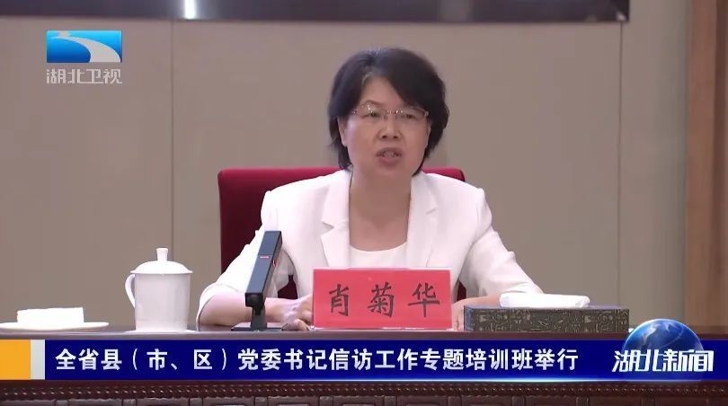
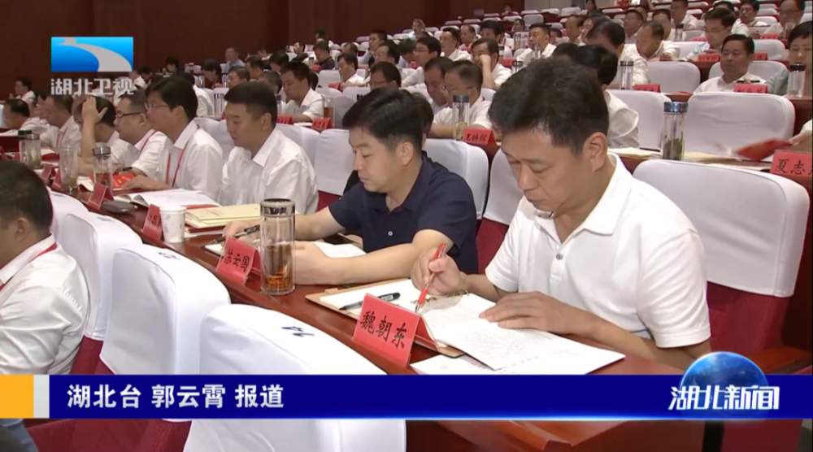
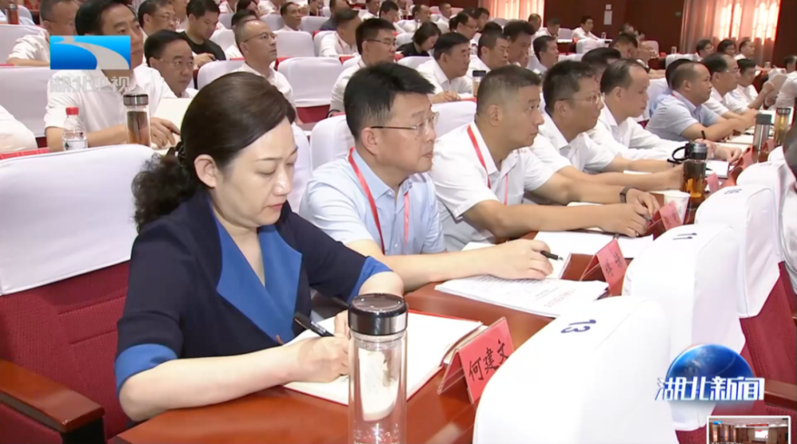

# 中央新成立部门的副部长南下，首次和县委书记们面对面

**撰文 | 余晖**

据国家信访局9月11日消息，9月7日至9日，中央社会工作部副部长、国家信访局局长李文章在湖北省调研，调研的主题是“信访工作和基层治理问题”。

在调研期间，李文章专门为参加湖北省县（市、区）党委书记信访工作专题培训班的学员们作辅导报告。

他说，“绝大多数信访事项发生在县域，应该也能够在县域范围内得到解决”。

中央新成立的部门频有新动作

此次李文章是以“中央社会工作部副部长、国家信访局局长”的身份南下调研的。

中央社会工作部，是新成立的中央部门。

今年3月，中共中央、国务院印发的《党和国家机构改革方案》提到， **组建中央社会工作部，作为党中央职能部门。**

中央社会工作部统一领导国家信访局。国家信访局由国务院办公厅管理的国家局调整为国务院直属机构。

中央社会工作部的职责包括“负责统筹指导人民信访工作，指导人民建议征集工作， **统筹推进党建引领基层治理和基层政权建设** ”等。

担任中央社会工作部部长的是吴汉圣，他此前任中央和国家机关工委分管日常工作的副书记。中央社会工作部的副部长包括李文章、赵世堂、柳拯。

其中，李文章出生于1963年1月，此前担任国务院副秘书长（今年7月卸任）、国家信访局党组书记、局长。

在中央社会工作部成立之后，该部已经有了不少新动作。

7月20日至21日，中央社会工作部、国家信访局与浙江省委在浙江省金华市浦江县联合召开总结推广“浦江经验”、深入开展领导干部接访下访经验交流会，李文章出席。

7月26日，吴汉圣到国家信访局考察调研，看望慰问信访干部。

8月30日，吴汉圣率调研组围绕党建引领基层治理工作在北京开展专题调研。

9月7日至9日，李文章在湖北省就信访工作和基层治理问题进行深入调研。

政知君注意到，“基层治理”是中央社会工作部关注的重点工作之一。

绝大多数信访事项，应该能在县域范围内解决

基层政权是最低一级行政区域内的国家政权，是国家政权的“神经末梢”，是国家治理现代化的基础和力量之源。

今年4月，“人民论坛网”在一篇分析中央社会工作部组建的文章中提到了基层治理的重要性：

有研究指出，当前我国基层社会与国家治理体系之间存在某种“隐性断裂”的风险，而要排除这一风险，就需要强化党对基层的全面领导，夯实基层政权执行国家政策、服务基层的权责和能力。

而县级党委书记，就是基层治理中不可或缺的一环。

此次在湖北省调研期间， **李文章专门为参加湖北省县（市、区）党委书记信访工作专题培训班的学员们作了辅导报告。**

湖北当地媒体报道了现场画面。

李文章在报告中对全国信访形势进行了梳理分析，对当前和今后一个时期信访工作重点任务进行了全面介绍。

他强调， **绝大多数信访事项发生在县域，应该也能够在县域范围内得到解决。**

李文章说， **县级党委、政府在做好信访工作方面负有极为重要的责任。**

“ **希望县（市、区）委负责同志坚守人民情怀**
，切实履行信访工作政治责任，坚持将信访纳入法治化轨道，坚持源头治理化解矛盾，以维护群众合法权益、化解信访突出问题的实效，为促进社会和谐稳定作出应有贡献。”

主持开班式的是湖北省委常委、政法委书记肖菊华。肖菊华曾任湖北省副省长，2022年6月任湖北省委常委，后兼任政法委书记。

在开班式上，肖菊华提到，要深入开展信访问题源头治理和信访积案化解，着力推进信访工作法治化，切实提高信访工作质效。

“要坚决扛起信访工作主体责任，构建党委统一领导、政府组织落实、信访工作联席会议协调、信访部门推动、各方齐抓共管的信访工作格局。”

面对群众信访问题，领导干部要站在最前面

在这次赴湖北之前，在浙江省浦江县，李文章出席总结推广“浦江经验”、深入开展领导干部接访下访经验交流会。

2003年，时任浙江省委书记习近平把浦江县作为首次下访接访群众的第一站，此后带头坚持每年下访，开创了省级领导干部下访接访的先河，“浦江经验”由此逐步形成。

那次会议强调：

各地区各部门要制定切实可行的实施方案， **积极组织开展领导干部接访下访活动，采取领导干部常态接访和定期约访、重点走访、带案下访等多种措施**
，探索形成切合实际、特色鲜明、卓有成效的方式方法，更加有力有效地解决群众诉求、转变工作作风、促进社会和谐稳定。

就在9月11日，浙江省信访局在《民主与法制》周刊发文。

文中提到，长时间以来，群众通过信访渠道反映问题的意愿仍很强烈。

**领导干部在急难险重等关键时刻，应该冲在最前列，面对目前大量的群众信访问题，领导干部要站在最前面，面对面地做好群众工作。**

文中还提到，“浦江经验”充分激发各级领导干部带头尊崇法治、敬畏法律，运用法治思维和法治方式，在深化改革、推动发展、化解矛盾、维护稳定、应对风险等方面的作用。

特别是通过 **各级党委政府“一把手”一竿子插到底，亲自接待群众、亲自阅批来信、亲自协调处理、亲自督查督办，不喊口号，不搞批转**
，持续放大“一把手”作为依法治省的重要组织者、推动者和实践者的定位，以实际行动为党中央“站好岗、放好哨”，确保全面依法治国各项任务真正落到实处。

**资料 ｜ 国家信访局官网 新华社 人民网 民主与法制周刊等**

**【版权声明】本文著作权归政知新媒体独家所有，未经授权，不得转载。**

