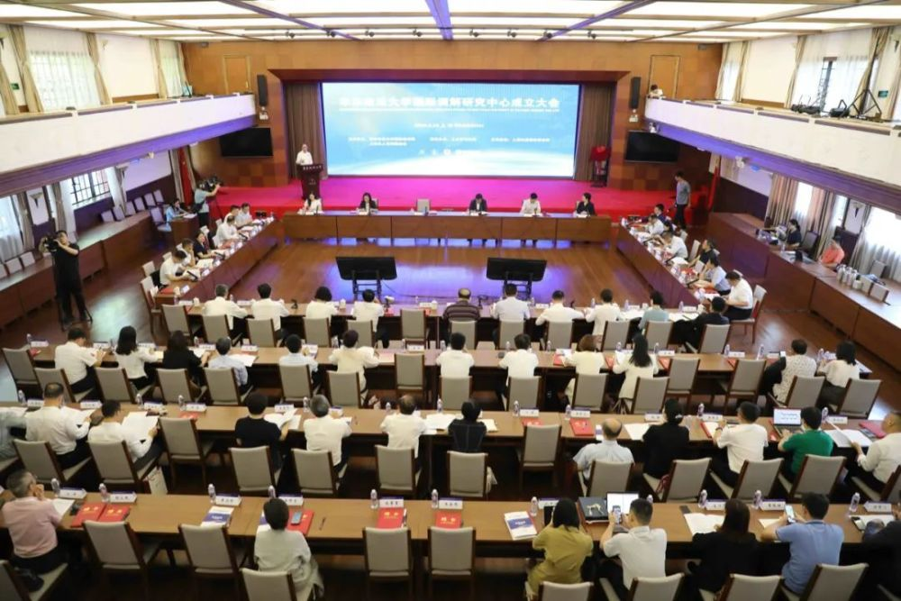

# 事关中央布局！司法部部长贺荣南下上海，两度提到了同一件事

**撰文 | 余晖**

据《法治日报》9月11日消息，近日，司法部党组书记、部长贺荣在华东政法大学实地调研。

她详细了解了法学教育、法学理论研究与实践结合、法治人才培养等情况。

在调研期间，贺荣多次关注到了涉外法治方面的工作。

赴上海参加重要会议

政知君注意到，近日，贺荣在上海出席了第十次上海合作组织成员国司法部长会议。

上海合作组织成员国司法部长会议是上海合作组织框架下的多边合作机制。 **本次会议由中国司法部主办，这是时隔10年后该会议再次在我国主办。**

司法部是国务院组成部门，为正部级，主要职责包括承担全面依法治国重大问题的政策研究，协调有关方面提出全面依法治国中长期规划建议，负责有关重大决策部署督察工作等。

现任司法部部长是贺荣，她曾在陕西、最高法工作，担任过最高人民法院党组副书记、分管日常工作的副院长（正部长级），今年2月任司法部党组书记、部长。她还是中央全面依法治国委员会委员兼办公室副主任。

9月5日，第十次上海合作组织成员国司法部长会议在上海开幕。

中共中央政治局委员、中央政法委书记陈文清出席开幕式，宣读习近平主席贺信并致辞。司法部部长贺荣主持开幕式。

在上海期间，贺荣外出调研。

9月4日至7日，贺荣在上海调研司法行政工作；另外，她还去了华东政法大学。

**华东政法大学是新中国创办的第一批高等政法院校** ，是上海市管理的高校。

在调研期间，贺荣提到， **要全面落实《关于加强新时代法学教育和法学理论研究的意见》**
，教育引导广大师生做习近平法治思想的坚定信仰者、积极传播者、模范实践者， **坚定不移走中国特色社会主义法治道路** 。

《关于加强新时代法学教育和法学理论研究的意见》，是今年2月由中共中央办公厅、国务院办公厅印发的。

上述《意见》明确了主要目标。

其中提到，到2035年，与法治国家、法治政府、法治社会基本建成相适应，建成一批中国特色、世界一流法学院校，造就一批具有国际影响力的法学专家学者。

《意见》还提到，要坚持正确政治方向、坚持和加强党的全面领导。

坚定不移走中国特色社会主义法治道路，坚持党的领导、人民当家作主、依法治国有机统一，
**引导广大法学院校师生和法学理论工作者在原则问题和大是大非面前旗帜鲜明、立场坚定，坚决反对和抵制西方“宪政”、“三权鼎立”、“司法独立”等错误观点** 。

此次在华东政法大学调研期间，贺荣强调：

要充分发挥法学院校理论研究阵地优势，加强习近平法治思想原创性贡献的研究阐释， **不断丰富发展中国特色社会主义法治理论** 。

加快涉外法治工作战略布局

这几年来，涉外法治紧缺人才培养备受中央关注。

2020年11月16日至17日，中央全面依法治国工作会议在京召开，这在党的历史上是首次。

在这次会议上，习近平强调，要 **加快涉外法治工作战略布局** 。

“要强化法治思维，运用法治方式，有效应对挑战、防范风险， **综合利用立法、执法、司法等手段开展斗争，坚决维护国家主权、尊严和核心利益** 。”

涉外法治人才培养，是当前开展涉外法治建设的重中之重。

今年2月，中国政法大学教授张法连在《瞭望》发表了题为《德才兼备、精英明法，加快建设涉外法治人才队伍》的文章。

文中提到，伴随着国家的蓬勃发展，保护国家主权、安全及发展利益的范围从领土主权、国家安全、海洋权益等传统领域，到深海、极地、外空和网络四大战略新领域，高新技术、领事保护、企业合规等领域也都有涉及。国家对高质量涉外法律服务的需求日益凸显。

但另一方面，涉外法治人才数量不足，且专业领域分布失衡，与国际水平相距较远。

以涉外律师为例， **我国约60万律师中，从事涉外业务的仅有两三千人，尚不能提供全面的涉外法律服务。**

在各类国际组织尤其是国际立法机构、司法机构、仲裁机构、调解机构等机构中任职的中国雇员人数较少， **有领导力、影响力的高端涉外法治人才更是稀少。**

强化涉外法治人才培养

这次在上海调研期间，贺荣多次提到了涉外法学。

在上海调研司法行政工作期间，她强调，要立足发挥上海各项优势， **加强涉外法律服务机构和人才建设** ，提升涉外法律服务水平。

在华东政法大学调研时，她说，要加快完善适应法治建设新要求的法学教育体系，加强科技法学、数字法学等新兴学科以及 **涉外法学相关学科建设** 。

她还提到：

要加强中央依法治国办对法学教育工作的指导，落实推进法学教育和法学院校改革要求，深化法学院校与法治工作部门在人才培养、课程建设、教材建设、实务培训、学生实习实训等环节的有效衔接。

要充分发挥立足上海的区位优势，加强国际法的理论研究和实践应用， **强化涉外法治人才培养** ，综合运用法治力量服务保障上海
**国际经济、金融、贸易、航运、科技创新** “五个中心”建设。

值得一提的是，8月24日，华东政法大学国际调解研究中心成立大会在上海举行，这是 **国内高校首家国际调解研究中心。**

华东政法大学校长叶青指出，当前，上海正在全力打造“亚太仲裁中心”“上海国际法律服务中心和“国际争议解决中心”，这一系列举措是为了进一步提升上海的城市软实力，同时
**也是为了代表中国更好参与国际合作和竞争，参与增强中国涉外法治话语权和全球经济治理能力** 。

**资料 ｜ 新华社 人民网 央视 法治日报 瞭望杂志等**

**【版权声明】本文著作权归政知新媒体独家所有，未经授权，不得转载。**

