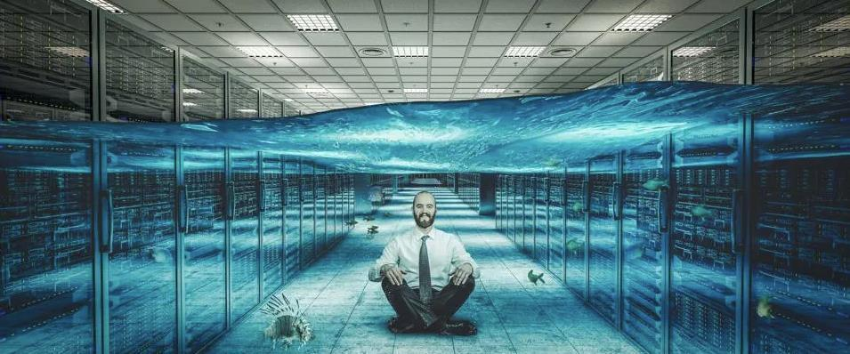
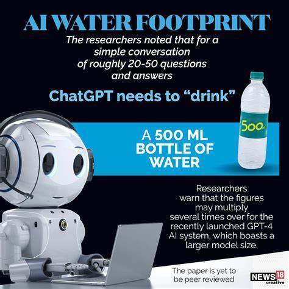
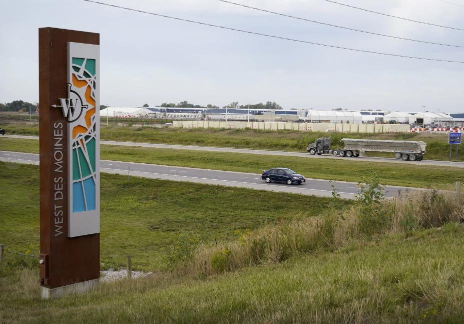
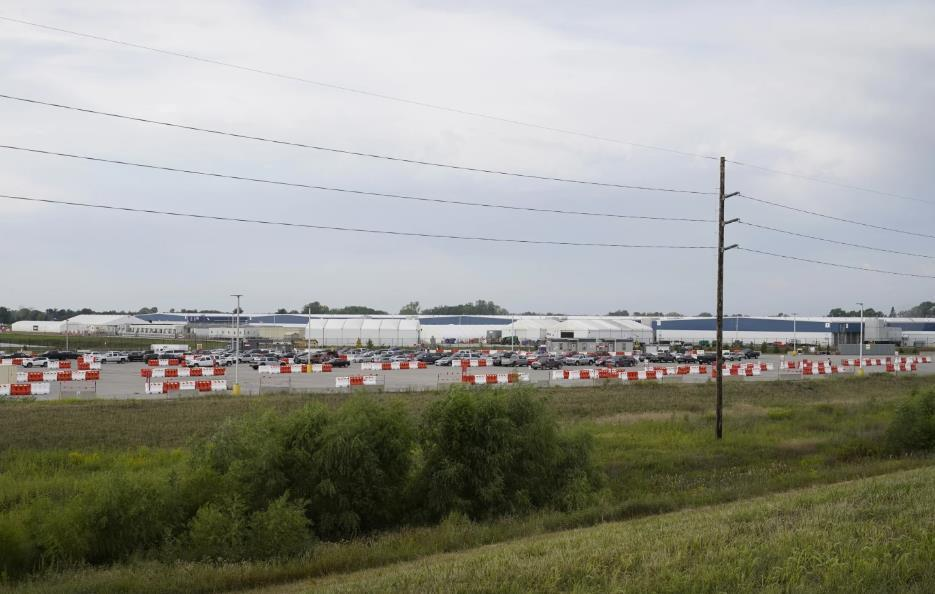

# 人工智能爆火导致用水量飙升：问ChatGPT 50个问题，耗水500毫升

**划重点**

  * _1_ AI模型产生的碳足迹已经引发关注，但其水足迹却经常被忽视。研究显示，培训和部署AI模型都需要耗费大量的水。
  * _2_ ChatGPT每次涉及20到50个问题的简单对话中，消耗的水量约为500毫升。鉴于其用户超过1亿人，其耗水量相当惊人。
  * _3_ 微软全球用水量飙升了34%。在过去十多年间，该公司始终在西得梅因市建设数据中心，以支持其云计算服务并培训大模型。
  * _4_ 谷歌用水量增加了20%，这几乎与其计算能力的增长同时发生，而谷歌计算能力增长在很大程度上由人工智能所推动。
  * _5_ 专家估计，训练Meta新AI模型Llama 2的总用水量高啊1090万升，比Llama增加一倍，而普通人平均每天喝大约3升水。

联合国环境规划署曾发布报告称，世界上约三分之二的人口每年至少经历1个月的严重缺水。到2030年，情况预计将更加恶化，世界上近半人口将面临严重的水资源短缺。除了农业和工业用水增长外，人工智能热潮导致的用水量也在飙升，而科技巨头们正因此变得更“饥渴”。

到目前为止，研究人员和开发人员主要关注减少人工智能模型的碳足迹，而经常忽视它们的水足迹。在数据中心培训和部署人工智能模型需要消耗大量的水。举例来说，在微软最先进的美国数据中心培训GPT-3可能直接消耗70万升清洁淡水，这些淡水可用于生产370辆宝马汽车或320辆特斯拉电动汽车。

此外，ChatGPT每次涉及20到50个问题的简单对话中，消耗的水量约为500毫升。这乍看起来不算多，但考虑到这款聊天机器人有超过1亿的活跃用户，每个人都参与了多个对话，其用水量相当惊人。

不仅仅是微软和OpenAI，在用水量方面，谷歌更是大户。2021年，仅其在美国的数据中心就将消耗127亿升淡水用于冷却，其中约90%都是可饮用水。

总体而言，2014年美国数据中心的总用水量估计高达6260亿升。值得称赞的是，大型科技公司都在采取措施来帮助解决这个问题。其中，亚马逊、Meta、谷歌和微软等科技巨头，都承诺到2030年变得“积极用水”，这意味着他们补充的水将超过他们消耗的水。

**01 与ChatGPT每次交互耗水500毫升**

构建像ChatGPT这类人工智能产品的成本可能很难衡量，其中包括用水成本。训练和部署OpenAI的技术需要大量的水，该公司需要从爱荷华州中部的浣熊河(Raccoon)和得梅因河(Des
Moines)的交汇处抽水，为强大的超级计算机降温。这台超算正帮助OpenAI的人工智能系统学习如何模仿人类书写。

随着微软、OpenAI和谷歌等领先的科技开发商竞相利用生成式人工智能的热潮，他们都承认，对其人工智能工具日益增长的需求带来了高昂的成本，从订购昂贵的半导体到用水量激增都在推动成本上涨。

但这些科技公司通常对细节守口如瓶。在爱荷华州，很少有人知道该州是OpenAI最先进大语言模型GPT-4的诞生地，直到一位微软高管在一次演讲中说漏了嘴，它“实际上是在得梅因以西的玉米地旁边构建的”。

构建大语言模型需要分析大量人类书写文本的模式，所有这些计算都需要大量的电力，并会产生大量的热量。为了在炎热的天气里保持凉爽，数据中心需要抽入大量的水，通常需要降水送入仓库大小、位于建筑外的冷却塔中。

任何在公司服务器机房待过的人都知道，你需要先带上毛衣。服务器机房要时刻保持凉爽，温度通常在10摄氏度左右，以防止设备出现故障。保持这一理想温度是一个持续的挑战，因为服务器本身会将电能转化为热量。而冷却塔通常被用来消耗热量，并通过蒸发冷水来保持房间的理想温度。

冷却塔可以完成这项工作，但它们需要大量的水。研究人员估计，数据中心平均每千瓦时消耗大约一加仑的水。也不是任何类型的水都可以使用。数据中心使用清洁的淡水来源，以避免海水可能带来的腐蚀或细菌生长。淡水对于控制房间内的湿度也是必不可少的。此外，数据中心也需要大量由水力发电的能源支持，科学家们将这种情况称为“非现场间接用水量”。

加州大学河滨分校的研究员任少雷一直在试图计算ChatGPT等生成式人工智能产品对环境的影响。在一篇将于今年晚些时候发表的论文中，任少雷的团队估计，每次你问ChatGPT
5到50个提示或问题时，它就会消耗500毫升的水。当然，其用水量取决于服务器所在的位置和季节。这一估计包括了这些公司没有测量的间接用水，比如为数据中心供电的发电厂降温用水。

“大多数人都没有意识到ChatGPT背后的资源消耗情况，”任说。“如果你不知道资源的使用情况，那么我们就无法帮助保护资源。”

OpenAI在其声明中回应了这些评论，称该公司正在“充分考虑”如何最好地利用计算能力。“我们认识到，培训大型模型可能是能源和水密集型的，为此会努力提高效率，”该公司表示。

**02 微软因训练和部署AI用水量飙升34%**

微软在其最新的环境报告中披露，从2021年到2022年，该公司全球用水量飙升了34%(达到近17亿加仑，或超过2500个奥运会游泳池储水量)。与外部研究人员对微软人工智能研究相关用水情况相比，这一数字有了大幅增长。

 _图1：微软位于爱荷华州西得梅因市的数据中心_

在就用水问题做出回应时，微软在一份声明中表示，它正在投资研究，以衡量人工智能的能源和碳足迹，“同时努力使大语言模型系统在培训和应用方面更有效率”。

_图2：在过去十多年间，微软始终在西得梅因市建设数据中心，以支持其云计算服务_

该公司的声明称：“我们将继续监测我们的排放，加快进度，同时增加使用清洁能源为数据中心供电，购买可再生能源，并通过其他努力实现我们的可持续发展目标，即到2030年实现负碳、水正和零浪费。”

微软于2019年对总部位于旧金山的OpenAI进行了第一笔10亿美元的投资。两年多后，这家初创公司推出了ChatGPT，并引发了全球对人工智能进步的关注。作为投资协议的一部分，微软将为OpenAI提供训练人工智能模型所需的计算能力。

为了至少完成其中的一部分工作，两家公司把目光投向了爱荷华州的西得梅因，这是个拥有6.8万人口的城市。十多年来，微软一直在那里建设数据中心，以为其云计算服务提供支持。微软在当地建设的第四和第五个数据中心将于今年晚些时候投入使用。

微软开始在西得梅因投资时担任市长的史蒂夫·盖尔(Steve
Gaer)说：“他们（微软）正在以最快的速度建造这些设施。”他表示，该公司被西得梅因致力于建设公共基础设施的承诺所吸引，并通过纳税为支持这项投资贡献了一笔“惊人”的资金。

 _图3：微软位于西得梅因市的第四、第五座数据中心有望于今年晚些时候投入使用_

微软在2020年首次表示，它正在为OpenAI开发世界上最强大的超级计算机之一，当时拒绝向媒体透露其部署的位置，但将其描述为“单一系统”，拥有超过28.5万个传统半导体核心和1万个图形处理器，后者是对人工智能工作负载至关重要的芯片。

专家们表示，由于需要在计算核心之间传输大量数据，在单个地点对人工智能模型进行预训练至关重要。

直到5月下旬，微软总裁布拉德·史密斯（Brad
Smith）才透露，该公司已经在爱荷华州建立了“先进的人工智能超级计算数据中心”，专门让OpenAI能够训练其第四代模型GPT-4。这种模型现在支持高级版本的ChatGPT和微软自己的诸多产品，并加速了一场关于遏制人工智能社会风险的辩论。

史密斯说：“这个数据中心是由加州工程师设计的，但它实际上是在爱荷华州建造的。”

在某些方面，西得梅因是训练强大人工智能系统相对高效的地方，特别是与微软在亚利桑那州的数据中心相比，后者为同样的计算需求消耗的水要多得多。

“因此，如果你在微软内部开发人工智能模型，那么你应该把模型的培训安排在爱荷华州，而不是亚利桑那州，”任少雷说。“在训练方面，这两个地方没有什么区别。但在用水和能源小号方面，两者有很大的不同。”

在一年中的大部分时间里，爱荷华州的天气足够凉爽，以至于微软可以使用外部空气来保持超级计算机的正常运行，并将热量排出大楼。该公司在一份公开披露的文件中表示，只有当温度超过29.3摄氏度时，它才会利用水来降温。

即便如此，微软可能仍然需要使用大量的水，特别是在夏天。根据西得梅因水厂的数据，2022年7月，也就是OpenAI表示完成GPT-4培训的前一个月，微软向其爱荷华州的数据中心群注入了约1150万加仑的水。这相当于该地区总用水量的6%左右，该水厂也为当地居民提供饮用水。

2022年，西得梅因水厂的一份文件称，该公司和市政府只会考虑微软未来的特定数据中心项目，前提是这些项目能够“展示并实施技术，大幅降低当前水平的高峰用水量”，以保护住宅和其他商业用户的供水。

微软表示，该公司正在直接与自来水厂合作，以解决反馈意见。自来水厂在一份书面声明中表示，微软始终是一个很好的合作伙伴，一直在与当地官员合作，在满足其需求的同时减少水足迹。

**03 谷歌用水量飙升20%，AI竞赛让情况变得更糟**

谷歌于7月份发布的2023年环境报告显示，该公司的用水量飙升20%，这在很大程度上也归功于其人工智能工作。
这家互联网巨头表示，其2022年消耗了56亿加仑的水，相当于37个高尔夫球场的用水量，其中52亿加仑用于支持其庞大的数据中心运营，比上一年增加了20%。

谷歌的用水量上涨幅度并不一致：在俄勒冈州，其用水量很稳定，因为它吸引了公众的注意；而在拉斯维加斯以外，它的用水量翻了一番。在爱荷华州，谷歌同样很饥渴，其Council
Bluffs数据中心用水量比其他任何地方都多。

谷歌的报告详细介绍了保持大型数据中心运行所需要的环境成本，这些数据中心通常需要大量的水才能保持凉爽。数据显示，随着谷歌和人工智能竞赛中的所有其他科技公司加快建设新的数据中心，它们的用水量很可能会继续上升。

2019年，谷歌仅在三个州就为数据中心申请了超过23亿加仑的水。该公司目前在北美拥有14个数据中心，用于支持其产品套件Google
Search，以及最近推出的Lamda和Bard等大语言模型。数据显示，仅Lamda就可能需要数百万升水来进行培训，比GPT-3还要多，因为谷歌的几个干渴的数据中心都位于得克萨斯州等炎热的州。

加州大学河滨分校电气与计算机工程系副教授任少雷指出，谷歌用水量增加20%几乎与其计算能力的增长同时发生，而谷歌的计算能力在很大程度上是由人工智能推动的。然而，任少雷表示，他对这种增长能否长期持续持怀疑态度，即使谷歌承诺补充水资源以抵消其使用量。他说：“这只是让他们的水务账目看起来更好，但水仍然被大量消耗。”

谷歌表示，2030年是其办公室和数据中心补充120%淡水的最后期限。根据它自己的报告，目前它只补充了6%的淡水。谷歌目前消耗的大部分水都是“可饮用的”，足够干净，可以用作饮用水。

谷歌在最新报告中指出，该公司已经考虑到缓解“当地的水资源压力”（水资源短缺的另一种方法），并表示到 2022 年，其淡水抽取量的 82%
将来自水资源相对丰富的地区。对于剩下的18%，谷歌称其正在探索新的合作伙伴和机会来改善用水情况，但随着更多的地方面临水资源短缺，它可能会面临越来越大的阻力。

2019年，谷歌计划在亚利桑那州梅萨建立一个数据中心，保证每天最多供水400万加仑。但正如媒体最近指出的那样，亚利桑那州已经面临水资源短缺困扰，这可能会阻止其批准谷歌类似的交易。

事实上，谷歌的一位发言人表示，一旦数据中心建成，那里将使用“风冷技术”。这表明谷歌正在努力寻找更可持续的用水策略，以应对不断增长的用水需求。

**04 Meta新AI模型用水总量惊人**

微软和谷歌并不是唯一感到越来越饥渴的公司。Facebook母公司Meta也在亚利桑那州建设一个数据中心，2022年用水量超过260万立方米(约合6.97亿加仑)，主要用于冷却数据中心。此外，Meta最新的大语言模型Llama
2，也需要大量的水来训练。

今年7月份，Meta发布了名为Llama
2的大型新人工智能模型。科技行业的人都感到很兴奋，除了任少雷，他对训练这些大语言模型需要消耗的水量感到担心。任少雷估计，训练Llama
2需要的用水总量高达1090万升，如果不包括水力发电，则为280万升。普通人平均每天要喝大约3升水。

Meta没有透露它用了多少水来训练这个人工智能模型。不过，该公司确实披露了耗电量。任少雷以此为基础，研究了Meta数据中心在使用能源和水方面的效率。他说，Llama
2几乎是Meta今年早些时候推出的上一款大型人工智能模型Llama 1的水足迹的两倍。

数据中心已经消耗了大量的能源，人工智能的蓬勃发展预计将大幅增加这种消耗。任少雷表示：“如果用电量增加，碳足迹和水足迹等其他东西也会随之增加。”
Meta发言人没有就任少雷的估算进行置评。

Meta的数据中心在2021年使用了超过500万立方米的水，大约相当于13.3亿加仑。该公司尚未分享2022年的数据。

到今年年底或者明年，Meta将在亚利桑那州建成并扩建一个数据中心，其用水量将继续攀升。（文/金鹿）

