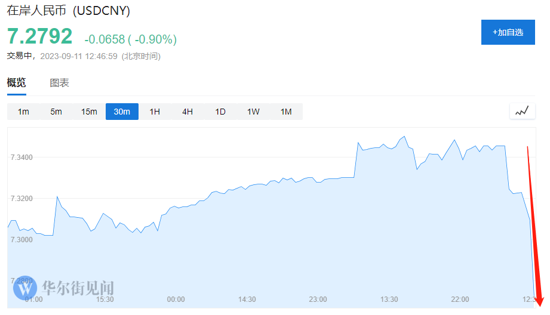
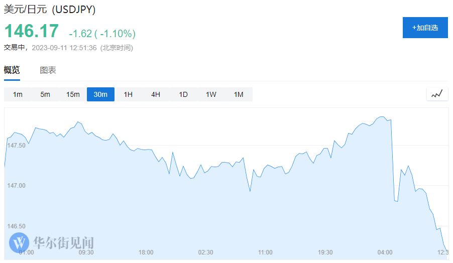
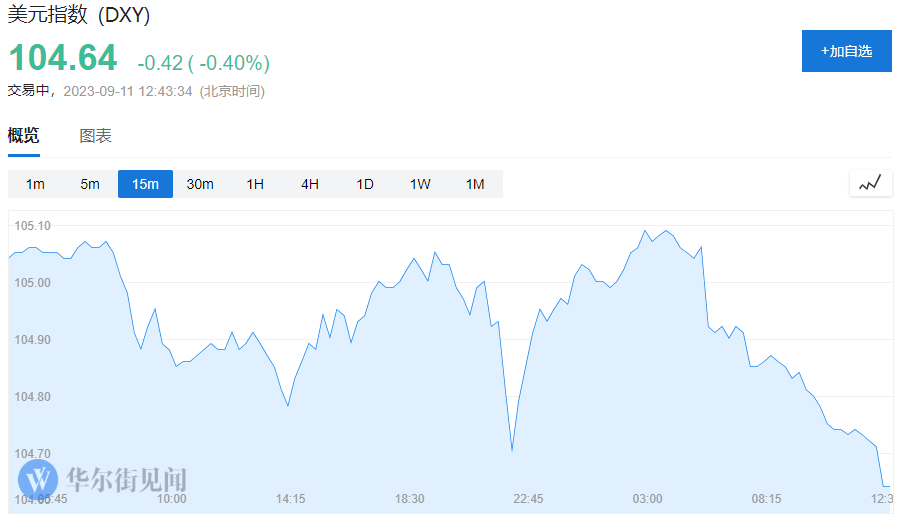

# 人民币突然猛拉！发生了什么？专家：日元升值+预期向好导致

9月11日上午，人民币出现猛拉行情。

在岸、离岸人民币兑美元双双反弹超过650点，接连收复多个关口，发生了什么？

分析普通认为，一方面，8月经济数据即将发布，机构预计相关数据超预期，且叠加国内经济政策引发的预期向好导致。另一方面，
**由于日元升值引发美元指数杀跌所致。**

值得一提的是，9月11日，全国外汇市场自律机制专题会议在北京召开。会议强调，
**金融管理部门有能力、有信心、有条件保持人民币汇率基本稳定，该出手时就出手，坚决对单边、顺周期行为予以纠偏，坚决对扰乱市场秩序行为进行处置，坚决防范汇率超调风险。**

**此外，11日午间，央行发布的数据显示，8月人民币贷款增加1.36万亿元，同比多增868亿元；8月末，广义货币（M2）余额286.93万亿元，同比增长10.6%；8月社会融资规模增量为3.12万亿元，比上年同期多6316亿元。**

**人民币突然猛拉**

9月11日上午，在岸人民币兑美元汇率大幅反弹，收复7.28关口。截至12：46，报7.2792，日内涨658点。

离岸人民币兑美元汇率反弹更大，连续收复7.33、7.32、7.31、7.30关口，日内涨幅超660点，截至12：47，报7.2985。

据中国证券报报道， **值得一提的是，9月11日上午人民币汇率反弹，是在此前一周人民币汇率快速走贬的背景下实现的。**
Wind数据显示，9月4日至8日当周，在岸、离岸人民币对美元汇率周度分别贬值1.08%、1.3%。

**人民币汇率为何反弹？**

据券商中国，这 **一方面是由于日元升值引发美元指数杀跌所致。**

9月10日，日本央行行长植田和男上任以来首次独立接受媒体采访，他在采访中指出，如果日本央行对物价和工资将持续上涨有信心，结束负利率是可行的选择之一。瑞穗表示，日本央行行长植田和男对薪资增长和利率的评论，暗示负利率政策最早或于1月结束。

11日，日股开盘，日本银行股及日元齐声上涨，东证银行股指数一度上涨3.39%，至2008年8月以来最高水平。日元兑美元一度上涨超1%，至146.17。

与此同时，美元指数则走势偏弱。截至12:43，美元指数报104.64，下跌0.4%。

**另一方面是由于国内经济政策引发的预期向好导致。** 最近，房地产政策逐步松动，今天早盘，准一线城市青岛更是释放超强信号。

青岛提出，为贯彻落实党中央、国务院决策部署，因城施策用好政策工具箱，促进全市房地产市场平稳健康发展，更好满足居民刚性和改善性住房需求：

一、调整住房限购区域，将市南区、市北区（原四方区域除外）移出限购区域，全域取消限购政策。

二、优化住房上市交易年限，在本市范围内，商品住房取得《不动产权证书》可上市交易。此政策的信号意义非常强。

另外， **从本周开始，我国将陆续公布8月的经济和金融数据。业内普遍预计，国内经济基本面有望逐步好转，信贷情况也或将出现明显回升。**

全国外汇市场自律机制专题会议认为，
**随着国内稳经济、稳预期政策陆续出台落地，物价（CPI）同比增速触底转正，进出口数据好于预期，房地产政策效果逐步显现**
，消费明显回暖，科技创新不断突破，经济高质量发展持续推进，经济“进”的势能正在积聚，人民币汇率在合理均衡水平上保持基本稳定具有坚实基础。

**未来走势如何？**

据中国证券报，
**展望人民币汇率未来走势，多位专家表示，人民币汇率短期内仍面临一定的外部压力，或继续处于磨底阶段。长期看，人民币汇率进一步走弱的概率不大。**

短期看，人民币汇率仍然面临内外压力。中信证券首席经济学家明明分析，一方面，近期多项稳经济政策举措逐步落地，但政策的效果仍需时间验证。另一方面，美国经济韧性或可在年内保持，经济明显走弱或在明年开始显现。“在这样的背景下，预计美元指数仍在高位宽幅震荡，短期内人民币汇率或仍面临外部压力。”他说。

中金公司外汇专家李刘阳表示，经济数据出现企稳迹象，内生增长动能的进一步积累或有待稳增长政策的落地生效，政策底有望进一步过渡至经济底，经济增长前景带给人民币汇率的拖累作用或边际减轻，随着愈来愈多的经济数据边际向好的态势或更加明显，人民币汇率能从国内经济增长修复预期中得到更多支撑。

此外，李刘阳表示，在美元指数及美债收益率偏高的背景下，上周央行继续采取了包括控中间价的逆周期因子调整、控制香港离岸人民币流动性和口头稳定预期等方式稳定人民币汇率，稳定外汇市场的预期。“稳汇率政策的持续发力或能向市场体现出央行维持汇率预期稳定的决心。”他说。

综合中国证券报 连润、券商中国 时谦

本文不构成个人投资建议，不代表平台观点，市场有风险，投资需谨慎，请独立判断和决策。

