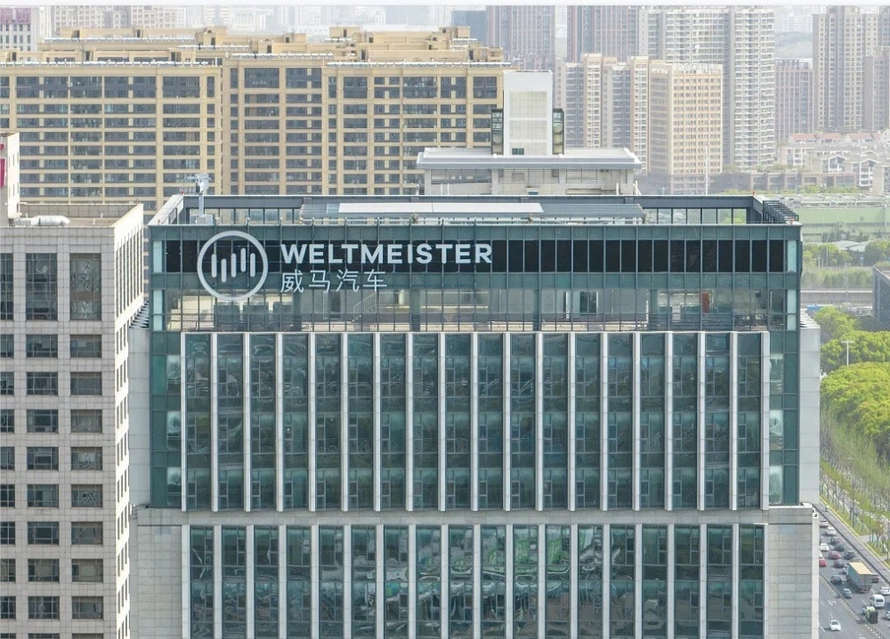

# 借壳上市失败，威马离破产还有多远？

作者 ｜ 程潇熠

编辑 ｜ 康晓

威马汽车第三次冲击IPO宣告失败。

9月8日晚，港股上市公司Apollo出行发布“终止收购协议”公告，称考虑到全球市场动荡及地缘政治冲突、金融市场氛围持续不确定及疫情后短期经济复苏等商业因素，已与相关方达成终止收购威马汽车全资子公司协议。

原协议表面上看是Apollo出行收购威马，但实际上是威马对Apollo出行的反向收购，以此实现借壳上市。

8个月前的1月12日，Apollo出行发布公告称，拟以20.2亿美元（约合人民币148亿元）收购威马控股全资子公司。鉴于2022年初，威马已获得该公司28.51%股权，成为最大单一股东。Apollo出行收购威马子公司后，威马在Apollo出行的持股比例将超68%。因此，威马可以通过反向收购上市公司Apollo出行实现借壳上市。

收购公告发布前一小时，威马汽车创始人兼CEO沈晖在社交平台上引用了电影《芙蓉镇》的台词：“活下去！像牲口一样活下去！”

**威马曾在2020年申请登陆科创板，2022年又向港交所提交了上市申请书，两次都默然熄火。这次通过反向收购上市被外界视为威马的“最后一搏”。**

威马汽车曾经身居造车新势力第一梯队，如今IPO落空、债务缠身。更为割裂的是，威马在国内和国外呈现出了两种截然不同的状态：国内复工复产状态扑朔迷离，旗下子公司不断被股权冻结、强制执行、被申请破产；国外订单信息不断，7月批量进欧洲，9月8日与泰国FD
co Thailand及中闵集团签署合作，宣布进军泰国市场。

除此之外，威马也在通过商用车市场合作寻求更多生路。

押注海外业务，威马汽车接下来还能撑多久？

**海外订单不断，但生产基地主体公司股权被冻结**

威马曾与蔚来、小鹏、理想同为新造车第一梯队，旗下首款纯电SUV威马EX5曾在2020年成为新势力单一车型的销量冠军。

另外，因较早切入新能源汽车B端市场（如网约车、出租车等），威马在国内网约车市场也曾占据一席之地。以与威马网约车合作最深的海南为例，2019年，威马在海南省的旅游租车业务整体租车率高达70%。

**威马汽车的历年融资总额超“蔚小理”达约350亿元，但资金快速烧完，债务缠身。**
据威马汽车招股书，截至2021年底，威马汽车的资产负债率已高达202.36%（“蔚小理”均在55%以下），远超破产警戒线（100%）。过去三年里，威马汽车始终处于亏损状态，三年累计亏损达174亿元，且亏损逐年加剧。2019年-2021年，亏损分别约为41亿元、51亿元、82亿元。

从今年年初以来，威马接连陷入裁员停薪、停工停产、门店关闭、股权冻结等风波。

今年2月，《深网》曾独家获悉，威马大部分员工被停薪留职，少部分人每月能拿到25%的工资，并且拖欠了部分员工的社保和被裁员员工的赔偿款。《深网》回访部分离职员工后得知，时至今日威马仍未补发上述员工的公积金及赔偿款。

虽然沈晖在《深网》发文两天后于社交媒体上回应，威马正通过一系列降本增效措施“全力保障复工复产”，但截至发稿，威马的复工复产状态仍处于扑朔迷离的状态。

威马为上市曾展开多次自救。2022年下半年，在公司资金紧张的情况下，威马CFO毕仕宇牵头成立了“智慧停车”项目组。产研团队、运营团队、大数据团队等多个部门中高层协调配合，在毕仕宇的主导下在内部创建了相关虚拟组织架构。

一位相关参与者曾对《深网》表示，毕仕宇称“智慧停车”项目是上市前必须要做的“重要背书”。

但最后这些自救项目都无疾而终，威马冲击上市三次均告失败。

与国内市场哑火形成鲜明对比的是，今年上半年，威马汽车频繁更新出海进展。

3月，威马汽车对外称，威马已在以色列、迪拜以及东南亚等地区获得了万辆汽车订单。7月初，据湖南日报报道，威马汽车的EX5及E5两款车型的数台样车，已经从上海发往西班牙的巴塞罗那港和德国的汉堡港。

7月25日，威马汽车在官方微博上晒出一张国际货轮照并配文：整装待发。据多家媒体报道，当日是装载50台威马W5车型，由上海港海通码头启程前往以色列。

9月8日，威马汽车与泰国FD co
Thailand及中闵集团在上海签署战略合作协议，宣布进军泰国电动汽车市场，并辐射深入到东南亚及大洋洲国家。威马汽车科技集团负责人告诉湖南日报，威马汽车将在泰国投资建厂。

然而威马汽车国内生产基地股权多次被冻结，公司主体被列为执行人。

威马汽车在国内有两大生产基地，分别位于浙江温州和湖北黄冈，所属公司主体分别为威马汽车制造温州有限公司（以下简称威马温州制造）和湖北星晖新能源智能汽车有限公司（以下简称湖北星晖）。根据企查查信息，这两家公司均被列为被执行人。

其中，威马温州制造在今年3月股权被冻结，冻结股权数约为40.4亿元。湖北星晖今年被两度冻结股权，8月22日，湖北星晖更是被上海一家制造业供应商（上海鑫燕隆汽车装备制造有限公司）申请破产重整。

国内生产基地仍未恢复正常运营生产，即威马汽车目前有大量闲置产能，却决定将在泰国投资建厂。由此可见，沈晖为威马找寻的“生路”或许就是海外市场。

**海外市场，掉队车企的最后希望？**

将海外市场视为救命稻草的并非只有威马。

去年年底，天际汽车成为第一家宣布在海外建厂的新势力公司，与沙特本地公司成立合资公司，共同投资约5亿美元，设立新能源汽车的生产制造和研发基地，年产约10万辆新能源车。该基地的项目签约，标志着天际成为了第一家在海外建厂的中国造车新势力。

天际汽车创立于2015年，也是与蔚小理同期创业的新势力车企，但2022年年销量仅5000辆出头。与威马汽车的经历类似，天际汽车从2023年开始部分岗位停工停产，并不断陷入被供应商“催债”、股权冻结等风波。

因海外市场突然起死回生的还有众泰汽车。

去年12月，已经停产两年的众泰汽车发布公告，称独家授权律赛国际在双方约定的中东特定国家和地区市场为本协议内车型的独家出口商、代理商。双方计划2022年到2023年销售10000台众泰T300，金额约6.92亿元。这也意味着众泰汽车正式复产。

从今年1月起，众泰开始陆续向中东地区交付T300海外版。根据多家媒体报道，除了中东市场，众泰汽车还将在中亚、西亚、南美等多个海外市场展开发力。

海外市场给众泰带来了希望，但并没有带来规模化销量。根据众泰汽车发布的2023年上半年业绩报告，众泰汽车上半年产销量仅为872辆、652辆，亏损高达2.84亿元。

除此之外，恒大汽车、爱驰汽车等在国内销量寥寥、债务缠身的车企也拿到了中东地区的合作。

全球能源转型大势所趋，盛产石油的中东国家也不得不顺势而为。相比中国、欧美等地区，中东地区相对而言是新能源汽车蓝海市场。有数据预测，未来五年，阿联酋对电动车的需求将以每年30%的速度增长。

**中东国家有钱有市场又急于求变，新能源车企缺钱求规模，二者一拍即合。随着国内价格战加剧，今年下半年，加入中东这一市场进行竞争的车企也越来越多。**

例如，小鹏汽车、极氪汽车纷纷宣布进入以色列市场；蔚来拿到了阿布扎比CYVN
Holdings总计约11亿美元的战略投资；沙特投资部也与高合汽车母公司华人运通签署了一项价值210亿沙特里亚尔（约合56亿美元）的协议。

**国内的新能源汽车战火迅速烧至海外，并没有给威马、爱驰、天际等车企充足的韬光养晦的时间。**

威马或许也意识到了，决定切入商用车领域扩展市场。

8月22日，据湖南日报报道，威马汽车与集兆嘉智慧重工集团达成资本层面深度战略合作，双方将重组威马汽车开曼境外公司
“威马新能源商用车集团（威马商用车）”，作为威马汽车的新能源商用车新业务版块，对标美国Rivian及特斯拉的Cybertruck。

目前，重组后的威马新能源商用车集团已经从集兆嘉智慧重工集团处获得了20万台的物流车及售货车订单。据湖南日报援引相关人士信息，“海外资本非常看好威马的资质、渠道和未来战略”，威马汽车将全面融入集兆嘉智慧重工生态，乘用车和商用车两个领域同时进行。

沈晖为威马找来了新叙事——商用车与海外市场，在新的叙事逻辑下，威马能不能等到“白衣骑士”，是其绝处逢生的关键。

