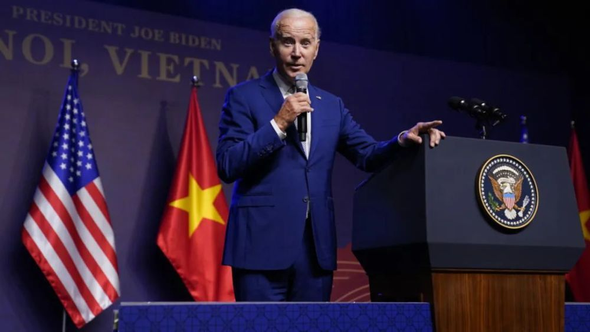
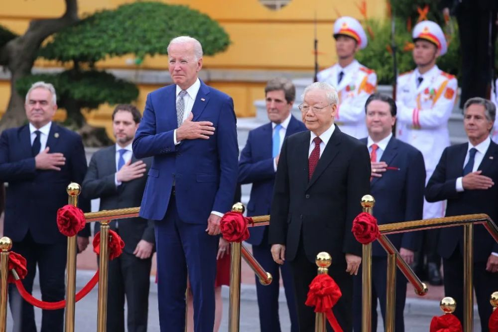
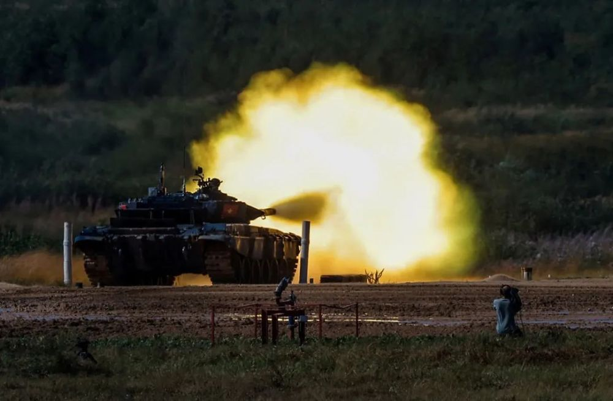

# 刘和平：美越关系连升两级，但中间仍有难迈过去的坎

**直新闻：刘先生，我们看到，美国总统拜登访越期间，美越关系不仅升级为了全面战略伙伴关系，而且双方宣布将会在半导体和稀土领域开展新的合作。对此，你怎么看？**

**特约评论员 刘和平：**
其实，我一直认为，美国推出的旨在遏制中国的”印太战略”，正在导致“印太”地区的地缘政治与安全格局以及地缘经济格局大重组。地缘政治与安全格局大重组的表现就是，美日、美韩、美澳与美菲同盟的升级与再造。地缘经济格局的大重组，主要表现为以芯片行业为主的产业链条大重组，这一动作在给中国经济发展带来一定麻烦的同时，也让“印太”地区的其他国家和地区看到了见缝插针取而代之的机会。而且，对于美国来说，地缘政治与安全格局大重组才是真正的目的，地缘经济格局大重组往往还只是手段，拜登政府往往是以地缘经济格局大重组为诱饵，吸引“印太”地区的国家和地区加入美国主导的地缘政治与安全格局大重组。拜登这次访问越南，采取的就是这样的手段。

那么众所周知，越南将自己的对外关系分为了三个层级，最高级是全面战略伙伴关系，其次是战略伙伴关系，再次是全面伙伴关系。因此，美越建立全面战略伙伴关系还不是一般意义上的升级，而是直接跳级。而这显然又是跟拜登向越南送出的大礼密切相关，也就是宣布将与越南在半导体和稀土领域开展新的合作，而后者正是越南梦寐以求的。也就是说，拜登给出的诱惑足够吸引人，才使得越南同意将美越关系跳级为了全面战略伙伴关系。

**直新闻：那拜登政府这次为什么要极力拉拢越南呢？**

**特约评论员 刘和平：**
确实，拜登这次在美越关系上不仅是花了心思而且是下了血本的，甚至为了突出美越关系的重要性，还不惜得罪了区内的其他国家。因为在拜登访问越南之前，相关国家在印尼召开了东盟峰会和东亚系列峰会，然而在两者时间间隔如此短的情况下，拜登却放了东盟峰会与东亚系列峰会的鸽子，先是前往印度出席了二十国集团峰会，然后又掉转头来访问了越南，这不仅得罪了印尼，更得罪了整个东盟。当然，得罪印尼与整个东盟以突出越南的特殊地位和作用，也正是拜登政府想要看到的结果。

而在我看来，拜登这种亲疏有别的做法，一方面是因为美方已经意识到了，东盟这个集体已经不可能放弃自己的中立立场，转而投入到旨在遏制与围堵中国的地缘政治与安全格局大重组当中。或者说得更准确一点，就是东盟这个集体不会加入“印太战略”。在这种情况下，美国只能放弃拉拢东盟的幻想，转而选择从东南亚的个别国家身上下功夫以寻求突破。另一方面则是因为越南和菲律宾一样，跟中国都存在着南海岛礁争端，而且是侵占中国南海岛礁最多的国家，因此它们都希望获得美国的某种承诺与保护。也就是说，对于美国来讲，相较于其他东南亚国家，菲律宾与越南是比较容易“上钩”的。在这种情况下，美国在搞掂菲律宾之后，一定会把手伸向越南。

**直新闻：那你认为，美越关系还能在全面战略伙伴关系的基础上再往前走一步升级为军事同盟关系吗？**

**特约评论员 刘和平：** 我认为，除非南海局势发生突变，否则这种可能性基本上不存在。

要知道，虽然越南将美越关系跳级为了全面战略伙伴关系，但是先后跟越南建立了全面战略伙伴关系的国家分别有中国、俄罗斯、印度和韩国，美国只是其中的第五个国家，而且还是个后来者。从中我们也可以看出，越南将越美关系跳级为了全面战略伙伴关系，只是其惯常使用的平衡外交战略的一部分，也就是把美国拉进来的目的，是为了平衡其他大国对越南的影响力。

这背后的原因就在于，美越之间还是存在着根深蒂固的相互猜疑。跟菲律宾在意识形态与安全上倒向美国，在经济上依赖中国不同，越南只是在安全上或者说是在南海岛礁争端问题上有求于美国，它不仅在经济上有求于中国，而且在意识形态上跟中国基本相同。也就是说，越南在跟美国靠近的时候，始终留了一个心眼，担心美国随时对其打出“意识形态牌”和“人权牌”。

我想，这就是越南在接待拜登访问之前，会先行接待中共中央对外联络部部长刘建超访越的原因。这显然是要告诉美方，越南共产党跟中国共产党之间是有着特殊关系的，这种关系是越美关系取代不了的。

**直新闻：据《纽约时报》援引越南财政部文件报道，在美越寻求提升关系之际，越南正与俄罗斯秘密商讨，计划通过在西伯利亚的俄越石油合资企业，来采购俄罗斯军备。对此，你又怎么看？**

**特约评论员 刘和平：**
对于这则新闻，我脑子里有一系列的疑问。其一是，由于以美国为首的西方世界正在对俄罗斯进行经济与军事制裁，这也就意味着，任何国家想要购买俄罗斯的武器，都等于是在冒天下之大不韪，甚至等于是在跟以美国为首的西方国家决裂，一定会遭到西方的反对与制裁。在这种情况下，越南怎么可能主动对外泄露这个秘密，而且是越南财政部泄的密，同时还得到了越南前任和现任官员的证实？第二，越南为什么要选择在拜登即将访越前对外透露这一绝密信息，这不是在给拜登以及给越美关系添堵吗？第三，由于近一年半多以来，俄罗斯生产的武器在俄乌战场上的表现远远不尽如人意，包括中东欧在内的相关国家都在想方设法淘汰俄罗斯的军备，并以西方生产的军备取而代之，甚至连俄罗斯武器的最大买主印度都已经加入了这一进程。在这种情况下，为什么越南还要做“逆行者”，冒着得罪西方世界的风险进一步从俄罗斯进口军备？第四，众所周知，由于当前俄乌战事正在进行中，俄罗斯最缺的就是军备，自己生产的武器都远远不够自己使用，甚至还要想方设法从伊朗与朝鲜购买武器。在这个节骨眼上，俄罗斯哪里还会有富余的军备卖给越南？

因此我认为，越南方面在拜登即将访越之前对外透露这一信息，恰恰不是为了从俄罗斯购买武器，而是为了给拜登政府施压，希望美方能够向其提供武器以替换掉俄罗斯的武器。或者说，越南这是在向拜登政府要价，你要是再不向我提供美式武器，那我可就要向俄罗斯购买了。因为最近一段时间以来，拜登政府不仅承诺会卖武器给印度，而且准备跟印度合作共同生产美式武器，越南也想要获得跟印度一样的待遇。

这也就意味着，美国会不会卖武器给越南，将成为美越关系能否进一步升级以及美越关系信任度的一块试金石。那么拜登政府最终会不会向越南出售武器？我认为，美国总统国家安全事务副顾问费纳在接受媒体采访时已经给出了答案。他说，现阶段没有要宣布的美越军火交易，但强调接下来美国及其合作伙伴可以向越南提供帮助，以实现军事供应多元化。很显然，至少在眼下，美方已经拒绝了越南的要求。这背后的原因就在于，美越之间的信任度还没有到这个份上。而美国不信任越南，越南也不信任美国的根源，仍然在于道不同不相为谋，在于两国之间的不同意识形态和政治制度。这是双方在眼下难以迈过去的一道坎。

作者丨刘和平，深圳卫视《直播港澳台》特约评论员

编辑丨曾子瑾，深圳卫视直新闻主编

