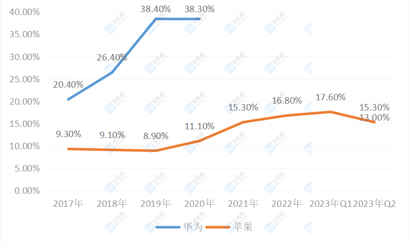
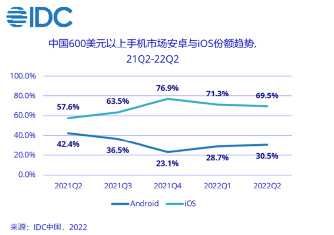
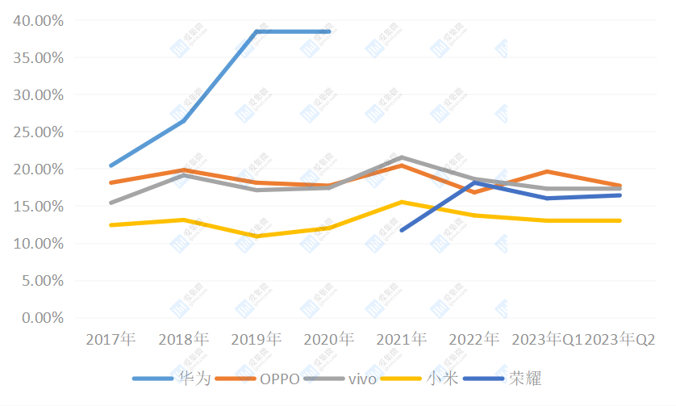

# 华为5G回归：苹果蒸发两千亿，“OV荣米”危机感拉满

集微网报道 近日，华为5G智能手机Mate 60系列强势回归，引发国内消费者购机热潮，黄牛也趁机炒货，不断推高华为5G手机的市场热度。

这让即将发布iPhone
15系列新品的苹果市值提前蒸发2000亿美元，而且随着华为5G手机销量不断攀升，苹果9月以后在国内智能手机市场将遭到巨大冲击，销量和销额都可能双双下滑。

与此同时，“OV荣米”也感受到华为5G手机带来的危机感。近两年来，“OV荣米”在国内高端手机市场刚有起色，如今却要面临华为5G手机的强大威胁，无力抗争的他们最终可能会被迫放慢高端化步伐。而且随着华为5G手机下探至中低端市场，“OV荣米”国内市场份额将进一步被压缩。

苹果市值已蒸发2000亿美元

近日，华为Mate 60、Mate 60 Pro、Mate 60 Pro+、Mate X5等5G智能手机接连上架，每次线上开售就秒空。

华为5G智能手机的热销使业界和资本界降低了对即将发布的iPhone 15系列的预期，苹果市值已蒸发2000亿美元（14688亿元人民币）。

这并不是苹果第一次遭遇华为高端手机的压制。早在2018年、2019年的时候，华为不断遭遇美国制裁，但是智能手机在国内市场却空前热销，年度份额最高达38.4%，刷新历史记录，至今没有手机厂商能打破。与此同时，苹果国内智能手机市场份额连续两年下滑，从2017年的9.3%降至2019年的8.9%。

_2017-2023Q1华为、苹果在国内智能手机市场份额变化趋势 来源：集微网、IDC_

如今华为5G智能手机回归，市场呼声高涨，让苹果感受到了前所未有的压力，因为苹果曾是华为淡出5G智能手机市场最大的受益者之一。过去三年，苹果由于缺少强劲的竞争对手，国内手机市场份额一路高歌猛进，从2020年11.1%提高至2022年的16.8%。而且随着2021年华为5G芯片库存耗尽，国内大部分高端手机用户转投苹果，使苹果国内高端手机市场份额不断攀升，2021年第四季度高达76.9%。

不过，苹果曾经从华为抢夺的市场份额可能随着华为5G手机强势回归而逐步流失。美银证券分析师莫汉说：“如果华为扩大麒麟 9000 芯片的供应和规模，我们认为新款
Mate 系列手机是华为增加出货量和重新获得市占率的一个机会，这可能会给 iPhone 销量带来下行风险，尤其是苹果的亚太地区销量。”

目前，华为已经在与苹果开始争夺国内高端手机市场份额。近日，华为5G手机新品受到国内消费者热捧，Mate 60 Pro在线销量五天内突破80万台，Mate
60 Pro+、Mate X5秒售罄。而且下周华为、苹果双方将通过新品发布会隔空对战，华为有望在国内获得更多的用户拥护。

但是短期内华为由于受5G芯片产能限制，只能从苹果手中抢回一部分高端手机市场份额。业内人士预计，Mate
60系列手机今年出货600万-800万台，明年出货将达1400万台。供应链消息也指出，Mate
60系列已加单至1500万-1700万台。华尔街投行杰富瑞（Jefferies）的分析师爱迪生·李表示，这些事态发展足以威胁新 iPhone
在中国的销售成绩，中国消费者更认为这是对美国制裁的重大胜利，估计 Mate 60 Pro 会占据 iPhone中国销量的38%。

山雨欲来风满楼，苹果似乎也感受到华为5G智能手机带来的可能冲击，已经降低了iPhone 15系列订购量。DIGITIMES
Research高级分析师Luke Lin近日表示，苹果在8月份为2023年下半年的iPhone
15系列订购了8000万至9000万部智能手机，这比2022年8月份为iPhone 14订购的9000万至1亿部要低。

中长期来看，随着华为5G手机产能不断释放，以及折叠屏手机出货持续增长，苹果在国内的高端手机市场份额将不断被稀释，是否会回到2019年状态还需要更多的市场观察。

OV荣米高端化步伐被迫放缓

华为5G智能手机回归，不仅对苹果不利，还将波及OPPO、vivo、小米、荣耀。

OPPO、vivo、小米对华为比较忌惮。2019年华为在国内智能手机市场如日中天，OPPO、vivo、小米却承受着巨大的经营压力，无力与华为抗衡，分别下滑1.7个百分点、2个百分点、2.2个百分点。

只有从华为独立的荣耀祝贺华为5G手机回归。近日，荣耀CEO赵明对华为手机回归表示“高兴和祝贺”，称华为手机回归让竞争充满了更多的可能性和更多的魅力。

确实，华为5G手机归回快速弥补了中国品牌在高端手机市场的不足，进一步激发市场竞争活力，但是对OPPO、vivo、小米、荣耀将造成双重打击。

第一，华为5G手机大卖，将在国内高端手机市场迅速站稳脚跟，使OPPO、vivo、小米、荣耀高端化市场步伐放缓。过去两年间，为了尽快取代华为在高端安卓市场的位置以及满足换机市场需求，OPPO、vivo、小米、荣耀都在加速品牌、产品的高端化，而且取得了一定的成绩。例如，小米13在2023年第一季度的全球400-599美元价位单品排行第三；OPPO
Find N2 Flip出货量在今年上半年小折叠屏手机市场排名第一；荣耀Magic
V2打破了2023年所有4000元以上手机首销日销售额纪录；vivo也曾在2022年第二季度取代华为首次在中国高端市场占据第二位……但是他们都还没有完全实现品牌高端化的蜕变，面对华为5G高端手机的强势回归，很可能再次无力对抗，被迫放慢国内高端化的脚步，加快海外高端化速度。毕竟，在2020年上半年的时候，国内高端手机市场基本被华为、苹果瓜分，其他手机厂商在高端手机市场的影响力十分有限。

华为5G手机价格如果未来进一步下探，将夺回部分曾经被OPPO、vivo、小米、荣耀瓜分的中低端手机市场份额。2021年，OPPO、vivo、小米虽然基本没有享受到华为淡出高端手机市场之后的红利，但是成为华为退出中低端手机市场之后的受益者，分别增加2.7个百分点、4.1个百分点、3.5个百分点。荣耀在2020年底从华为独立之后也受益于华为淡出手机市场，市场份额快速增长，从2021年的11.7%提高至2022年的18.1%，成为国内第二大手机厂商。如果未来华为5G手机价格下探至中低端手机市场，OPPO、vivo、小米、荣耀中低端手机市场份额将被不同程度的挤压，中国手机市场格局也会跟着发生改变。

_2017-2023Q1中国品牌在国内智能手机市场份额变化趋势 来源：集微网、IDC_

不过，短期来看，受5G芯片产能、良率、成本等方面考量，华为会将重心放在高端手机市场上，无暇顾及中低端手机市场，可能只会对OPPO、vivo、小米、荣耀国内高端手机业务造成重创。中长期来看，华为有可能将5G手机下放到中低端市场，挤占OPPO、vivo、小米、荣耀生存空间。

总之，华为5G手机回归初期受影响最大的是苹果，其次才是OV荣米；与此同时，下半年国内高端手机市场以及整体手机市场格局都会发生改变，华为在国内智能手机市场地位将持续恢复，其他手机厂商都要承受华为5G手机回归带来的巨大竞争压力。

