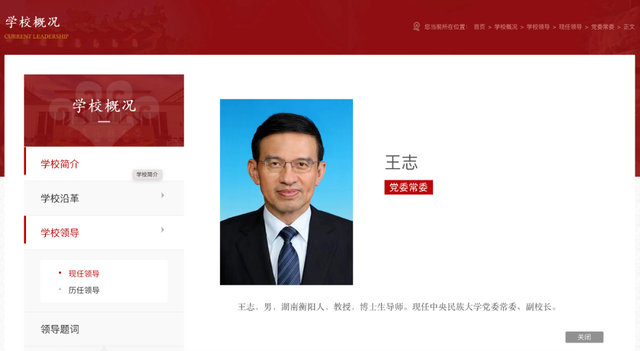

# 原央视主持人王志，时隔11年再履新

中央民族大学网站“学校领导”最新信息显示，王志已任中央民族大学党委常委、副校长。

这意味着，王志这位原央视主持人，时隔11年后，由中国传媒大学校长助理“跨校”转任新职。

公开资料显示，王志今年58岁，湖南衡阳人，1986年毕业于湖南师范大学中文系，1989年进修该校文艺美学专业研究生，毕业后分配到湖南电视台。1994年2月，王志进入中央电视台（简称央视），任记者、主持人、制片人等职。

2008年10月，受中组部、团中央“博士服务团”委派，王志赴云南挂职锻炼，出任丽江市副市长兼云南省政府新闻办副主任、省委宣传部外宣办副主任。

2010年9月，结束云南挂职后，王志调任中国红十字基金会，任理事会理事，后出任中国红十字基金会常务副理事长。

2012年7月，王志回到其博士母校中国传媒大学，担任校长助理，直至此次履新中央民族大学。

_王志出任中央民族大学副校长。图源：中央民族大学官网截图_

央视工作近15年

央视是王志职业生涯的重要一站，他在央视工作近15年，并为广大观众所熟知。

1994年2月，王志进入中央电视台，并在《东方之子》节目中任记者和主持人；1996年2月，进入中央电视台新闻评论部，在《新闻调查》栏目中任记者和主持人；2003年1月，在《面对面》栏目中任制片人、主持人和记者。

王志主持风格犀利，理性、挑剔但不轻狂的质疑，使他获得“非常主持”的赞誉。

在《东方之子》工作期间，王志分别于1994年、1995年、2002年获得中国电视新闻一等奖。

2003年1月11日，王志担任制片人、主持人和记者的《面对面》栏目开播，按一般规律，一档新栏目得到观众的认可至少需要半年时间，但当时正值“非典”时期，王志一对一访谈了呼吸病学学家钟南山、北京大学人民医院院长吕厚山等人；并深入一线采访了奋战在抗击“非典”最前线的医务工作者，社会反响强烈。

作为《面对面》栏目的制片人、主持人和记者，王志也因此而“为大家广泛接受”。2004年，王志获得“中国青年五四奖章”。

4年之后的2008年10月，受中组部、团中央“博士服务团”委派，王志赴云南挂职锻炼，出任丽江市副市长兼云南省政府新闻办副主任、省委宣传部外宣办副主任。

王志由此完成了从主持人到地级市副市长的身份转变，开启了他的从政生涯。在当时，王志的选择也引发广泛关注。

曾挂职副市长，负责招商引资

在云南挂职期间，王志大部分时间在丽江工作。据媒体报道，在丽江市政府，很多人称呼王志为“王副”。从央视主持人成为“王副”之后，他始终保持低调，并贯穿于他的挂职生涯。

王志作为丽江市副市长的分工是主抓“招商引资”。

据报道，2008年10月22日，王志抵达丽江挂职锻炼，同年11月5日，丽江市下发了市政府领导分工的通知，王志“负责招商引资、审计、政策研究和法制工作；协助分管文化、广播、电视工作。分管市招商引资办公室、市审计局、市政府研究室、市政府法制办公室”。

据介绍，作为主管招商引资的副市长，王志经常会参加一些重要的招商会和洽谈会。一些重要的投资商，王志也会亲自接待。

2010年9月，王志挂职锻炼期满。媒体报道，在任丽江市副市长期间，王志为丽江招商引资带来积极影响，直接反映在了丽江的招商数据上。

数据显示，2009年，丽江共有149个招商引资项目，省外合作项目80个，到位资金98亿多元，比2008年增长94%，超额完成云南省下达的56亿元的任务。重点项目包括丽江市和中国国电龙源集团签署风力发电合作开发协议，总投资40亿元；永胜县松坪乡拿到了金额高达7000万元的整乡推进项目等。

国家扶贫重点县永胜县的松坪乡是王志的挂钩扶贫点，距丽江市约100公里。据报道，王志曾三次到松坪乡考察工作，在他的努力下，松坪乡拿到了金额高达7000万元的整乡推进项目。

值得一提的是，王志在丽江屈指可数的一次高调亮相，出现在2009年送丽江雪桃进京贺60年大庆时。时任玉龙县副县长木志英曾对媒体说，最初他们请的媒体很少，很多主流媒体都没请，“王副”特意叮嘱她，要多请一些媒体来。

据报道，在昆明机场，王志破天荒地“作了一把秀”，推销丽江雪桃，以至于有媒体认为雪桃上国宴是他一手策划。

时隔11年再履新

2010年9月，在结束云南挂职后，王志调任中国红十字基金会，任理事会理事，后出任中国红十字基金会常务副理事长。

谈到自己的职务变动，王志说，“我去丽江挂职锻炼，规定的时间是一年，实际上我干了575天。后来碰上红基会换届，他们觉得我挺合适。我去红基会工作，是正式的调动。”

2012年7月，王志回到其博士母校中国传媒大学，担任校长助理，分管文化创意园区等工作。

从丽江市副市长，到红基会副理事长，再到中国传媒大学担任校长助理，王志的职务变动被媒体总结为“四年三跳”。

此后，王志一直低调行事，很少出现在媒体面前。“我并不觉得我有什么值得大家关注的，我现在就是回到母校任职了，是一个普通的老师而已。而且我们学校还有那么多很优秀的老师，不希望媒体过多关注报道我。你们也可以多宣传学校，宣传我们的文化创意园。”王志接受媒体采访时表示。

值得一提的是，2014年，时隔六年后，王志曾回归荧屏。5月，他加盟陕西卫视，担任了陕西卫视大型人文历史活动《丝绸之路万里行》节目的总主持人。

对于这个决定，王志公开表示：“如果我按照以前的状态继续下去，我会离媒体越来越远。我做采访记者做了20年，衡量各方面因素，我觉得应该接受这个挑战。”

在这档节目中，王志随节目组车队，沿丝绸之路一路自驾，横跨欧亚大陆，途经8个国家的38座城市，写下了九十余篇文章，对这次行程进行了完整的记录。此后，他又写成了一部30万字的作品——《西行三万里——王志看丝路》。

不过，王志并未借此“复出”，重新回归荧屏。在母校中国传媒大学任职11年之后，王志走上新的工作岗位。

中央民族大学官网显示，该校是国家民委、教育部、北京市共建高校。1999年、2004年学校先后进入国家“211工程”和“985工程”；2017年进入“双一流”建设A类高校行列；2022年顺利进入第二轮“双一流”建设高校，民族学再次入选“双一流”建设学科。

官网显示，中央民族大学目前有7位副校长，王志是其中一位。

作者：孙晓波

