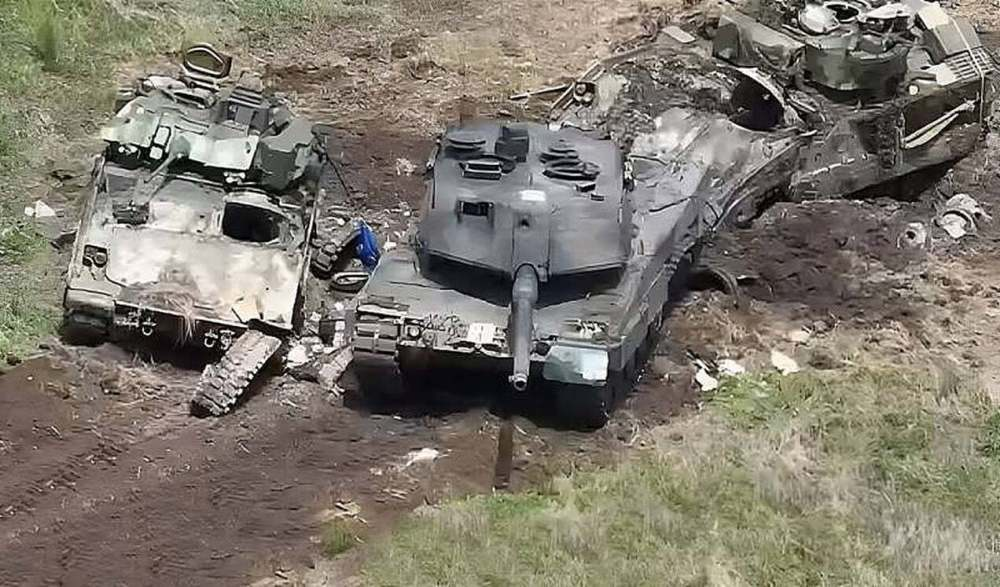

# 外媒：乌军“豹-2A6”与俄军T-80BV坦克交火视频流出，“画面首次出现”

【环球网报道 见习记者
黄泽佳】比利时“陆军识别”网站当地时间9月10日报道称，一个名为“OSINTtechnical”的社交媒体X账号当天在网上发布一段无人机航拍画面，这是德国向乌克兰提供的“豹-2A6”主战坦克与俄军T-80BV主战坦克之间首场被记录下来的战斗场景。不过有关俄军武器在战斗中的损失的一些说法也引发争议。

 _视频截图 图源：比利时“陆军识别”网站_

“陆军识别”网站称，这段视频拍摄于乌军在扎波罗热地区的反攻行动初期，地点位于穿过新沃达尼利夫卡（Novodanylivka）、小托克马奇卡(Mala
Tokmachka)和罗博季涅（Robotyne）的T0803高速公路。“陆军识别”网站称，一辆乌军“豹-2A6”主战坦克在与两辆俄军T-80BV坦克发生遭遇战后开火，一辆T-80BV坦克被击伤，俄军坦克随后撤离战场。报道称，“豹-2A6”坦克在2.8公里外开火并命中俄军坦克，展现了这种坦克的火炮射程和准确度。

_“豹-2A6”主战坦克 资料图 图源：外媒_

“陆军识别”网站还称，德国“豹-2A6”与俄罗斯T-80BV主战坦克孰优孰劣一直是军事爱好者和专家们感兴趣的话题，这两种主战坦克之间的对抗凸显了不断变化的乌克兰战场态势，也体现了“先进军事装备在决定战场结果时起到的关键作用”。报道称，“豹-2A6”坦克是德国工程技术的体现，拥有强大的120毫米滑膛炮、先进的装甲防护设计与电子系统；而俄军的T-80BV主战坦克由燃气轮机驱动，体现了俄罗斯坦克的设计理念，其配备了125毫米滑膛炮与反应装甲，专为高速机动作战设计，在坦克决斗中是一个“具有挑战性”的对手。

 _俄军T-80BV主战坦克 资料图 图源：外媒_

值得注意的是，“陆军识别”网站的报道先是声称乌军“豹-2A6”坦克击毁两辆俄军T-80BV坦克，随后又表示只有一辆俄军坦克被击伤，前后说法并不完全一致。

台湾“中时新闻网”在转载这一报道时也提到，俄军坦克被“豹-2A6”坦克击中后仍能自行驶离，“陆军识别”网站有关乌军坦克“大胜”的说法并不准确。

_被击毁的“豹-2A6”主战坦克与“布雷德利”步兵战车 资料图 图源：外媒_

“今日俄罗斯”今年8月16日还曾提到，俄罗斯国防部声称，乌军自6月初发动反攻以来已经损失了约5000件重型军事装备，俄军还多次发布缴获乌军装甲车辆的视频，包括“豹-2”坦克在内的西方军事装备均有被俄军缴获的记录。

