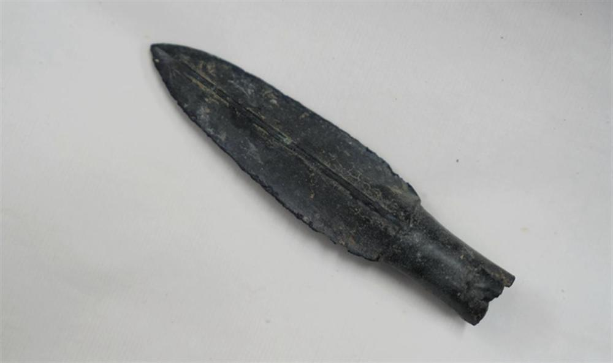

# 安徽一男子在自家田里挖出战国青铜楚剑和矛，主动上交给国家

近日，安徽省岳西县温泉镇解放村村民刘善应在自家田里挖出一把青铜剑和青铜矛。他第一时间向村镇汇报，在县文物保护中心的初步鉴定下为战国时期文物。刘善应毫不犹豫将两件文物捐赠给岳西县文物保护中心。

_出土的青铜楚剑（图源：岳西网）_

_出土的青铜矛_

_岳西县文物保护中心向刘善应颁发文物收藏证书_

据了解，此次出土的青铜剑和青铜矛，经省市专家鉴定所处年代应为战国时期，其中青铜剑应为楚剑，这两件器物的出土填补了岳西县春秋战国时期出土实物的空白，也有力印证了岳西县地处吴头楚尾的说法。

极目新闻综合岳西网、大皖新闻

（来源：极目新闻）

