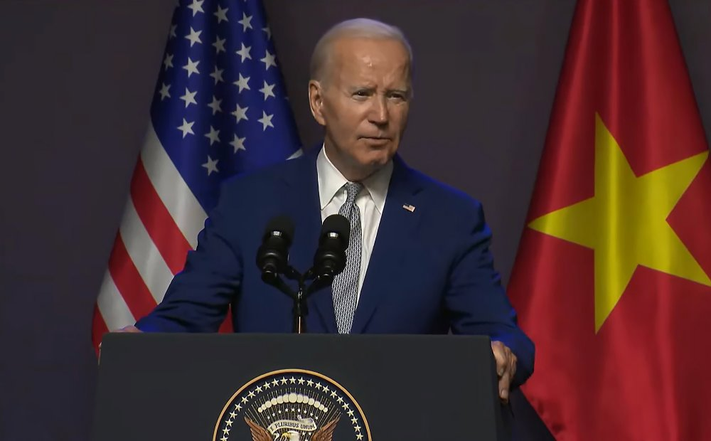

# 拜登访问越南，声称无意围堵中国

（观察者网讯）当地时间9月10日，美国总统拜登在结束二十国集团领导人峰会（G20）的行程后访问越南，并在首都河内召开新闻发布会。据美联社报道，拜登在当天的新闻发布会上声称，他访问越南“不是为了围堵中国”，而是要让美国在“印太地区”建立“稳定的基础”。

拜登在河内与越共中央总书记阮富仲等越南领导人举行了会晤。拜登在会谈中表示，越南是美国在“关键时刻”的重要合作伙伴，他希望在气候、经济等问题上取得更多进展。阮富仲则同意会晤为扩大双边关系提供了“绝佳的机会”，并感谢拜登邀请自己访问华盛顿。

在拜登访问期间，美越两国宣布将关系提升为全面战略伙伴关系，扩大在半导体供应链、劳动力发展、科研、矿产供应链等多个领域的合作。

 _美国总统拜登与越共中央总书记阮富仲出席欢迎仪式
图自美联社_

对于此次访问的目的，拜登在新闻发布会上说：“我不寻求遏制中国，我只是想确保我们与中国的关系是稳定向上的。我们有机会加强在世界各地的联盟，以维持稳定。这次访问是为了加强‘印太合作’，让越南与美国更亲密。这不是为了围堵中国，而是要建立稳定的基础。”

拜登声称，他“真诚地”寻求改善美国与中国的关系，美国“希望中国在经济上取得成功”，但前提是要遵守所谓的“国际规则”。

_9月10日，拜登在河内出席新闻发布会 图自澎湃影像_

尽管拜登一再坚称，访问越南不是在针对中国，但美国媒体直言，接触越南显然是拜登政府“围堵中国”战略的一环。美联社指出，华盛顿想要通过提升与越南的伙伴关系来“对抗中国影响力”，美国公司也试图寻找中国产品的“替代品”。

《纽约时报》称，尽管拜登在公开发言中否认有任何“敌对意图”，但他近期外交政策的“潜台词”都是“遏制中国”。在过去几个月里，拜登政府扩大了与澳大利亚、印度和菲律宾的合作，还试图与日本和韩国构筑“三方联盟”关系。

不过，《纽约时报》也分析称，中国依然是越南主要的合作伙伴，与拜登达成协议并不代表越南会“倒向美国”。越南奉行不加入军事联盟、不结盟对抗另一国、不允许外国在越南境内建立军事基地、不在国际关系中使用武力的政策，不太可能加入针对中国的联盟。

巩固对华关系依然是越南的核心外交政策之一。越共中央总书记阮富仲上个月视察越南谅山省越中边境友谊-
友谊关口岸时表示，世界上只有越中友谊—友谊关口岸以“友谊”二字命名，这体现了越中两国人民“同志加兄弟”的特殊传统友谊。越南始终高度重视并将发展同中国的关系视为头等优先。

对于美越提升外交关系，中国外交部发言人毛宁在9月4日的例行记者会上表示，中方认为，美国在处理与亚洲国家关系时，应当摒弃零和博弈的冷战思维，遵守国际关系基本准则，不针对第三方，不得有损地区和平稳定与发展繁荣。

**本文系观察者网独家稿件，未经授权，不得转载。**

