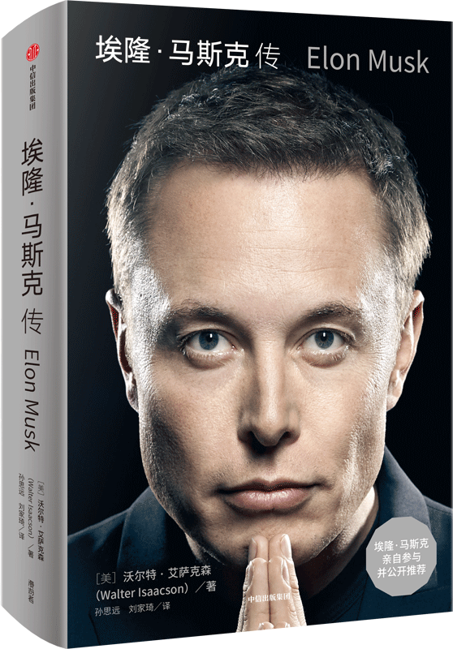

# 特斯拉如何做到极限量产？马斯克亲自挂帅住进工厂，“疯起来不要命”

一个没有走出童年噩梦的人，一位风险成瘾者，一头“喷火巨龙”。

作者：张小珺

出品：腾讯新闻《潜望》栏目

对一个世界首富来说，还有什么困扰着他，是他始终无法驱散的？

沃尔特·艾萨克森在其撰写的新传记《埃隆·马斯克传》中揭示了这一话题。马斯克对艾萨克森谈及2021年在精神和肉体上仍未痊愈的伤痕，他说道：

“从2007年开始，可能直到去年，痛苦就没有停止过。就像头顶上悬着一把剑，一定得让特斯拉好起来，变个戏法吧，再变个戏法吧，变出一连串小兔子在空中飞舞。如果下一只兔子没变出来，你就死定了。你不可能一直为了生存背水一战，一直都处在激发肾上腺素的状态，还能毫发无损。

今年我还发现了一些新情况，那就是为生存而战能让你坚持相当长一段时间。但是当你不再处于这种非生即死的状态，还想每天像打了鸡血一样战斗没那么容易了。”

据艾萨克森观察，马斯克是一位“风险成瘾”者。每当处于成功时刻，他似乎会感到不安，然后立刻制造出全新的戏剧性事件——发起一场狂飙运动，立即投入行动，再宣布一个最后期限，通常这个期限不仅不切实际，而且毫无必要。

缺陷塑造了他的人格，心魔成了他的燃料。他像极了一头“喷火巨龙”，在公司内咆哮着。也由此，马斯克形成了一套独特又极端的管理方法。

**值得一提的是，马斯克的管理比绝大多数科技公司创始人面临的要更复杂，他的管理幅度不止涉及6家公司，而且链条纵深**
——从产品设计和软件工程，深入到了制造、供应链和多家巨型工厂。

先来看他所创立或掌管的6家公司：特斯拉（市值7887亿美元）、SpaceX（估值近1500亿美元）、Boring
Company（估值56亿美元）、Neuralink（估值50亿美元）、Twitter（440亿美元收购）、X.AI，横跨从造新能源车、造火箭、挖隧道、建脑机接口，到一个社交游乐场，再到一家AI公司。

再来看这些公司的管理纵深度。在书中，甲骨文创始人拉里·埃里森评价道，马斯克和乔布斯一样，两人都有强迫症——他们执着于解决一个问题，不达目的不罢休。但不同之处在于，马斯克的这种习惯不仅体现在产品设计方面，还体现在他对基础科学、工程和制造的问题研究当中。乔布斯喜欢每天走进苹果公司的设计工作室看看，但他从未去过苹果在中国的工厂。
**相比之下，马斯克泡在装配线上的时间比他在设计工作室里的时间还多。** “与设计一家工厂所需要的脑力劳动相比，设计车的脑力劳动不值一提。”他说。

马斯克是如何成为马斯克的？他所展示出的那种粗暴、冷漠又刻薄的管理风格如何形成？他又是怎么分身乏术同时在6家公司担任掌门人？《埃隆·马斯克传》中给出了一些答案。

世界首富的心魔

对于马斯克来说，一切的伤痛与父亲曾经给他造成的情感创伤相比，都微不足道。

据《埃隆·马斯克传》，他的父亲埃罗尔·马斯克是“一名工程师、一个无赖、一个富有魅力的幻想家，他的这些特质至今仍然困扰着马斯克”。

**马斯克的童年在南非度过，“他经受过切肤之痛，也学会了如何在痛苦中生存”。**
12岁那年，他乘坐大巴来到一个名叫“野外学校”的生存营地。每个孩子只能分到一点点食物和水，这里允许他们为了争夺生存物资大打出手，甚至鼓励他们这么做。马斯克身材矮小，木讷呆滞，被人打了两次，最后他瘦了10磅。

最痛苦的经历在学校。他是班里年纪最小、个头最矮的学生，也很难搞清楚人情世故那一套。小混混经常盯上他，朝他的脸挥舞拳头。一天清晨，校园集会，一个男生和一帮朋友玩闹，撞上了马斯克。马斯克一把推了回去，双方发生口角。这个男生和他的朋友们在休息时间找到马斯克，发现他在吃三明治。他们从身后靠近，踢了他的脑袋，还把他推下水泥台阶。挨揍以后，他就像一个肿胀的肉球，去了医院，一周都没法上学。

校园欺凌发生后，他的父亲站在施暴者一边。当马斯克从医院回家，父亲狠狠斥责了他一顿，马斯克对艾萨克森回忆说：“我站了一个小时，他冲我大喊大叫，说我是个白痴，说我一无是处。”而这样类似的场景，在他和兄弟姐妹们的童年中，见得太多了。

作者是这么描述的： **尽管马斯克无数次尝试在生理和心理上摆脱父亲的阴影，但父亲对他的精神影响仍将继续存在。**
他的情绪会在晴空万里和暗无天日之间、在激情四射和麻木愚钝之间、在冷漠疏远和真情流露之间循环往复，偶尔还会陷入那种双重人格的“恶魔模式”，这让他的身边人感到害怕。

埃罗尔自己也承认， **他以街头黑帮式的管理风格对他的孩子们实行了“极其严厉的独裁统治”，“埃隆后来也把同样严苛的独裁风格搬到了自己同他人的关系中”。**

埃罗尔是一个制造痛苦的黑暗人物，接连对马斯克的母亲实施家暴，二人最终离婚。许多年后，当马斯克得知父亲与其第二任妻子的女儿有了一个孩子，他感到毛骨悚然、怒不可遏，但又难以启齿。后来马斯克再也没和父亲说过话。

一个风险成瘾者

马斯克的童年浸透着人性。艾萨克森分析道，动荡环境和剧烈冲突对他有着莫大的吸引力，有时他甚至渴望这些东西。在面临重大的危机、最后期限和事业转折时，他披荆斩棘、激流勇进。

**“戏剧性是他人生的最佳伴侣。”** 马斯克的弟弟金博尔说。

极端的原生家庭塑造了他极端的行事风格。他喜欢扩大风险，破釜沉舟，让大家无路可退。可以说他是一个“风险成瘾”者。

当他与朋友玩赌注很高的德州扑克，尽管马斯克不是行家，他还是上了牌桌。“在场有很多聪明人和高手，他们擅长计牌、计算赔率。”一位在场人士说，
**“埃隆做的就是在每一手牌上全押，输个精光，再买更多的筹码，加倍下注。最后，他输了许多手牌以后，又一次全押，赢了，然后他说：‘好，就这样吧，我不玩了’。”**
这样的举动代表了他生活的一个主题：不会轻易把筹码拿下牌桌，让它们继续跟着他冒险。

“我一直都是这种状态，要么把筹码再推回牌桌上，要么去打游戏的下一关，总之我不会安于现状。”马斯克说。

**马斯克是一个集权的领导者，尤其不擅长与CEO分享权力——** 这是他同时在6家公司亲力亲为的原因——而不是担当投资人或者董事会成员。

在创办特斯拉早期，马斯克是特斯拉的出资人，但他先后与三位早期CEO闹掰了。其中，第二位出任特斯拉的CEO迈克尔·马克思日渐发现，根本无法忍受马斯克的行为。“他可能就是个暴君。”迈尔克说，作为一个天性和善的人，无论对方是保安还是高管，迈克尔都会彬彬有礼，因此广受赞誉。“埃隆确实脾气不太好，他不会在意善待他人这件事。”他甚至没有读过他当时的妻子贾丝廷的大部分小说，迈克尔感到震惊。“他这种性格挺极端的，说实话，他根本就没有与任何人建立起真正的情感联系。”

最终，马斯克意识到没办法与他人分享权力，赶走了亲自任命的CEO，于2008年自己出任。

**他的管理风格可以说是粗暴无礼。** 马斯克会在会议上说：“这是我听过的最愚蠢的方案。”他还会经常用炒掉员工来发泄自己的愤怒。

作者观察道， **在马斯克带领的队伍中，虽然团队精神存在，但他待人的态度依然可能是冷漠的、粗暴的。**
在内华达州超级工厂，一个周六的晚上10点，因为机械臂对不准的问题耽误了安装进度，马斯克勃然大怒，叫来了年轻的制造工程师。马斯克大声嚷嚷道：“嘿，这机器瞄得不准，是你干的吗？”这位工程师怯怯嘟囔了几句。马斯克不停质问：“这是不是你做的？！”他失去耐心：“你就是个白痴！滚出去，别再让我看见你！”

几分钟后，项目经理把这位倒霉的年轻工程师拉到一边，告诉他：马斯克下令解雇他。他很快就会收到解聘书。而在工程师走后的一周，这名经理也被解雇了；又过了一周，经理的上司也遭遇解雇。

“埃隆不高兴的时候，就会大发雷霆，经常对新人和基层员工发火。”一位员工称。另一位员工说，他只是找不到一种有效的方法应对他的挫败感。

**马斯克最喜欢的一个词或概念是“硬核”。**
在创办第一家公司Zip2时，他就用“硬核”来描述他想要营造的职场文化。近30年后，他在重塑Twitter温和、人性化的文化时也会提到这个词。他在一些给员工写的电子邮件中，邮件标题是“超级硬核”。他写道：“请大家做好准备，迎接超高的工作强度，这种强度，你们大多数人此前从未承受过。心里素质不够强大的人是没法颠覆一个行业的。”

**他有狂热的紧迫感，坚持设定不切实际的最后期限，逼迫所有人完成。**
而作为员工，你永远不能对他说不——如果你这么做了，他会当场开掉你，然后换一个说Yes的人。

而且，他对一些人的离去并不会感到伤感，他喜欢有新鲜血液加入。他担心的是“富裕了就不再事必躬亲”的现象。他总觉得有些人在公司工作很长时间，挣够了钱，买了几处度假小屋，就再也不怀念在工厂里打地铺的日子——你很难想象，这位世界首富甚至至今没有私人助理或协调人员，他想完全掌控自己的日常安排。

“埃隆也非常关心人类，但他关心的人类更多时候是宏大意义上的族群。”一位员工说，
**“作为他的下属，你肯定会意识到你只是一个用来实现这个宏伟目标的工具人，这没什么问题。但有时候，工具人出现了磨损，他会觉得他可以直接换掉这个工具人。”**
这让一些员工从他的硬核路线中逃离。

作者称，马斯克在某些方面和贝佐斯（亚马逊创始人）相像，都是靠着激情、创新和强大的意志力颠覆一个行业，他们都对员工很粗鲁，时常把“愚蠢”二字挂在嘴边，谁敢质疑、反对他们，谁就会迅速引来怒火。他们的目光聚焦在未来蓝图，而不是短期利润。

但两人对工程问题的钻研方式大相径庭。贝索斯的座右铭是“步步为营，如狼似虎”。马斯克的天性则是要狂飙突进，用一个不可能完成的最后期限把大家逼到极限，即便他要因此承担风险。

这些都让马斯克在对于工厂的极限量产理论和公司治理方法论方面具有独特的发言权。 **以下两个章节试图将其方法理论化：马斯克是如何管理工厂和管理公司的。**

量产！量产！特斯拉如何极限量产？

\- 把工厂的控制权攥在自己手里

马斯克喜欢“垂直整合”战略。在他的原则里，
**让一家公司成功的不是产品本身，而是高效地制造产品的能力。这个问题就是，你怎么制造那些制造机器的机器——换句话说，你是怎么设计工厂的。**
这与设计车辆本身一样重要。

他设计工厂的方法论于2010年5月形成，当时丰田正要出售一家工厂，位于加州弗里蒙特，在硅谷的边缘地带。马斯克以4200万美元买下来。

在工厂设计上，马斯克将工程师的隔断式工位放在装配线的角落，每当他们做出来的设计元素拖延了生产进度，就会看到闪烁的灯光，听到工人的抱怨声。马斯克还会经常召集工程师同他在生产线上走来走去。

**他把自己的开放式办公桌放在装配线中间，四周没有墙壁，桌子下面有一个枕头，过夜时可以用上。**

2013年他又提出一个大胆的想法：在美国建造巨大的电池工厂，产量比世界上其它电池工厂的总和还要大。对马斯克来说，这涉及第一性原理。Model
S使用的电池约占全球电池总量10%，而特斯拉彼时筹备的新车型Model X和Model
3，会导致特斯拉的电池需求增长到此前的10倍。最终，他与电池供应商松下公司合作建立了超级工厂。

\- 亲自挂帅，住进工厂，24小时集体冲锋

在书中，艾萨克森观察说：“每当马斯克陷入阴沉沉的心理状态，他就会让自己疯狂地工作。”在2017年7月Model
3启动量产之后，他就是这种状态。此时，他刚经历了一段情感破裂；雪上加霜的是，他得知父亲和第二任妻子的女儿怀了一个孩子。于是，他将自己投入Model
3量产的黑暗地狱中。

当时他的核心关切是：提高产能，让特斯拉每周生产出5000辆Model
3。要知道，特斯拉已经命悬一线——如果能做到，特斯拉就能活下去；如果不能公司就会耗尽资金。

**马斯克搬进了工厂车间。这是他的一种战术：亲自挂帅，每天24小时保持集体冲锋的状态，努力去实现这个目标——在公司，他要求大家达到那种“不要命”的工作强度。**

他从内华达州生产电池的超级工厂开始，很快， **他成了这里狂热的“大元帅”。**

马斯克要求每周生产5000个电池包，生产线设计师告诉他：这太疯狂了，他们最多能生产1800个，扩产还需1年。马斯克立马把他调走了，找来了一位新负责人，因为这名负责人身上有马斯克喜欢的“大刀阔斧向前冲”的劲头。

“那真是疯起来不要命，我们当时每天只睡四五个小时，还经常打地铺。我记得我当时就在想： **‘我正在保持理智的边缘疯狂试探’。**
”马斯克回忆说。天气缓和一点的时候，马斯克睡在工厂屋顶上的帐篷里。

\- 从自动化信徒摇身一变，去自动化

马斯克在工厂做的另一件大事是，从自动化变成去自动化。

自20世纪初有流水线以来，大多数工厂设计分两步：第一步，搭建生产线，工人要在每个工位上完成特定的任务；第二步，生产线跑通以后，机器人和其他设备陆续进场，渐进式地替代一部分工人的工作。然而，最开始，马斯克把这两步颠倒了过来——第一步就尽可能自动化地完成每一项任务。后来，他发现——这并不好使。

马斯克在内华达工厂发现，机械臂在抓取材料和对准过程中出现问题，导致进度耽搁；而这个问题手动完成可靠性更强。

于是，他从一个自动化的信徒摇身一变，以同样高涨的热情开始追求新目标：找出生产线上每一个存在自动化障碍的环节，看看去掉自动化后是不是能完成得更快。

**从此去自动化成为马斯克“量产方法论”的一部分：务必要等到设计过程的其他部分都做完，在质疑了所有要求、去掉所有不必要的部分以后，再引入自动化设备。**

\- 屏幕和红绿灯管理

在内华达工厂的生产瓶颈于2018年春缓解后，马斯克立马进驻了弗里蒙特整车装配厂。他要将该工厂每周生产2000辆Model 3的产能扩展到5000辆。
**他发起了一场名为“产量激增”的行动，试图像消防演习一样找到并消灭量产缓解的所有问题。**

在工厂的中央区域是一间名叫“木星”的主会议室。马斯克把它作为办公室和议事厅，有时也是他睡觉的地方。屋里有一排屏幕，界面像股票行情图一样闪烁着、更新着，实时显示整个工厂和每个工位上的总产量。

**在马斯克看来，设计一个好的工厂就像设计一款微型芯片，重要的是设计出合理的工位密度、工序安排和工作流程。因此，他最关注的是其中一块显示屏：上面可以看到个装配线上的工位情况，红绿灯表明该工位运行是否畅通无碍。而且每个工位上本身也有真实的红绿灯，马斯克可以在房间里走来走去，一次次去锁定故障点。他的团队称此过程为“来到红灯前”。**

“产量激增”行动开始后，马斯克像熊一样在厂房快速移动，走向他看到的每一个红灯。据他自己回忆，情况好的时候，他一天在厂房里能下100道命令。

经过两个月的努力，到2018年5月下旬，该工厂每周能生产3500辆Model 3。这个成绩让人眼前一亮，但还没达到5000辆目标。

\- 在帐篷里造车

为了进一步提高弗里蒙特厂产能，马斯克想到一个关于二战的故事：当时美国政府需要赶制轰炸机，就在加州航天航空公司的停车场里建了生产线。与高管讨论后，他们决定效仿美国政府当年的做法。

在弗里蒙特区划法中，有一条叫“临时车辆维修设施”的规定，作用是允许小型加油站搭建帐篷，方便车辆更换轮胎或消声器，但并没规定帐篷的最大尺寸。
**“去办一个许可证，然后咱们搭一个巨大的帐篷出来，以后我们再补交罚款。”马斯克下令说。**

当天下午，特斯拉的工人开始清理覆盖在工厂后面停车场上的碎砖瓦砾。他们没时间在开裂的混凝土上铺路，所以简单地铺了一个长条，开始在长条周围搭帐篷。只用了两周，他们就将帐篷搭建完毕，完成一处长1000英尺、宽150英尺的生产设施，足够容纳一条临时装配线。每个工位都安排工人上岗，没有采取机器人。

但有一个问题，他们没有传送带将未完工的车辆送到帐篷那头。他们手头只有一个用于移动零部件的老旧系统，传送能力不足以移动车身。马斯克说：
**“我们把它放在一个小斜坡上，靠重力就能有足够的推力，保持标准的传送带速度来移动车辆。”**

这是马斯克的 **“帐篷行动”** 。“如果常规思维无法完成一项任务，那么就有必要使用非常规的思维手段。”马斯克这样说。

他们在7月1日凌晨1点53分，完成了5000辆目标。马斯克向所有特斯拉员工发送了一条信息：“我们成功了！……我们创造了一种突破不可能的全新解决方案，在帐篷里全力以赴地拼搏。”

马斯克如何做管理？他的十三条军规

在经历了内华达工厂和弗里蒙特工厂地狱般的扩产能后，马斯克总结了“五步工作法”，并且会像念咒语一样在内部念叨这套方法论。“每次一谈到五步工作法，我就像老和尚念经一样。”马斯克说，“但我觉得把大家耳朵磨出茧子是有好处的。”

他的“五步工作法”如下：

**1、质疑每项要求。**
提出任何一项要求时，都应该附上提出这一要求的人。永远不要接受一项来自某个部门的要求，比如来自“法务部门”或“安全部门”的要求。你必须知道提出这项要求的人的名字。接下来你应该质疑它，不管这个人有多聪明。
**聪明人提出的要求才是最危险的**
，因为人们不太可能质疑他们。这件事要一直做下去，即便这项要求来自我马斯克本人。质疑后，大家就会改进要求，让它变得不那么愚蠢。

**2、删除要求当中所有你能删除的部分和流程，虽然你可能还得把它们加回来。**
事实上，你如果最后加回来的部分还不到删除部分的10%，那就说明你删减得还不够。

**3、简化和优化。** 这应该放在第2步之后，因为人们常犯的错误就是简化和优化一个原本不应该存在的部分或者流程。

**4、加快周转时间。**
每个流程都可以加快，但只有遵循了前三个步骤之后才能这么做。在特斯拉工厂，我错误地把很多精力花在加快生产流程上，后来我才意识到这些流程原本就应该被拿掉。

**5、自动化。**
在内华达工厂和弗里蒙特工厂犯下的一个大错就是我一开始试图将每个步骤进行自动化改造。我们本应该先质疑所有要求，删除不必要的部分和流程，把问题筛出来、处理掉，然后再推进自动化。

五步之外，还衍生出一些推论，包括：

**6、所有技术经理都必须有实战经验。**
比如，软件团队的管理人员必须至少花20%的时间进行编程，太阳能屋顶业务的经历必须花时间在屋顶亲自做安装工作。否则光说不练，他们就像是不会骑马的骑兵队队长、不会舞刀弄枪的将军。

**7、“你好，我好，大家好”是很危险的。** 人们会因此不再质疑同事的工作成果，人们天然有一种倾向是不想把要好的同事踢下船，而这种危险倾向一定要避免。

**8、犯错没关系，但错了还不肯低头就不行。**

**9、永远不要要求你的团队做你自己都不愿意做的事。**

**10、每当有问题需要解决时，不要只与你直接管理的相关负责人聊。** 深入调研就是跨层级沟通，去跟你属下的属下直接交流吧。

**11、招聘要招态度端正的人。** 技能是可以教的，但要扭转一个人的工作态度可就太费劲了，得给他“换个脑子”。

**12、疯狂的紧迫感是我们公司运作的法则。**

**13、唯一要遵守的规则就是物理学定律能推导出来的规则，其他一切都只是建议。**

以上可以视作是马斯克的十三条军规。

马斯克的管理与其性格一脉相承，充满了夸张、大开大合和戏剧色彩。

如果你问马斯克，CEO需要具备哪些特质，其中一定不包括“是个好人”这一条。

**马斯克的一大原则就是管理者追求的目标不应该包括“被人喜欢”。**
这是他为什么在收购了Twitter后干掉了这家公司的管理层，自己接管；然后又干掉了大部分员工。

对于马斯克各种复杂多面的性格，作者在结尾说：一个懂得节制谨慎的马斯克真的还会像一个自由不羁的马斯克一样成就斐然吗？心直口快、无所顾忌是他人各种不可或缺的特质吗？他脚踏实地又狂放不羁，如果我们不接受他人格中的复杂多面，那么火箭还能被送入太空吗？我们还能迎来电动车革命这场划时代的转型吗？

有时候，伟大的创新者就是与风险共舞的孩子，他们拒绝被规训。他们可能草率鲁莽，处事尴尬，有时甚至引发危机，但或许他们也很疯狂——疯狂到认为自己真的可以改变世界。

也许，倘若我们不理解马斯克的心魔，就难以真正理解马斯克与他的疯狂。

注：本文片段摘自《埃隆·马斯克传》，这本书将于2023年9月12日全球同步出版，唯一简体中文版由中信出版集团出版。本书由《乔布斯传》执笔人、美国当代知名传记作家Walter
Isaacson（沃尔特·艾萨克森）撰写。

