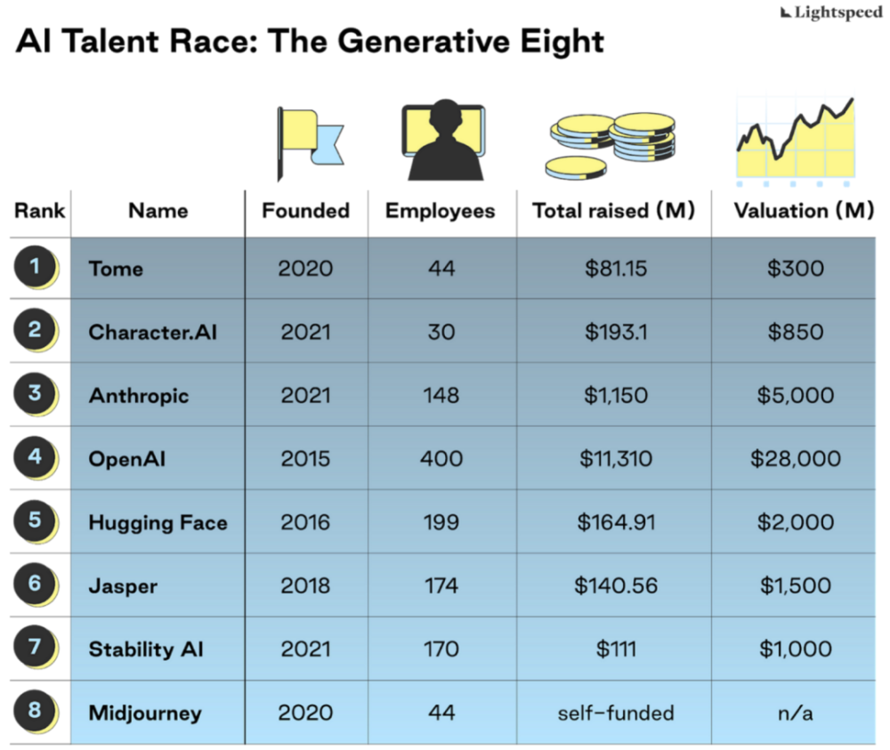
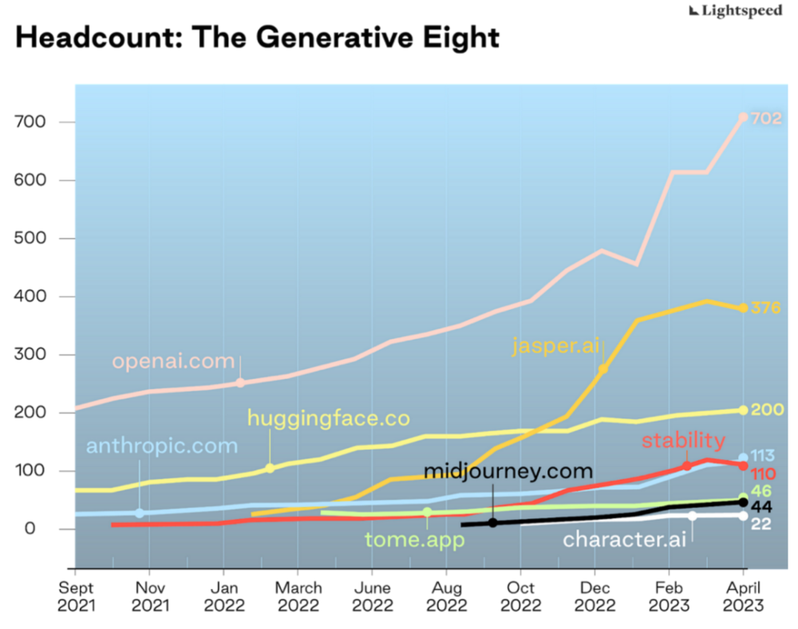
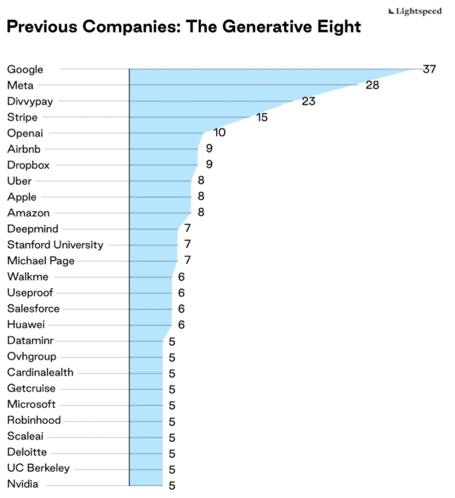
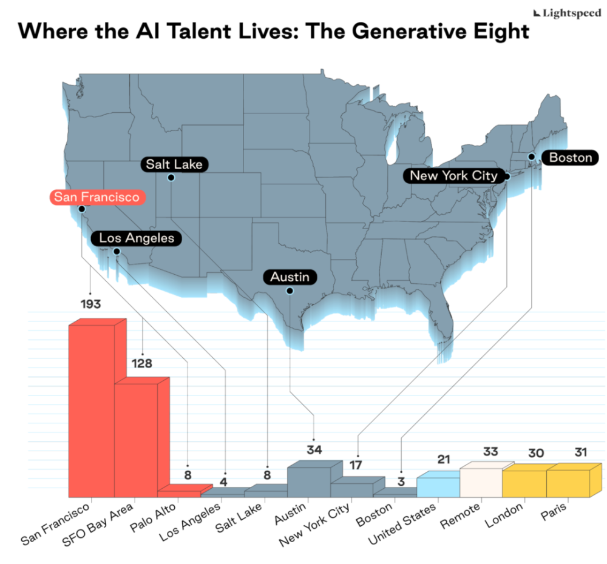
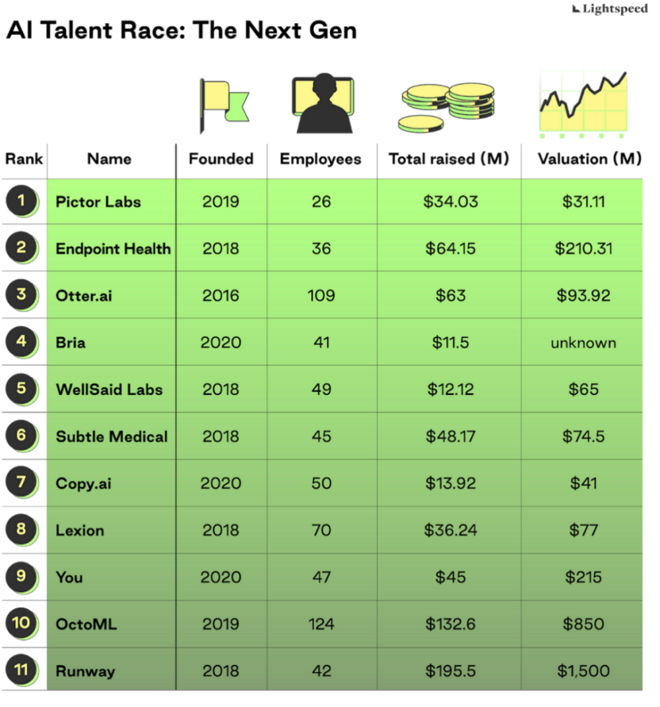
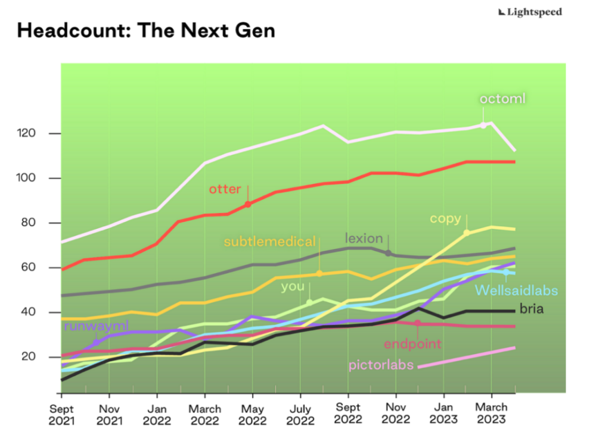

# 生成式AI八巨头来了：硅谷押注，未来科技巨头将洗牌？

**划重点**

  * _1_ 随着这场AI竞赛的爆发，硅谷面临着原本作为科技中心外迁转移的危机。旧金山的海耶斯社区已被重新命名为“脑谷”，而西雅图、纽约、波士顿等也有望后来居上。
  * _2_ 统计发现，生成式AI头部公司的科技人才，很大程度上都来自于全球知名高校，其中美国斯坦福大学、加州伯克利大学和麻省理工包揽了前三名。
  * _3_ 当前AI浪潮的一个显著特点，是对许多领域的创新在同时加速，类似GPT大语言模型正在迅速并行提高自然语言在C端和B端产品中的解析能力。

_本期由RockFlowUniverse和腾讯科技联合发布，解读生成式AI赛道的19家潜力新星。_

编辑：西昻翔、Helen

目前，生成式人工智能已经席卷全球，AI技术的崛起也正挑战着传统科技巨头的地位。最近，硅谷知名VC
Lightspeed发布了一份专注生成式AI领域的重磅报告，并筛选出了未来可能成为八大AI巨头公司和11家新锐公司。

在这项分析中，Lightspeed对生成式AI领域的3500多家公司数据进行了深入分析，根据公开可得的员工信息，如学历、先前公司、工作年限、科技专利、出版物等，对数亿个人和数百万家公司进行排名筛选，以确定拥有顶级技术人才的公司。

本期《AI未来指北》聚焦这篇报告中的八家AI潜力公司和11家新锐公司，它们分别是谁？规模和人才背景究竟是如何的？我们一起探究生成式AI赛道的未来。

**01.生成式AI八巨头，未来的“FAANGS”**

目前领先的生成式AI公司究竟是哪些？他们在哪里寻找人才？Lightspeed认为，下列生成式AI领域的公司，将被频频提及并最终改变我们的生活方式，有望成为未来的FAANGS：

这八个新巨头的所处领域和具体应用分别是：

Tome——帮助生成演示文稿和可视化叙事文稿的AI。

Character.AI——创建各种AI生成的角色并可以与人类聊天。

Anthropic——AI安全和研究公司，帮助搭建工作环境下的聊天机器人。

OpenAI——发布了ChatGPT，展示了大语言模型的强大功能，以及用于图像生成的DALL-E。

Hugging Face——构建模型来执行企业中的特定任务。

Jasper——搭建AI模型，为营销和品牌工作生成有创意的内容。

StabilityAI——Stable Diffusion的创建者，首批向公众发布的图像生成模型之一。

Midjourney——一个自筹资金的研究实验室，发布了一款功能强大的图像生成工具，完全基于Discord运行。

目前，这些公司正在赢得科技人才的竞争，而且这种竞争只会愈演愈烈。八家AI巨头的技术人才大多来自其他科技公司，包括一些已从OpenAI离职的员工。其中最引人注目的是AI人才大本营——谷歌。

众所周知，谷歌多年来在AI研究上投入大量资金，但几乎没有面向消费者的重磅产品或服务，直到去年底面临OpenAI的巨大压力才终于有了可观进展。而在谷歌之后，曾重注押在元宇宙的Meta、支付巨头Stripe，甚至Airbnb和Dropbox等公司也为生成式AI巨头输送了大批有生力量。到目前为止，他们的竞争情况如下：

_八大AI公司的人才数据统计_

_八大AI公司主要人才来源：此前工作背景来自谷歌、Meta等公司_

此外，统计发现，生成式AI八巨头的科技人才中，教育背景在很大程度上都来自于全球知名高校，其中斯坦福大学、加州伯克利大学和麻省理工包揽了前三名；与此同时，他们的来源也很国际化，加拿大滑铁卢大学AI研究所排名第四，比利时鲁汶大学AI研究所排名第八。

_八大AI公司人才的主要教育背景_

受此影响，旧金山的海耶斯社区，已被重新命名为“脑谷”，以反映其作为AI活动、聚会和黑客之家所在地的地位。与此同时，人才似乎正在涌回规模较大的城市和湾区（或者至少更多AI人才开始在AI公司寻找新工作）。

在这场AI竞赛中，硅谷面临着原本作为科技中心外迁转移的危机。根据调查数据显示，美国西雅图在AI人才名单中占据主导地位，因为该地是几家顶级公司和机构的所在地。2021年，布鲁金斯学会的一份报告列出了较为推崇AI的八个城市“早期采用者”——纽约、波士顿、西雅图、洛杉矶、华盛顿特区、圣地亚哥、德克萨斯州奥斯汀和北卡罗来纳州罗利（这些数据可能被低估，因为部分员工并未透露具体位置）。

_八大AI公司主要分布的地区_

**02.生成式AI的“新锐派”**

虽然生成式AI八巨头吸引了大量的公众关注，不过，Lightspeed在其研究中还发现了另一类AI公司，它们也吸引了顶级AI人才加入自己的阵营。这11家公司可以被认为生成式AI的“新锐派”，它们有一个共同特点：虽然AI是其产品核心，但都在解决特定领域问题或专注于客户的特定用例（用例指使用场景和用途）。

这些生成式AI新锐公司覆盖了从医疗保健到娱乐等诸多行业，它们有望将AI工具真正推向实际应用：

以下是这11家公司的简单情况：

Pictor Labs——专注于AI驱动的病理学研究，有望加速疾病临床实验和转化。

Endpoint Health——针对免疫相关疾病的AI辅助精准治疗。

Otter.ai——AI驱动的音频转录，搭建新的聊天机器人会议助手。

Bria——借助AI生成图像和视频内容，且正在推进相关的商业化研究。

WellSaid Labs——AI驱动的文本转语音配音工具。

Subtle Medical——AI驱动的放射学图像处理。

Copy.ai——借助聊天机器人生成高质量的营销文案。

Lexion——适用于销售、采购、人力资源、法律等的AI合同助理

You——带有聊天机器人界面的搜索引擎。

OctoML——搭建基于云的LLM模型调优和运行方案。

Runway——借助AI生成视频、图像和其他形式创意内容。

这些公司的估值从数千万美元至15亿美元不等。他们的员工数量虽不如上文提及的生成式AI八巨头，但也不容小觑，并且有一半以上的公司人数在去年有了爆发式的增长：

_11家AI新锐公司_

关于这些人才的出处，统计发现，华盛顿大学、微软和艾伦AI研究所（由已故微软联合创始人保罗·艾伦创立的一家研究机构）再次亮相。

_AI新锐公司工作/学业背景_

**03\. 生成式AI的未来**

在这个充满活力和竞争激烈的领域，AI公司们都在争夺顶级技术人才，推动行业更多的变革发生。未来，这些AI公司将在哪些方向持续发力？目前生成式AI呈现怎样的发展趋势？硅谷传奇投资人Elad
Gil表示，眼下生成式AI赛道有三个重点值得关注：

**其一，更好的AI技术正在持续泛化。**

当前AI浪潮的一个显著特点，是对许多领域的创新在同时加速。类似GPT的大语言模型正在迅速提高自然语言在C端和B端产品中的解析能力，与此同时，图像生成、语音到文本、文本到语音、音乐、视频和其他领域的进步正在发生。

这一次，技术进步相比此前更加明显，这意味着市场更容易创造出“好10倍的产品”来征服用户，显著更强的大语言模型有望支撑起一个全新创业生态的建立。当然，这一点只是和此前的AI浪潮相比有明显变化。

**第二，基础设施正在被广泛采用和快速增长。**

包括OpenAI、Stability.AI、Hugging Face、Weights and
Biases等一大批公司在内，虽然其中一部分的收入落后于使用量和普及度，但它们有望探索出更新的模式以实现商业化的快速增长。

OpenAI现在是LLM的领导者——而4年前，谷歌是处于默认位置的龙头。但它未能充分利用其在AI领域的诸多优势，这一点令人震惊。有这样一个类比，此前施乐公司发明了图形界面的操作系统，拥有所有人才、数据和渠道来为行业建立开创性的基础设施，但随后出现了苹果，真正推动行业向前发展。

**其三，应用方面有明确用例的公司，会取得先发优势。**

目前，已经出现许多被验证可行用例的创业公司——例如营销文案方向（Copy.AI、Jasper）、图像生成方向（Midjourney、Stable
Diffusion等）和代码生成方向（Github
Copilot、Replit）等，在之前的AI浪潮中并不存在。这一批新兴AI应用针对有高度重复、高薪的任务进行了可观改造。它们成了这波AI浪潮下最大的受益者，比如语音转录、机器人、视频等正在被完善，有望拓宽下一代AI用例。

Elad
Gil认为，如今许多人谈论AI时，往往将LLM/CNN/RNN/GAN等认定为过去AI功能的有限改进。事实上，就像汽车诞生后有人又发明了飞机，但被评论说“飞机只是另一种汽车——有翅膀罢了”，他们没有提及飞机的全新用例以及对旅行、物流、国防和其他领域的影响。因此也就没有看到，一个崭新的航空时代正在拉开序幕。

当下的市场共识是，ChatGPT的推出是此轮AI热潮真正的“发令枪”，喻示着AI有望在新功能方面带来重大意义正在被主流所承认，并引发了对生成式AI的大规模热情、炒作和采用。而目前距离其发布才9个月，鉴于大型企业的产品规划周期通常需要3-6个月，原型设计和构建更是需要长达一年时间，我们距离AI使用的峰值可能尚未到来，AI基础设施公司收入大幅增长和投资加速的步伐仍值得期待。

*腾讯科技《AI未来指北》系列策划，围绕AI技术发展、商业模式、应用场景、治理几大板块，关注AI未来发展趋势。

**Ref：**

https://medium.com/lightspeed-venture-partners/eight-ai-startups-winning-the-
race-for-tech-talent-571a18b03642

https://blog.eladgil.com/p/early-days-of-ai

