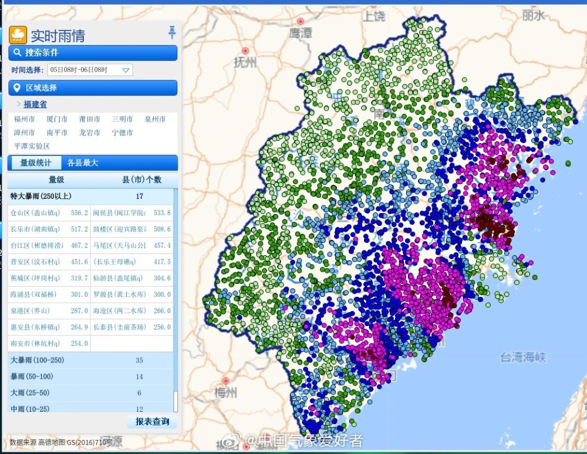

# 疑因与热岛效应有关！西安上海遭定点特大暴雨突袭，城市热岛是双刃剑

可以说，最近一段时间，我国天气关键词之一便是“雨”，台风海葵的登陆先是给东南沿海的福建带来了大范围特大暴雨，9月5日～9月6日福州乌山国家站24小时降雨量达到400毫米，巨幅打破历史纪录。仓山区盖山镇降雨更是一度超过600毫米，对于福州来说，这场台风暴雨可谓惊天动地，严重干扰了很多人的生活。

一、定点特大暴雨突袭西安上海

但9月7日下午起，我国珠三角开始遭猛烈暴雨袭击，其中香港、深圳、东莞、广州、佛山、中山、珠海和澳门降下大暴雨和特大暴雨，一条极端的特大暴雨带从香港出发，向北伸向深圳、东莞、广州南部、佛山中部和肇庆东南部，其所到之处的所有气象站几乎都打破了历史纪录。

此后，台风海葵的暴雨进一步向西推进，粤西、广西多地这两天同样暴雨如注，比如今天是海葵上岸的第七天，广西玉林、北海、钦州等地出现特大暴雨，其中博白县打破日降雨纪录、水鸣镇24小时降雨高达446.2毫米。

但实际上，除了华南的激烈特大暴雨，这两天定点打击的暴雨也让部分城市直呼“吃不消”。比如在9月11日下午，一小簇降雨云团在上海市区突然爆发出现，引发了一次相当“局部”的激烈暴雨。这次上海的特大暴雨范围特别特别小，已经缩小到了街道社区级别，但强度非常非常大，北蔡局部45分钟105毫米，浦东国家站60分钟猛下102.5毫米，接近前几天香港世纪暴雨的雨强，但没下的地方是真没下，降水量为0。

今天暴雨在全国四处出击，除海葵持续打击的华南、被定点雷雨袭击的上海外，覆盖我国西部大片地区的华西秋雨带上也有猛烈降雨；其中陕西暴雨中心又一次落在大城市里面，西安部分市区中午1小时降雨30～64毫米，直接造成了严重的内涝。这已经是9月以来，第六座被暴雨打击的大城市了。

二、城市热岛真不是好事？

最近，西安和上海两个城市都遭遇了罕见的定点特大暴雨，造成了严重的内涝和交通混乱。有人认为，这与城市热岛效应有关，因为城市热岛会增加水汽含量，导致降水强度增大。那么，城市热岛真的不是好事吗？我们来分析一下。

城市热岛效应是指城市地区的气温比周围农村地区高出几度到十几度的现象。这是由于城市建筑、道路、工业等人为活动消耗了大量能量，同时也产生了大量的废热，使得城市地区的热量平衡被打破。城市热岛效应有以下几个特点：

\- 城市热岛效应主要发生在夜间，白天的差异较小。

\- 城市热岛效应随着城市规模和人口密度的增加而增强。

\- 城市热岛效应受到季节、气候、风向等因素的影响，不同地区和不同时间的表现不一样。

城市热岛效应对城市环境和气候有着复杂的影响，既有利也有弊。我们来看看它的优缺点。

热岛效应虽然是城市化带来的结果，但也有优点：

\- 城市热岛效应可以缓解冬季的寒冷，降低供暖能耗和污染排放。

\- 城市热岛效应可以促进植物生长，增加城市绿化和生物多样性。

\- 城市热岛效应可以改善城市气流，增加空气对流和湿度，一定程度上有利于缓解雾霾和空气污染问题。

热岛效应的缺点有：

\- 城市热岛效应可以加剧夏季的高温，增加制冷能耗和不适感。

\- 城市热岛效应可以增加降水量和强度，引发内涝、洪水等灾害。

综上所述，城市热岛效应是一把双刃剑，既有好处也有坏处。虽然说现在是9月中旬，我国中东部地区的水汽和能量还没有到快速减少的阶段，激烈暴雨也是可能发生的。但原本可以均匀的释放的水汽和能量，最近选择集中力量在大城市里猛烈释放，放大了暴雨的破坏力和极端性，这或许就和城市热岛有关，值得进一步研究。

