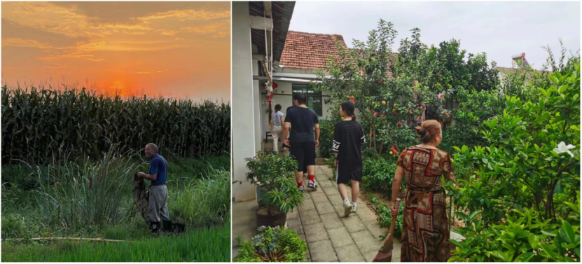

# 2035年，中国最后一代农民将退出土地，以后谁还在种田？

**核心要点：**

  * _1_ 从调研来看，村庄种地的人绝大多数是50岁以上的人，主力是60多岁的人。当地农民认为六十多岁的人还是年轻人，是村庄的壮劳力。
  * _2_ 70-80多岁的身体健康可以自理有行动能力的高龄老人，他们一般都会种植自家的户均10亩左右的土地。收入来源主要是种地和捕捞。
  * _3_ 农业确实存在后继无人的问题，众多的80后90后们不愿意回乡种地，即便种地，也是个别人回乡规模化经营。所以，70后成为最后一代农民在本地是不争的事实。
  * _4_ 最后一代农民退出土地的时候，差不多也到了2035年，是国家经济发展的新阶段。所以，最后一代农民具有维持农村，守护村庄的重要意义。

**任亮亮 武汉大学社会学院博士生**

在湖北省S县农村调研，发现当地的农业仍然比较发达，表现在四方面：

无土地抛荒，几乎所有的土地都在被种植利用，且两季轮种再加上适合种植经济作物，农业产值并不低；

弱土地治理，除了部分农田被实施了高标准农田改造外，大部分的土地都是农民自发经营维护，即便是存在70%的小农户之间、小农户与大农户之间的流转、托管、代耕等，也都是以私下协商、口头契约来实现；

无地租经济，很多土地的流转是低于市场价或者免费的，村集体不介入，也没有以此来推动反租倒包，不在农业分利秩序中扮演重要角色；

小农资销售体系，当地的农资种子、机械等都还是通过在乡镇开办农资店的小老板来提供的，是一种小农户销售对接服务链条，资本并没有规模性延伸到此。

整体表现为一种相对传统的农业型村庄，即便是在城镇化的压力下年轻人都外出务工，依托农业来运转的农业型村庄相对保持了其完整性和独立性。

一个农业型村庄是如何可能的，其意义如何理解？成为本文要探讨的问题。

_充满希望的绿色稻田_

**一、谁在种田？**

当地政府在统计土地从业劳动力的时候也是用实际从业者，取消了60岁的限制。从调研来看，村庄种地的人绝大多数是50岁以上的人，主力是60多岁的人。当地农民认为六十多岁的人还是年轻人，是村庄的壮劳力。对农业从业人员，依据年龄和种植规模可以分为三类。

**一是50-60岁的人，极个别低于50岁，他们一般种植规模在100以上，不超过300亩，极个别种植经济作物规模达到七八百亩，属于种田大户。**
这一部分人被我们称之为 **中坚农民**
，他们除了种地之外，很多人还是村干部。当地的村干部说，不搞副业当干部是当不下去的，而搞副业在本地缺乏工业经济，也只能多包一些地。以J村为例，书记兼主任出生于1989年，在村里和邻村包800多亩土地种植白菜，主要由妻子和岳父管理。副主任1961年出生，种植200多亩土地。妇女主任出生于1968年，承包200多亩土地。由此观之，村干部的经济收入，一部分是来自种田的农业收入，另一部分是来自当村干部的补贴。

_参观爷爷屋后种植的玉米和水稻_

**二是60-70岁的低龄老人，他们的种植规模在30—50亩，属于低龄小农户。**
很多人还有劳动能力，也有劳动意愿，他们会积极捕捉本地的非正规就业机会从事打零工或者农机服务。一部分人虽然种地规模不大，但是有成套的农机，在农忙时以农机手的方式在本地或者外地从事服务，赚取一部分收入。一部分人会在本地从事建筑、服装、农业等行业的临时性雇工，他们是本地劳动力市场保持活跃的主要力量。除此之外，还有一部分人家里有堰塘搞养殖，或者到公共水域捕捞，每年捞鱼摸虾也能有部分收入。

**三是70-80多岁的身体健康可以自理有行动能力的高龄老人，他们一般都会种植自家的户均10亩左右的土地。**
收入来源主要是种地和捕捞。种地比较方便的原因是他们的土地一般都在房前屋后分为两大块，水利灌溉比较方便。机械化普及后，农业种植只需去打药、补苗或者间苗，需要的劳动力强度不大。捕捞则是在自家堰塘或者公共水域去下网，早上去把网里的鱼虾取了再下进去，第二天或者第三天再去取。大家表示“每次鱼虾弄个20-30块钱问题不大”。很多人从事鱼虾捕捞，到处广撒网，以至于有个叔叔下了二十个网不记得放到哪一块了。很多老人也将院子的土地利用好发展庭院种植，吃不了的蔬菜就在早上拿到市场去卖。

_正准备下网捕捞的爷爷与打理庭院种植的奶奶_

**二、农业秩序的自平衡**

在当地的农业秩序方面，年轻人几乎全部外出，不参与土地种植，也就形成了农业分利秩序的老人优先。在村的大户，小大户和小农户之间也形成了比较好的分利与合作秩序，能够维持本地农业秩序的自平衡。

 _傍晚，晚霞、池塘与房屋_

**一是本地化的农机社会服务。**

当地国家级的农机合作社的农机手们几乎没有去外省市服务的经历，主要在本县内及周边展开业务。有农机的一般是小大户，上规模种植的大户经营土地的人力就已经略显不足，他们不愿意购买农机再自己耕种，一般都会请专业的农业手来服务，这是相对能够降低成本的。规模小的小农户一般也不愿意采购，一来年龄大操作不方便，二来土地规模小，买农机不划算。所以，这两个群体对农机服务有需求。

提供服务的是本地的小大户们，一来他们的种植规模不大，农忙期间很快忙完自己的事，能够抽身出来从事农机服务。二来正值家庭进城阶段，有内在的经济压力促使他们寻找本地的经济机会。三来农机现在的更新迭代很快，如果仅仅服务自己家里的种植，三到四年就需要换农机，成本过高。因此，他们有能力也有意愿提供农机服务。本地的需求市场规模与本地的农机手可提供的服务相匹配，所以，本地化的农机服务得以形成。

**二是本地化的农业熟人用工。**

本地种植土地为轮种，一般为水稻和油菜或者白菜。在收割和播种期间，大户们仅仅靠自己家的劳动力是难以满足紧张的收割和播种期的，这时就会产生农业雇工需要。同时，对于规模大的农户来说，日常农业种植中的管护也是需要请部分人工的。这种用工需求的产生，也能够得到来自小大户和小农户们的响应。对于小大户和小农户们来说，对子代输出资源的压力，自我养老积累经济资源的压力，农忙一阵不影响农闲九个月的休闲的生活安排，多种因素作用下，给大户打工也是一种不错的选择。

本地化的农业熟人用工，省去了监督成本。有一点值得重视的是，这里客观上形成了小大户为大户和小农户农机服务，小农户为小大户和大户提供劳动力的交换关系。由于存在本地化长久合作的预期，所以农机服务和农业雇工的成本都是低于市场价格的，这又为老人们省去了一部分农业成本，激发了种植积极性。
**一个老人说，一亩地哪怕全过程请机械请人工，自己都能赚200元及以上，种地是有利可图的。**

**三是本地化的村组统筹水利。**

S县地处江汉平原，水系水利发达，大集体时期修建的沟渠水利都还能起到作用，充分的水源条件下农业灌溉问题不大。作为例证的是，某村书记说山区的农村之间会因为种地抢水打架，但是他们不会，哪怕排到最后一个，也都有稳定的预期：“水流足够大，灌溉来得及。”还有一个种田大户说，他们历年来需要做的工作是防涝而不是防旱。再加上，不少村庄在县乡两级政府的指导下也成立了用水协会，由村干部担任。能够对村民之间的争水用水问题发生进行抑制。

总体来看，本地提供了优渥的农业、社会和自然经济资源。农业层面，土地平整且容易连块，细碎化的问题不明显，所以农业经济的机会比较充足；社会层面，产生了较多的非正规就业机会，可以让老人捕捉到；自然经济资源方面，自然水利提供的捞鱼摸虾的可实现也成为农民家庭的一笔重要收入。从人群占据机会来看，中坚农民即大户们主要在规模农业层面捕捉经济利益；小大户们则一方面从事农业，一方面也在捕捉社会经济机会；小农户们则主要捕捉农业就业和自然经济资源的机会变现，形成了比较有秩序的分利格局。

**三、农业稳则农村稳**

当地的农业没有完全走向规模化，主要还是小农户和小大户们在从事农业生产。换句话说，小农户生产在本地这种土地相对平整、水利资源比较丰富的地方还有一定的效率和现实意义。即农业性村庄的社会秩序整体还比较稳定。

_武汉大学社会学院大二学生郭鼎元绘图：传统与现代功能杂糅的农民房屋布局_

一是老人有交往，这一批正在从事农业的农民主要为50、60、70后，他们过去有大集体时期共同生产生活的记忆，加上长期在村，相互之间还是比较熟悉的。又因为种地需要的农机服务、农业雇工、水利协调等，都能够提供一些交往的事件。老人在村庄有交往的动力和意愿，熟人社会就还能够维持住。

二是老人有土地。虽然从三代家庭的家庭收入结构来看，农业收入的占比变得比较低。但是对于老人们来说，离开土地，他们也没有更多的机会赚钱，反而是当地的农业发达，还能让老人有一笔收入，用作自我养老中的经济资源提供。粮油蔬菜也可以补贴到进城的子女，体现出老人的价值。在土地上耕作，已经是很多人的习惯，可以用来消遣时间、锻炼身体，也是亲近自然的机会。

三是老人有收入。在城镇化压力下，老人作为被溢出的个体是不争的事实，自养秩序也在逐步形成。以S县老人为例，当地盛行喝早酒，老人有追求高质量生活的习惯，很多老人有消费的习惯，
**访谈中遇到的一位农民一年挣4万，他们夫妻俩自己一年就花3万，剩下的1万才会给子女或者孙辈补贴。**
但是他们比较自立，不愿意要子女增加负担，也不愿意成为子女的负担，所以有经济收入是维持他们体面生活的必备条件。

四是老人有空间。土地在房前屋后，老人对于环境是比较熟悉的，是能够看到自己种植的农作物或者经济作物在逐步成长的，能够产生心理寄托。由于还有土地，家里就还需要有粮仓、有农机，而不至于完全将家居布局改为现代的，和城市一样的，毫无农村元素的。这样的话，生活在现代元素的家中，即使是在农村，也会觉得不适应。同时，老人是生活在村庄，是一个比较让人觉得自由又很舒服的环境，是心情愉悦的。

**老人农业在本地还有一定的生命力，也有现实的需要。**
反过来说，当前很多地方以及政策要求推动土地规模化经营，这是发展的必然。即便是在本地，规模化经营也即将成为政策发展方向。问题是，当前还在种植土地的这一批人还需要土地，当前的城乡发展还需要农村保持稳定。

需要探讨两个问题：一是最后一代农民，农业确实存在后继无人的问题，众多的80后90后们不愿意回乡种地，即便种地，也是个别人回乡规模化经营。
**所以，70后成为最后一代农民在本地是不争的事实。**
这批人有种地的现实需要，也还需要在农村完成养老，度过老年生活的最后阶段。也就是说，他们还需要种植十到十五年左右的时间。本地优渥的农业机会，完全能够与他们的需求匹配起来，土地不会荒，生产也还会比较有效率。所以，改变土地耕作模式的关键是还要兼顾好最后一代农民的现实诉求和利益。如果推行规模化流转经营，耕作对于他们而言的经济需要和养老功能是否还有别的可替代途径？或者失去土地的他们只能等死？

二是城乡关系中的稳定的城镇化发展和作为后方的农村建设。如果农民失去了土地，那么在未来，即便是很多进城的农民遭遇了失败，不得不退回农村的时候，他们也无路可退了。只有宅基地没有土地的他们回村何以生活，那么他们就只能在城市的边角地带待着，一般为城中村。在城市经济上升时，城中村作为很多人进城的中转站或者跳板，较差的生活环境和较小的生活空间是可以忍受的。但是如果无法在城市获得就业机会，又不能回到农村，意味着城中村可能就失去活力成为穷人的聚居区，成为贫民窟，为城市治理增加负担，也成为城市的不稳定因素。所以，未来的十到十五年，国家的发展在城市，国家的稳定则要依托农村，也就是城乡关系要遵循的标准为农民可进可退。

最后一代农民退出土地的时候，差不多也到了2035年，是国家经济发展的新阶段。所以，最后一代农民具有维持农村，守护村庄的重要意义。在城乡融合发展的战略角度看，维护最后一代农民种植权益与推进“人的城镇化”高质量发展是高度同频的。

