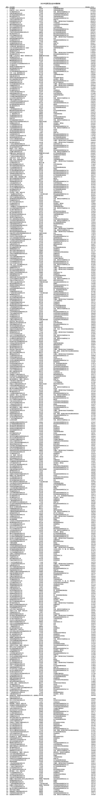

# “2023中国民营企业500强”榜单：京东、阿里、恒力集团位居前3

全国工商联9月12日发布“2023中国民营企业500强”榜单和《2023中国民营企业500强调研分析报告》。京东集团、阿里巴巴(中国)有限公司、恒力集团有限公司位居榜单前三位。

今年是全国工商联连续组织开展的第25次上规模民营企业调研，共有8961家年营业收入5亿元以上的企业参加。民营企业500强入围门槛达275.78亿元，比上年增加12.11亿元；制造业民营企业500强入围门槛达145.16亿元，比上年增加19.44亿元；服务业民营企业100强入围门槛达314.04亿元，比上年增加12.89亿元。有17家500强企业营业收入超3000亿元，其中有8家企业营业收入超过5000亿元。京东集团以10462.36亿元的营业收入连续两年位居民营企业500强榜首、连续三年位居服务业民营企业100强榜首；恒力集团有限公司连续两年位居制造业民营企业500强首位。资产总额超过千亿元规模的企业有86家，其中有11家企业资产总额超过5000亿元。共有28家民营企业500强入围世界500强。

