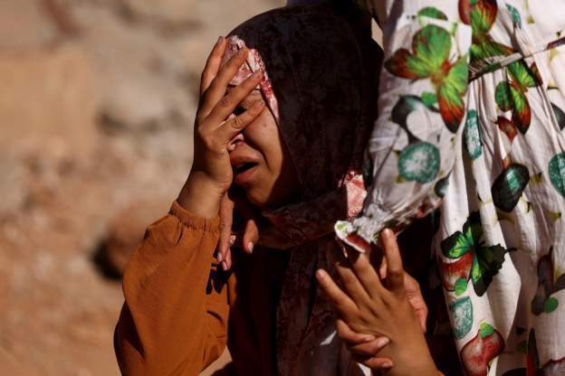
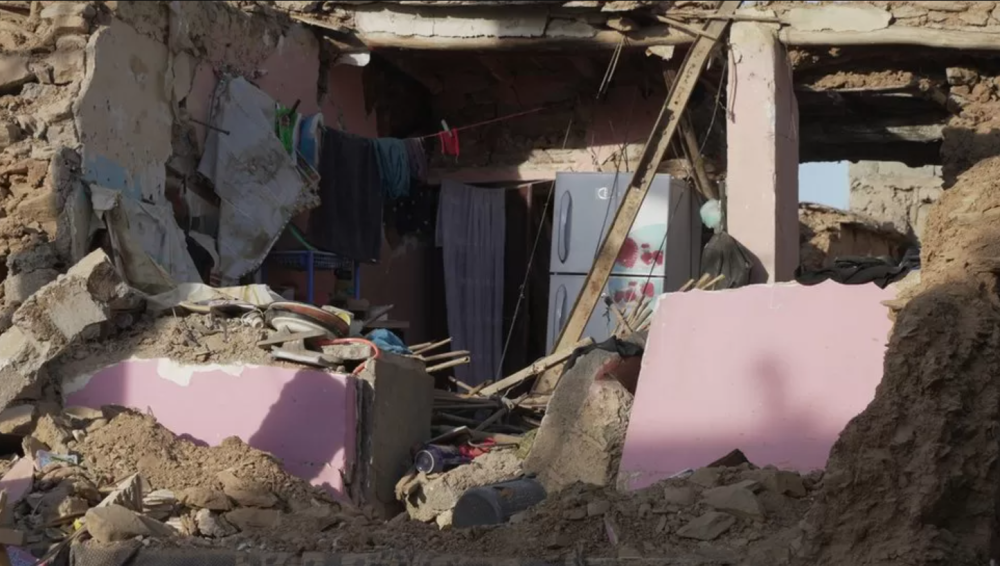
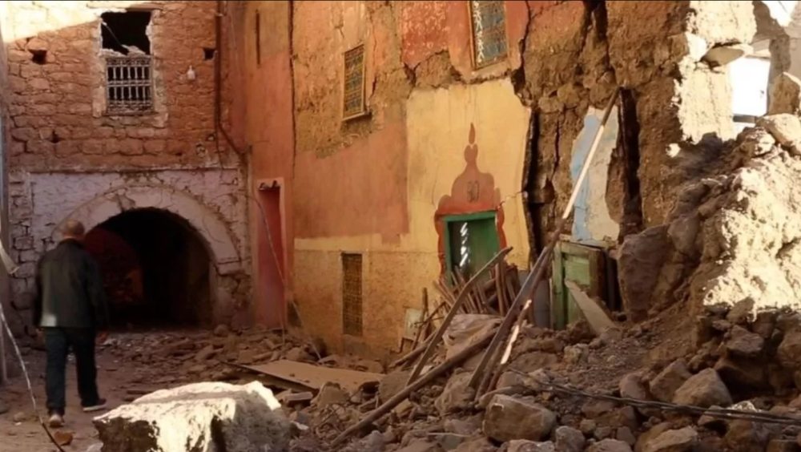

# 一名摩洛哥强震幸存者的“生死抉择”：为救儿子，亲眼目睹父母死去

当地时间9月8日23时11分，摩洛哥发生7.0级地震，震中位于该国南部著名旅游城市马拉喀什西南方向约71公里处。

随着“黄金72小时”逝去，发现新的生还者越来越难。据摩洛哥内政部的消息，截至当地时间9月11日15时，摩洛哥地震死亡人数已升至2681人，受伤人数升至2501人。

据前线媒体报道，在地震中心的山区，连片的村庄遭受了此前从未预想过的超强地震，生命损失惨重，有的村庄据初步估计人口已经减半。有幸存者心痛地回忆说，自己为了抢时间救儿子，只能亲眼目睹父母死亡。

在受灾最重的阿特拉山脉，生活着许多摩洛哥传统部落，在这种极端灾难面前，村民们极其渴望政府的救助能够再早一点到达。

_▲失去亲人的妇女掩面哭泣_

**50岁男子自述：**

**时间紧张，儿子和父母只能救一个**

塔耶布·伊亨巴兹是阿斯特拉山脉下一位普通牧民，以放牧山羊为生。

在他50岁的人生里，从来没有做过这样艰难的决定：当他深夜发现全家人在地震中被困在废墟下时，被迫选择是救儿子还是救父母。

当地时间9月8日晚上，他和妻子、两个孩子和父母在家中享受周五夜晚的闲适时光，完全没有想到摩洛哥60多年来最强烈的地震即将到来。在他印象里，这个村庄很少遭遇什么严重的地质灾害。塔耶布的父亲当晚早早进入了梦乡，其他家人也准备休息。

“一切发生得太快了。当地震发生时，我们家清醒的几个人都跑到门口。我爸爸正在睡觉，我妈妈不听我劝阻，执意留下来等他。”塔耶布回忆道。站在门口时，他看到妻子和女儿已经逃到屋外，他决定折返回到倒塌的房屋里救家人。

彼时，塔耶布发现他儿子和父母都被困在瓦砾中，他可以看到儿子的手从瓦砾中伸出来。他知道自己必须当机立断，立刻朝着儿子亚当斯所在方向奔去，在瓦砾中拼命挖掘，将儿子拯救出来。当他转头再冲向被大块石头困住的父母时，为时已晚。

_▲塔耶布和儿子劫后重生_

“我不得不在我父母和儿子之间作出选择。”他眼含泪花地说道，“我无法帮助我的父母，墙倒塌以后他们半截身子被死死压住了。这太悲伤了，我亲眼看到我父母死去的过程。”

塔耶布说，他将一直为这个决定感到纠结，内心无法获得平静。他在早已化为废墟的家园附近徘徊，久久不肯离去。他穿的一条浅色牛仔裤上的污渍，是此前沾染上的他父母的血迹。

他的所有衣服都在家里，自从地震以来就没有干净衣服可以换了。他和儿子现在住在靠近以前家里的临时帐篷内，暂时靠亲戚接济。他家所有值钱的东西都被埋在废墟下面，大部分山羊也都死了。“这就像是人生重启了。没有父母、没有房子、没有食物、没有衣服。我现在50岁了，又要重新开始。”

塔耶布表示，他永远记得父母教给他的做人道理：他们总是说“要耐心、努力工作，永不放弃”。在他和媒体谈话时，儿子亚当斯穿着一件C罗的球衣跑来拥抱住他：“是我爸爸救了我的命。”

**“无法安慰的哭声”**

**许多村民呼吁加强救援**

像塔耶布这样的悲伤遭遇并非个例。由于地处山区，地震引发的山体滑坡杀伤性极大。据一位逃出来的村民估计，他所在村庄估计有一半人已经死去。

现年47岁的阿卜杜·马济德在逃难路上被媒体记者发现，他说当地震发生时，他和妻子以及3个孩子都在家中，“地板塌了下去。”

他12岁的儿子跑了出来，而其他人被困住了。阿卜杜的腿被砸下来的瓦砾压住，所幸邻居将他拉出废墟。然后他花了两个小时试图营救他妻子和一个女儿，但当他清理完废墟后，发现她们都已经死了。第二天，他另一个女儿的尸体也从废墟中被发现。

阿卜杜现在睡在以前房子的对面，用一块防水布当做帐篷凑合。他在倒塌的废墟中依然可以看到原来的厨房，冰箱仍然立着，衣服还晾在外面。

_▲阿卜杜家里的冰箱立在废墟里_

他说自己不能离开这片区域，哪怕还有余震的风险。“那是我的厨房和冰箱，我们一家人都在那里生活过。现在我只是看着它，守卫我的回忆。”

阿卜杜说，在上周五之前，他从未想过地震的可能性。“即使到现在，我也无法相信地震真的发生了。”走在街上的很多行人主动停下来拥抱悲痛的阿卜杜，路过的汽车里也会有人探出身来给他加油打气。

在连接一个村庄与外界的蜿蜒山路旁，许多家庭聚在一个临时大帐篷里，从各个方向都传来了“无法安慰的哭声”。在阿特拉斯山脉一个又一个村庄中，相似的场景正在重复上演。由传统部落组成的小社区现在比以往任何时候都更需要外部帮助，摩洛哥政府必须尽快承担起责任。

_▲传统建筑被地震损坏_

一位村民表示，“地震无法避免，我并不抱怨，但现在政府必须尽快打通道路，把救援人员送进来。”

红星新闻记者 郑直

编辑 彭疆 责编 李彬彬

