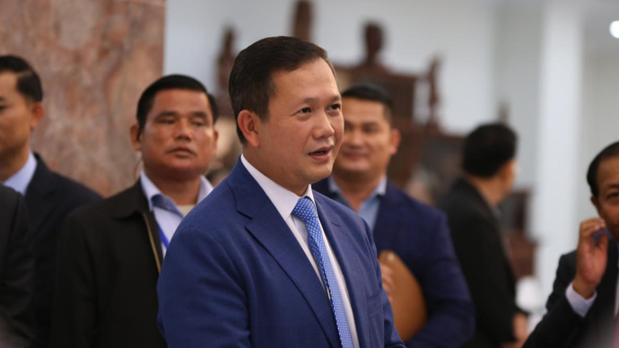

# 上任后首次正式出访，柬埔寨新首相为何选中国？

应中方邀请，柬埔寨首相洪玛奈将于9月14日至16日正式访华。这将是这位45岁的新生代领导人自上月22日宣誓就职以来的首次正式访问。

上任不到一个月便将目的地选在中国，洪玛奈此访释放出的信号耐人寻味、引人关注。

分析人士认为，这体现了中柬“铁杆”友谊的延续性，同时也将让这种友谊焕发出更大生机和活力。

**延续“铁杆”友谊**

作为中国的近邻，柬埔寨与中国并不接壤，但柬埔寨首相却是北京的常客。

今年2月，时任柬埔寨首相洪森来华访问。中国国家主席习近平用“铁杆朋友”来称呼他。

三年前的2月，在中国抗击新冠疫情的特殊时刻，洪森在结束对韩国的访问后临时决定访华，成为首位在疫情暴发期间来访的外国领导人，向外界展示了柬埔寨与中国患难与共的兄弟情谊。

如今，柬埔寨新首相洪玛奈又将启程，目的地仍是中国。

与前几天赴印尼雅加达出席东盟峰会等活动不同，这将是洪玛奈任内首次正式访问，被视为带有风向标意义。

那么，他为何要将中国选为任内首次正式出访目的地？

“洪玛奈一直是中柬关系的参与者和推动者。前两次洪森访华，他都作为代表团成员随同出访，见证了两国在亲密合作中互利共赢。这次访问凸显出柬埔寨新一届政府对发展中柬关系的高度重视。”
**中国社科院亚太与全球战略研究院研究员许利平** 指出，这是中柬“铁杆”友谊延续性的体现，同时也将让这种友谊焕发出更大生机和活力。

**上海国际问题研究院外交政策研究所周边外交室主任周士新**
指出，洪玛奈自上任以来曾出席多场外事活动，但一直没有进行正式访问。这次，他将首次正式访问选在中国，既是议程需要，更是政策选择，体现了柬埔寨对中国的重视，也反映出柬埔寨新政府为推进新的发展战略而作出的努力。

“今年以来，包括柬埔寨在内的一些东南亚国家在经济发展方面承受不小的压力，各国都把经济发展作为优先选择。洪玛奈政府提出的‘五角战略’核心就是发展经济、提升民生福祉。”周士新解释道，中国和柬埔寨是全面战略合作伙伴，中国也是柬埔寨第一大贸易伙伴、最大投资者。加强对华关系也反映出新政府治国理政的优先方向。

**促进经济融合**

除了任内首次正式访问外，洪玛奈此行恰逢中柬合作的几个节点时刻：建交65周年、中柬友好年、“一带一路”倡议提出十周年。

回望过去65年，两国关系历经国际风云变幻，始终坚如磐石，多领域合作取得累累硕果。以经贸为例，中国连续11年成为柬最大贸易伙伴。去年双边贸易额达160.2亿美元，同比增长17.5%，创历史新高。

这次洪玛奈访华，双方将重点谈些什么？两国又将如何以此访为契机，推动两国关系取得更大发展？

据中国外交部发言人介绍，中方对此访抱有三方面期待。战略上，通盘谋划今后一个时期中柬全面战略合作；议题上，推动“工业发展走廊”和“鱼米走廊”等合作倡议尽快落地见效；目标上，以高质量、高水平、高标准建设新时代中柬命运共同体。

柬埔寨外交部同样对访问寄予厚望——推进打造中柬“钻石六边”（政治、产能、农业、能源、安全、人文）合作架构，造福两国和两国人民。

两位分析人士认为，洪玛奈此访重点何在，应结合柬埔寨新政府颇具雄心的国内发展战略来看。

许利平预计，柬埔寨方面或聚焦两个主题：向中国领导人介绍其施政理念和方向，包括新提出的“五角战略”；同时进一步深化两国间务实合作。

周士新同样提到柬埔寨的“五角战略”。他认为，从原来的“四角战略”到现在的“五角战略”，这是洪玛奈政府对国家发展战略的继承和发展。对华关系同样如此，新政府继承了两国以往的合作成果（包括建设“走廊”和经济特区、落实自贸协定等），同时也重视经贸合作“质”的提升。

“此访最重要议程在于，进一步促进两国经济关系的融合，特别是在高质量发展方面。”周士新阐释道，柬埔寨处于产业结构转型升级的过程中，对与中国无缝隙合作抱有很大期待。柬方可能希望中方加大在新能源车、电子商务、数字经济等重点领域的投资，提升柬商业竞争力，同时扩大对华农产品出口，为柬旅游业发展开拓更大空间，以促进柬埔寨经济的快速复苏。

纵观“钻石六边”合作架构，许利平指出，产能和农业被视为柬埔寨经济的重要着眼点和发力点。中方提到的“工业发展走廊”和“鱼米走廊”刚好与之呼应。建设这两条走廊是2月洪森访华时双方达成的共识，也是“钻石六边”的两大支柱、新旗舰项目。目前，蓝图已经画好，关键就是怎样将它们落实。

在此过程中，“中柬可以各施所长。”许利平指出，两国处于不同的发展阶段，工业化水平有一定落差，恰好形成某种互补关系。中国可以利用自身工业化发展的经验和人才，来助推柬埔寨工业的发展步伐，特别可以在产能建设、工业园区等方面发力。

**形成示范效应**

除了进行正式访问，洪玛奈此行还将前往广西南宁，参加第20届中国—东盟博览会（简称东博会）和中国—东盟商务与投资峰会开幕式。

“柬埔寨首相是东博会的老朋友。洪森自2004年东博会诞生起，几乎每年都率团参加。”许利平指出，东博会是中国和东盟合作的重要组成部分，可谓倡议发布、商品展示和实践的综合平台，通过举办一系列高层会议和论坛，为推动落实双方领导人的共识打开渠道。今年是东博会启动20年，参展国多达40多个。

“一直以来，东博会在促进中国和东盟经贸关系方面扮演着发动机的角色，因此受到东盟国家重视。”周士新指出，如今，经过20年的发展，东博会不再局限于单纯的经贸促进会，还被赋予更多元的功能，日渐成为线上线下有机结合的互动平台，为促进相互理解、战略对接、经济融合提供更多动力。

从这个角度看，柬埔寨首相每年捧场，不仅是对东博会的支持与重视，也让中柬合作成为东博会各国合作、中国与东盟合作中的典范。

“柬埔寨不仅是中国开展澜沧江—湄公河合作、中国和东盟合作的重要一环，也是高质量共建‘一带一路’的重要国家。”许利平指出，双方在双边合作领域内的探索和尝试，可以为中国加强和东南亚其他国家的合作提供借鉴和参考，甚至起到示范和引领作用，特别是对其邻居缅甸、老挝等。

周士新提到中柬在自贸区建设方面的领先。在东盟范围内，只有两个国家与中国达成自贸协定，一个是新加坡，另一个就是柬埔寨。

从2020年初谈判启动到宣告完成，中柬只花了7个月时间。与自贸协定谈判动辄数年甚至十几年的“国际惯例”相比，中柬自贸协定的达成相当高效。

“与中国—东盟自贸协定、区域全面经济伙伴关系协定（RCEP）相比，中柬自贸协定更具灵活性和针对性，更能体现两国的经贸互补性和地方优势。”周士新指出，柬埔寨生产能力相对较弱，在两国自贸安排下，中国对于柬农业发展提供很大帮助和援助，柬埔寨可以充分发挥农产品优势，扩大对华出口。

展望未来，两位分析人士都对中柬关系，以及中国与东盟合作的前景充满信心。

周士新指出，柬埔寨新政府希望能推进相对平衡的外交路线，包括与欧美发展更好的关系，但后者似乎意兴阑珊。下一步，洪玛奈政府可能会拓展与日本、韩国方面的合作，以获得更多投资和援助。但是，中柬全面战略合作伙伴关系不会因此受到影响。

“柬埔寨新一届政府中的一些成员带有美西方留学背景，担任一些重要职位，将有助于新政府改善与西方的关系，这对柬埔寨也是有益的。”许利平说，但这种潜在的改善并不意味着会对中柬关系形成对冲、制约或挑战。因为中柬钢铁般的友谊本身就不针对第三方，而是建立在双方务实合作的基础上，符合两国和两国人民的利益。中国和东盟其他国家的合作亦是如此。

