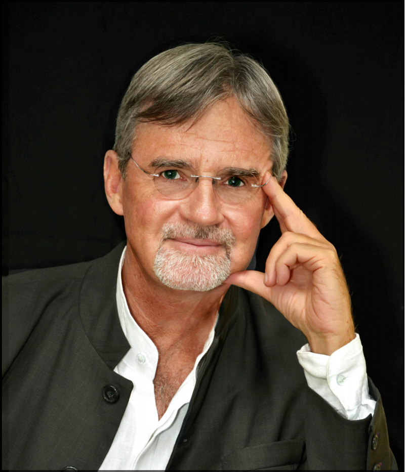

# 专访《奥本海默》编剧：人们不再相信科学家，是从他受辱开始的

 _图源：Stephen Frietch_

**撰文｜李珊珊**

**责编｜徐卓君**

正在热映的诺兰导演的新电影《奥本海默》让很多国人关注到了“原子弹之父”、物理学家奥本海默。电影的灵感来源正是一本获得过普利策传记奖的《美国的普罗米修斯》（中译：《奥本海默传》），这本书是两位资深传记作家——凯•伯德与马丁•舍温25年研究与写作的成果——两位作者也被诺兰写入了电影编剧一栏。

马丁•舍温是一位美国历史学家，他的主要研究领域涉及核武器和核扩散的历史，他从20世纪80年代开始收集整理关于奥本海默的资料，20年后，拥有了5万多页的档案文档、大量奥本海默的信件及对150多人的访谈记录，但舍温发现自己得了传记作家常患的一种病：手握大量的资料，却不知从何下笔，而且总觉得自己的材料还不够。

舍温找到了好友凯•伯德，后者曾做过他的编辑，同样是传记作家，专注于日本广岛和长崎原子弹爆炸，以及政治人物传记的研究与写作。两人一起又用了5年时间，完成了一本奥本海默的传记——《美国的普罗米修斯》，2006年，该书获得了普利策传记奖。

2021年，84岁的马丁•舍温去世，两年后，在地缘冲突频发、全球化逆行的今天，电影《奥本海默》上映。《奥本海默传》新版出版之际，我们与书的另一位作者，也是电影的编剧之一凯•伯德谈起了他们的这本书，这位作者说：“奥本海默的故事与今天的我们关联密切”，不管是从对待科学的态度，还是从对待核武器的方法，奥本海默的观点都值得我们认真对待。

为什么将奥本海默比作普罗米修斯？

**知识分子:** 您当时是怎么给您的奥本海默的传记起名叫“美国的普罗米修斯”的，在那本书之前，人们会把奥本海默跟普罗米修斯划等号吗?

**凯•伯德：** 并不会，之前，也并不会有很多人把奥本海默跟普罗米修斯划等号的，这个书名甚至不是我们最初想用的书名。

马丁和我在写这本书的时候，使用的工作标题只是“奥比”，这是奥本海默的昵称，他的朋友和学生都直呼他的昵称“奥比”。我们觉得给书起一个简短的标题可能不错，就想叫它“奥比”。

但就在书要印刷出版之前，我们接到出版社的电话，说不能使用这个标题——它太傻了。我们必须在两天内想出一个新的名字。

我还记得那天晚上跟我妻子聊天，她说：为什么不把它叫作“普罗米修斯”或“美国的普罗米修斯”呢?

我说：不行，这个名字太复杂了，谁会记住这个希腊神话人物的名字呢？普罗米修斯，从宙斯那里偷了火给人类？

第二天早上,我接到马丁·舍温的电话，他说自己前一天晚上与我们的老朋友、另一位传记作家出去吃饭。这位朋友说，他绝不会读一本叫“奥比”的书。这位朋友还说：为什么不叫它“美国的普罗米修斯”呢？

这样，我的妻子和我们的朋友都想到了同样的书名，我们就用了这个名字，可能从那本书之后，更多的人觉得奥本海默像个盗火者了。

这是件很有意思的事情，在我们这本书出版之前，奥本海默是公认的“原子弹之父”，上过《时代》和《生活》杂志的封面，在相当长的一段时间里，除了阿尔伯特·爱因斯坦，他可能是当时美国最有名的科学家。但我认为在这部电影上映之前，大多数美国人，特别是年轻一代，都不知道奥本海默是谁。当然，电影上映之后，可能情况就不同了。

**知识分子:** 写作奥本海默的传记，改变了你对核武器或高科技的看法吗?

**凯•伯德：**
奥本海默的生平非常复杂,他的生活中有许多迷团。我们写作时必须面对的一个问题是，第二次世界大战是如何结束的，是什么最终促使日本投降的？这个问题到目前仍然存在很大的争议。在我们写作时，许多人,并且今天仍有人认为，是原子弹爆炸终结了第二次世界大战,迫使日本投降。

1945年5月，欧洲反法西斯战争顺利结束，日本也快要被击败。我们从日本方面的消息来源知道，1945年6月，日本天皇给他在莫斯科的大使发电报，说请让苏联人明白，我们已准备好投降，目前只需要美国保证不会因战争罪将天皇送上法庭，保留天皇制。

当时在华盛顿内部就是否应该答应投降条款这一点辩论不断。一些人认为应该保证保留天皇制，这有助于早日结束战争，也有人坚持要求日本无条件投降。8月6日原子弹被投下,随后，苏联加入战争。我认为正是苏联的参战最终说服了东京强硬派，他们别无选择只能投降。结束战争的不是原子弹爆炸,而是苏联参战。

使用原子弹后，美国确实说会保留天皇制，但天皇权力将服从美国占领军最高司令官，所以情况其实非常复杂。

战后奥本海默自己也提到，从他在华盛顿得到的简报中知道日本有投降的意向。

**知识分子:**
你对洛斯阿拉莫斯曾经出现过的关于原子弹研究的伦理辩论持什么观点？当时的年轻科学家应该拒绝继续研制原子弹吗？如果您是当时的一位年轻科学家，会作何选择？

**凯•伯德：**
确实，我们的资料指出，1945年春天，洛斯阿拉莫斯的一些科学家了解到欧洲战事已经结束，德国被击败了。他们问：德国人已经输了，我们都知道日本没有制造原子弹的能力，为什么我们还要如此努力地制造这个武器？在1945年春，他们进行了一次辩论。

奥本海默站出来说：我们必须继续研究，因为人类必须明白这种武器已经被发明了，它的威力和可怕的毁灭性必须被展示和研究。这种毁灭性力量的本质必须被证明，这样人们才能明白它有多危险。如果在人们不理解原子武器已被发明的情况下战争就结束了，那么下一次战争将在掌握了原子武器的两方之间打响，那将是末日，会是可怕的种族灭绝。

这个论点很有趣，说服了许多科学家继续工作，只有一个人因为认为德国已被击败，法西斯分子使用原子武器赢得战争的危险已经消失而退出。所有其他人包括奥本海默继续工作。

回想起来，我不知道……如果我是1945年春在洛斯阿拉莫斯的年轻科学家，我可能也会退出,停止研究。

你会担心原子战争吗？

**知识分子:** 奥本海默的生平对今天有什么启示?你怎么看奥本海默最大的成就和最艰难的处境?

**凯•伯德：** 奥本海默的故事与今天的相关性很强，不仅在美国，在世界上其他地方，我想也是如此。

过去100年里，我们的文明浸润在科学技术中，出现了这么多改变人类生活的发现，但大多数人并不理解科学，也不理解科学方法。战后，作为科学家的奥本海默想警告人们不要依赖那些危险的大规模杀伤性武器。但没有人听从他的话,相反他受到了公开羞辱。同样，在新冠大流行期间，我们面临艰难的公共卫生问题，这些问题没有简单的答案，科学家必须进行试验来找出事实，必须根据新的事实和试验来改变看法。但是人们不理解这种科学方法，这很不幸。

奥本海默的故事中的另一个重要教训是：奥本海默感到迫切需要制造这种大规模杀伤性武器——原子弹,因为他担心德国科学家会先做出来，把它交给希特勒使用。但在那之后，他警告人类不应继续依赖它，他想要进行国际控制和禁止这种武器。现在，我们仍生活在原子时代，许多国家已经拥有了自己的核武器。

这让世界变成了一个危险的世界，我们不应安于目前这种与原子弹共存的不稳定现状。如果奥本海默还健在，我认为他会再次争辩说：我们应该找到方法禁止这些武器，少花钱在这类研究上。

**知识分子:** 奥本海默对核武器的警告和遗憾如今在日益增加的区域冲突，比如俄乌冲突等方面，有何启示?

**凯•伯德：** 奥本海默认为，战术核武器这种东西实际上并不存在，它不能在军事上使用。因为任何这类武器都需要一个大目标——一个城市，它们是恐怖的武器。

**知识分子:** 您对当今世界日益增长的政治紧张局势，以及其对科学合作的潜在影响有何担忧?

**凯•伯德：**
的确，有许多令人担忧的冲突。在中东有阿拉伯人和以色列人之间的冲突；在亚洲，许多人担心朝鲜，人们也担心印度和巴基斯坦为克什米尔争执，并且印度和巴基斯坦都拥有核武器，所以这两国有爆发核战争的可能。

这是一个危险的世界，我们应该意识到这一点，我认为我们太心安了。从这个意义上，《奥本海默》这部电影非常有用，它可以提醒人们这些武器的危险。

事实是这个故事还没有结束。这些武器只在二战中在日本的广岛、长崎使用过两次。那已经是70多年前的事,但这个故事还没有结束。它可能会造成更严重的后果。当然，我们希望不会。

政治家是问题所在

**知识分子:** 在你的写作过程中面临的最大挑战是什么？会是，比如说，无法获得一些秘密档案吗？

**凯•伯德：** 我觉得主要的挑战还是奥本海默是个非常复杂的人，围绕这个人的很多事情也异常复杂。

**我和马丁其实做了大量的研究，所以我们有许多资料来源——档案文档和访谈记录。但奥本海默仍然是一个非常神秘而复杂的人，他的身上充满了谜团。他的童年相当艰难，虽然他父母很富有，他在纽约城长大，但他非常害羞、不善社交，尤其在与女性交往时。从很小的时候，他就对地质、化学和后来的物理有兴趣，但他也热爱诗歌。在后来的生命中，他开始研究印度吠陀，学习梵语以便阅读原文。所以他不仅是物理学家和科学家，也是一个写诗的人。**

**关于他，有许多谜团，例如：一个巨大的谜团是：奥本海默是否曾经是美国共产党员。联邦调查局对他进行过监视和调查，试图证明他是美国共产党党员。的确，他的妻子凯蒂在20世纪30年代加入过美国共产党，他的弟弟弗兰克也是美共党员。你知道，在经历大萧条和严重经济问题的20世纪30年代，许多大学中的学者，特别是奥本海默，被左翼的社会主义思想所吸引。**

**但我们认为证据清楚地表明他实际上从未加入美国共产党。他参加了党的一些活动，比如试图消除伯克利的一处公共游泳池的种族隔离，帮助农场工人，在20世纪30年代后期西班牙内战期间为西班牙共和国筹集救护车资金，等等，但他从未正式加入美共。所以这是一个大谜团，我们在写作的过程中花了很多时间来研究。**

**知识分子:** 您提到了联邦调查局对奥本海默进行了各种监视和调查，国家安全与公民权利之间应该如何平衡呢？

**凯•伯德：**
对奥本海默进行监视的原因可以想象。在二战前，他是左倾的自由派，但在战争期间，他非常想为战争努力做贡献，因为他担心德国的科学家会先造出原子弹。早在1939年，他就意识到裂变是可能的，因此原子弹也成为可能。战争爆发前，他曾在德国与德国科学家一起学习，他知道那里的科学家和他一样聪明能干，有能力造出这种武器。所以，他特别担心希特勒会先一步获得这种大规模杀伤性武器，从而帮助法西斯主义获胜。这是他制造这种毁灭性武器的动机。

**但在战后，他曾警告美国总统杜鲁门等人：我们不应该依赖这种武器，这是恐怖的武器，也是侵略者的武器。在1945年的一次演讲中，奥本海默说这些（原子弹）是侵略者的武器、恐怖的武器，他敦促人类应该将其非法化，在国际上禁止原子弹，对其进行管制，但他的建议被忽视和驳回了。**

**后来，我们（美国）与苏联进行军备竞赛，奥本海默认为这是资源的浪费，也很危险。他继续公开反对原子弹，结果在华盛顿树敌无数。这也导致了1954年，他在秘密法庭受审，那是非常不公正的诉讼，最终他被剥夺了安全许可，然后该消息被泄露给媒体，成为全美头条新闻，他受到羞辱。**

**我觉得这个故事与当今时代高度相关。因为从中我们会看到“原子弹之父”、1945年美国最负盛名的科学家在9年后成为悲剧的主角，在秘密审判中受辱。**

**知识分子:您说过这就像新冠大流行中的安东尼·福奇博士？您还提到过奥本海默是最后一个科学背景的知识分子？**

**凯•伯德：**
在过去三年的疫情期间，让我惊讶的是，有很多人不信任公共卫生官员和科学家，不想听科学家关于如何应对疫情和保护自己避免病毒感染的建议。在美国和世界其他地方，似乎有许多人对科学专业知识持怀疑和不信任的态度。你看到特朗普这样的政客，作为美国总统，质疑安东尼·福奇博士这样的公共卫生官员的诚信。

**政治被带入疫情是非常不幸的，科学家受到质疑，人们不再信任科学家及其提出的建议，这很糟糕。这种情况正是始于奥本海默那个时代。**

**知识分子:** 麦卡锡主义的迫害对奥本海默和冷战期间美国的科学创新造成了多大的伤害?

**凯•伯德：**
参议员约瑟夫·麦卡锡在20世纪50年代初成为非常有影响力的参议员。他发起了一场政治运动，变成了一场“猎巫运动”，人们在全美各地寻找“不忠的人”和“美国共产党员”并指控他们。

**这种政治运动变得非常具有破坏性，它摧毁了许多人的职业，甚至生命。被指控的人中，有普通的学校教师，有政治家和科学家。奥本海默在1945年曾作为美国最著名的科学家而声名显赫，但9年后，也就是在1954年受到秘密审判且被公开羞辱。**

**这给全美乃至全世界的科学家发送信息：科学家应该局限在自己的领域内,只谈科学，不谈政治和政策。这对科学造成了可怕的影响，意味着对科学一无所知的政治家可以毫无顾忌地做出有关科学技术应用的决定,而不依靠科学家的专业知识来智慧地使用技术。**

**知识分子:** 这种情况也损害了国际合作吗？我想知道现在是否有类似的事情发生？

**凯•伯德：** 我猜你是指奥本海默自己总是支持科学家进行国际合作。

**是的，麦卡锡主义和冷战阻止了这种合作。人类面临的重大问题，像气候变化、环境污染、疫情中的公共健康问题，都是需要基于科学找到解决这些问题的方法，最好的方式是各国科学家通力协作、共享实验数据。**

**奥本海默支持将中国、苏联、印度的科学家召集在一起开会合作。但在充满怀疑和政治干预的世界,这有时无法实现。最后的结果就是，我们没有解决应该解决的问题。**

**我想，如果科学家可以在联合国或世界各地的会议上公开合作，而不受政治家的干扰，有助于他们解决气候变化、贫困、医疗和公共卫生等重大问题。政治家是问题所在。**

**知识分子:** 您现在还在写什么人的传记?

**凯伯德：**
我现在正在写一本关于罗伊·科恩的传记。科恩是约瑟夫·麦卡锡的律师，在20世纪50年代，他是麦卡锡的参谋长，所以他是这场麦卡锡主义“猎巫行动”的一部分。

**多年后，1973年，他遇到了从事房地产行业的唐纳德·特朗普，并成为他的律师。他教特朗普一切他知道的东西——如何行事，如何不道歉，如何总是广泛抨击政治对手。所以可以说，他给了特朗普政治生涯的策略手册。因此，麦卡锡主义与特朗普有直接关系。**

**知识分子:** 罗伊·科恩的生平真是个丰富多彩的故事，期待您的新作。

