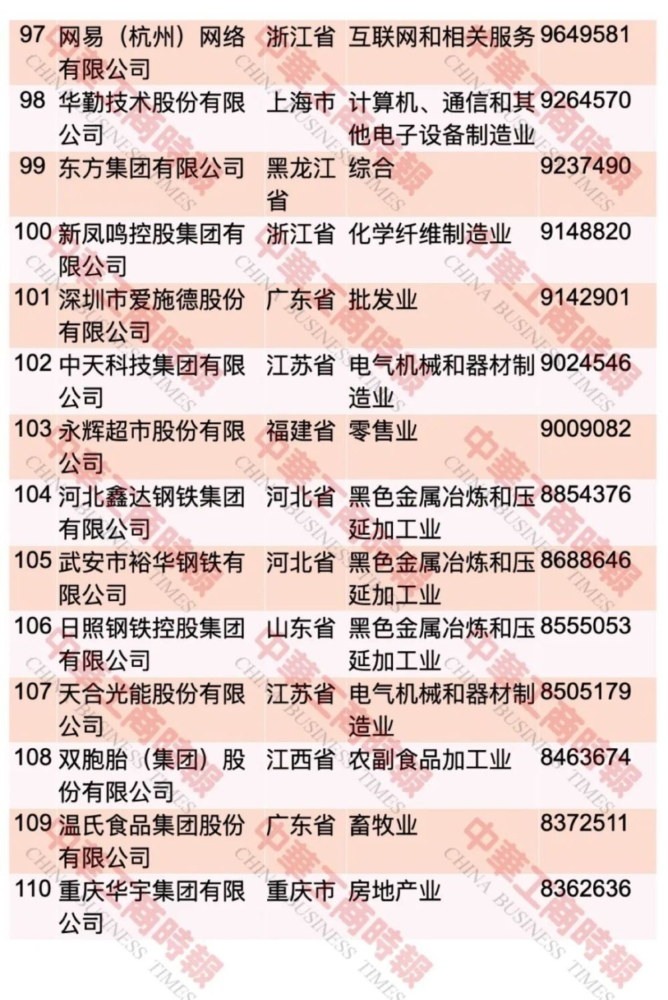
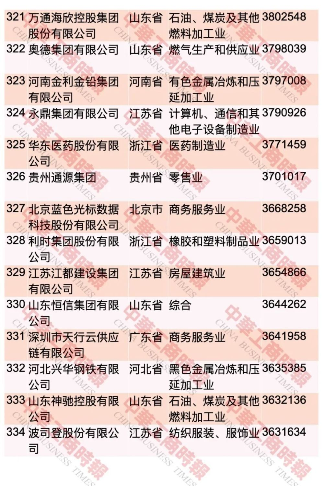

# 中国民企500强最新榜单出炉！这个省入选108家

新华社消息，全国工商联9月12日发布“2023中国民营企业500强”榜单和《2023中国民营企业500强调研分析报告》。
**京东集团、阿里巴巴（中国）有限公司、恒力集团有限公司位居榜单前三位。其中，京东集团以10462.36亿元的营业收入规模蝉联民营企业500强榜首。**

_调研分析报告截图_

根据调研分析报告，2022年，民营企业500强入围门槛为275.78亿元，较上年增加12.11亿元。其中，2022年营业收入总额超过1000亿元（含）的企业有95家。

据介绍，今年是全国工商联连续组织开展的第25次上规模民营企业调研，共有8961家年营业收入5亿元以上的企业参加。

据大众日报记者从现场了解到，2022年，民营企业500强分布于28个省、自治区、直辖市和新疆生产建设兵团。

浙江、江苏、山东、广东四省连续多年入围500强企业数量前四。
**浙江、江苏两省入围企业数量最多，浙江省入围企业108家，较上年增加1家；江苏省入围企业89家，较上年减少3家。**

完整榜单如下：

每日经济新闻综合新华社、大众日报、中华工商时报

每日经济新闻

