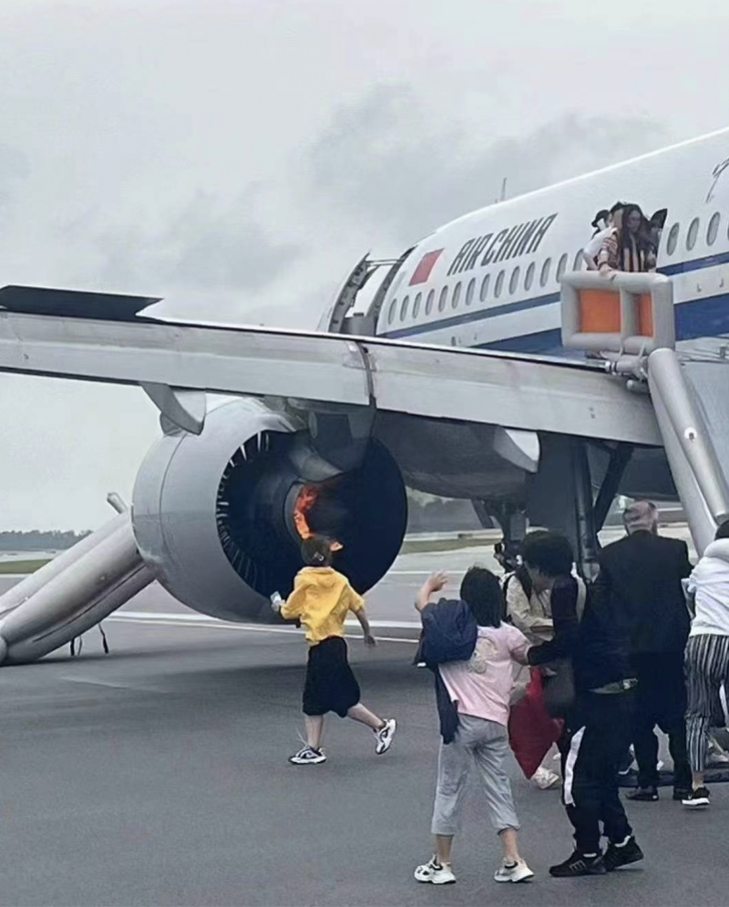
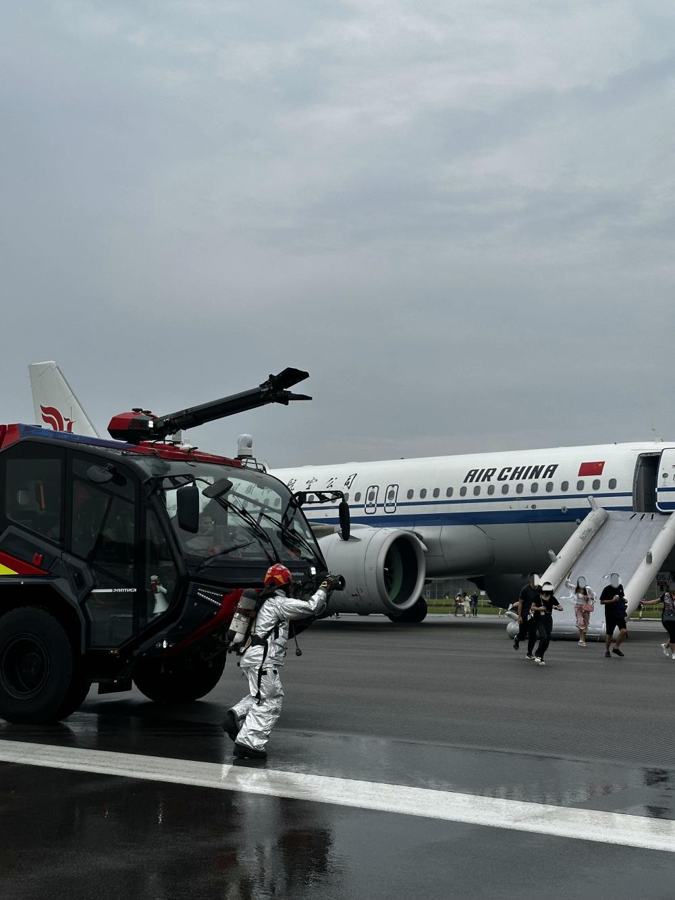
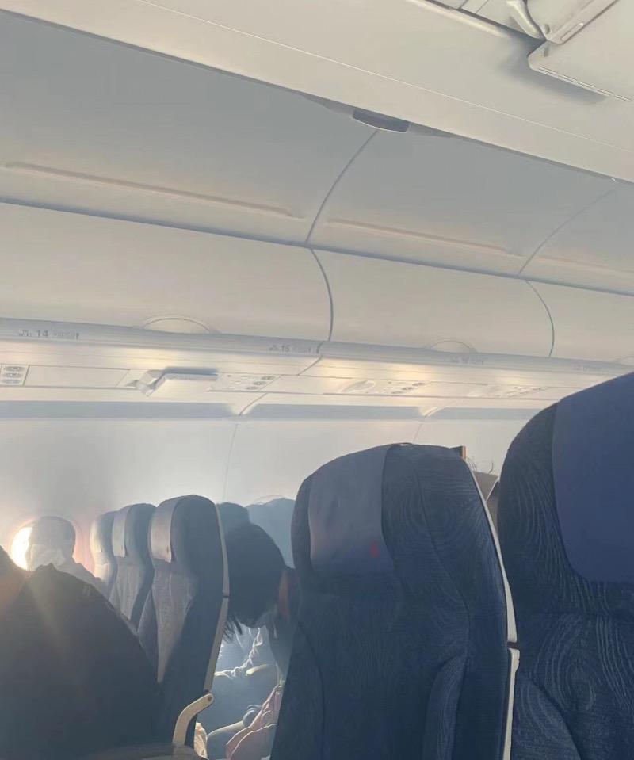

# 中国航班樟宜惊魂：先遇火警后因故折返，两班次连出状况背后

然然是国航CA403航班的常客。9月10日上午，她从成都搭乘这趟航班计划飞抵新加坡。“当时天气还挺好”，她一边听歌一边欣赏窗外的风景，直到被一阵刺鼻的烟味打断思绪。

烟雾很快弥漫开来，焦灼的等待过后，北京时间16时14分，飞机终于降落新加坡樟宜机场。“我从左侧滑梯逃出来时，看到飞机发动机已经起火，双腿一阵发软。”这架机型为A320neo的航班，在降落前曾挂出紧急代码7700。最终机上146名旅客和9名机组人员安全撤离。

就在事发第二天，国航新加坡飞回成都的对开航班CA404也被取消，原因则为“国航原因”。据悉，这架飞机因故障在跑道折返，导致乘客滞留。有民航专家告诉南都、N视频记者，起火事件后机组处置专业水准是一流的，但接连发生的故障背后的隐忧，亦不容忽视。

 _飞机左侧发动机起火。_

**惊魂一刻**

“最开始看到烟雾时，我以为眼花了。”小米（化名）是本趟航班的乘客之一，也是一名在新加坡读书的中国留学生。

9月初，她趁教师节回四川看望以前的老师和同学。假期即将结束，她选择乘坐国航CA403飞赴新加坡继续学业。

和小米一样搭乘这趟航班返回新加坡的，还有留学一年半的然然（化名），她是CA403航班的常客。9月10日9时许，她抵达机场，“当时天气还挺好”。

这趟由成都飞往新加坡的航班，由一架机龄4年多的空客A320neo飞机执飞。原计划于9月10日11时05分从成都天府机场起飞，4小时45分钟之后落地新加坡樟宜机场。

然而，一阵意想不到的烟雾，正悄然而至。

小米向南都记者回忆，距离飞机降落大约还有40分钟时，机舱内开始出现烟雾，并散发出“一种像是橡胶和汽油混在一起的刺鼻气味”。

坐在21L位置上的然然，临窗座位靠近右边机翼。快降落时，她正听着歌欣赏窗外的风景，却发现飞机一直在绕圈徘徊。过了没多久，她闻到了奇怪的味道，“像什么东西被烧了，我以为是乘客的东西有味道，但后面味道越来越大，机舱开始出现烟雾。”

烟雾很快弥漫开来，紧接着，乘务员开始给乘客派发湿巾。“当机组人员要求捂住口鼻时，我开始感到害怕。”小米说，由于飞机没有明显颠簸，大部分乘客都比较配合。

然然告诉南都记者，乘务员反应很迅速，马上开始安全排查，并安抚乘客。“她们说已经尽快安排降落，飞机指标都是正常的。”

烟雾越来越大，味道也越来越浓烈。然然佩戴了口罩，“我感觉还好，但很多乘客没有口罩，时间一久会觉得呼吸不畅。乘务员给每个人发放了湿纸巾，让乘客们尽量埋头捂住口鼻。”

北京时间16时14分，CA403航班终于降落新加坡樟宜机场。

平安落地后，本趟航班乘客王先生告诉南都记者，“等待降落期间大脑一片空白，第一次对死亡如此畏惧。”

**紧急撤离**

确认安全后，然然第一时间给父母好友报平安。“下来后才看到左侧发动机起火，消防车也来灭火了，现在回想还是有些后怕。”

她回忆，乘客撤离时，飞机的左侧引擎正在起火。人们通过应急滑梯迅速向外疏散。“我从左侧滑梯逃出来，双腿一阵发软。”

“疏散过程中，空姐一直提醒大家不要带行李，快速撤离。”小米看到，撤离过程中，有乘客携带了行李。社交平台上流传的视频上显示，甚至有人因此摔倒。

_乘客携带行李撤离时摔倒。_

资深机长陈建国向南都记者分析了其中的风险。紧急撤离时，携带行李不仅会阻碍他人及自身逃生，撤离过程中行李也有可能将滑梯划破。

紧急撤离之后，所有乘客聚集在机场旁的一个空旷草地内。“机务人员清点好人数后，航空公司派车先把小孩、孕妇接去了航站楼。”然然说，后来下起了雨，工作人员还搭建了一个临时帐篷让乘客暂时休息，并为受皮外伤的乘客处理伤口。

机上共有旅客146名、机组人员9名，9名乘客在撤离过程中因吸入烟雾或擦伤而受轻伤。

这场惊心动魄的历险过后，人们从飞常准数据得知，CA403航班曾在16时05分发出7700代码。

有业内人士告诉南都记者，7700为应答机遇险编码。“当飞机遇到发动机着火、紧急迫降、客舱升压等紧急情况时，飞行员会将应答机代码调整为7700。应答机编码发出后，管制员对该飞机实施优先权，进行包括优先落地等在内的紧急处置。”

民航专家李瀚明解释，从CA403航班挂出7700代码的时间来看，应该是最终进近阶段出现的火情。日常训练中，机组人员也会在模拟机上训练遇到此类情况的处理流程（发动机着火检查单），一般而言分为S-
I-E（关车、隔离、熄火）三步。

在这三步以后，燃烧理论中所需的燃料、氧化剂和温度三要素中，燃料通过切断油路控制，温度通过释放灭火剂控制，此时发动机失火的情况大概率会得到控制。“不过，上述步骤完成后，也意味着发动机在这次飞行中无法再正常工作。”

李瀚明补充说，机组还需要执行被称为“单发降落检查单”的另一个标准流程，将飞机在只有一个正常工作的发动机的情况下安全着陆。

“从飞机飞行的相关信息判断，这一次，机组在12分钟内快速执行了两个相关的标准流程，机场消防车也在12分钟内完成出动，其专业水准是一流的。”

 _乘客迅速完成撤离。_

**成因几何**

9月11日凌晨，国航通报CA403航班起火成因，初步判断系发动机机械故障所致，目前正在进一步调查。

事发后，新加坡樟宜机场表示，机场第三跑道将暂时关闭，航班运营可能受到影响。

南都记者留意到，9月10日、11日，国航由新加坡飞往成都的对开航班CA404接连被取消。其中，9月11日的航班取消原因为“国航原因”。新加坡当地媒体报道称，11日，一架计划从新加坡飞往成都的国航CA404航班飞机出现故障，在樟宜机场跑道准备起飞前临时折返，乘客被迫滞留候机厅。

陈建国告诉南都记者，全球范围内，飞行过程中发动机故障事件几乎每周都会发生，但原因有所不同，如遭到鸟击，发动机吸入异物或是内部机械故障等。

有业内人士认为，发动机是一个复杂的系统。“内部的燃油系统或机械故障等都可能导致发动机着火，飞机上配备了灭火瓶，经过训练的机组人员会按照操作程序进行处置。”

那么，本次航班前货舱为何出现烟雾？陈建国分析，该机型飞机的货舱会引入客舱空气，对货舱空气进行循环，发动机故障触发火警产生烟雾以后，可能是由于烟雾进入客舱系统，再从客舱系统循环至前货舱，因而使前货舱出现烟雾。

_客舱烟雾弥漫。_

“对于旅客来说，当客舱出现烟雾时，最重要的是要听从机组的指挥。机组会根据实际情况判断烟雾的来源是否为空调系统的烟雾、电气系统的烟雾、货舱货物引起的烟雾，或是发动机引起的烟雾，并进行相应的处置”，陈建国说。

此次国航CA403航班机型为空客A320neo，配置的发动机是普惠公司GTF发动机PW1100G。

陈建国告诉南都记者，该款发动机今年以来已经发生12起类似故障。李瀚明则透露，“从2017年开始，这款发动机陆续在飞行过程中出现了各种各样的问题。”

今年8月底，美国FAA（美国联邦航空管理局）曾发布适航指令，详细说明了空客A320neo系列飞机上使用的普惠
PW1100G发动机所需检查的内容，要求在30天内对全球202台普惠GTF发动机的第一级和第二级高压涡轮盘进行超声波检查。如果检查发现疲劳迹象，则必须在飞行之前进行更换，该指令立即生效。

**事故频发**

中国民用航空局官方信息显示，A320系列是Airbus欧洲空中客车工业公司研制的双发中短程150座级客机，包括A318、A319、A320及A321四种客机。

A320系列客机是世界上第一种采用电传操纵系统的亚音速民航运输机。1987年2月22日，第一架A320飞机首次试飞，1988年2月获适航证并交付使用。

近年来，A320客机在全球范围内曾发生过数起事故。

今年4月25日，哥伦比亚一架空客A320-214型号客机，起飞后不久遭飞鸟撞击，一个引擎在空中起火，客机下方就是游客云集的海滩。机长决定返回机场，并成功紧急迫降。

2015年3月24日，一架从西班牙巴塞罗那飞往德国杜塞尔多夫的空客320客机在法国南部坠毁，机上142名乘客和6名机组人员全部遇难。

2014年12月28日，亚航QZ8501航班从印度尼西亚泗水飞往新加坡时失联。亚航确认该班机是一架空客A320-200型号飞机，注册号为PK-
AXC。这架空客A320-200型号飞机载有162人，无一生还。其中一些遗体是在距离客机坠毁地点1000公里外的海上被发现。

2010年7月28日，巴基斯坦蓝色航空公司的一架A321客机，在距离伊斯兰堡马巴德国际机场仅一公里航程时撞山爆炸，机上146名乘客及6名机组人员全部遇难。经初步调查，可能是大雨和浓雾导致了这起事故。

目前，国航尚未披露从新加坡飞往成都的航班取消具体原因。

出品：南都即时

采写：南都记者 彭雨欣 张倩寒 见习记者 周敏萱 实习生 傅烨桐

