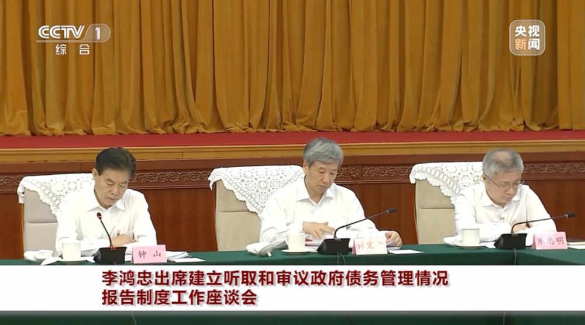
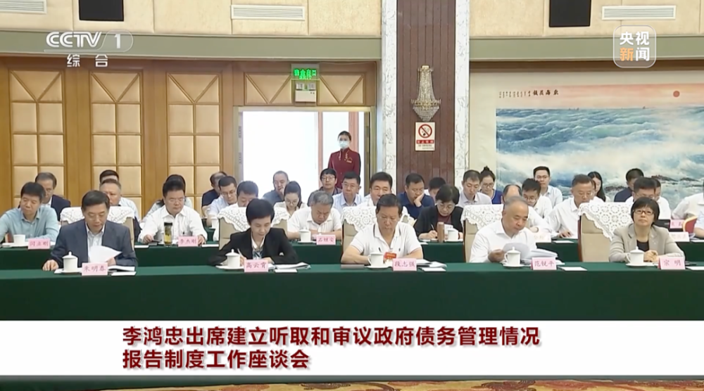
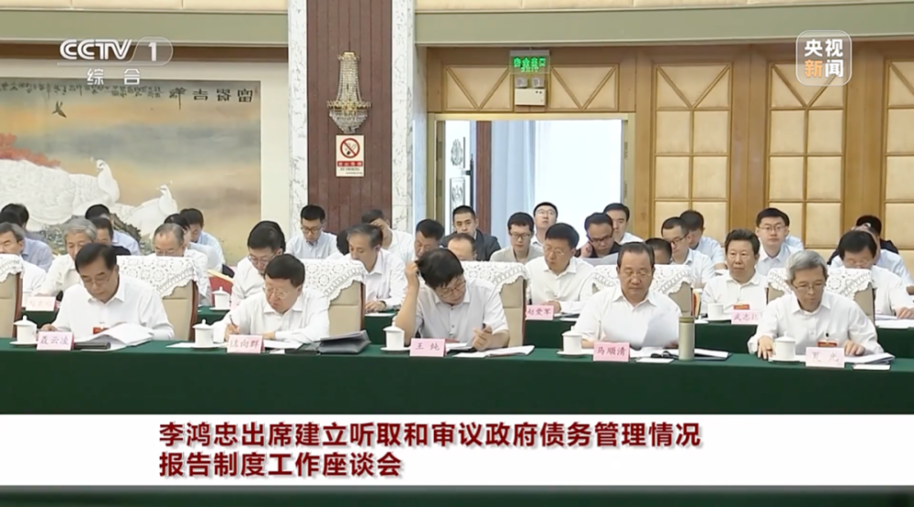

# 中央部署后一项新制度将建立！李鸿忠部署，有新信号

**撰文 | 余晖**

据央视报道，9月11日，中共中央政治局委员、全国人大常委会副委员长李鸿忠在京出席了一场座谈会。

这场座谈会的名称是“建立听取和审议政府债务管理情况报告制度工作座谈会”。

这是人大强化政府债务监督的最新举措。

**重大部署**

央视披露了这场座谈会的现场画面。画面显示，出席座谈会的还有全国人大常委会副委员长肖捷、张庆伟。

第十四届全国人大财经委主任委员钟山，副主任委员史耀斌、许宏才，财政部副部长朱忠明等也出席了会议。

政知君注意到，多位地方人大领导也在现场，包括吉林省人大常委会副主任范锐平，内蒙古自治区人大常委会副主任段志强，上海市人大常委会副主任宗明，河北省人大常委会副主任高云霄等。

在座谈会现场，李鸿忠提到，
**建立全国人大常委会听取和审议国务院关于政府债务管理情况报告制度，“是以习近平同志为核心的党中央加强人大监督特别是预算审查监督工作的重大部署”。**

他提到， **坚决守住不发生系统性风险的底线** ，实现稳增长与防风险长期均衡，推动经济社会高质量发展。

在这次座谈会召开之前，8月21日，十四届全国人大常委会第十次委员长会议举行，全国人大常委会委员长赵乐际主持会议。

那次会议的一项议题是，听取“关于建立全国人大常委会听取和审议国务院关于政府债务管理情况报告制度的汇报”。

一个背景是，地方债务风险问题，备受中央关注。

2022年12月15日至16日举行的中央经济工作会议专门提到过这一问题。会议强调，要“防范化解地方政府债务风险，坚决遏制增量、化解存量”。

今年4月28日和7月24日召开的中央政治局会议，两度关注到了这个问题。

**4月的会议提到，“要加强地方政府债务管理，严控新增隐性债务”。**

**7月的会议提到，“要有效防范化解地方债务风险，制定实施一揽子化债方案”。**

**一些地方市县债务风险较高**

今年3月1日，财政部部长刘昆在发布会上表示，我国2022年法定债务的负债率约为50%左右。在全世界、在经济界都是比较低的。

截至2023年7月末，全国地方政府债务余额380234亿元，控制在全国人大批准的限额之内。

不过，一些地方债务负担相对较重。

在上述发布会上，刘昆提到，“中国地方政府的债务主要是分布不均匀，一些地方债务风险较高，还本付息压力较大”。

今年7月，《证券日报》称，今年以来，一些地方公开表示化债艰难，仅凭自身能力无法有效解决，引起市场高度关注。

同月，《经济日报》也提到了类似问题。

上述报道称，当前地方隐性债务存量还不小，有的地方融资平台偿债问题突出，有的地方债务管理不规范甚至还违规新增隐性债务，一些地方市县债务风险较高，债务风险防控仍不可轻视。

8月28日，在第十四届全国人大常务委员会第五次会议上，财政部部长刘昆受国务院委托作报告。

报告在介绍下一步安排时提到，制定实施一揽子化债方案，在外界看来，这是对7月24日中共中央政治局会议精神的落实。

上述报告提到：

中央财政积极支持地方做好隐性债务风险化解工作，督促地方统筹各类资金、资产、资源和各类支持性政策措施，紧盯市县加大工作力度，妥善化解存量隐性债务，优化期限结构、降低利息负担，逐步缓释债务风险。

**新举动**

**为了避免一边化债一边新增，强化跨部门联合监管显得十分重要，其中尤其少不了人大监督。**

2018年3月，中办曾印发《关于人大预算审查监督重点向支出预算和政策拓展的指导意见》。

上述意见提到，人大对支出预算和政策开展全口径审查和全过程监管，其中一个就是“政府债务”。

指导意见明确，坚决制止无序举债搞建设，规范举债融资行为；积极稳妥化解累积的地方政府债务风险，坚决遏制隐性债务增量，决不允许新增各类隐性债务等。

2021年6月，中办印发《关于加强地方人大对政府债务审查监督的意见》。

去年11月，《人民日报》报道称，多数地方人大建立听取政府债务报告制度。

如今，人大在强化政府债务监督方面又有一个新举动。

据媒体报道，此次建立的“全国人大常委会听取和审议国务院关于政府债务管理情况报告制度”，
**能有效防范金融财政危机，对国家的总财力、总债务有清晰的把控和监督。**

中央财经大学教授温来成在接受第一财经采访时说，建立全国人大常委会听取和审议国务院关于政府债务管理情况报告制度意义重大，它属于专项报告，有利于强化全国人大常委会对政府债务的监督。

在9月11日的会议现场，李鸿忠强调，要准确把握人大监督政府债务的定位和原则。

他说，按照党中央决策部署依法监督，积极回应人民关切， **推动科学合理确定政府债务规模** ， **突出监督重点，深入开展调研**
，综合运用监督方式方法，充分发挥人大代表和专家智库作用，着力增强监督实效。

“要坚持系统观念、全局观念，上下联动、同题共答，形成人大监督政府债务的工作合力。”

**资料 ｜ 新华社 人民网 经济日报 证券时报 第一财经等**

**【版权声明】本文著作权归政知新媒体独家所有，未经授权，不得转载。**

