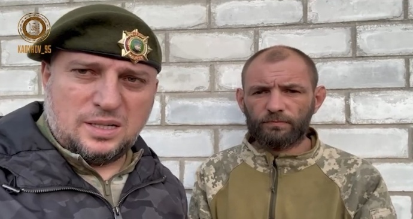
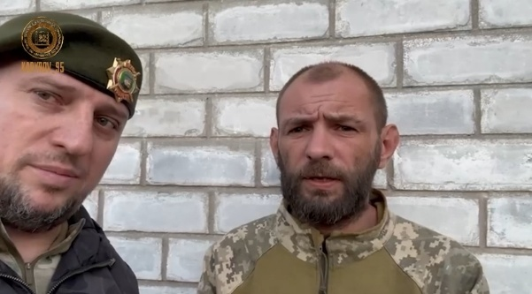

# 卡德罗夫发视频：一被俘乌士兵称想留在俄罗斯，请求普京授国籍

【环球网报道】俄罗斯车臣共和国领导人卡德罗夫11日在社交平台上分享了一段关于一名被俘乌士兵的视频，引起多家俄媒关注。

综合俄新社、塔斯社等多家俄媒报道，卡德罗夫当日在社交平台Telegram上发布一段视频，一名被俘乌士兵在视频中称自己想留在俄罗斯，并请求俄总统普京授予他俄罗斯国籍。

据俄新社报道，上述乌士兵名叫亚历山大，此前在顿涅茨克的克列谢耶夫卡地区被俘。在卡德罗夫发布的视频中，亚历山大与车臣“阿赫马特”特种部队指挥官阿拉乌季诺夫进行了对话。

_卡德罗夫11日在Telegram上所发视频中，车臣“阿赫马特”特种部队指挥官阿拉乌季诺夫（左）与一名被俘乌士兵（右）在镜头前对话的画面。_

视频显示，当阿拉乌季诺夫提到亚历山大将通过俄乌交换战俘而回到乌克兰时，后者说，“我想留在俄罗斯境内，所以我想对俄罗斯总统普京说几句话：尊敬的弗拉基米尔·弗拉基米罗维奇（普京），如果有可能，请让我留在俄罗斯。我没有犯大错，我会通过自己的付出来赎罪。我也请您提供帮助，让我成为一名俄罗斯公民”。

_卡德罗夫11日在Telegram上所发视频中，车臣“阿赫马特”特种部队指挥官阿拉乌季诺夫（左）与一名被俘乌士兵（右）在镜头前对话的画面。_

塔斯社报道称，亚历山大还称，乌军领导层欺骗乌士兵，将后者派往前线，这些士兵在前线遭到俄军袭击，他不想再去前线。

截至环球网发稿，尚未看到乌克兰官方对这一消息作出回应。

