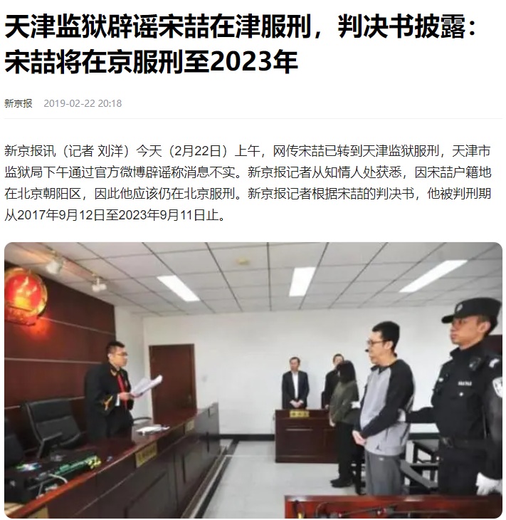
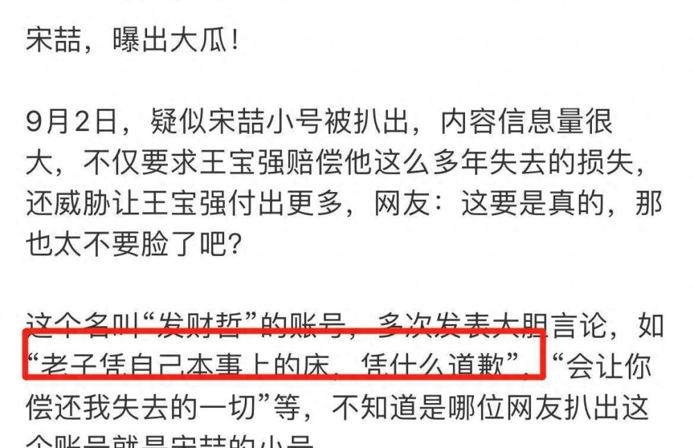

# 媒体人曝王宝强前经纪人宋喆已经出狱，服刑6年未减刑

9月12日，资深记者杜恩湖发文透露，王宝强前经纪人宋喆已经在9月11日正式出狱，目前从监狱回到北京家中。

有关宋喆服刑的报道，《新京报》曾在2019年报道中提及判决书内容，服刑时间从2017年9月12日至2023年9月11日止，与记者的爆料一致。换而言之，宋喆入狱六年应该没有获得减刑。

据悉，宋喆曾是王宝强最信任的经纪人，长期担任王宝强的助手，2015年9月至2016年6月在洽谈合作工作时，分别侵占王宝强工作室的款项65万及制定阴阳合同，与一家文化公司的委托人各侵占72万，当时王宝强的演出费原定是360余万，宋喆与合作公司的委托人合谋，将演出费压到200万，二人私分了一百多万。

宋喆家人承认进账的款项大部分用于买房买车及旅行，法院最终认定宋喆为主犯，判刑6年，因其为北京户籍，一直在北京监狱服刑。

当时宋喆并没有上诉，判决当天生效，因为当庭认罪且退还全部赃款，法院酌予从轻处罚。有知情人透露，宋喆整个人暴瘦，精神状态也不太好，曾传转到天津某监狱服刑，但最终被证实是假消息。

在此之前，王宝强在2016年宣布与马蓉离婚，并在法院起诉离婚，后马蓉反而起诉王宝强的律师，指其涉嫌误导公众，要求立案调查，不过法院驳回马蓉的诉讼请求，身败名裂之后，马蓉在2017年被曝移民澳洲，此前曾开通社交账号分享日常，因为不堪网友的嘲讽而选择停更。

近年来有不少人爆料指宋喆已经出狱，参加节目采访、发文爆料、养猪等都假新闻。

据悉，宋喆的前妻杨慧在2016年起诉离婚，其律师表示已经提交了宋喆和马姓案外人“不正当关系”的证据，继而引发王宝强和马蓉离婚风波，如今七年过去物是人非，王宝强事业爱情双收，而杨慧也独自逍遥，消失在公众视线。

