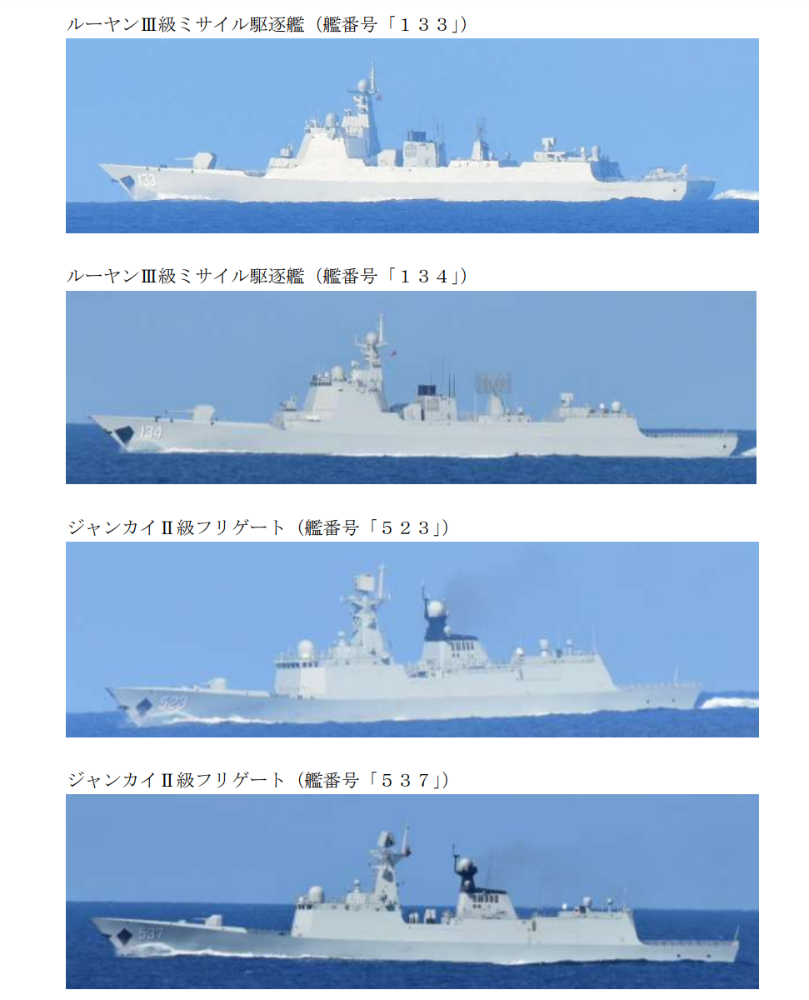
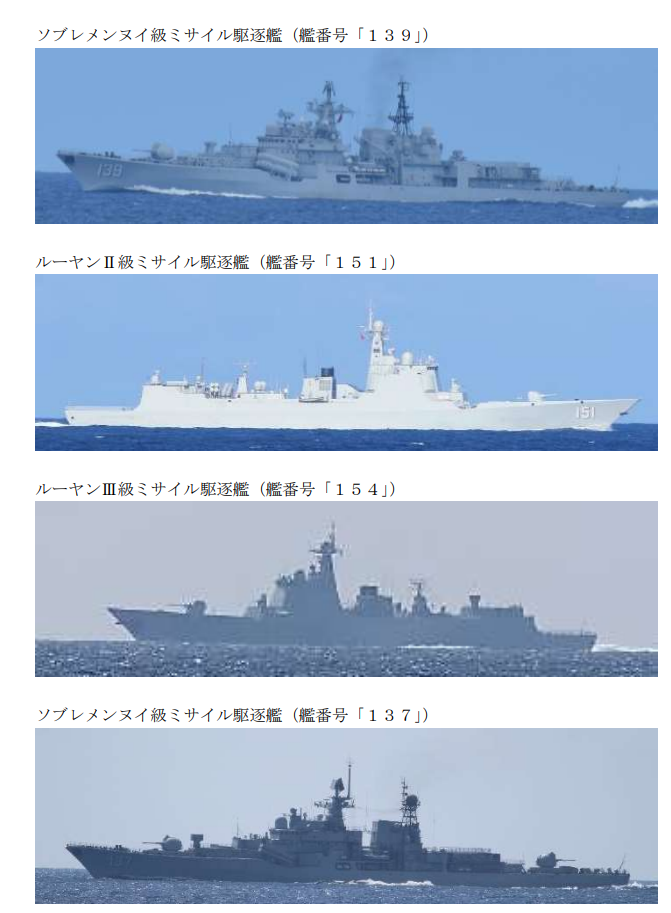
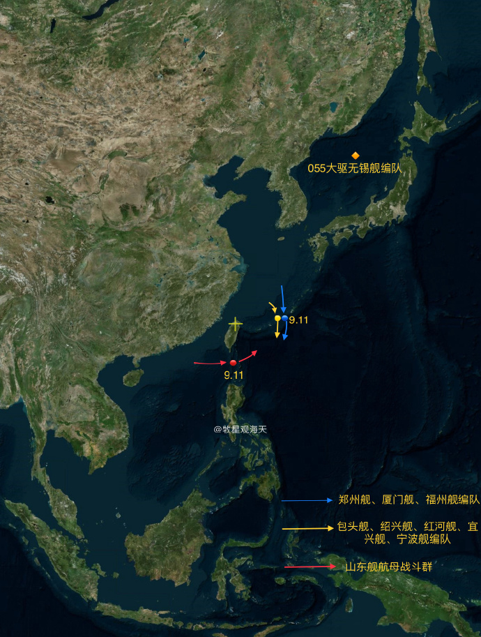
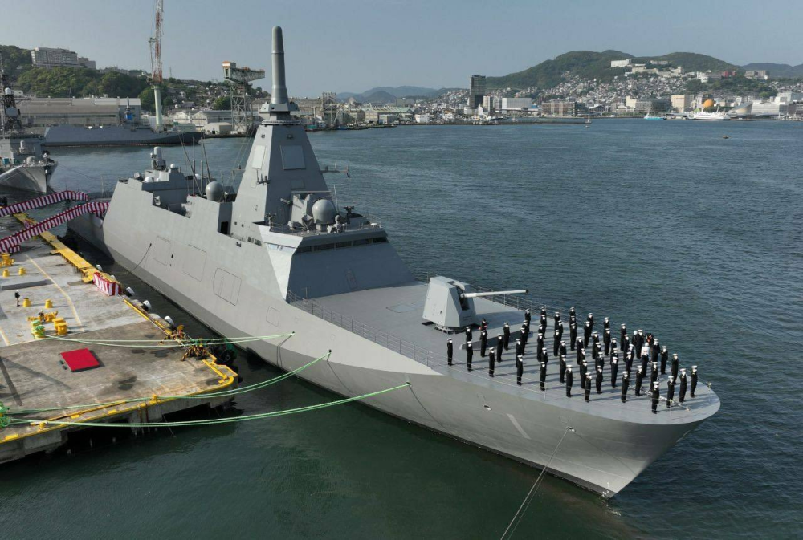
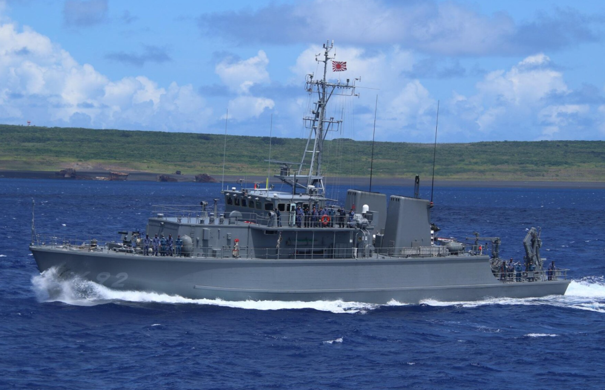
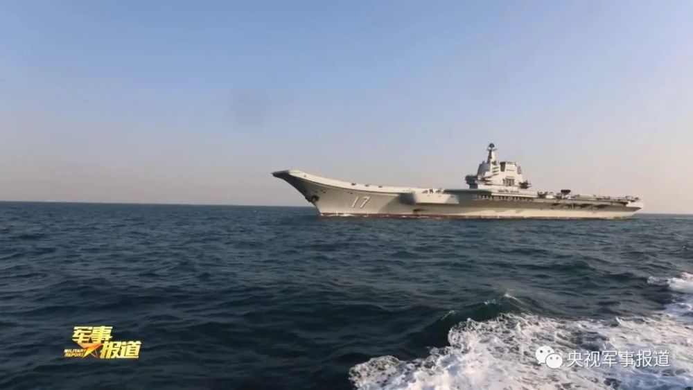

# 山东舰进入西太平洋后，8艘我军舰艇进入西太

【文/观察者网 王世纯】在台湾防务部门发布消息称山东舰编队进入西太平洋以后，日本统合幕僚监部也发布了我海军其他军舰编队进入西太平洋的消息。

日本统合幕僚监部称，9月11日，中国海军8艘驱护舰通过宫古海峡进入西太平洋，8艘舰艇分别为052C型驱逐舰郑州舰、052D型驱逐舰包头舰、绍兴舰、厦门舰、054A型护卫舰红河舰、宜兴舰、以及两艘现代级驱逐舰福州舰和宁波舰。

这是今年以来，日本自卫队通报的我军远洋舰艇编队中规模最大的一支，其中红河舰和宜兴舰是刚刚入役的新批次054A型导弹护卫舰，同时是首次参与远洋任务。

_日方拍摄的我舰艇编队_

 _在西太平洋，美日通报的我军舰艇动向 图源：微博@牧星观海天_

台防务部门9月12日上午发布消息称，解放军派出了22架军机和20艘军舰在台海周边活动。此前11日，台岛东部称，解放军山东舰航母编队在台岛鹅銮鼻东南111公里（60海里）处演练，进入西太平洋。这是台军自6月21日以来第四次通报我山东舰动向，也是山东舰继今年4月份首次出西太进行远洋训练后，时隔不到半年再次进行远洋训练。

值得一提的是，日本海上自卫队出动隶属于第13护卫队的新型护卫舰30FFM“最上”级三号舰“能代”（のしろ）号、第1海上补给队“十和田”级补给舰“十和田”号、第46扫海队所属“黑岛”号扫雷艇及第5航空群所属P-3C海上巡逻机。

_“能代”号和“黑岛”号扫雷艇_

目前，日本统合幕僚监部没有通报我山东舰动向。自今年4月6日以来，日本统合幕僚监部先后四次报道我军山东舰动向。日本防卫省统合幕僚监部4月25日发布的消息称，山东舰从4月7日进入西太平洋以来，到24日期间，共进行舰载机起降约620架次。随后山东舰编队在4月25日通过宫古海峡进入南海方向。

据新华社此前报道，海军新闻发言人刘文胜海军大校曾介绍，中国海军山东舰航母编队2020年12月20日顺利通过台湾海峡，赴南海相关海域开展训练。刘文胜表示，这次组织山东舰航母编队跨区机动训练，是根据年度计划作出的正常安排，今后还将根据训练需要继续组织类似行动。

**本文系观察者网独家稿件，未经授权，不得转载。**

