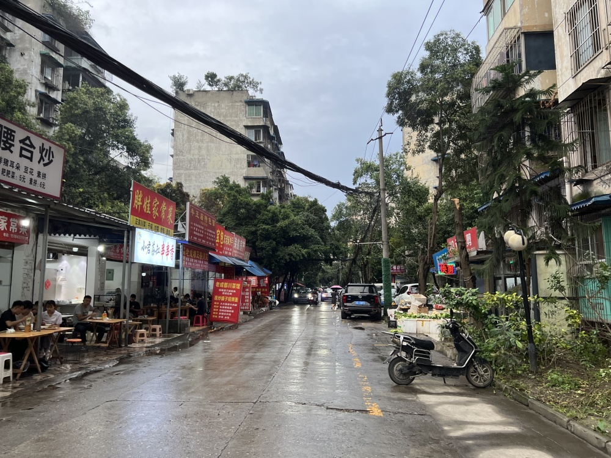
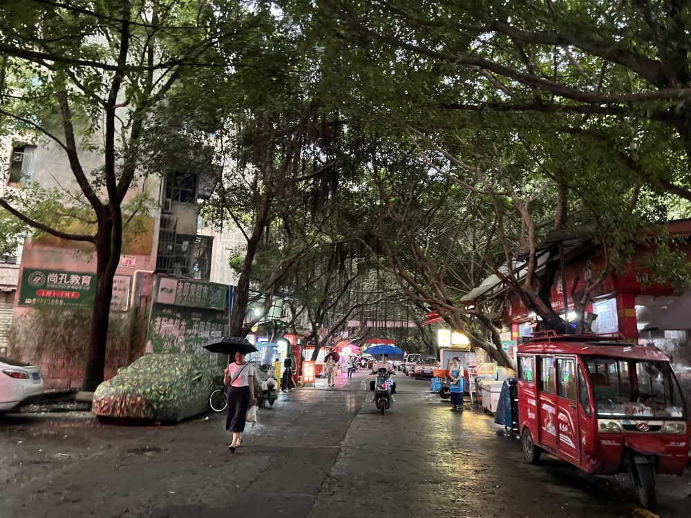
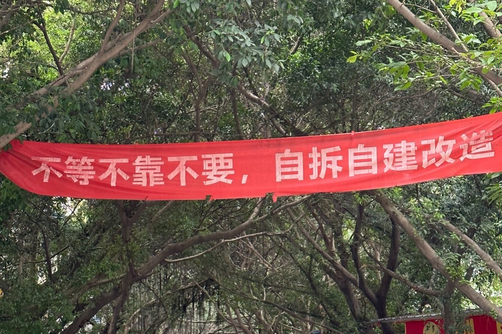

# 搁浅的老小区“自拆自建”：无政策文件支持，业主同意率卡在99.99%

成都武侯区中央花园二期，是一个建成20多年的商品房住宅小区，因为设施老化，业主们开始筹划“自拆自建”。此事经媒体报道后，引发社会关注。不少人更关注的是，该小区若重建成功能否为后来者提供一个样本。

_中央花园二期 本文图片均为庄岸供图_

然而，目前事情的进展似乎并不顺利。9月4日，成都市武侯区住建交局房屋管理科工作人员告诉澎湃新闻（www.thepaper.cn），中央花园二期拆了重建首先要符合城市规划，需经规划和自然资源局同意后再报建，现在规划和自然资源局那边还没有通过。此外，虽有政策允许D级危房原址重建，但“自拆自建”暂时没有政策性的文件支持。

9月6日，武侯区晋阳街道办回复澎湃新闻时也表示，目前，街道办还没有收到上级部门针对此事的任何批复。

澎湃新闻了解到，早在2018年，该小区就有业主提出在原有基础上拆旧房重建新房，通过增加容积率的方式让开发商覆盖拆建的成本，这样除了提升居住环境外，房子也能升值。5年过去了，重建设想仍停留在纸上。

_小区内餐馆林立_

**花园小区多年后变“老破小”，业主提出推倒重建**

中央花园是成都城西当年著名的“五大花园”之一，中央花园二期建成于上世纪90年代末，是当地最早的一批商品房。小区位于二环三环之间的清水河畔，总共72栋楼，3300多户，人口过万。

_中央花园二期_

早年，成都有“南富西贵”之说，在西边买商品房的人都具有一定经济实力。而中央花园二期地理位置优越，附近规划有两条地铁线（其中一条在建），周边配套有学校、医院、公园等。

但这个建成20多年的花园小区，如今已经成为业主口中的“老破小”。居民楼外墙褪色严重、路面凹凸不平、各类电缆电线无序交织，没有地下停车场。这与一街之隔，后来新建的小区形成鲜明对比。

为此，有业主提出了“自拆自建”的构想——寻找愿意投资的开发商，原地“自主更新，拆旧建新”。

最先提出这一想法的是小区业委会副主任伍大明，他的设想是：将小区容积率增加到3.5，拆40万平方米旧房，建70万平方米新房，按照1：1归还业主后，开发商还有30万平方米的新房卖。“除成本税费外还有盈利，这样才会有企业来投资，业主也不用掏钱。”

2018年9月，伍大明和业委会负责人在网上向当地领导留言反映中央花园二期“自拆自建”的问题，以寻求支持。

2018年12月，武侯区委办公室在网上留言板上回复：“如中央花园二期业主都愿意进行改造重建，街道将会同相关部门、企业推动该小区改造重建工作。”武侯区晋阳街道办随后也进行了回复，表示：“小区95%以上业主同意，将规划危房旧城改造。”

事实上，无论是“自拆自建”，还是政府回复中的“危房旧城改造”，多数业主并不介意以什么名义来改造小区，他们的想法是，只要能住上更好的房子就行。

**业主同意率达不到100%，关键一步难迈出**

2019年8月，小区业主开始就是否同意改造进行投票，第一轮投票业主意愿同意率达到96.7%。业委会提交了重建申请。区委主要负责人批示：同意纳入危旧房论证。但业委会没有进行危房鉴定，因为“还谈不上存在安全隐患”。

在随后的政府相关部门讨论中，由于该小区是商品房，不符合棚户区改造相关政策，要重建，只能原地、原址、原图重建。不能增加容积率，重建面临困难，事情因此搁置。

2020年4月，成都发布《城市有机更新实施办法》，列明了三种城市更新形式：保护传承、优化改造和拆旧建新。事情似乎又出现了转机。

据媒体报道， 2021年11月，成都市武侯区委主要领导到该小区调研提出，“自拆自建”需要业主同意率达到100%，政府才能出规划。

业委会开始组建拆旧建新小组，继续动员业主。2022年3月21日至5月21日，业主同意率达到99.99%，但达不到100%，关键性的一步仍难迈出。

要取得100%业主同意并不容易。自主拆建，有人看到了希望，也有人看到风险。始终有人担心：“如果烂尾了怎么办？”

_小区里动员自拆自建的标语_

目前为止仍明确表示反对“自拆自建”的业主何某（化名）表示，居民自行拆旧建新，烂尾风险高，没有保障，同时也担心业委会从中牟利，“哪个来保障？政府不出面，烂尾了没有地方住。”

有的业主对小区状况有更清醒的认识，他们认为，小区位置虽然好，但位于航线下方，层高受限，加之小区面积大，没有利润空间，有没有开发商愿意接手？如果开发商不靠谱，烂尾了又怎么办？谁来监督，烂尾了业主找谁？因此，有的业主明确表示，政府出面保障才会同意。

2023年5月25日，小区业委会形成报告提交给晋阳街道办及武侯区相关部门。

2023年6月，有业主留言称“中央花园二期已经是危房了，墙里的砖都粉了，请问什么时候能拆迁改造”，成都市武侯区晋阳街道办事处答复表示，经查，中央花园二期暂无拆迁计划，如有拆迁计划将及时公示。

**武侯区住建交局：暂无政策性文件支持**

伍大明表示，他们坚持一个原则，团结第一，目前没有支持的业主，不责怪；大部分业主愿意住上安全舒适的新房子。他说，他们去跑腿，包括跟业主做工作，和政府联系，做成了大家都好，如果做不成，也并没喊业主出一分钱。

清华大学建筑学院教授尹稚接受中国之声采访时表示，“此小区彻底推倒重建的可能性大概不像业主想象的那么大。”他认为，有多个基本前提，若确实出现大面积结构性隐患，可以通过“危房认定”确定级别，如果被认定确实需要拆除，也得找经济上可行的办法，通过扩容来吸引社会投资、平衡改造成本，属于常规做法。

尹稚说，大规模改造工程，按城市规划惯例来讲，需经过市级审批以及正式的流程和决议，无论是设施提升型改造，还是结构加固型改造，亦或是下决心彻底推倒重来，都要有专业性的评估，国家对这些评估有严格的技术标准。“业主们如果想不花钱或者少花钱，大概唯一的出路，是这个小区的地还有增值的空间。”

尹稚认为，在正常新建小区销售都面临去库存压力的情况下，这样一个传统的老旧小区用增容的方式来推倒重建，有没有让市场和政府都能接受的增值空间？其个人也不那么看好。

9月4日，成都市武侯区住建交局房屋管理科一位工作人员告诉澎湃新闻，这种“自拆自建”首先要符合城市规划，规划和自然资源局同意后再报建。但现在规自局那边都还没通过。虽有政策允许D级危房原址重建，但“自拆自建”暂时没有政策性的文件支持。

9月6日，武侯区晋阳街道办回复澎湃新闻时表示，目前，街道办还没有收到上级部门针对此事的任何批复。

**相关报道：**

[万人小区决定推倒重建：业主多为退休老人，有人视作生命“最后一战”
](https://new.qq.com/rain/a/20230822A02N3200)

